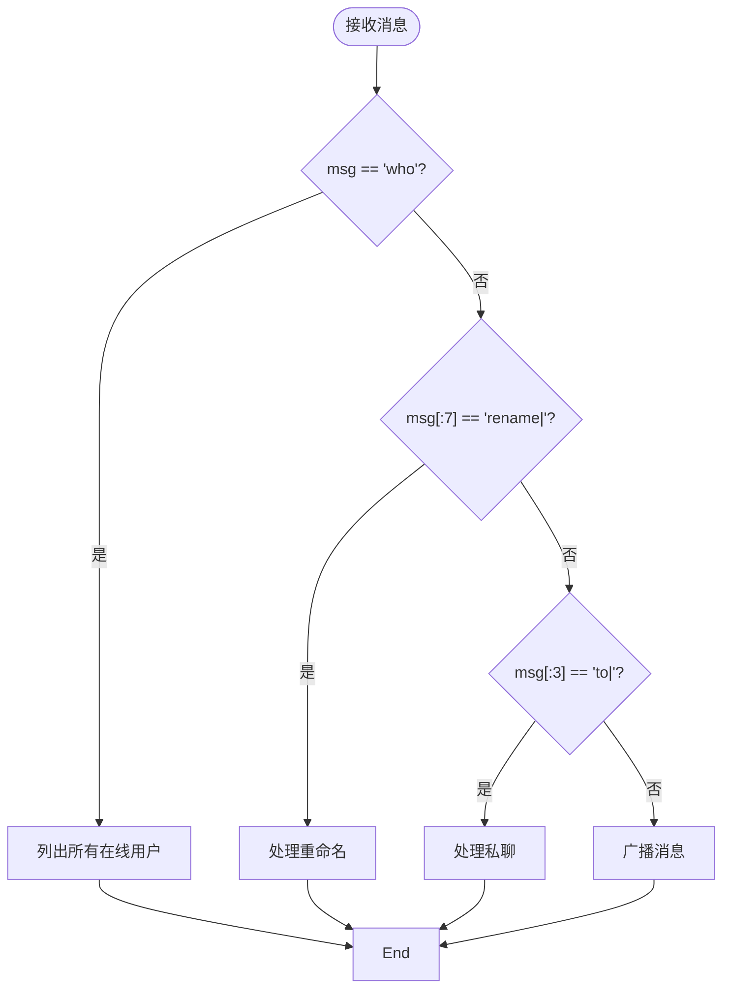
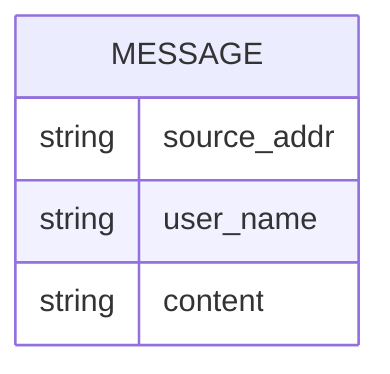
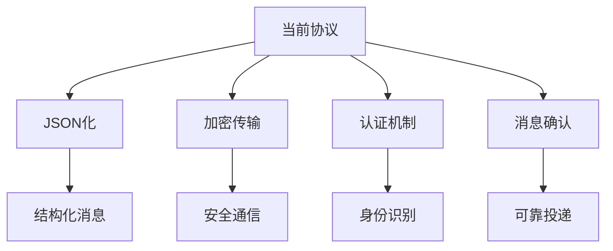

# API与命令协议

<cite>
**本文档引用的文件**  
- [user.go](file://14-golang-IM-System/user.go)
- [server.go](file://14-golang-IM-System/server.go)
- [client.go](file://14-golang-IM-System/client.go)
</cite>

## 目录
1. [引言](#引言)
2. [通信协议概述](#通信协议概述)
3. [支持的命令与语法](#支持的命令与语法)
4. [命令解析逻辑](#命令解析逻辑)
5. [请求/响应示例](#请求响应示例)
6. [消息广播格式](#消息广播格式)
7. [协议局限性](#协议局限性)
8. [未来扩展方向](#未来扩展方向)
9. [客户端实现指南](#客户端实现指南)
10. [结论](#结论)

## 引言
本系统为一个基于TCP长连接的即时通讯（IM）系统，采用明文传输、换行符分隔的消息格式。客户端与服务器之间通过简单的文本命令进行交互，支持公聊、私聊、用户名修改、在线用户查询等基本功能。本文档详细定义了系统的API与命令协议，说明各命令的语法、处理逻辑及使用方式。

## 通信协议概述
系统采用以下通信机制：
- **传输协议**：TCP长连接
- **数据格式**：明文文本
- **消息分隔符**：换行符 `\n`
- **编码方式**：UTF-8
- **连接管理**：服务器为每个客户端维护独立连接，超时300秒未活动将被强制断开

该协议设计简洁，易于实现，适用于轻量级即时通讯场景。

**Section sources**
- [server.go](file://14-golang-IM-System/server.go#L55-L115)

## 支持的命令与语法
系统支持以下四类命令：

| 命令类型 | 语法格式 | 功能描述 |
|--------|--------|--------|
| 普通消息 | 直接发送文本 | 触发消息广播至所有在线用户 |
| 查询在线用户 | `who` | 请求服务器返回当前所有在线用户信息 |
| 修改用户名 | `rename|新名称` | 请求更改当前用户名 |
| 私聊消息 | `to|用户名|内容` | 向指定用户发送私密消息 |

所有命令均以换行符结尾，服务器接收到完整消息后进行解析处理。

**Section sources**
- [user.go](file://14-golang-IM-System/user.go#L66-L123)

## 命令解析逻辑
所有命令的解析由 `user.DoMessage` 方法统一处理，其核心逻辑如下：

### 字符串分割与边界检查
- 使用 `strings.Split(msg, "|")` 对命令进行分段解析
- 在处理 `rename|` 和 `to|` 命令前，先检查字符串长度和前缀匹配
- 所有命令均进行空值校验，防止越界访问

### 错误反馈机制
- 若命令格式错误或参数缺失，立即返回错误提示
- 若用户名已存在或目标用户不存在，返回相应提示信息
- 所有错误信息通过 `user.SendMsg()` 发送回客户端

### 处理流程


**Diagram sources**
- [user.go](file://14-golang-IM-System/user.go#L66-L123)

**Section sources**
- [user.go](file://14-golang-IM-System/user.go#L66-L123)

## 请求/响应示例
### 查询在线用户
- **客户端发送**：`who`
- **服务器响应**：
  ```
  [127.0.0.1:54321]127.0.0.1:54321:在线...
  [127.0.0.1:54322]Alice:在线...
  ```

### 修改用户名
- **客户端发送**：`rename|Alice`
- **服务器响应**：`您已经更新用户名:Alice`

### 私聊消息
- **客户端发送**：`to|Alice|你好啊`
- **目标用户接收**：`Bob对您说:你好啊`

### 普通消息广播
- **客户端发送**：`大家好！`
- **所有用户接收**：`[127.0.0.1:54321]Bob:大家好！`

**Section sources**
- [user.go](file://14-golang-IM-System/user.go#L66-L123)
- [server.go](file://14-golang-IM-System/server.go#L49-L53)

## 消息广播格式
服务器广播消息的标准格式为：
```
[IP:Port]用户名:消息内容
```
- **IP:Port**：客户端远程地址，由 `conn.RemoteAddr().String()` 获取
- **用户名**：当前用户的昵称（可修改）
- **消息内容**：用户发送的原始文本（去除末尾换行符）

此格式统一用于上线通知、下线通知和普通消息广播。



**Diagram sources**
- [server.go](file://14-golang-IM-System/server.go#L49-L53)
- [user.go](file://14-golang-IM-System/user.go#L66-L123)

## 协议局限性
当前协议存在以下技术局限：

| 问题 | 描述 |
|-----|-----|
| 缺乏认证机制 | 无登录验证，用户名可随意修改，存在冒名风险 |
| 无消息确认 | 客户端发送消息后无法确认是否送达 |
| 易受恶意输入攻击 | 未对特殊字符、超长消息进行过滤和限制 |
| 文本格式脆弱 | 依赖固定分隔符，格式错误易导致解析失败 |
| 无消息历史 | 服务器不存储历史消息，新用户无法获取过往内容 |

这些限制影响系统的安全性与可靠性，需在后续版本中改进。

**Section sources**
- [user.go](file://14-golang-IM-System/user.go#L66-L123)
- [server.go](file://14-golang-IM-System/server.go#L49-L53)

## 未来扩展方向
建议从以下几个方面进行协议升级：

1. **引入JSON格式**：使用结构化数据替代明文命令，提升可读性与扩展性
2. **添加消息ID**：为每条消息分配唯一ID，支持确认机制与去重
3. **支持加密传输**：集成TLS/SSL，保障通信安全
4. **增加认证流程**：引入用户名密码登录或Token机制
5. **支持消息类型字段**：区分系统消息、普通消息、通知等
6. **实现心跳机制**：主动维护连接状态，提高稳定性
7. **支持离线消息**：服务器暂存未送达消息，用户上线后推送



**Diagram sources**
- [server.go](file://14-golang-IM-System/server.go#L49-L53)
- [user.go](file://14-golang-IM-System/user.go#L66-L123)

## 客户端实现指南
为确保客户端稳定运行，建议遵循以下最佳实践：

### 连接建立
- 使用 `net.Dial("tcp", "ip:port")` 建立连接
- 设置合理的超时时间（建议5秒）
- 连接失败后应进行指数退避重试

### 心跳维持
- 定期发送空消息或专用心跳包（如 `ping`）
- 监听连接状态，及时发现断线
- 保持活跃状态以避免被服务器超时踢出

### 异常重连
- 捕获网络异常（如EOF、连接重置）
- 实现自动重连机制，最多尝试3-5次
- 重连成功后重新注册用户名

### 用户交互
- 提供清晰的菜单界面（如公聊/私聊模式选择）
- 输入校验：防止发送空消息或格式错误命令
- 实时显示服务器响应，提升用户体验

**Section sources**
- [client.go](file://14-golang-IM-System/client.go#L66-L73)
- [client.go](file://14-golang-IM-System/client.go#L130-L150)

## 结论
本文档详细定义了IM系统的API与命令协议，涵盖通信机制、命令语法、解析逻辑、示例交互及客户端实现建议。当前协议虽功能完整，但存在安全性和可靠性方面的不足。建议在后续开发中引入结构化数据格式、认证机制和加密传输，以构建更健壮的即时通讯系统。