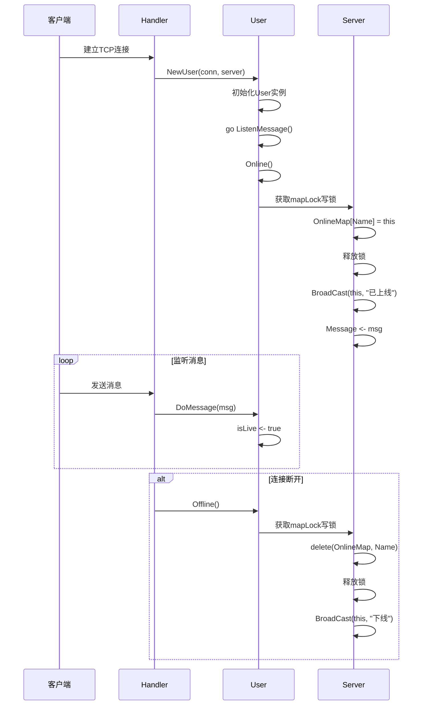
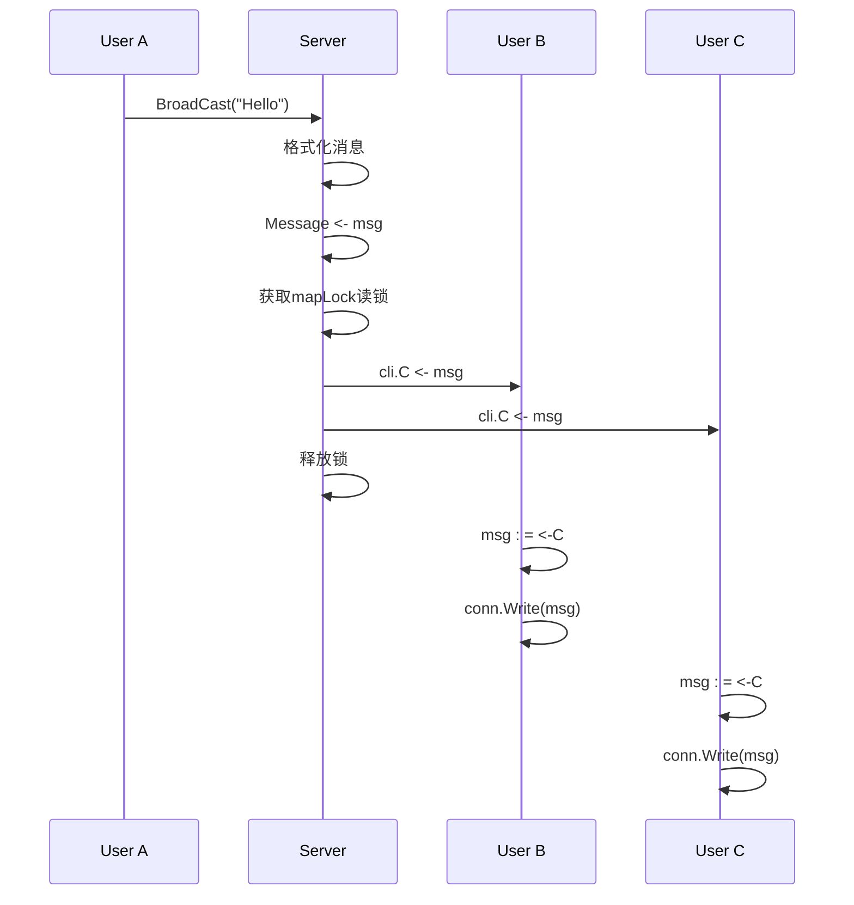

# 功能模块详解

<cite>
**本文档引用的文件**  
- [main.go](file://14-golang-IM-System/main.go)
- [server.go](file://14-golang-IM-System/server.go)
- [user.go](file://14-golang-IM-System/user.go)
</cite>

## 目录
1. [用户连接与断开](#用户连接与断开)
2. [消息广播机制](#消息广播机制)
3. [在线用户查询](#在线用户查询)
4. [用户名修改](#用户名修改)
5. [私聊功能](#私聊功能)
6. [超时强踢功能](#超时强踢功能)
7. [潜在缺陷分析](#潜在缺陷分析)

## 用户连接与断开

该功能由 `server.Handler` 方法主导，结合 `user.Online` 和 `user.Offline` 实现。当客户端建立 TCP 连接后，`Handler` 会创建一个新的 `User` 实例，并调用其 `Online` 方法。

`Online` 方法首先获取服务器的写锁，将新用户以用户名为键加入 `OnlineMap` 在线用户列表，然后调用 `server.BroadCast` 向所有在线用户广播“已上线”通知。

当连接断开时（客户端关闭或读取错误），`Handler` 中的读取协程会检测到 `n == 0` 或错误，随即调用 `user.Offline`。`Offline` 方法同样获取写锁，从 `OnlineMap` 中删除该用户，并广播“下线”消息。

**Diagram sources**
- [server.go](file://14-golang-IM-System/server.go#L55-L115)
- [user.go](file://14-golang-IM-System/user.go#L36-L45)
- [user.go](file://14-golang-IM-System/user.go#L48-L58)

**Section sources**
- [server.go](file://14-golang-IM-System/server.go#L55-L115)
- [user.go](file://14-golang-IM-System/user.go#L36-L58)

## 消息广播机制

消息广播由 `server.BroadCast` 方法和 `ListenMessager` 协程共同完成。`BroadCast` 方法接收一个 `User` 和消息字符串，将其格式化为 `[IP地址]用户名:消息内容` 的形式，然后将此字符串发送到服务器的 `Message` 通道。

`ListenMessager` 是一个在 `Server.Start()` 时启动的独立协程，它持续监听 `Message` 通道。一旦有新消息到达，它会获取 `OnlineMap` 的读锁，遍历所有在线用户，并将消息通过每个用户的 `C` 通道发送出去。用户的 `ListenMessage` 协程会监听自己的 `C` 通道，并将消息写回客户端连接。

**Diagram sources**
- [server.go](file://14-golang-IM-System/server.go#L49-L53)
- [server.go](file://14-golang-IM-System/server.go#L35-L46)
- [user.go](file://14-golang-IM-System/user.go#L126-L132)

**Section sources**
- [server.go](file://14-golang-IM-System/server.go#L35-L53)
- [user.go](file://14-golang-IM-System/user.go#L126-L132)

## 在线用户查询

在线用户查询通过 `who` 命令实现，其逻辑在 `user.DoMessage` 方法中。当用户发送 `who` 消息时，系统会进入 `if msg == "who"` 分支。

该分支首先获取服务器 `OnlineMap` 的读锁，然后遍历 `OnlineMap` 中的每一个 `User`。对于每个在线用户，构造一条 `[IP地址]用户名:在线...` 的消息，并通过当前用户的 `SendMsg` 方法逐条发送给查询者。遍历完成后释放锁。

**Section sources**
- [user.go](file://14-golang-IM-System/user.go#L66-L74)

## 用户名修改

用户名修改通过 `rename|新用户名` 命令实现。`DoMessage` 方法解析消息，提取 `|` 符号后的部分作为新用户名。

系统首先检查新用户名是否已存在于 `OnlineMap` 中。如果存在，则向用户发送“当前用户名被使用”的提示。如果不存在，则获取 `mapLock` 写锁，从 `OnlineMap` 中删除旧的用户名键，将新的用户名作为键重新加入映射，并更新 `User` 实例的 `Name` 字段，最后通知用户修改成功。

**Section sources**
- [user.go](file://14-golang-IM-System/user.go#L75-L88)

## 私聊功能

私聊功能通过 `to|用户名|消息内容` 命令实现。`DoMessage` 方法首先解析出目标用户名 `remoteName` 和消息内容 `content`。

系统会进行一系列校验：检查 `remoteName` 是否为空、目标用户是否存在于 `OnlineMap` 中、`content` 是否为空。任何一项校验失败都会向发送者返回相应的错误提示。

只有当所有校验通过后，系统才会调用目标用户的 `SendMsg` 方法，将格式化后的私聊消息（`发送者对您说:内容`）发送给接收者。

**Section sources**
- [user.go](file://14-golang-IM-System/user.go#L89-L119)

## 超时强踢功能

超时强踢功能在 `server.Handler` 方法中实现，利用 `select` 语句和 `time.After` 定时器。

当用户连接建立后，会创建一个 `isLive` 布尔通道。在处理用户消息的协程中，每当成功读取到一条消息，就会向 `isLive` 通道发送 `true`。`Handler` 的主循环使用 `select` 监听两个事件：`isLive` 通道和一个300秒的 `time.After` 定时器。

如果用户在300秒内发送了任何消息，`isLive` 通道会被激活，`select` 语句执行并结束，定时器被重置。如果用户长时间不活动，`time.After` 会先触发，执行踢人逻辑：向用户发送“你被踢了”消息，关闭其消息通道 `C`，关闭连接 `conn`，并退出 `Handler`。

**Section sources**
- [server.go](file://14-golang-IM-System/server.go#L55-L115)

## 潜在缺陷分析

尽管系统功能完整，但仍存在一些潜在缺陷：

1.  **并发安全风险**：虽然使用了 `sync.RWMutex` 保护 `OnlineMap`，但在极端高并发场景下，频繁的加锁解锁可能成为性能瓶颈。此外，`mapLock` 的作用域应严格限制在对 `OnlineMap` 的操作上，避免在锁内执行耗时的 I/O 操作（如 `SendMsg`），尽管当前代码已避免此问题。

2.  **消息粘包问题**：客户端与服务器之间的通信基于 TCP 流。当前代码使用 `conn.Read(buf)` 读取数据，但未处理粘包和拆包问题。如果客户端快速发送多条短消息，它们可能被合并成一次 `Read` 调用，导致消息解析错误。反之，长消息也可能被拆分成多次 `Read`。应引入消息边界（如固定长度头或特殊分隔符）来解决此问题。

3.  **异常输入处理不足**：`rename|` 和 `to|` 命令的解析依赖于 `strings.Split`，如果输入格式不规范（如缺少 `|` 或字段数不足），`strings.Split` 返回的切片可能越界，导致程序 panic。代码中虽有部分检查，但不够健壮，应增加对切片长度的检查。

4.  **资源清理不彻底**：`Offline` 方法关闭了 `User.C` 通道和 `conn` 连接，但没有明确终止 `ListenMessage` 协程。虽然当 `conn.Write` 失败时协程会因 `for` 循环中的错误而退出，但这依赖于底层连接的关闭行为，不够直接和清晰。

5.  **错误处理不完善**：`conn.Read` 和 `conn.Write` 的错误处理较为简单，仅打印日志或返回。在生产环境中，应有更完善的错误日志记录和监控机制。

**Section sources**
- [server.go](file://14-golang-IM-System/server.go#L55-L115)
- [user.go](file://14-golang-IM-System/user.go#L66-L123)