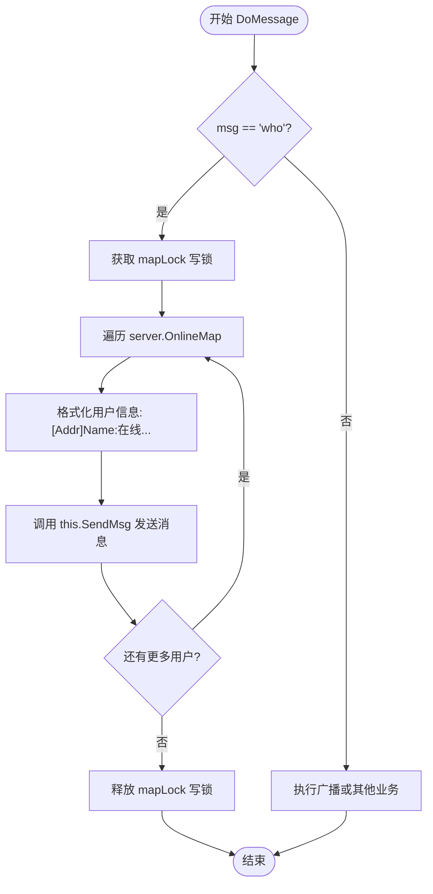

<cite>
**本文档中引用的文件**
- [user.go](file://14-golang-IM-System/ServerV0.5-在线用户查询/user.go)
- [server.go](file://14-golang-IM-System/ServerV0.5-在线用户查询/server.go)
- [main.go](file://14-golang-IM-System/ServerV0.5-在线用户查询/main.go)
</cite>

## 目录
1. [在线用户查询功能概述](#在线用户查询功能概述)
2. [命令解析与执行流程](#命令解析与执行流程)
3. [核心数据结构与并发控制](#核心数据结构与并发控制)
4. [响应消息格式与发送机制](#响应消息格式与发送机制)
5. [性能分析与优化建议](#性能分析与优化建议)
6. [典型输入输出示例](#典型输入输出示例)
7. [扩展方案：分页查询](#扩展方案：分页查询)

## 在线用户查询功能概述

本技术文档详细阐述了即时通讯系统中“在线用户查询”功能（`who`命令）的实现机制。当客户端用户输入`who`指令时，系统通过`DoMessage`方法识别该命令，利用`server.OnlineMap`映射表获取所有在线用户信息，并通过`SendMsg`方法向请求者逐条发送格式化的响应消息。该功能是系统基础业务逻辑的重要组成部分，为用户提供了实时了解在线状态的能力。

**Section sources**
- [user.go](file://14-golang-IM-System/ServerV0.5-在线用户查询/user.go#L66-L123)
- [server.go](file://14-golang-IM-System/ServerV0.5-在线用户查询/server.go#L15-L15)

## 命令解析与执行流程

`DoMessage`方法是处理用户输入消息的核心入口。当用户输入`who`命令时，该方法通过简单的字符串比较进行识别，并触发在线用户查询逻辑。整个流程是一个典型的条件分支处理模式，`who`命令是其中的一个分支。



**Diagram sources**
- [user.go](file://14-golang-IM-System/ServerV0.5-在线用户查询/user.go#L66-L75)

**Section sources**
- [user.go](file://14-golang-IM-System/ServerV0.5-在线用户查询/user.go#L66-L75)

## 核心数据结构与并发控制

### 在线用户映射表 (OnlineMap)

`OnlineMap`是系统的核心数据结构，定义为`map[string]*User`类型的哈希表，存储了所有当前在线用户的指针，以用户名为键。该映射表是实现用户管理、消息广播和在线查询等功能的基础。

### sync.RWMutex 并发控制

`server`结构体中包含一个`sync.RWMutex`类型的`mapLock`字段，用于保护对`OnlineMap`的并发访问。在`who`命令的实现中，虽然查询操作本质上是只读的，但代码中使用了`mapLock.Lock()`（写锁）而非`RLock()`（读锁），这是一个潜在的性能瓶颈。

**性能优势分析**：
- **读写锁（RWMutex）**：允许多个读操作同时进行，但写操作是独占的。
- **当前实现问题**：`who`命令使用写锁进行遍历，导致同一时间只能有一个`who`查询或任何修改操作（如用户上线/下线）执行，这在高并发场景下会严重限制系统吞吐量。
- **优化方向**：应将`Lock()`和`Unlock()`替换为`RLock()`和`RUnlock()`，以允许多个`who`查询并行执行，从而显著提升读操作的性能。

**Section sources**
- [server.go](file://14-golang-IM-System/ServerV0.5-在线用户查询/server.go#L19-L19)
- [user.go](file://14-golang-IM-System/ServerV0.5-在线用户查询/user.go#L67-L74)

## 响应消息格式与发送机制

### 响应消息格式规范

系统对`who`命令的响应消息有统一的格式规范：
`[用户IP地址:端口]用户名:在线...\n`

该格式清晰地展示了用户的网络地址和名称，并以“在线...”作为状态标识，末尾的换行符`\n`用于分隔多条消息。

### 逐条发送机制

当前的实现采用逐条发送的模式。在遍历`OnlineMap`的循环中，每格式化一条用户信息，就立即调用`SendMsg`方法发送。`SendMsg`方法直接调用`conn.Write`将字节流写入TCP连接。

**代码实现细节**：
- **字符串拼接**：使用Go语言的`+`操作符进行字符串拼接，如`"[" + user.Addr + "]" + user.Name + ":" + "在线...\n"`。在用户量大时，这会产生大量临时字符串对象，增加GC压力。
- **网络写入**：`SendMsg`方法直接执行`this.conn.Write([]byte(msg))`，每次调用都是一次独立的系统调用。

**Section sources**
- [user.go](file://14-golang-IM-System/ServerV0.5-在线用户查询/user.go#L70-L72)
- [user.go](file://14-golang-IM-System/ServerV0.5-在线用户查询/user.go#L61-L63)

## 性能分析与优化建议

### 当前实现的延迟问题

当前的逐条发送机制存在明显的性能缺陷：
1.  **高延迟**：对于拥有N个在线用户的系统，`who`查询会产生N次独立的`Write`系统调用。每次系统调用都有上下文切换的开销，且TCP协议的延迟确认（Delayed ACK）机制可能导致消息被分批发送，进一步增加响应时间。
2.  **资源浪费**：频繁的系统调用消耗CPU资源，大量的小数据包在网络上传输效率低下。

### 优化方向：批量发送

一个高效的优化方案是采用**批量发送**策略：
1.  **构建完整消息**：在`DoMessage`方法中，使用`strings.Builder`或`bytes.Buffer`将所有在线用户的信息拼接成一个完整的、包含所有`\n`分隔符的字符串。
2.  **单次写入**：将拼接好的完整消息通过一次`conn.Write`调用发送出去。

这种优化可以将N次系统调用减少为1次，极大地降低了延迟和CPU开销，提高了网络传输效率。

**Section sources**
- [user.go](file://14-golang-IM-System/ServerV0.5-在线用户查询/user.go#L66-L75)

## 典型输入输出示例

为帮助新手理解功能，以下是典型的交互示例：

**输入**：
```
who
```

**输出**：
```
[127.0.0.1:54321]user1:在线...
[127.0.0.1:54322]user2:在线...
[127.0.0.1:54323]user3:在线...
```

此示例展示了当有三个用户在线时，执行`who`命令后客户端收到的响应。每行代表一个在线用户，包含了其连接地址和用户名。

**Section sources**
- [user.go](file://14-golang-IM-System/ServerV0.5-在线用户查询/user.go#L70-L72)

## 扩展方案：分页查询

### 大规模在线场景下的性能瓶颈

在大规模在线场景（如数千或数万用户）下，即使采用批量发送优化，一次性返回所有用户信息也会导致：
-   **响应巨大**：单条响应消息可能达到数MB，消耗大量带宽。
-   **客户端卡顿**：客户端需要处理和渲染大量数据，可能导致界面卡顿。
-   **服务器内存压力**：在拼接消息时需要在内存中构建一个巨大的字符串。

### 分页查询扩展方案

为解决上述问题，可将`who`命令扩展为支持分页查询，例如：
-   **命令格式**：`who page=1 size=20` 或 `who 1/20`
-   **实现逻辑**：
    1.  解析命令中的页码（page）和每页大小（size）。
    2.  计算需要返回的用户范围（例如，第1页，每页20个，则返回前20个用户）。
    3.  仅遍历并拼接该范围内的用户信息。
    4.  同时返回总用户数和总页数等元信息。

此方案能有效控制单次响应的数据量，提升系统在高负载下的稳定性和用户体验。

**Section sources**
- [user.go](file://14-golang-IM-System/ServerV0.5-在线用户查询/user.go#L66-L75)