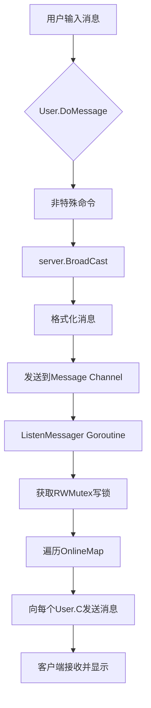

<cite>
**Referenced Files in This Document**   
- [server.go](file://14-golang-IM-System/server.go)
- [user.go](file://14-golang-IM-System/user.go)
- [ServerV0.3-用户消息广播/server.go](file://14-golang-IM-System/ServerV0.3-用户消息广播/server.go)
- [ServerV0.3-用户消息广播/user.go](file://14-golang-IM-System/ServerV0.3-用户消息广播/user.go)
</cite>

## 目录
1. [消息广播机制](#消息广播机制)
2. [核心组件分析](#核心组件分析)
3. [数据流与并发控制](#数据流与并发控制)
4. [性能考量与优化建议](#性能考量与优化建议)
5. [总结](#总结)

## 消息广播机制

本文档深入解析IM系统中的消息广播机制，重点阐述`server.BroadCast`方法如何将用户消息格式化为`[IP:Port]用户名:消息内容`的标准格式，并推送到`Message` channel；`ListenMessager` goroutine如何持续监听该channel并将消息分发给所有在线用户的`C`通道。文档包含消息广播的数据流图、channel缓冲机制的作用、`RWMutex`在遍历`OnlineMap`时的并发控制原理。

**Section sources**
- [server.go](file://14-golang-IM-System/server.go#L49-L53)
- [server.go](file://14-golang-IM-System/server.go#L35-L46)

## 核心组件分析

### 消息广播方法 (BroadCast)

`server.BroadCast`方法是消息广播的核心。该方法接收一个`*User`指针和一条消息字符串，首先将消息格式化为`[IP:Port]用户名:消息内容`的标准格式，然后将格式化后的消息发送到服务器的`Message` channel中。此方法实现了消息的统一封装，确保所有广播消息具有一致的格式。

**Section sources**
- [server.go](file://14-golang-IM-System/server.go#L49-L53)

### 消息监听协程 (ListenMessager)

`ListenMessager`是一个在服务器启动时启动的goroutine，它持续监听`Message` channel。一旦有新消息到达，它会获取`mapLock`的写锁，遍历`OnlineMap`中的所有在线用户，并将消息通过每个用户的`C` channel发送出去。完成广播后，释放锁。这种设计确保了消息能够实时推送给所有在线客户端。

**Section sources**
- [server.go](file://14-golang-IM-System/server.go#L35-L46)

### 用户消息处理 (DoMessage)

`User.DoMessage`方法负责处理用户输入的各种命令。当消息不是特殊命令（如`who`、`rename|`、`to|`）时，会调用`server.BroadCast(this, msg)`将消息进行广播。这构成了消息从客户端输入到广播的完整路径。

**Section sources**
- [user.go](file://14-golang-IM-System/user.go#L66-L123)

## 数据流与并发控制

### 消息广播数据流

**Diagram sources**
- [user.go](file://14-golang-IM-System/user.go#L66-L123)
- [server.go](file://14-golang-IM-System/server.go#L49-L53)
- [server.go](file://14-golang-IM-System/server.go#L35-L46)

### Channel缓冲机制

系统中使用了两个关键的channel：`Server.Message`和`User.C`。`Server.Message`是一个无缓冲的string channel，这意味着发送操作`this.Message <- sendMsg`会阻塞，直到`ListenMessager` goroutine从channel中读取消息。`User.C`是一个无缓冲的string channel，用于将消息从服务器推送到客户端。这种无缓冲设计确保了消息的实时性，但也引入了阻塞风险。

**Section sources**
- [server.go](file://14-golang-IM-System/server.go#L19-L19)
- [user.go](file://14-golang-IM-System/user.go#L10-L10)

### RWMutex并发控制

`RWMutex`用于保护对`OnlineMap`的并发访问。在`ListenMessager`中，当需要遍历所有在线用户进行广播时，会获取写锁`this.mapLock.Lock()`，以防止在遍历过程中有其他goroutine修改`OnlineMap`（如用户上线或下线）。由于写锁是互斥的，这确保了遍历过程的原子性。在未来的优化中，可以考虑在遍历只读操作时使用读锁`RLock()`，以提高并发性能。

**Section sources**
- [server.go](file://14-golang-IM-System/server.go#L16-L16)
- [server.go](file://14-golang-IM-System/server.go#L35-L46)

## 性能考量与优化建议

### 高并发场景下的阻塞风险

当前实现中，`Message` channel是无缓冲的，且`ListenMessager`在遍历`OnlineMap`时持有写锁。在高并发场景下，如果在线用户数量庞大，遍历和发送消息的过程会变长，导致`BroadCast`方法长时间阻塞，进而阻塞整个消息处理流程。此外，如果某个客户端网络缓慢，其`User.C` channel的发送操作也会阻塞，拖慢整个广播过程。

### 应对策略

1.  **非阻塞发送**：可以将`Server.Message` channel改为带缓冲的channel，或者使用`select`语句配合`default`分支实现非阻塞发送，避免生产者被阻塞。
2.  **goroutine池**：在`ListenMessager`中，可以为每个消息的分发启动一个独立的goroutine，或者使用一个goroutine池来异步处理消息分发，从而将广播操作与消息接收解耦。
3.  **批量广播优化**：可以设计一个机制，将短时间内收到的多条消息合并为一个批次进行广播，减少对`OnlineMap`的遍历次数和锁的竞争。
4.  **消息优先级队列**：可以引入不同优先级的channel，例如将系统通知（上线/下线）和用户消息分开处理，确保关键消息能被优先广播。

### 当前实现的局限性

当前实现缺乏消息确认机制。服务器无法知道消息是否成功送达所有客户端。在网络不稳定或客户端异常断开的情况下，消息可能会丢失。一个完善的IM系统应引入ACK机制，要求客户端收到消息后返回确认，服务器可据此进行重发或标记消息状态。

**Section sources**
- [server.go](file://14-golang-IM-System/server.go#L35-L46)
- [server.go](file://14-golang-IM-System/server.go#L49-L53)

## 总结

该IM系统的消息广播机制通过`BroadCast`方法和`ListenMessager` goroutine的协同工作，实现了基本的消息分发功能。`RWMutex`确保了对在线用户列表的并发安全访问。然而，无缓冲channel和同步广播的设计在高并发下存在性能瓶颈。未来的优化方向应集中在解耦消息接收与分发、引入异步处理和批量操作，以及增加可靠的消息传递机制。