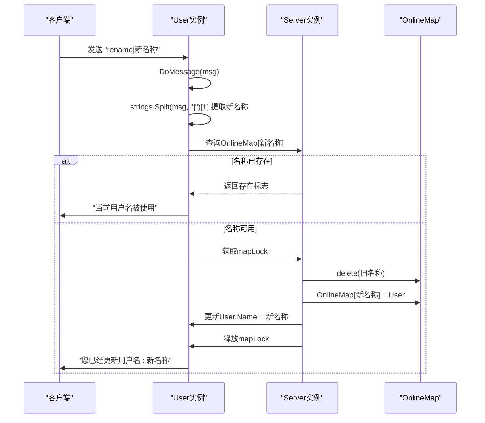

# 用户名修改

<cite>
**Referenced Files in This Document**   
- [user.go](file://14-golang-IM-System/ServerV0.6-修改用户名/user.go)
- [server.go](file://14-golang-IM-System/ServerV0.6-修改用户名/server.go)
</cite>

## 目录
1. [简介](#简介)
2. [核心组件](#核心组件)
3. [名称修改流程](#名称修改流程)
4. [并发安全性分析](#并发安全性分析)
5. [字符串处理边界情况](#字符串处理边界情况)
6. [代码实现缺陷分析](#代码实现缺陷分析)
7. [交互示例](#交互示例)
8. [扩展架构建议](#扩展架构建议)

## 简介
本文档深入分析即时通讯系统中用户名修改功能的技术实现。当用户发送`rename|新名称`格式的消息时，系统通过`DoMessage`方法解析新用户名，检查在线用户映射表（OnlineMap）中是否存在重名，若无冲突则通过加锁操作安全地更新用户信息。文档详细阐述了名称修改的完整流程、并发安全机制、字符串处理的边界情况，并指出当前实现中存在的缺陷，为不同层次的开发者提供实用指导。

## 核心组件

本功能涉及两个核心组件：`User`结构体和`Server`结构体。`User`代表连接到服务器的客户端用户，包含用户的基本信息和通信通道；`Server`管理所有在线用户和消息广播。

**Section sources**
- [user.go](file://14-golang-IM-System/ServerV0.6-修改用户名/user.go#L7-L14)
- [server.go](file://14-golang-IM-System/ServerV0.6-修改用户名/server.go#L15-L15)

## 名称修改流程

当用户请求修改用户名时，系统执行以下步骤：

1.  **消息解析**：`DoMessage`方法接收客户端消息，通过`strings.Split(msg, "|")`将`rename|新名称`格式的字符串分割，提取出新用户名。
2.  **存在性检查**：系统查询`Server`实例中的`OnlineMap`，检查新用户名是否已被其他用户占用。
3.  **原子性更新**：如果用户名可用，系统获取`mapLock`互斥锁，从`OnlineMap`中删除旧的用户名键，并以新用户名作为键重新注册当前`User`实例。
4.  **状态同步**：在锁的保护下，更新`User`实例自身的`Name`字段。
5.  **结果反馈**：向客户端发送成功或失败的提示消息。



**Diagram sources**
- [user.go](file://14-golang-IM-System/ServerV0.6-修改用户名/user.go#L79-L94)

## 并发安全性分析

由于`OnlineMap`是一个被多个goroutine（每个用户连接一个）并发访问的共享资源，直接读写会导致数据竞争（data race）。为确保操作的原子性和一致性，系统采用了`sync.RWMutex`（读写锁）。

-   **读操作**：在查询在线用户列表（`who`命令）或检查用户名是否存在时，使用读锁（`RLock`），允许多个goroutine同时读取。
-   **写操作**：在用户上线、下线或修改用户名时，必须使用写锁（`Lock`）。写锁是排他的，能有效防止在更新`OnlineMap`（如`delete`和`map[key]=value`）以及同步`User.Name`字段的过程中被其他goroutine干扰，从而保证了整个更新流程的原子性。

**Section sources**
- [user.go](file://14-golang-IM-System/ServerV0.6-修改用户名/user.go#L85-L92)
- [server.go](file://14-golang-IM-System/ServerV0.6-修改用户名/server.go#L35-L46)

## 字符串处理边界情况

`strings.Split`函数是处理`rename|新名称`这类命令的关键，但其行为在边界情况下需要特别注意：

-   **空名称**：如果用户发送`rename|`，`strings.Split`会返回一个长度为2的切片`["rename", ""]`。此时`newName`为空字符串`""`。当前代码逻辑会检查`OnlineMap[""]`，如果存在一个用户名为空的用户（虽然初始用户名是IP地址，但理论上可能通过其他方式产生），则会提示重名；否则会允许修改为空用户名，这通常不是期望的行为。
-   **特殊字符**：`strings.Split`仅以`|`为分隔符，不检查新名称的内容。这意味着用户可以使用包含空格、表情符号或控制字符的名称，可能导致显示混乱或安全问题。
-   **分隔符缺失**：如果用户发送`rename新名称`（缺少`|`），`strings.Split`返回的切片长度为1，访问`[1]`会引发`panic: runtime error: index out of range`，导致当前用户连接的goroutine崩溃。虽然`defer-recover`机制可以捕获此panic，但当前代码未实现，存在稳定性风险。

**Section sources**
- [user.go](file://14-golang-IM-System/ServerV0.6-修改用户名/user.go#L79)
- [go_test/4.字符串/string.go](file://go_test/4.字符串/string.go#L84-L95)

## 代码实现缺陷分析

当前的用户名修改实现存在以下主要缺陷：

1.  **缺乏输入校验**：代码未对新用户名进行任何合法性校验。应增加对名称长度（如1-20字符）、字符集（如仅允许字母、数字、下划线）的检查，防止恶意或无效输入。
2.  **未处理索引越界**：直接访问`strings.Split(msg, "|")[1]`存在严重的安全隐患。如果分隔后切片长度不足2，程序会panic。应在访问前检查切片长度。
3.  **空用户名问题**：如上所述，允许修改为空字符串的用户名，这在业务逻辑上通常是不合理的。
4.  **用户体验差**：对于格式错误的消息，系统没有给出明确的错误提示，用户难以知道如何正确操作。

## 交互示例

### 成功场景
```
用户A输入: rename|小明
系统回复: 您已经更新用户名:小明
广播消息: [127.0.0.1:54321]小明:已上线
```

### 失败场景
```
用户B输入: rename|小明
系统回复: 当前用户名被使用

用户C输入: rename|
系统回复: 您已经更新用户名: (空字符串) 或 程序崩溃

用户D输入: rename
系统回复: (无响应或程序崩溃)
```

## 扩展架构建议

在分布式IM系统中，单机的`OnlineMap`无法保证全局名称唯一性。为实现跨服务的名称唯一性，可采用以下架构：

1.  **中心化注册中心**：引入Redis或etcd作为全局用户注册中心。修改用户名时，需向注册中心发起原子性操作（如Redis的`SET key value NX`），成功则更新本地状态，失败则返回重名。
2.  **分布式锁**：使用Redis的`Redlock`算法或Zookeeper的临时顺序节点来实现跨服务的分布式锁，确保同一时间只有一个服务能处理特定用户的改名请求。
3.  **事件驱动架构**：当用户成功修改名称后，发布一个`UserRenamedEvent`事件。其他服务实例通过消息队列（如Kafka）订阅该事件，更新各自的本地缓存，保证数据最终一致性。

此扩展方案能有效解决单点故障和水平扩展问题，但增加了系统复杂性和延迟。