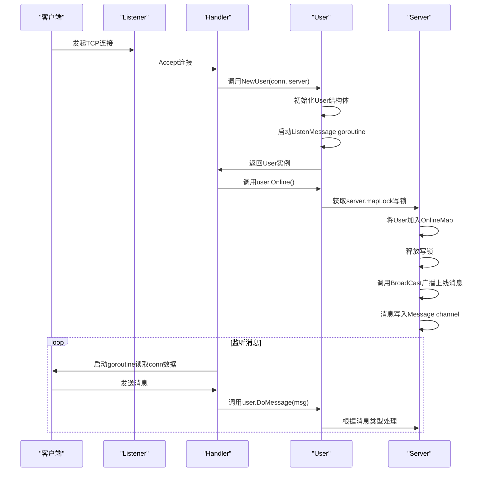
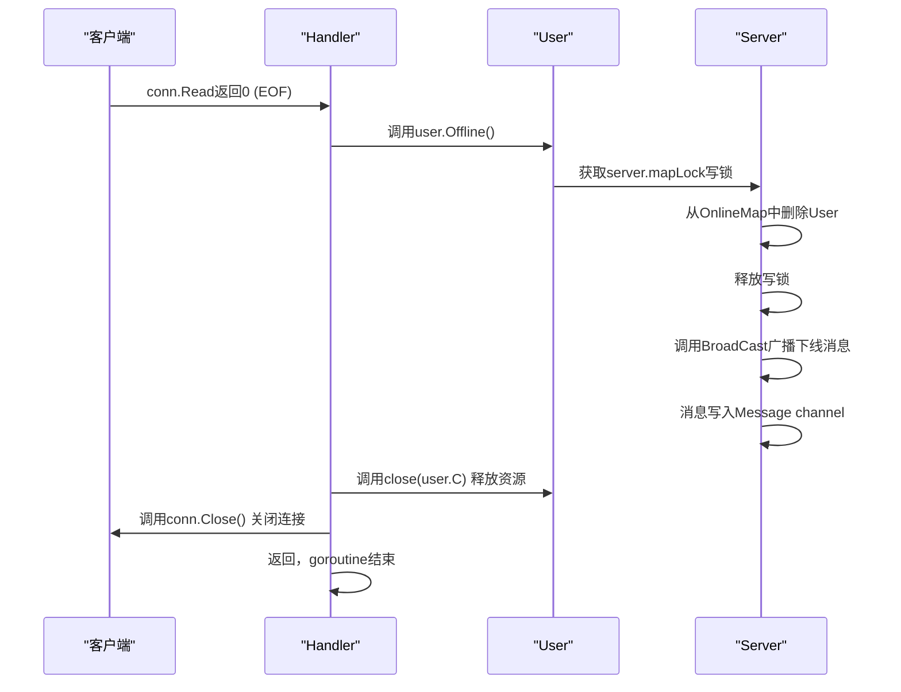
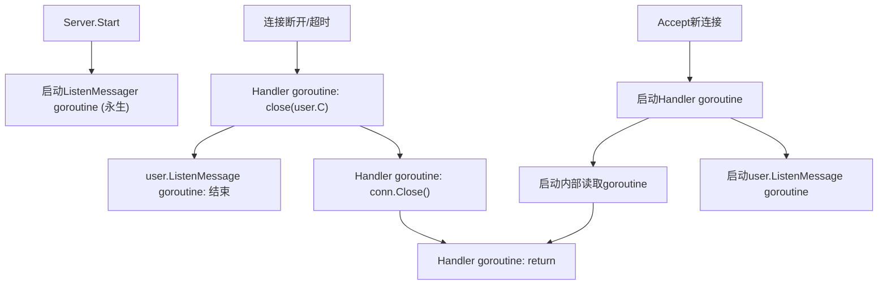
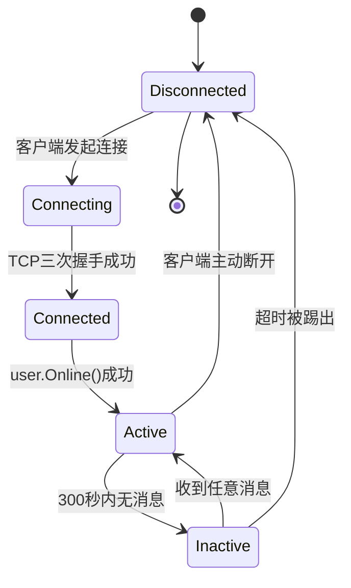

<cite>
**本文档中引用的文件**   
- [server.go](file://14-golang-IM-System/server.go)
- [user.go](file://14-golang-IM-System/user.go)
</cite>

## 目录
1. [用户连接与断开](#用户连接与断开)
2. [连接建立与销毁的完整流程](#连接建立与销毁的完整流程)
3. [sync.RWMutex在并发读写map中的作用机制](#syncrwmutex在并发读写map中的作用机制)
4. [User结构体初始化流程](#user结构体初始化流程)
5. [goroutine生命周期管理](#goroutinelifecycle管理)
6. [连接状态变化的状态机图示](#连接状态变化的状态机图示)
7. [连接泄漏的排查方法和性能监控点](#连接泄漏的排查方法和性能监控点)

## 用户连接与断开

本文档详细阐述了在Go语言实现的即时通讯系统中，用户连接与断开功能的技术实现。核心逻辑围绕`server.Handler`方法展开，当客户端建立TCP连接后，服务器通过该方法创建`User`实例，并调用其`Online`方法将用户加入`OnlineMap`在线用户列表，同时通过`BroadCast`广播上线通知。当用户断开连接时，系统会触发`Offline`方法，从`OnlineMap`中安全地删除用户记录并广播下线消息。文档深入分析了连接建立与销毁的完整调用时序、`sync.RWMutex`在并发环境下的保护机制、`User`结构体的初始化过程以及`goroutine`的生命周期管理。

**Section sources**
- [server.go](file://14-golang-IM-System/server.go#L55-L115)
- [user.go](file://14-golang-IM-System/user.go#L36-L45)
- [user.go](file://14-golang-IM-System/user.go#L48-L58)

## 连接建立与销毁的完整流程

### 连接建立时序图

当客户端发起TCP连接时，服务器端的处理流程如下：



**Diagram sources**
- [server.go](file://14-golang-IM-System/server.go#L55-L115)
- [user.go](file://14-golang-IM-System/user.go#L17-L33)
- [user.go](file://14-golang-IM-System/user.go#L36-L45)

### 连接销毁时序图

当用户断开连接时，无论是主动关闭还是网络异常，系统的处理流程如下：



**Diagram sources**
- [server.go](file://14-golang-IM-System/server.go#L70-L73)
- [user.go](file://14-golang-IM-System/user.go#L48-L58)

### 优雅下线处理

在`server.Handler`方法中，通过`conn.Read(buf)`的返回值来判断连接状态。当`n == 0`时，表示客户端已关闭写端（即发送了FIN包），此时应优雅地处理用户下线：

```go
n, err := conn.Read(buf)
if n == 0 {
    user.Offline()
    return
}
```

此代码片段确保了在连接正常关闭时，系统能及时清理用户状态。`defer listener.Close()`的使用（见`server.go`第126行）确保了即使服务器启动失败，监听套接字也能被正确释放，防止资源泄漏。

**Section sources**
- [server.go](file://14-golang-IM-System/server.go#L70-L73)
- [server.go](file://14-golang-IM-System/server.go#L126)

## sync.RWMutex在并发读写map中的作用机制

`OnlineMap`是一个全局的在线用户映射表，被多个`goroutine`并发访问。为了保证数据一致性，系统使用`sync.RWMutex`进行保护。

### 读写锁机制

- **写操作（加写锁）**：当执行`Online`（上线）、`Offline`（下线）或`rename`（改名）等修改`OnlineMap`的操作时，必须获取写锁（`mapLock.Lock()`）。写锁是排他的，同一时间只能有一个写操作。
- **读操作（加读锁）**：当执行`who`（查询在线用户）或广播消息遍历`OnlineMap`时，只需获取读锁（`mapLock.RLock()`）。读锁是共享的，允许多个读操作同时进行。

### 避免并发Panic

若不使用`sync.RWMutex`，直接对`map`进行并发读写，Go运行时会检测到并发的map写入并触发`fatal error: concurrent map writes`的panic。通过在所有对`OnlineMap`的访问前后正确地加锁和解锁，系统完全避免了此类风险。

**Section sources**
- [server.go](file://14-golang-IM-System/server.go#L15)
- [user.go](file://14-golang-IM-System/user.go#L37-L39)
- [user.go](file://14-golang-IM-System/user.go#L49-L51)
- [user.go](file://14-golang-IM-System/user.go#L68-L70)

## User结构体初始化流程

`User`结构体的初始化由`NewUser`函数完成，该函数接收一个`net.Conn`连接和一个指向`Server`的指针。

```go
type User struct {
	Name string
	Addr string
	C    chan string
	conn net.Conn
	server *Server
}
```

### 初始化步骤

1.  **字段赋值**：`Name`和`Addr`被设置为客户端的远程地址（`conn.RemoteAddr().String()`）。
2.  **资源创建**：为每个用户创建一个独立的`chan string`（`C`），用于接收服务器要广播给该用户的消息。
3.  **依赖注入**：将`conn`和`server`指针保存在结构体中，以便后续操作。
4.  **启动监听**：立即启动一个`goroutine`执行`user.ListenMessage()`，该`goroutine`会持续监听`user.C`这个channel，一旦有消息写入，就通过`conn.Write`发送给客户端。

此流程确保了每个新连接的用户都能立即进入可通信状态。

**Section sources**
- [user.go](file://14-golang-IM-System/user.go#L7-L14)
- [user.go](file://14-golang-IM-System/user.go#L17-L33)

## goroutine生命周期管理

本系统中`goroutine`的生命周期与TCP连接紧密绑定，管理得当，避免了泄漏。

### 主要goroutine

1.  **监听goroutine**：在`Server.Start()`中启动，通过`go this.ListenMessager()`创建。它是一个永不停止的循环，负责从`Message` channel读取消息并广播给所有在线用户。其生命周期与服务器进程相同。
2.  **Handler goroutine**：在`listener.Accept()`后，通过`go this.Handler(conn)`为每个连接创建。它是连接的主处理循环，负责接收消息和处理超时。当连接关闭或超时，该`goroutine`会执行`return`退出。
3.  **消息读取goroutine**：在`NewUser`中，通过`go user.ListenMessage()`为每个用户创建。它负责将`user.C`中的消息发送到客户端。当`Handler goroutine`调用`close(user.C)`时，该`goroutine`中的`for`循环会因`msg := <-this.C`接收到零值而退出。
4.  **消息处理goroutine**：在`Handler`内部，通过`go func()`创建，负责调用`conn.Read`。当连接断开，`Read`返回0或错误，该匿名`goroutine`会`return`退出。

### 生命周期图



**Diagram sources**
- [server.go](file://14-golang-IM-System/server.go#L118-L120)
- [server.go](file://14-golang-IM-System/server.go#L55-L115)
- [user.go](file://14-golang-IM-System/user.go#L17-L33)
- [user.go](file://14-golang-IM-System/user.go#L126-L132)

## 连接状态变化的状态机图示

为初学者提供一个用户连接状态的简化状态机。



**Diagram sources**
- [server.go](file://14-golang-IM-System/server.go#L55-L115)
- [user.go](file://14-golang-IM-System/user.go#L36-L45)

## 连接泄漏的排查方法和性能监控点

### 潜在风险与排查

尽管设计良好，但仍需警惕连接泄漏：
- **风险点**：如果`Handler`中的`select`循环因未处理的`panic`而意外退出，但未执行`defer`或`return`前的清理代码，则可能导致`user.C`未被`close`，`conn`未被`Close`，`User`未从`OnlineMap`移除。
- **排查方法**：通过`pprof`工具分析`goroutine`数量。如果`goroutine`数量持续增长且不下降，说明存在泄漏。检查`Handler`函数中是否有未捕获的`panic`。

### 性能监控点

1.  **OnlineMap大小**：定期打印`len(server.OnlineMap)`，监控在线用户数，是系统负载的核心指标。
2.  **Message Channel长度**：虽然`Message` channel是无缓冲的，但可以监控`ListenMessager` goroutine的处理延迟。如果广播消息后，客户端接收有明显延迟，说明该goroutine处理不过来。
3.  **goroutine数量**：使用`runtime.NumGoroutine()`监控总`goroutine`数，应与在线用户数大致成正比（每个用户约3个goroutine）。
4.  **超时踢人频率**：记录因超时被踢出的用户数，可反映用户活跃度和网络质量。

**Section sources**
- [server.go](file://14-golang-IM-System/server.go#L100-L110)
- [server.go](file://14-golang-IM-System/server.go#L15)