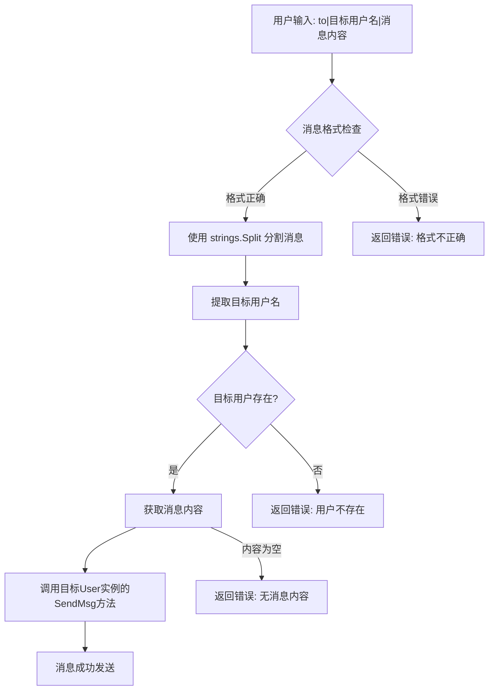
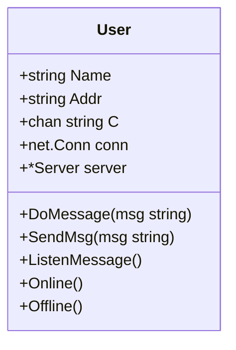
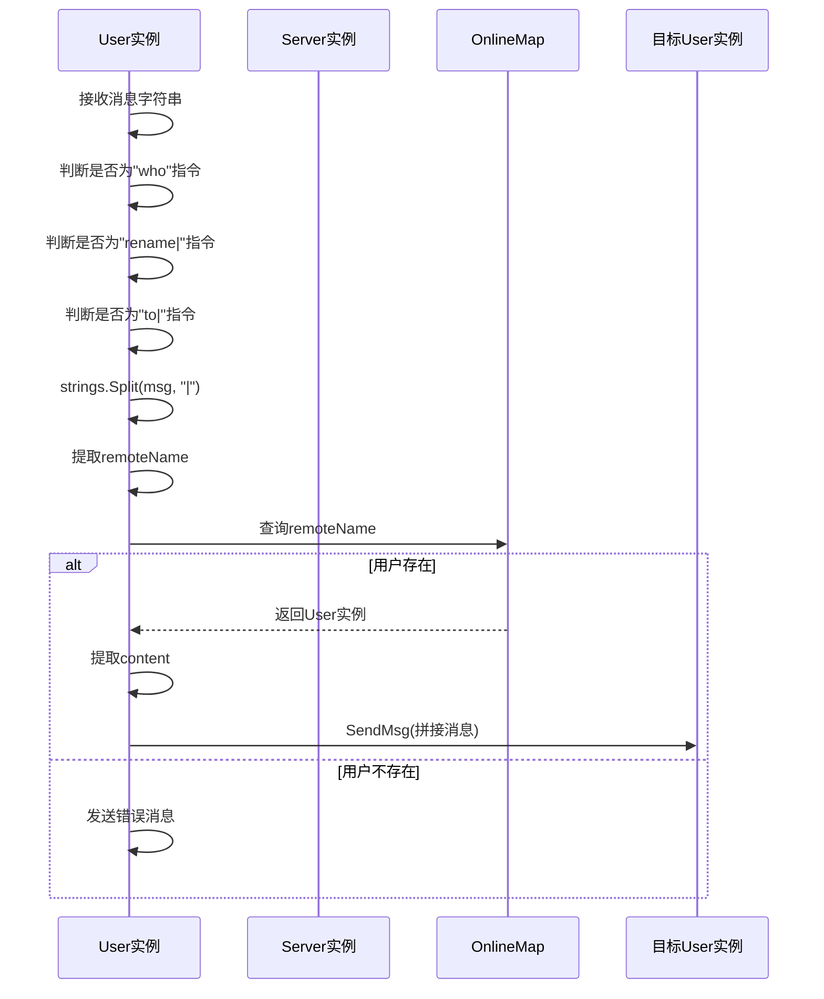

<cite>
**本文档引用的文件**  
- [server.go](file://14-golang-IM-System/ServerV0.8-私聊功能/server.go)
- [user.go](file://14-golang-IM-System/ServerV0.8-私聊功能/user.go)
- [client.go](file://14-golang-IM-System/client.go)
</cite>

## 目录
1. [私聊功能技术文档](#私聊功能技术文档)
2. [私聊消息处理流程](#私聊消息处理流程)
3. [核心组件分析](#核心组件分析)
4. [私聊功能扩展性分析](#私聊功能扩展性分析)
5. [高并发性能优化策略](#高并发性能优化策略)
6. [结论](#结论)

## 私聊功能技术文档

本技术文档系统化阐述了基于Go语言实现的即时通讯系统中私聊功能（to|命令）的完整技术实现。文档详细解析了当用户输入`to|目标用户名|消息内容`格式指令时，`DoMessage`方法如何解析目标用户、验证消息格式、在`OnlineMap`中查找对应`User`实例，并通过其`SendMsg`方法实现点对点消息转发的全过程。内容涵盖私聊消息处理流程图、字符串分割逻辑的健壮性分析、目标用户不存在时的错误处理机制，并指出了当前实现中消息内容含分隔符'|'会导致解析错误的潜在缺陷。

**Section sources**
- [user.go](file://14-golang-IM-System/ServerV0.8-私聊功能/user.go#L65-L132)
- [client.go](file://14-golang-IM-System/client.go#L75-L140)

## 私聊消息处理流程

### 私聊消息处理流程图

**Diagram sources**
- [user.go](file://14-golang-IM-System/ServerV0.8-私聊功能/user.go#L65-L132)

### 字符串分割逻辑与健壮性分析

私聊功能的核心在于对用户输入的字符串进行精确解析。系统采用`strings.Split(msg, "|")`方法将输入消息按竖线`|`分隔符拆分为多个部分。该逻辑首先通过`len(msg) > 4 && msg[:3] == "to|"`进行前缀检查，确保消息符合私聊命令的基本格式。

分割后，系统通过索引访问数组元素来提取信息：
- `strings.Split(msg, "|")[1]` 获取目标用户名
- `strings.Split(msg, "|")[2]` 获取消息内容

系统对提取的每个部分都进行了健壮性校验：
1. **用户名校验**：检查`remoteName`是否为空，若为空则返回格式错误提示。
2. **用户存在性校验**：通过`OnlineMap`查找目标用户，若不存在则返回"该用户名不存在"。
3. **消息内容校验**：检查`content`是否为空，若为空则提示"无消息内容，请重发"。

**Section sources**
- [user.go](file://14-golang-IM-System/ServerV0.8-私聊功能/user.go#L95-L115)

### 错误处理机制

系统实现了多层次的错误处理机制，确保用户体验的友好性：
- **格式错误**：当消息不以`to|`开头或分割后缺少必要部分时，返回"消息格式不正确"的提示。
- **用户不存在**：在`OnlineMap`中查找失败时，返回"该用户名不存在"。
- **空消息内容**：当消息内容为空时，提示用户重新发送。

这些错误信息通过`SendMsg`方法直接反馈给发送方，实现了即时的交互反馈。

**Section sources**
- [user.go](file://14-golang-IM-System/ServerV0.8-私聊功能/user.go#L97-L115)

### 潜在缺陷分析

当前实现存在一个显著的潜在缺陷：**消息内容中若包含分隔符`|`，将导致解析错误**。例如，当用户发送`to|张三|你好|世界`时，`strings.Split`会将其分割为`["to", "张三", "你好", "世界"]`四个部分，导致系统将"你好"作为消息内容，而"世界"被忽略，严重破坏了消息的完整性。此缺陷源于使用了与消息内容可能冲突的简单分隔符，是典型的字符串解析边界情况问题。

**Section sources**
- [user.go](file://14-golang-IM-System/ServerV0.8-私聊功能/user.go#L113)

## 核心组件分析

### User 结构体

`User`结构体是系统的核心数据模型，封装了用户的所有状态和行为。

**Diagram sources**
- [user.go](file://14-golang-IM-System/ServerV0.8-私聊功能/user.go#L7-L14)

### DoMessage 方法执行流程

`DoMessage`方法是消息处理的中枢，采用条件判断链处理不同类型的指令。

**Diagram sources**
- [user.go](file://14-golang-IM-System/ServerV0.8-私聊功能/user.go#L65-L132)

### 典型私聊交互示例

为新手开发者提供一个典型的私聊交互示例：

1. **客户端A**在私聊模式下输入 `to|B|你好，今天过得怎么样？`
2. 客户端A将消息 `to|B|你好，今天过得怎么样？\n\n` 发送给服务器
3. 服务器的`DoMessage`方法解析消息，提取目标用户`B`和内容`你好，今天过得怎么样？`
4. 服务器在`OnlineMap`中查找用户`B`的`User`实例
5. 找到后，调用`B.SendMsg("A对您说:你好，今天过得怎么样？")`
6. **客户端B**收到消息并显示 `A对您说:你好，今天过得怎么样？`

**Section sources**
- [client.go](file://14-golang-IM-System/client.go#L75-L140)
- [user.go](file://14-golang-IM-System/ServerV0.8-私聊功能/user.go#L113)

## 私聊功能扩展性分析

### 离线消息存储

当前系统仅支持在线用户间的实时通信。为实现离线消息存储，可引入消息队列（如Redis）或数据库。当`DoMessage`发现目标用户不在线时，可将消息持久化存储，并在用户下次上线时推送。这需要扩展`User`结构体以包含消息队列或数据库连接。

### 消息加密

为增强安全性，可在`SendMsg`方法中集成加密逻辑。例如，在发送前使用AES或RSA对消息内容进行加密，在`ListenMessage`接收后进行解密。这需要在`User`结构体中增加密钥管理字段，并在客户端与服务器间建立安全的密钥交换机制。

**Section sources**
- [user.go](file://14-golang-IM-System/ServerV0.8-私聊功能/user.go#L126-L132)

## 高并发性能优化策略

在高并发场景下，`OnlineMap`的查找性能至关重要。当前实现使用`sync.RWMutex`进行读写锁保护，但在海量用户在线时，频繁的锁竞争可能成为瓶颈。

**优化策略**：
1. **分片锁**：将`OnlineMap`按用户名哈希值分片，每个分片拥有独立的锁，减少锁竞争范围。
2. **读写分离**：对于读操作（如查询用户是否存在），可使用`sync.Map`等无锁数据结构，进一步提升读取性能。
3. **缓存层**：引入内存缓存（如Redis），将热点用户的查找操作前置到缓存层，减轻主Map的压力。

这些优化策略可在不改变核心业务逻辑的前提下，显著提升系统的并发处理能力。

**Section sources**
- [server.go](file://14-golang-IM-System/ServerV0.8-私聊功能/server.go#L15-L15)
- [user.go](file://14-golang-IM-System/ServerV0.8-私聊功能/user.go#L99)

## 结论

本文档全面分析了即时通讯系统中私聊功能的技术实现。系统通过`DoMessage`方法实现了基于`to|`命令的点对点消息转发，流程清晰，错误处理完善。然而，使用`|`作为分隔符的简单设计在消息内容包含该字符时会产生解析缺陷，建议未来采用更健壮的协议（如JSON）或转义机制来解决此问题。此外，通过引入离线消息存储、消息加密和高并发优化策略，可以显著提升系统的功能完整性和性能表现。