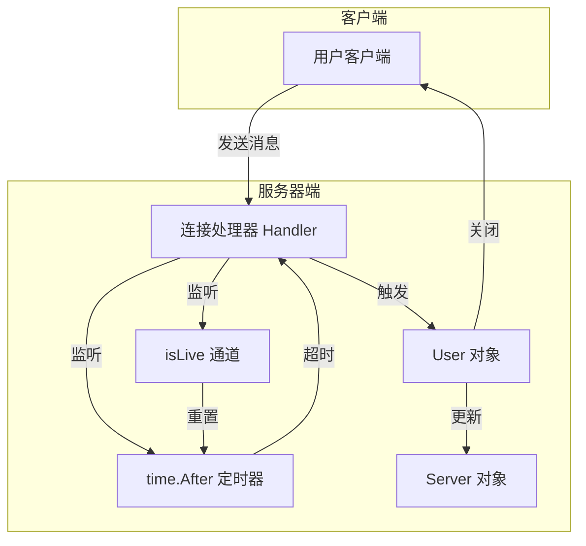
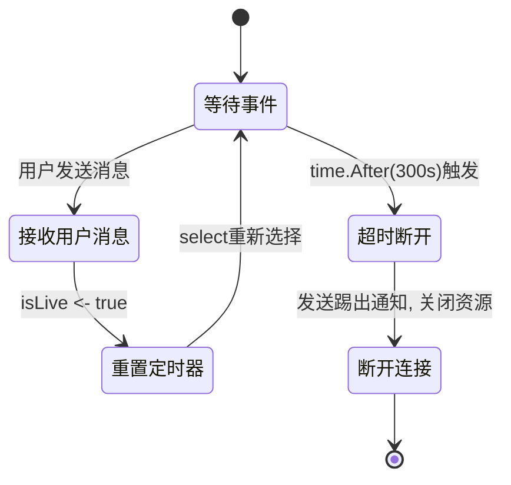
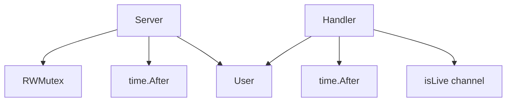

# 超时强踢功能

<cite>
**Referenced Files in This Document**   
- [server.go](file://14-golang-IM-System/ServerV0.7-超时强踢功能/server.go)
- [user.go](file://14-golang-IM-System/ServerV0.7-超时强踢功能/user.go)
- [main.go](file://14-golang-IM-System/ServerV0.7-超时强踢功能/main.go)
- [server.go](file://14-golang-IM-System/ServerV0.8-私聊功能/server.go)
</cite>

## 目录
1. [引言](#引言)
2. [项目结构](#项目结构)
3. [核心组件](#核心组件)
4. [架构概述](#架构概述)
5. [详细组件分析](#详细组件分析)
6. [依赖分析](#依赖分析)
7. [性能考虑](#性能考虑)
8. [故障排除指南](#故障排除指南)
9. [结论](#结论)

## 引言

本文档深入解析即时通讯系统中的超时强踢功能，重点阐述基于Go语言的`select`语句与`time.After`定时器实现的心跳检测机制。该功能通过监控用户活动状态，确保在用户长时间无操作时自动断开连接，从而释放服务器资源并维护系统健康。文档将从基础概念到高级优化，全面剖析该功能的技术实现。

## 项目结构

本功能位于`14-golang-IM-System`目录下的`ServerV0.7-超时强踢功能`子目录中，是IM系统迭代开发的第七个版本。项目结构清晰，主要包含`main.go`、`server.go`和`user.go`三个核心文件，分别负责程序入口、服务器逻辑和用户状态管理。

**Section sources**
- [server.go](file://14-golang-IM-System/ServerV0.7-超时强踢功能/server.go#L1-L10)
- [user.go](file://14-golang-IM-System/ServerV0.7-超时强踢功能/user.go#L1-L10)

## 核心组件

超时强踢功能的核心在于`Server`结构体的`Handler`方法，该方法为每个新建立的TCP连接创建一个独立的goroutine。在此goroutine中，通过`select`语句同时监听两个通道：一个是`isLive`通道，用于接收用户活动信号；另一个是`time.After(300秒)`返回的定时器通道，用于触发超时事件。

**Section sources**
- [server.go](file://14-golang-IM-System/ServerV0.7-超时强踢功能/server.go#L55-L115)
- [user.go](file://14-golang-IM-System/ServerV0.7-超时强踢功能/user.go#L126-L132)

## 架构概述

**Diagram sources**
- [server.go](file://14-golang-IM-System/ServerV0.7-超时强踢功能/server.go#L55-L115)
- [user.go](file://14-golang-IM-System/ServerV0.7-超时强踢功能/user.go#L1-L20)

## 详细组件分析

### 超时检测机制分析

#### 心跳机制与select监听
超时检测的核心是`select`语句的非阻塞多路复用特性。`Handler`函数中的`for`循环内，`select`会同时等待`isLive`通道和`time.After`定时器通道的就绪。`select`的工作原理是随机选择一个已就绪的case分支执行，从而实现了对多个事件源的高效监听。

**Diagram sources**
- [server.go](file://14-golang-IM-System/ServerV0.7-超时强踢功能/server.go#L85-L115)

**Section sources**
- [server.go](file://14-golang-IM-System/ServerV0.7-超时强踢功能/server.go#L85-L115)

#### time.After资源管理
`time.After(d Duration)`函数返回一个`<-chan Time`，在指定的持续时间`d`之后，该通道会发送当前时间并关闭。在`select`语句中使用`time.After`时，如果`isLive`通道先被触发，`time.After`创建的定时器将永远不会被消费，这可能导致定时器资源泄漏。然而，在当前实现中，由于`Handler`函数在超时或用户下线后会直接`return`并结束整个goroutine，因此与该goroutine关联的所有资源（包括未触发的定时器）都会被Go运行时自动回收，从而避免了长期的资源泄漏问题。

### 可配置化改造方案

当前代码中，超时时间硬编码为300秒（5分钟）。为了提高系统的灵活性，应将其改造为可配置参数。

**Section sources**
- [server.go](file://14-golang-IM-System/ServerV0.7-超时强踢功能/server.go#L99)
- [server.go](file://14-golang-IM-System/ServerV0.8-私聊功能/server.go#L99)

## 依赖分析

本功能主要依赖Go标准库中的`net`、`sync`和`time`包。`net`包用于处理TCP网络连接，`sync`包中的`RWMutex`用于保证在线用户映射表的并发安全，`time`包则提供了`time.After`这一关键的定时器功能。各组件间依赖关系清晰，`Server`结构体依赖`User`结构体，而`Handler`方法作为连接处理的核心，协调了`User`对象、`isLive`通道和定时器之间的交互。

**Diagram sources**
- [server.go](file://14-golang-IM-System/ServerV0.7-超时强踢功能/server.go#L1-L20)
- [user.go](file://14-golang-IM-System/ServerV0.7-超时强踢功能/user.go#L1-L20)

**Section sources**
- [server.go](file://14-golang-IM-System/ServerV0.7-超时强踢功能/server.go#L1-L20)
- [user.go](file://14-golang-IM-System/ServerV0.7-超时强踢功能/user.go#L1-L20)

## 性能考虑

当前5分钟的超时时间对于大多数IM应用场景是合理的，它平衡了用户体验（避免频繁断线）和服务器资源消耗。在大规模连接场景下，可以考虑使用`time.Ticker`或更高效的定时器轮（Timing Wheel）算法来优化大量连接的定时器管理，减少系统调用开销。此外，`time.After`在`select`中可能产生的短暂资源泄漏在goroutine生命周期较短的场景下影响较小，但在长连接、高并发的系统中，应考虑使用`time.NewTimer`并在`select`的`default`分支或`isLive`分支中主动调用`Stop()`方法来精确管理定时器资源。

## 故障排除指南

若发现用户未被正确踢出，应检查`Handler`函数中的`select`循环是否被意外中断，以及`conn.Read`返回的错误处理逻辑是否正确。若出现资源泄漏，应确认goroutine是否能正常退出。可通过在`time.After`前打印日志来调试定时器是否按预期触发。

**Section sources**
- [server.go](file://14-golang-IM-System/ServerV0.7-超时强踢功能/server.go#L70-L115)

## 结论

超时强踢功能通过Go语言强大的并发原语，以简洁高效的方式实现了用户活跃度检测。`select`语句与`time.After`的结合，完美诠释了Go在处理并发I/O和定时任务上的优势。未来可通过引入PING/PONG协议进行更精细化的活跃度检测，并将超时时间配置化以适应不同业务需求。