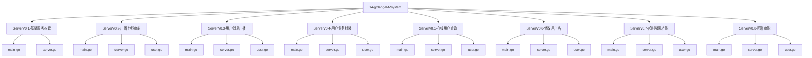
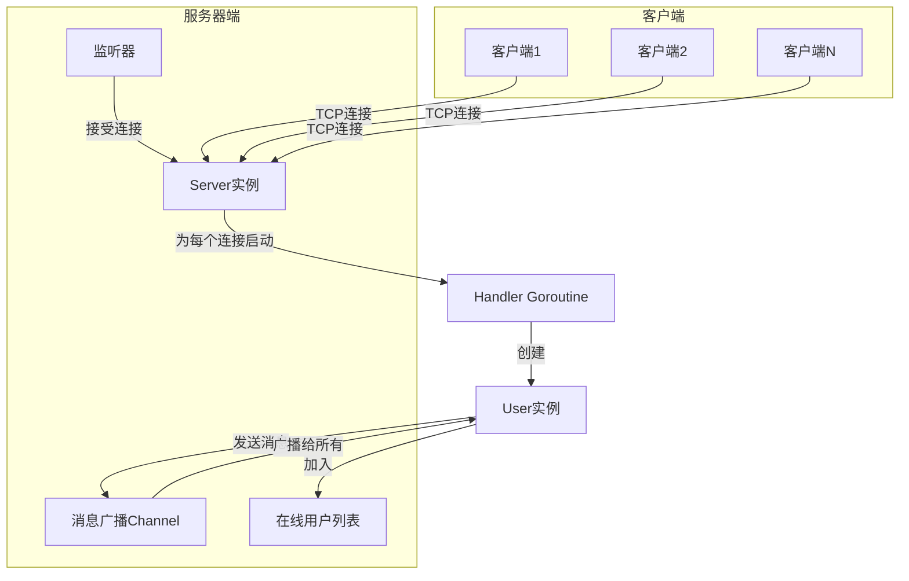
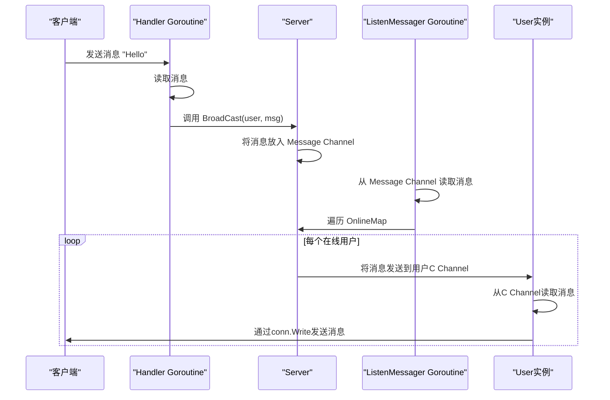
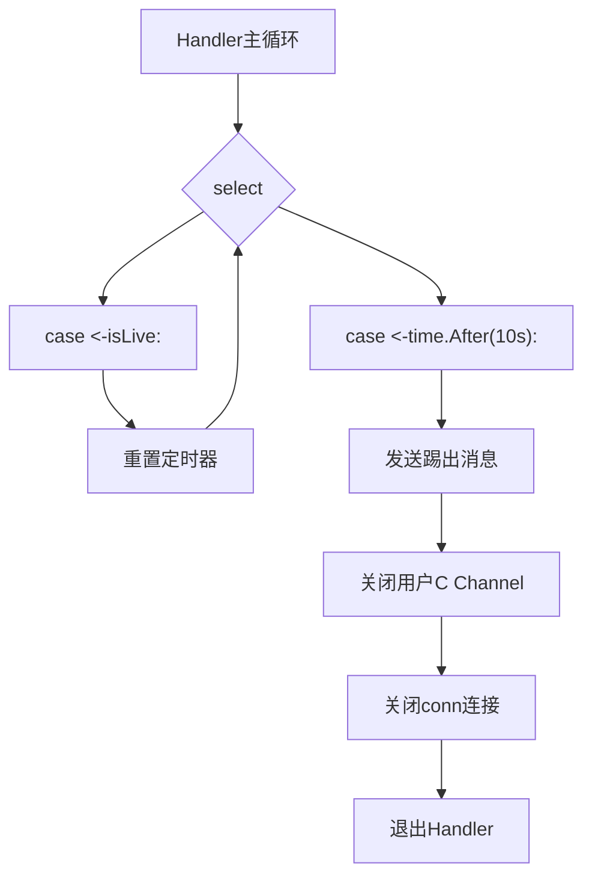
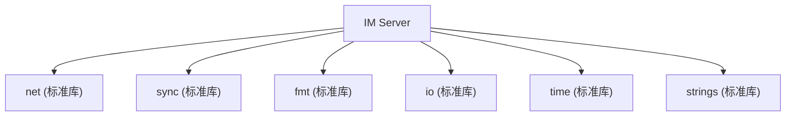

<cite>
**本文档中引用的文件**
- [main.go](file://14-golang-IM-System/ServerV0.1-基础服务构建/main.go)
- [server.go](file://14-golang-IM-System/ServerV0.1-基础服务构建/server.go)
- [user.go](file://14-golang-IM-System/ServerV0.2-广播上线功能/user.go)
- [server.go](file://14-golang-IM-System/ServerV0.3-用户消息广播/server.go)
- [user.go](file://14-golang-IM-System/ServerV0.4-用户业务封装/user.go)
- [server.go](file://14-golang-IM-System/ServerV0.5-在线用户查询/server.go)
- [user.go](file://14-golang-IM-System/ServerV0.6-修改用户名/user.go)
- [server.go](file://14-golang-IM-System/ServerV0.7-超时强踢功能/server.go)
- [server.go](file://14-golang-IM-System/ServerV0.8-私聊功能/server.go)
- [user.go](file://14-golang-IM-System/ServerV0.8-私聊功能/user.go)
</cite>

## 目录

1. [引言](#引言)
2. [项目结构](#项目结构)
3. [核心组件](#核心组件)
4. [架构概览](#架构概览)
5. [详细组件分析](#详细组件分析)
6. [依赖分析](#依赖分析)
7. [性能考量](#性能考量)
8. [故障排除指南](#故障排除指南)
9. [结论](#结论)

## 引言

本教程旨在引导学习者从零开始构建一个完整的即时通讯（IM）系统。通过八个渐进式的版本迭代，我们将深入探讨TCP服务器的初始化、连接管理、消息广播、用户状态维护、私聊功能等核心概念。每个版本都建立在前一个版本的基础上，逐步增加复杂性和功能，帮助学习者理解IM系统的设计模式和实现细节。

## 项目结构

该项目采用版本化目录结构，每个版本对应一个独立的文件夹，清晰地展示了IM系统的演进过程。这种结构便于学习者按步骤理解代码变化，也方便进行版本对比。



**Diagram sources**
- [14-golang-IM-System](file://14-golang-IM-System)

**Section sources**
- [14-golang-IM-System](file://14-golang-IM-System)

## 核心组件

IM系统的核心由`Server`和`User`两个结构体构成。`Server`负责监听端口、管理客户端连接和广播消息，而`User`则代表一个在线客户端，封装了其状态、通信通道和行为逻辑。随着版本迭代，这两个组件的功能不断丰富，从最初的简单连接处理发展到支持复杂的用户交互。

**Section sources**
- [server.go](file://14-golang-IM-System/ServerV0.1-基础服务构建/server.go)
- [user.go](file://14-golang-IM-System/ServerV0.2-广播上线功能/user.go)

## 架构概览

整个IM系统基于Go语言的并发模型构建，利用`goroutine`和`channel`实现高效的并发处理。服务器启动一个监听循环，为每个新连接创建一个独立的`goroutine`进行处理。消息广播通过一个中心化的`Message` channel实现，所有在线用户的`User`实例都监听一个共享的广播通道，从而实现群聊功能。



**Diagram sources**
- [server.go](file://14-golang-IM-System/ServerV0.3-用户消息广播/server.go)
- [user.go](file://14-golang-IM-System/ServerV0.3-用户消息广播/user.go)

## 详细组件分析

### ServerV0.1 - 基础服务构建

此版本实现了IM服务器的最基础功能：TCP监听和连接处理。`Server`结构体包含IP和端口信息，并通过`Start()`方法启动一个无限循环来接受客户端连接。每当有新连接时，都会调用`Handler()`方法，目前仅打印一条连接成功的消息。

```mermaid
flowchart TD
Start([启动服务器]) --> Listen["net.Listen(\"tcp\", 地址)"]
Listen --> |成功| Loop{循环等待连接}
Loop --> Accept["listener.Accept()"]
Accept --> |新连接| Handle["go this.Handler(conn)"]
Handle --> Handler["Handler方法"]
Handler --> Print["打印\"链接建立成功\""]
Accept --> |失败| LogError["记录错误并继续"]
LogError --> Loop
Listen --> |失败| EndError["打印错误并退出"]
```

**Diagram sources**
- [server.go](file://14-golang-IM-System/ServerV0.1-基础服务构建/server.go#L1-L51)
- [main.go](file://14-golang-IM-System/ServerV0.1-基础服务构建/main.go#L1-L7)

**Section sources**
- [server.go](file://14-golang-IM-System/ServerV0.1-基础服务构建/server.go)
- [main.go](file://14-golang-IM-System/ServerV0.1-基础服务构建/main.go)

### ServerV0.2 - 广播上线功能

此版本引入了`User`结构体，用于表示一个在线用户。`User`包含用户名、地址、一个用于接收消息的`channel`和一个`net.Conn`连接。当新用户连接时，`NewUser`函数会创建一个`User`实例，并启动一个`goroutine`来监听其`channel`，一旦有消息就发送回客户端。这为后续的广播功能奠定了基础。

**Section sources**
- [user.go](file://14-golang-IM-System/ServerV0.2-广播上线功能/user.go)

### ServerV0.3 - 用户消息广播

此版本实现了核心的群聊消息广播功能。`Server`结构体新增了`Message` channel和`OnlineMap`在线用户列表。`ListenMessager()` goroutine持续监听`Message` channel，一旦收到消息，就遍历`OnlineMap`将消息发送给所有在线用户。`Handler()`方法也进行了升级，开始读取客户端发送的消息，并将其广播出去。



**Diagram sources**
- [server.go](file://14-golang-IM-System/ServerV0.3-用户消息广播/server.go#L1-L116)

**Section sources**
- [server.go](file://14-golang-IM-System/ServerV0.3-用户消息广播/server.go)

### ServerV0.4 - 用户业务封装

此版本将用户相关的业务逻辑（上线、下线、处理消息）从`Server`中剥离，封装到`User`结构体的方法中，提高了代码的可维护性和内聚性。`User`现在持有一个指向`Server`的指针，以便调用服务器的广播方法。

**Section sources**
- [user.go](file://14-golang-IM-System/ServerV0.4-用户业务封装/user.go)

### ServerV0.5 - 在线用户查询

此版本在`User`的`DoMessage()`方法中增加了对特殊命令`who`的支持。当用户输入`who`时，系统会遍历`OnlineMap`，将所有在线用户的信息通过私有`channel`发送回请求的客户端，实现了在线用户查询功能。

**Section sources**
- [server.go](file://14-golang-IM-System/ServerV0.5-在线用户查询/server.go)
- [user.go](file://14-golang-IM-System/ServerV0.4-用户业务封装/user.go)

### ServerV0.6 - 修改用户名

此版本扩展了`DoMessage()`方法，支持`rename|新用户名`格式的命令。系统会检查新用户名是否已被占用，如果可用，则在`OnlineMap`中更新用户映射，并修改用户实例的`Name`字段。

**Section sources**
- [user.go](file://14-golang-IM-System/ServerV0.6-修改用户名/user.go)

### ServerV0.7 - 超时强踢功能

此版本增强了`Handler()`方法，引入了超时踢出机制。为每个连接创建一个`isLive` channel，当用户发送任何消息时，都会向此channel发送信号。`Handler`的主循环使用`select`语句监听`isLive` channel和一个10秒的定时器。如果定时器先触发，说明用户在10秒内无任何活动，服务器将强制关闭其连接。



**Diagram sources**
- [server.go](file://14-golang-IM-System/ServerV0.7-超时强踢功能/server.go#L1-L144)

**Section sources**
- [server.go](file://14-golang-IM-System/ServerV0.7-超时强踢功能/server.go)

### ServerV0.8 - 私聊功能

此版本在`DoMessage()`方法中增加了对`to|用户名|消息`格式的支持，实现了点对点私聊功能。系统会解析出目标用户名，查找对应的`User`实例，并直接调用其`SendMsg()`方法将消息发送过去，而不会经过广播通道。

**Section sources**
- [user.go](file://14-golang-IM-System/ServerV0.8-私聊功能/user.go)

## 依赖分析

该IM系统主要依赖于Go语言标准库中的`net`包进行TCP网络通信，以及`sync`包中的`RWMutex`来保证对共享资源`OnlineMap`的并发安全访问。各版本之间通过文件复制和增量修改的方式进行迭代，没有使用外部依赖管理工具。



**Diagram sources**
- [go.mod](file://14-golang-IM-System/go.mod)
- [server.go](file://14-golang-IM-System/ServerV0.3-用户消息广播/server.go)

**Section sources**
- [server.go](file://14-golang-IM-System/ServerV0.3-用户消息广播/server.go)

## 性能考量

该系统的设计充分利用了Go的轻量级`goroutine`，每个客户端连接都由一个独立的`goroutine`处理，保证了高并发下的响应能力。消息广播通过一个中心`channel`进行，避免了在每次发送时都进行复杂的锁操作。然而，广播的实现是在`ListenMessager()` goroutine中遍历所有在线用户，当用户数量极大时，可能会成为性能瓶颈。未来的优化方向可以是引入更高效的消息队列或分片广播机制。

## 故障排除指南

*   **无法连接服务器**: 检查服务器IP和端口是否正确，防火墙是否放行了相应端口。
*   **消息无法广播**: 确认客户端发送的消息是否以换行符结尾，因为服务器代码中使用`buf[:n-1]`来去除换行符。
*   **用户无法修改名称**: 确保输入的命令格式为`rename|新名称`，中间无空格。
*   **私聊功能失效**: 检查目标用户名是否正确，且该用户当前在线。
*   **连接被意外断开**: 可能是超时踢出功能触发，检查是否在规定时间内（V0.7为10秒）发送了消息。

**Section sources**
- [server.go](file://14-golang-IM-System/ServerV0.7-超时强踢功能/server.go)
- [user.go](file://14-golang-IM-System/ServerV0.8-私聊功能/user.go)

## 结论

通过对八个版本的分析，我们完整地构建了一个功能丰富的IM系统。从最基础的TCP服务开始，逐步添加了用户管理、消息广播、状态查询、属性修改、连接超时和私聊等核心功能。这个循序渐进的教程不仅展示了Go语言在网络编程中的强大能力，也体现了良好的软件工程实践，如代码封装、功能解耦和迭代开发。学习者可以在此基础上，进一步扩展文件传输、群组聊天、消息持久化等高级功能。