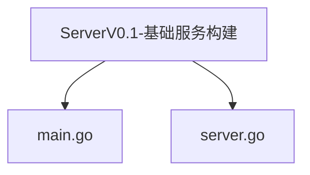
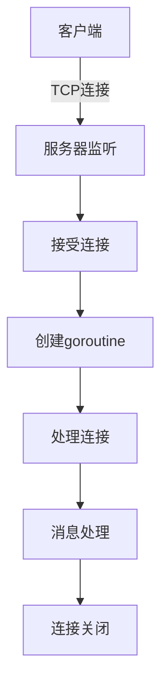
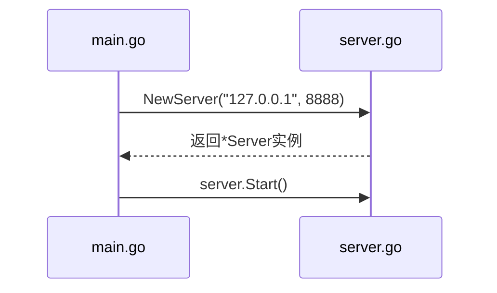
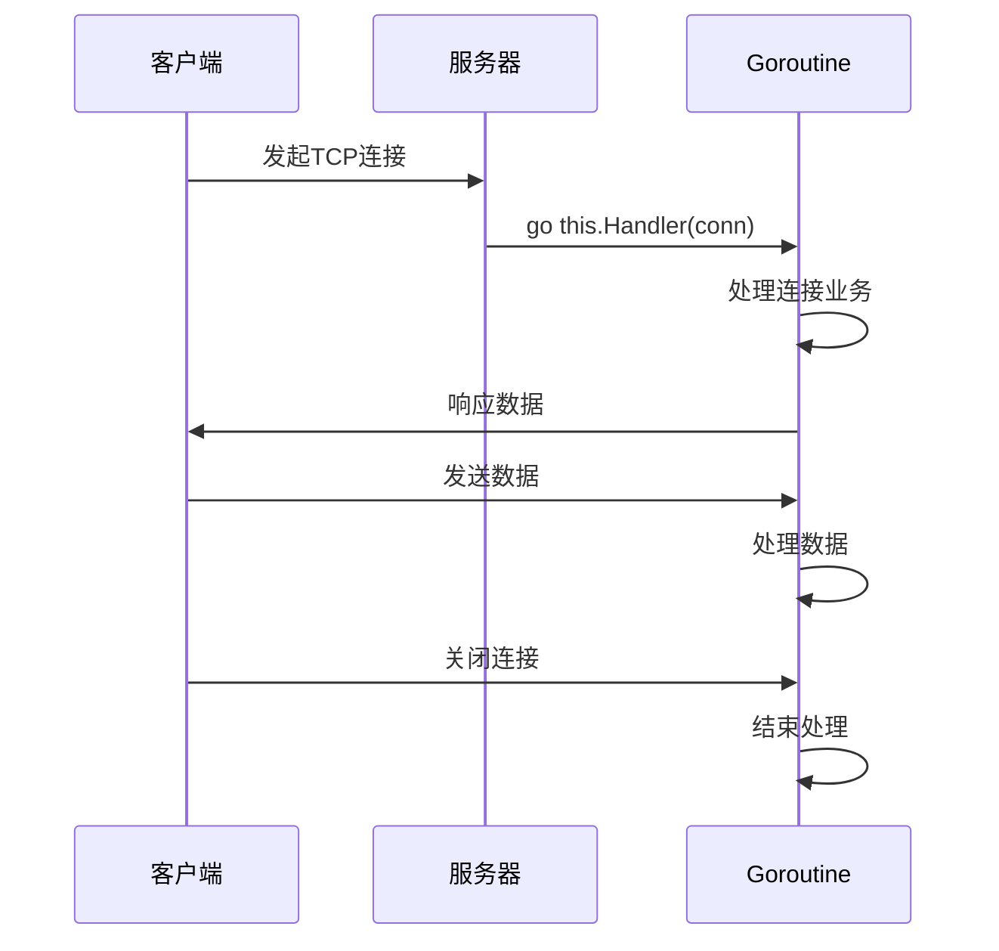
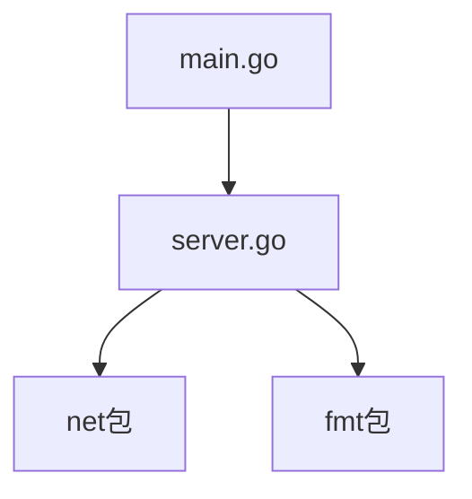

# V0.1 - 基础服务构建

<cite>
**Referenced Files in This Document**   
- [main.go](file://14-golang-IM-System/ServerV0.1-基础服务构建/main.go)
- [server.go](file://14-golang-IM-System/ServerV0.1-基础服务构建/server.go)
- [server.go](file://14-golang-IM-System/server.go)
- [user.go](file://14-golang-IM-System/user.go)
</cite>

## 目录
1. [简介](#简介)
2. [项目结构](#项目结构)
3. [核心组件](#核心组件)
4. [架构概览](#架构概览)
5. [详细组件分析](#详细组件分析)
6. [依赖分析](#依赖分析)
7. [性能考量](#性能考量)
8. [故障排除指南](#故障排除指南)
9. [结论](#结论)

## 简介
本文档详细讲解了即时通讯（IM）系统V0.1版本的实现，重点分析TCP服务器的初始化流程、端口监听机制和客户端连接处理逻辑。通过代码示例展示Go语言标准库net包的基本用法，解释每个新连接如何通过goroutine实现并发处理。提供架构图说明服务启动流程，并指导学习者如何编译运行该版本，使用telnet测试基础连接。同时指出当前版本的局限性，为后续功能扩展打下基础。

## 项目结构
IM系统V0.1版本位于`14-golang-IM-System/ServerV0.1-基础服务构建`目录下，包含两个核心文件：`main.go`和`server.go`。该版本实现了基础的TCP服务器功能，能够监听指定IP和端口，接受客户端连接并进行基本的连接处理。



**Diagram sources**
- [main.go](file://14-golang-IM-System/ServerV0.1-基础服务构建/main.go)
- [server.go](file://14-golang-IM-System/ServerV0.1-基础服务构建/server.go)

**Section sources**
- [main.go](file://14-golang-IM-System/ServerV0.1-基础服务构建/main.go)
- [server.go](file://14-golang-IM-System/ServerV0.1-基础服务构建/server.go)

## 核心组件
V0.1版本的核心组件包括服务器实例的创建与启动流程。`main.go`文件中的`main`函数负责初始化服务器实例并调用其`Start`方法启动服务。`server.go`文件定义了`Server`结构体及其相关方法，包括`NewServer`构造函数、`Start`启动方法和`Handler`连接处理方法。

**Section sources**
- [main.go](file://14-golang-IM-System/ServerV0.1-基础服务构建/main.go#L1-L7)
- [server.go](file://14-golang-IM-System/ServerV0.1-基础服务构建/server.go#L1-L51)

## 架构概览
V0.1版本的IM系统采用经典的客户端-服务器架构，基于TCP协议实现可靠的网络通信。系统启动后，服务器在指定端口上监听连接请求，为每个新连接创建独立的goroutine进行处理，实现了高并发的连接管理。



**Diagram sources**
- [main.go](file://14-golang-IM-System/ServerV0.1-基础服务构建/main.go#L1-L7)
- [server.go](file://14-golang-IM-System/ServerV0.1-基础服务构建/server.go#L1-L51)

## 详细组件分析

### 服务器初始化分析
服务器初始化流程从`main`函数开始，通过调用`NewServer`函数创建服务器实例，然后调用`Start`方法启动服务。`NewServer`函数接收IP地址和端口号作为参数，初始化`Server`结构体并返回指针。



**Diagram sources**
- [main.go](file://14-golang-IM-System/ServerV0.1-基础服务构建/main.go#L4-L6)
- [server.go](file://14-golang-IM-System/ServerV0.1-基础服务构建/server.go#L15-L32)

**Section sources**
- [main.go](file://14-golang-IM-System/ServerV0.1-基础服务构建/main.go#L1-L7)
- [server.go](file://14-golang-IM-System/ServerV0.1-基础服务构建/server.go#L15-L32)

### 端口监听机制分析
服务器的端口监听机制在`Start`方法中实现，使用Go语言标准库的`net.Listen`函数创建TCP监听器。该方法首先绑定指定的IP和端口，然后进入无限循环，持续接受新的连接请求。

```mermaid
flowchart TD
Start([Start]) --> Listen["net.Listen(\"tcp\", \"127.0.0.1:8888\")"]
Listen --> Success{"监听成功?"}
Success --> |否| Error["打印错误信息"]
Success --> |是| Loop["进入accept循环"]
Loop --> Accept["listener.Accept()"]
Accept --> Conn{"获取连接?"}
Conn --> |否| Continue["继续循环"]
Conn --> |是| Goroutine["go this.Handler(conn)"]
Goroutine --> Loop
```

**Diagram sources**
- [server.go](file://14-golang-IM-System/ServerV0.1-基础服务构建/server.go#L34-L50)

**Section sources**
- [server.go](file://14-golang-IM-System/ServerV0.1-基础服务构建/server.go#L34-L50)

### 客户端连接处理逻辑分析
每个新连接由独立的goroutine处理，通过`Handler`方法实现。该方法首先打印连接建立成功的消息，然后进入阻塞状态，等待客户端发送数据或连接关闭。



**Diagram sources**
- [server.go](file://14-golang-IM-System/ServerV0.1-基础服务构建/server.go#L38-L48)

**Section sources**
- [server.go](file://14-golang-IM-System/ServerV0.1-基础服务构建/server.go#L38-L48)

## 依赖分析
V0.1版本的IM系统主要依赖Go语言标准库中的`net`包进行网络通信，`fmt`包用于格式化输出。系统内部组件之间通过函数调用和方法调用进行交互，没有外部依赖。



**Diagram sources**
- [main.go](file://14-golang-IM-System/ServerV0.1-基础服务构建/main.go)
- [server.go](file://14-golang-IM-System/ServerV0.1-基础服务构建/server.go)

**Section sources**
- [main.go](file://14-golang-IM-System/ServerV0.1-基础服务构建/main.go)
- [server.go](file://14-golang-IM-System/ServerV0.1-基础服务构建/server.go)

## 性能考量
V0.1版本采用goroutine实现并发连接处理，每个连接由独立的goroutine处理，充分利用了Go语言的并发优势。然而，该版本没有实现连接池或资源限制机制，大量并发连接可能导致资源耗尽。

## 故障排除指南
常见问题包括端口被占用、防火墙阻止连接等。可以通过检查端口占用情况、关闭防火墙或使用不同端口来解决。服务器日志会输出监听错误和连接接受错误，有助于诊断问题。

**Section sources**
- [server.go](file://14-golang-IM-System/ServerV0.1-基础服务构建/server.go#L36-L37)
- [server.go](file://14-golang-IM-System/ServerV0.1-基础服务构建/server.go#L42-L43)

## 结论
V0.1版本成功实现了IM系统的基础服务构建，包括TCP服务器的初始化、端口监听和客户端连接处理。通过Go语言的goroutine机制实现了高并发的连接管理，为后续功能扩展打下了坚实的基础。然而，该版本功能较为基础，缺乏用户管理、消息广播等高级功能，需要在后续版本中逐步完善。