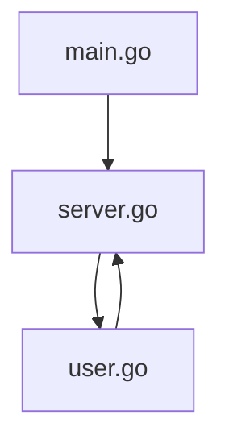
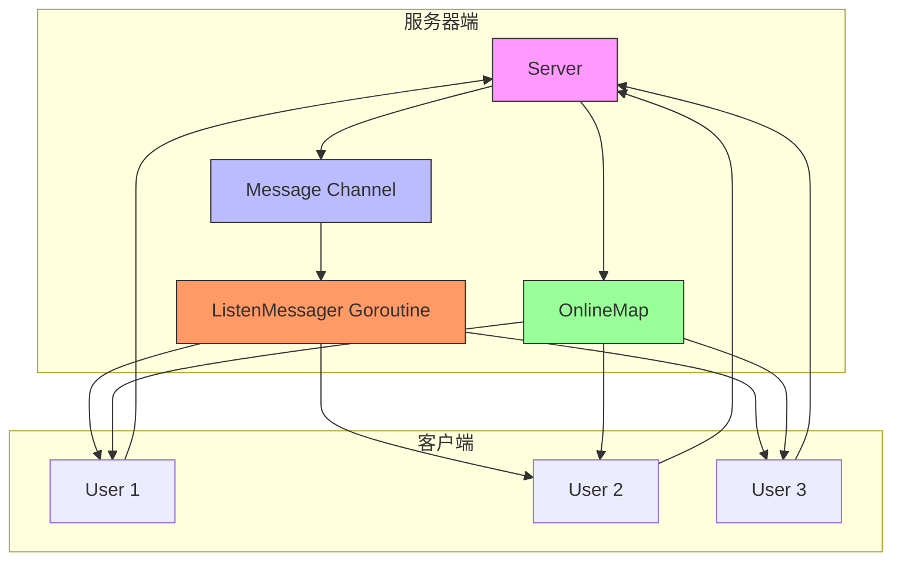
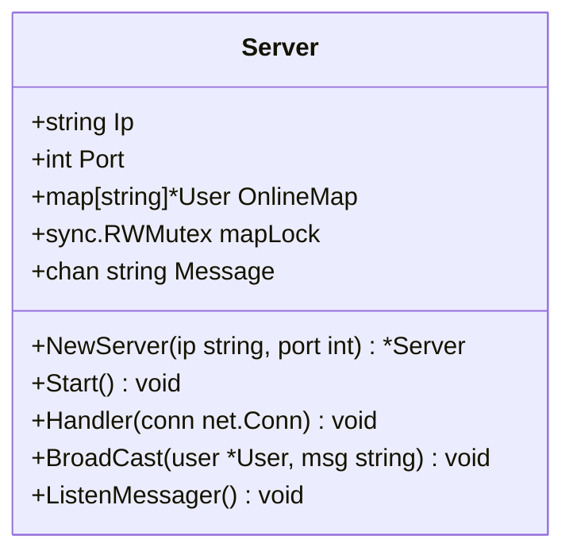
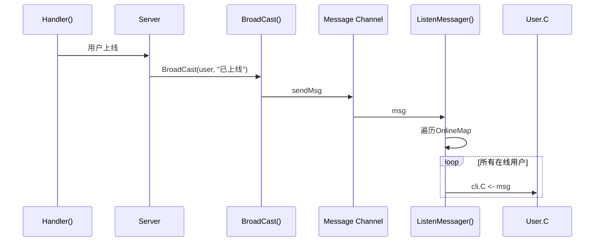
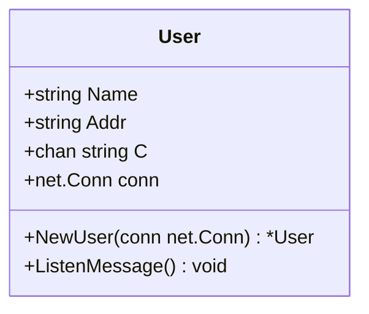
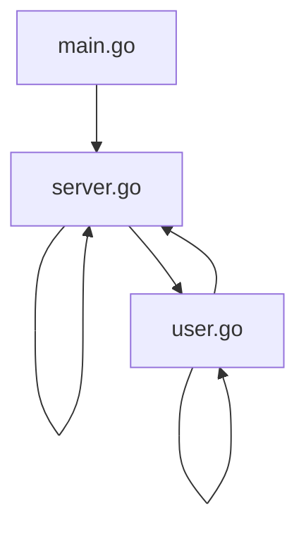

# V0.2 - 广播上线功能

<cite>
**Referenced Files in This Document**  
- [main.go](file://14-golang-IM-System/ServerV0.2-广播上线功能/main.go)
- [server.go](file://14-golang-IM-System/ServerV0.2-广播上线功能/server.go)
- [user.go](file://14-golang-IM-System/ServerV0.2-广播上线功能/user.go)
</cite>

## 目录
1. [简介](#简介)
2. [项目结构](#项目结构)
3. [核心组件](#核心组件)
4. [架构概述](#架构概述)
5. [详细组件分析](#详细组件分析)
6. [依赖分析](#依赖分析)
7. [性能考量](#性能考量)
8. [故障排除指南](#故障排除指南)
9. [结论](#结论)

## 简介

本文档深入解析IM系统V0.2版本中用户上线广播功能的实现机制。重点阐述`Server`结构体如何维护在线用户列表，当新用户连接时如何触发广播通知。分析`user.go`中用户对象的创建过程及消息发送逻辑，`server.go`中`BroadCast`方法如何遍历所有在线用户并发送上线消息。通过具体代码示例展示消息格式设计和channel的使用模式。提供时序图说明用户连接→广播触发→消息分发的完整流程，并指导学习者测试该功能，观察多客户端间的广播效果。同时讨论当前广播机制的性能瓶颈和改进方向。

## 项目结构

IM系统V0.2版本位于`14-golang-IM-System/ServerV0.2-广播上线功能`目录下，包含三个核心文件：`main.go`、`server.go`和`user.go`。该版本在基础服务构建（V0.1）之上，实现了用户上线广播的核心功能，为后续版本的消息广播、在线查询等功能奠定了基础。



**Diagram sources**
- [main.go](file://14-golang-IM-System/ServerV0.2-广播上线功能/main.go)
- [server.go](file://14-golang-IM-System/ServerV0.2-广播上线功能/server.go)
- [user.go](file://14-golang-IM-System/ServerV0.2-广播上线功能/user.go)

**Section sources**
- [main.go](file://14-golang-IM-System/ServerV0.2-广播上线功能/main.go)
- [server.go](file://14-golang-IM-System/ServerV0.2-广播上线功能/server.go)
- [user.go](file://14-golang-IM-System/ServerV0.2-广播上线功能/user.go)

## 核心组件

V0.2版本的核心组件包括`Server`结构体和`User`结构体。`Server`负责维护在线用户列表、处理新连接和广播消息；`User`代表一个客户端连接，封装了用户的基本信息和通信通道。`NewServer`函数用于创建服务器实例，`Start`方法启动服务器监听。`NewUser`函数创建用户实例并启动其消息监听协程。`BroadCast`方法实现消息广播逻辑，`Handler`方法处理新用户连接。

**Section sources**
- [server.go](file://14-golang-IM-System/ServerV0.2-广播上线功能/server.go#L1-L97)
- [user.go](file://14-golang-IM-System/ServerV0.2-广播上线功能/user.go#L1-L36)

## 架构概述

V0.2版本的架构采用经典的生产者-消费者模式。`Server`结构体中的`Message` channel作为消息队列，`BroadCast`方法是生产者，将格式化后的消息写入channel；`ListenMessager`协程是消费者，从channel读取消息并广播给所有在线用户。每个`User`对象拥有一个`C` channel，用于接收来自服务器的消息。当新用户连接时，`Handler`方法创建`User`实例，将其加入`OnlineMap`，并调用`BroadCast`发送上线通知。



**Diagram sources**
- [server.go](file://14-golang-IM-System/ServerV0.2-广播上线功能/server.go#L1-L97)
- [user.go](file://14-golang-IM-System/ServerV0.2-广播上线功能/user.go#L1-L36)

## 详细组件分析

### Server 结构体分析

`Server`结构体是整个IM系统的核心，负责管理所有客户端连接和消息广播。它包含IP和端口配置、在线用户列表`OnlineMap`、用于线程安全的`mapLock`读写锁，以及用于消息广播的`Message` channel。

#### Server 结构体定义


**Diagram sources**
- [server.go](file://14-golang-IM-System/ServerV0.2-广播上线功能/server.go#L7-L15)

#### 广播机制分析


**Diagram sources**
- [server.go](file://14-golang-IM-System/ServerV0.2-广播上线功能/server.go#L49-L53)
- [server.go](file://14-golang-IM-System/ServerV0.2-广播上线功能/server.go#L35-L46)

**Section sources**
- [server.go](file://14-golang-IM-System/ServerV0.2-广播上线功能/server.go#L49-L53)
- [server.go](file://14-golang-IM-System/ServerV0.2-广播上线功能/server.go#L35-L46)

### User 结构体分析

`User`结构体代表一个客户端连接，封装了用户的基本信息和通信通道。`Name`和`Addr`存储用户的名称和地址，`C`是接收服务器消息的channel，`conn`是底层的TCP连接。

#### User 结构体定义


**Diagram sources**
- [user.go](file://14-golang-IM-System/ServerV0.2-广播上线功能/user.go#L3-L9)

#### 消息监听机制
```mermaid
flowchart TD
Start([User.ListenMessage]) --> Receive["msg := <-this.C"]
Receive --> Write["conn.Write([]byte(msg + \"\\n\"))"]
Write --> Start
```

**Diagram sources**
- [user.go](file://14-golang-IM-System/ServerV0.2-广播上线功能/user.go#L28-L32)

**Section sources**
- [user.go](file://14-golang-IM-System/ServerV0.2-广播上线功能/user.go#L28-L32)

## 依赖分析

V0.2版本的组件间依赖关系清晰。`main.go`依赖`server.go`中的`NewServer`和`Start`函数。`server.go`依赖`user.go`中的`NewUser`函数和`User`结构体。`User`结构体的方法`ListenMessage`被`NewUser`函数调用以启动消息监听协程。`Server`的`Handler`方法调用`NewUser`创建用户实例，并调用`BroadCast`方法发送上线通知。



**Diagram sources**
- [main.go](file://14-golang-IM-System/ServerV0.2-广播上线功能/main.go)
- [server.go](file://14-golang-IM-System/ServerV0.2-广播上线功能/server.go)
- [user.go](file://14-golang-IM-System/ServerV0.2-广播上线功能/user.go)

**Section sources**
- [main.go](file://14-golang-IM-System/ServerV0.2-广播上线功能/main.go)
- [server.go](file://14-golang-IM-System/ServerV0.2-广播上线功能/server.go)
- [user.go](file://14-golang-IM-System/ServerV0.2-广播上线功能/user.go)

## 性能考量

当前广播机制存在潜在的性能瓶颈。`ListenMessager`协程在广播消息时对`OnlineMap`加写锁，导致在高并发场景下可能成为性能瓶颈。此外，消息广播是同步操作，如果某个客户端网络延迟较高，会阻塞整个广播过程。建议的改进方向包括：使用更细粒度的锁、实现异步非阻塞的消息发送、引入消息队列进行流量削峰、对在线用户列表进行分片处理等。

## 故障排除指南

测试该功能时，若无法观察到广播效果，请检查以下几点：确保服务器已成功启动并监听指定端口；确认客户端能够成功连接到服务器；检查`BroadCast`方法是否被正确调用；验证`Message` channel是否正常工作；确保`ListenMessager`协程已成功启动。可通过在关键位置添加日志输出来辅助调试。

**Section sources**
- [server.go](file://14-golang-IM-System/ServerV0.2-广播上线功能/server.go#L35-L46)
- [server.go](file://14-golang-IM-System/ServerV0.2-广播上线功能/server.go#L49-L53)

## 结论

V0.2版本成功实现了用户上线广播功能，为IM系统奠定了坚实的基础。通过`Server`和`User`两个核心结构体的协作，利用Go语言的channel和goroutine特性，实现了高效的消息广播机制。该设计体现了Go语言在并发编程方面的优势，代码简洁且易于理解。后续版本可在本版本的基础上，逐步增加更多功能，如用户消息广播、在线用户查询、私聊功能等，最终构建一个完整的即时通讯系统。