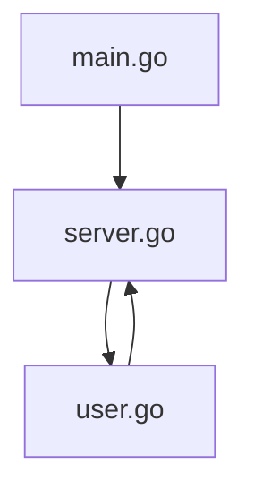
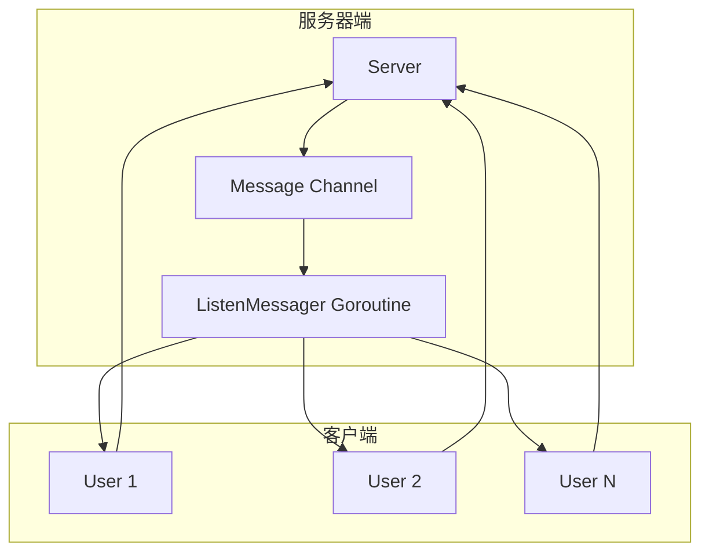
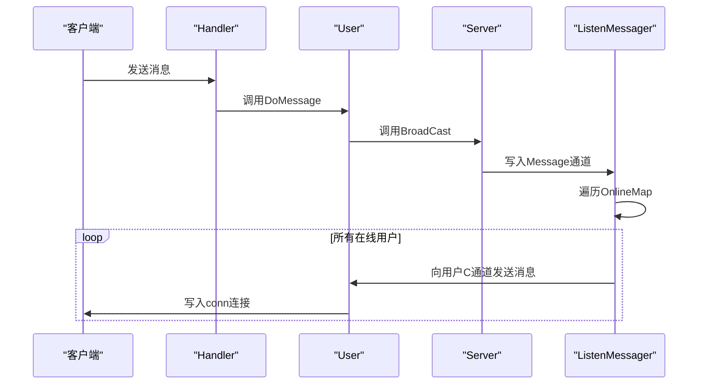
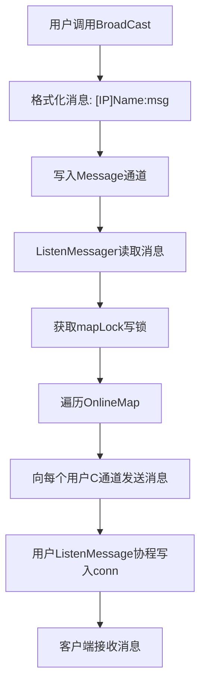

# V0.3 - 用户消息广播

<cite>
**本文档引用文件**  
- [user.go](file://14-golang-IM-System/ServerV0.3-用户消息广播/user.go)
- [server.go](file://14-golang-IM-System/ServerV0.3-用户消息广播/server.go)
- [main.go](file://14-golang-IM-System/ServerV0.3-用户消息广播/main.go)
</cite>

## 目录
1. [简介](#简介)
2. [项目结构](#项目结构)
3. [核心组件](#核心组件)
4. [架构概览](#架构概览)
5. [详细组件分析](#详细组件分析)
6. [依赖分析](#依赖分析)
7. [性能考虑](#性能考虑)
8. [故障排除指南](#故障排除指南)
9. [结论](#结论)

## 简介
本文档全面解析IM系统V0.3版本的群聊消息广播功能。重点分析用户输入消息后，从连接读取、消息解析到全局广播的完整处理链路。详细说明`user.go`中`DoMessage`方法如何将接收到的数据转发给服务器，`server.go`中如何通过消息通道实现异步广播。同时探讨消息顺序保证、并发安全等潜在问题及其解决方案。

## 项目结构
IM系统V0.3版本位于`ServerV0.3-用户消息广播`目录下，包含三个核心文件：`main.go`、`server.go`和`user.go`。该版本在V0.2基础上实现了用户消息的群发广播功能，支持多客户端实时通信。

**图示来源**  
- [main.go](file://14-golang-IM-System/ServerV0.3-用户消息广播/main.go#L1-L7)
- [server.go](file://14-golang-IM-System/ServerV0.3-用户消息广播/server.go#L1-L116)
- [user.go](file://14-golang-IM-System/ServerV0.3-用户消息广播/user.go#L1-L71)

**本节来源**  
- [main.go](file://14-golang-IM-System/ServerV0.3-用户消息广播/main.go#L1-L7)
- [server.go](file://14-golang-IM-System/ServerV0.3-用户消息广播/server.go#L1-L116)
- [user.go](file://14-golang-IM-System/ServerV0.3-用户消息广播/user.go#L1-L71)

## 核心组件
系统核心由`Server`和`User`两个结构体构成。`Server`负责管理所有在线用户并实现消息广播，`User`代表每个客户端连接，封装了用户状态和通信逻辑。`DoMessage`方法处理用户输入，`BroadCast`方法实现消息分发，`ListenMessager`协程监听全局消息通道并推送至各客户端。

**本节来源**  
- [server.go](file://14-golang-IM-System/ServerV0.3-用户消息广播/server.go#L8-L116)
- [user.go](file://14-golang-IM-System/ServerV0.3-用户消息广播/user.go#L4-L71)

## 架构概览
系统采用主从式架构，服务器监听TCP端口，为每个新连接创建`User`实例。所有用户通过独立的`chan string`接收消息，服务器通过统一的`Message`通道进行异步广播。读写分离设计确保高并发下的线程安全。

**图示来源**  
- [server.go](file://14-golang-IM-System/ServerV0.3-用户消息广播/server.go#L8-L53)
- [user.go](file://14-golang-IM-System/ServerV0.3-用户消息广播/user.go#L4-L24)

## 详细组件分析

### 用户消息处理分析
`User`结构体的`DoMessage`方法接收客户端消息并调用`server.BroadCast`进行广播。服务器将消息格式化后发送至`Message`通道，由`ListenMessager`协程统一处理，遍历所有在线用户并推送消息。

#### 消息处理流程

**图示来源**  
- [user.go](file://14-golang-IM-System/ServerV0.3-用户消息广播/user.go#L58-L64)
- [server.go](file://14-golang-IM-System/ServerV0.3-用户消息广播/server.go#L49-L53)
- [server.go](file://14-golang-IM-System/ServerV0.3-用户消息广播/server.go#L35-L46)

### 消息广播机制分析
服务器通过`Message`通道实现解耦式广播。`BroadCast`方法将消息写入通道，`ListenMessager`协程监听该通道并负责实际分发。使用`sync.RWMutex`保护`OnlineMap`，确保并发读写安全。

#### 广播流程图

**图示来源**  
- [server.go](file://14-golang-IM-System/ServerV0.3-用户消息广播/server.go#L49-L53)
- [server.go](file://14-golang-IM-System/ServerV0.3-用户消息广播/server.go#L35-L46)
- [user.go](file://14-golang-IM-System/ServerV0.3-用户消息广播/user.go#L60-L70)

**本节来源**  
- [server.go](file://14-golang-IM-System/ServerV0.3-用户消息广播/server.go#L35-L53)
- [user.go](file://14-golang-IM-System/ServerV0.3-用户消息广播/user.go#L58-L70)

## 依赖分析
系统内部组件高度内聚，`user.go`依赖`server.go`中的`Server`类型，`main.go`启动`Server`实例。无外部依赖，完全基于Go标准库`net`和`sync`实现。

**图示来源**  
- [main.go](file://14-golang-IM-System/ServerV0.3-用户消息广播/main.go#L1-L7)
- [server.go](file://14-golang-IM-System/ServerV0.3-用户消息广播/server.go#L1-L116)
- [user.go](file://14-golang-IM-System/ServerV0.3-用户消息广播/user.go#L1-L71)

**本节来源**  
- [main.go](file://14-golang-IM-System/ServerV0.3-用户消息广播/main.go#L1-L7)
- [server.go](file://14-golang-IM-System/ServerV0.3-用户消息广播/server.go#L1-L116)

## 性能考虑
系统采用Goroutine和Channel实现高并发，每个用户连接独立协程处理读写。广播操作在单个`ListenMessager`协程中串行执行，通过`RWMutex`保护共享状态，避免竞态条件。消息编码简单高效，仅进行字符串拼接和字节转换。

## 故障排除指南
常见问题包括连接中断、消息丢失和广播回环。确保客户端正确处理换行符，服务器日志可帮助诊断`conn.Read`错误。测试时使用多个客户端验证广播功能，检查用户名是否正确显示。

**本节来源**  
- [server.go](file://14-golang-IM-System/ServerV0.3-用户消息广播/server.go#L80-L85)
- [user.go](file://14-golang-IM-System/ServerV0.3-用户消息广播/user.go#L60-L70)

## 结论
V0.3版本成功实现了用户消息广播功能，采用Go的并发原语构建了高效、安全的IM系统核心。通过通道和协程解耦消息生产与消费，利用读写锁保障并发安全。该设计为后续功能扩展（如私聊、用户名修改）奠定了坚实基础。