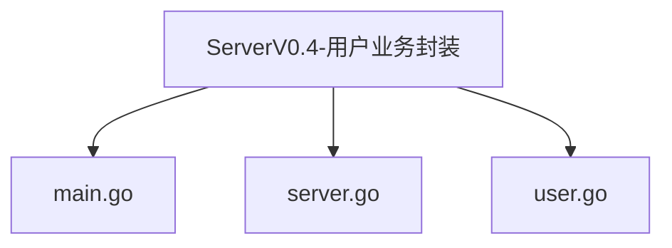
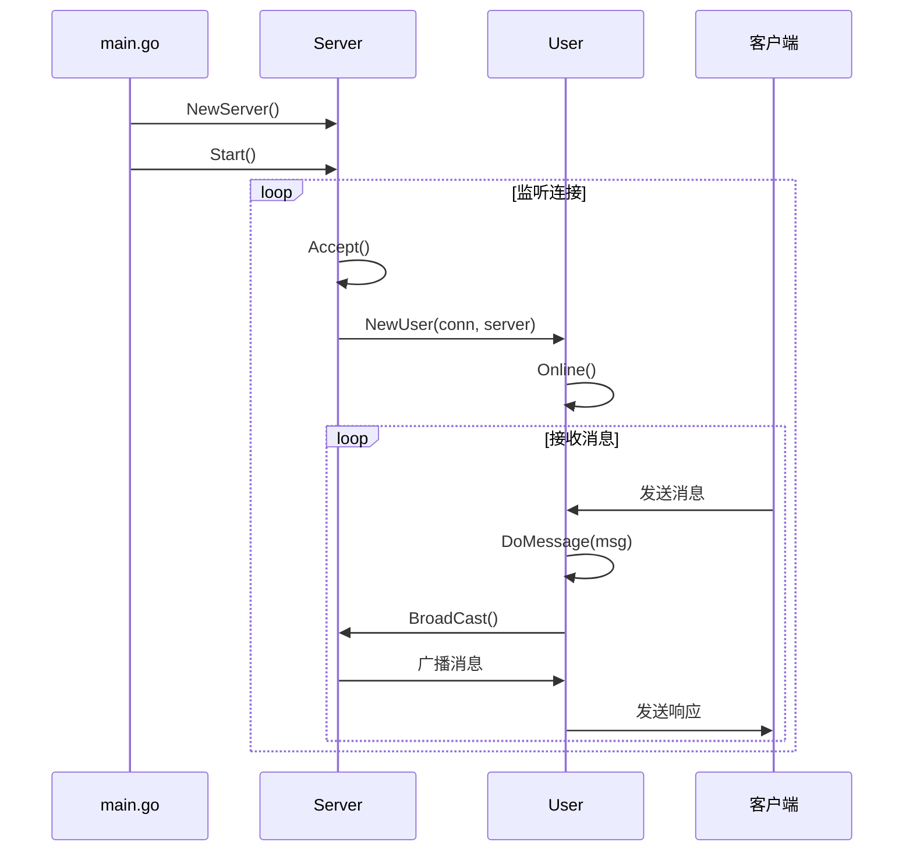
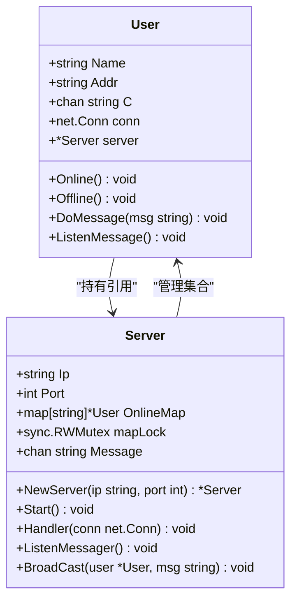
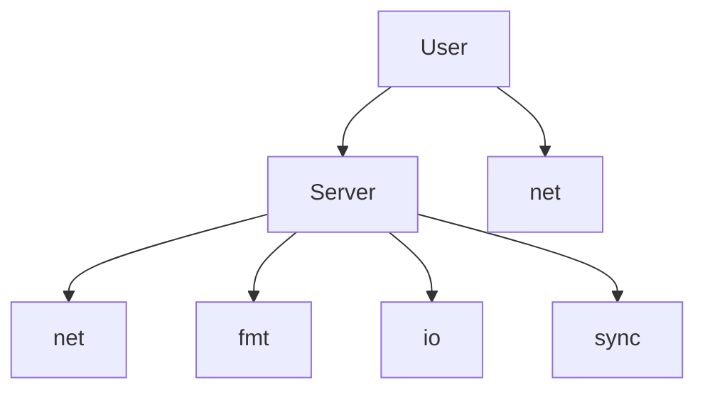

# V0.4 - 用户业务封装

<cite>
**Referenced Files in This Document**   
- [main.go](file://14-golang-IM-System/ServerV0.4-用户业务封装/main.go)
- [server.go](file://14-golang-IM-System/ServerV0.4-用户业务封装/server.go)
- [user.go](file://14-golang-IM-System/ServerV0.4-用户业务封装/user.go)
- [main.go](file://14-golang-IM-System/ServerV0.3-用户消息广播/main.go)
- [server.go](file://14-golang-IM-System/ServerV0.3-用户消息广播/server.go)
- [user.go](file://14-golang-IM-System/ServerV0.3-用户消息广播/user.go)
</cite>

## 目录
1. [引言](#引言)
2. [项目结构](#项目结构)
3. [核心组件](#核心组件)
4. [架构概览](#架构概览)
5. [详细组件分析](#详细组件分析)
6. [依赖分析](#依赖分析)
7. [性能考量](#性能考量)
8. [故障排除指南](#故障排除指南)
9. [结论](#结论)

## 引言

本文档深入剖析IM系统V0.4版本的代码重构与业务封装过程。重点讲解如何将分散在`main.go`和`server.go`中的用户处理逻辑迁移至`user.go`，实现关注点分离。通过对比V0.3与V0.4的代码差异，展示面向对象设计原则在Go语言中的应用，并说明封装后代码的可维护性提升，以及如何为后续功能扩展提供清晰的接口。

## 项目结构

IM系统V0.4版本的项目结构遵循了清晰的版本迭代路径，每个版本都位于独立的目录中，便于追踪功能演进。V0.4版本的核心文件包括`main.go`、`server.go`和`user.go`，分别负责程序入口、服务器核心逻辑和用户业务逻辑的封装。



**Diagram sources**
- [main.go](file://14-golang-IM-System/ServerV0.4-用户业务封装/main.go)
- [server.go](file://14-golang-IM-System/ServerV0.4-用户业务封装/server.go)
- [user.go](file://14-golang-IM-System/ServerV0.4-用户业务封装/user.go)

**Section sources**
- [main.go](file://14-golang-IM-System/ServerV0.4-用户业务封装/main.go)
- [server.go](file://14-golang-IM-System/ServerV0.4-用户业务封装/server.go)
- [user.go](file://14-golang-IM-System/ServerV0.4-用户业务封装/user.go)

## 核心组件

V0.4版本的核心组件围绕`User`结构体和`Server`结构体展开。`User`结构体封装了用户的所有业务逻辑，包括上线、下线、消息处理等。`Server`结构体则负责管理用户连接、消息广播和服务器生命周期。

**Section sources**
- [server.go](file://14-golang-IM-System/ServerV0.4-用户业务封装/server.go#L10-L20)
- [user.go](file://14-golang-IM-System/ServerV0.4-用户业务封装/user.go#L7-L14)

## 架构概览

V0.4版本的架构设计体现了清晰的分层思想。`main.go`作为程序入口，创建并启动`Server`实例。`Server`实例负责监听客户端连接，并为每个连接创建`User`实例。`User`实例则负责处理用户的具体业务逻辑，如消息接收、处理和发送。



**Diagram sources**
- [main.go](file://14-golang-IM-System/ServerV0.4-用户业务封装/main.go#L1-L7)
- [server.go](file://14-golang-IM-System/ServerV0.4-用户业务封装/server.go#L23-L32)
- [user.go](file://14-golang-IM-System/ServerV0.4-用户业务封装/user.go#L17-L33)

## 详细组件分析

### User结构体分析

V0.4版本中，`User`结构体被赋予了完整的业务职责，实现了从数据容器到业务实体的转变。通过将用户相关的所有操作封装为方法，极大地提升了代码的可维护性和可读性。

#### 类图展示



**Diagram sources**
- [user.go](file://14-golang-IM-System/ServerV0.4-用户业务封装/user.go#L7-L14)
- [server.go](file://14-golang-IM-System/ServerV0.4-用户业务封装/server.go#L10-L20)

#### 方法职责划分

`User`结构体的方法集清晰地划分了各项职责：
- `NewUser`：工厂函数，负责创建并初始化`User`实例。
- `Online`：处理用户上线逻辑，包括将用户加入在线列表和广播上线消息。
- `Offline`：处理用户下线逻辑，包括从在线列表中移除用户和广播下线消息。
- `DoMessage`：核心业务方法，处理用户发送的各类消息。
- `ListenMessage`：监听用户消息通道，将消息发送给客户端。

**Section sources**
- [user.go](file://14-golang-IM-System/ServerV0.4-用户业务封装/user.go#L17-L33)
- [user.go](file://14-golang-IM-System/ServerV0.4-用户业务封装/user.go#L36-L45)
- [user.go](file://14-golang-IM-System/ServerV0.4-用户业务封装/user.go#L48-L58)
- [user.go](file://14-golang-IM-System/ServerV0.4-用户业务封装/user.go#L66-L123)
- [user.go](file://14-golang-IM-System/ServerV0.4-用户业务封装/user.go#L126-L132)

### 与V0.3版本对比

V0.3版本中，用户处理逻辑分散在`server.go`的`Handler`方法中，导致代码耦合度高，难以维护。V0.4版本通过将这些逻辑迁移至`user.go`，实现了关注点分离。

在V0.3的`server.go`中，`Handler`方法直接处理用户消息：
```go
// V0.3 server.go
func (this *Server) Handler(conn net.Conn) {
    // ...
    go func() {
        buf := make([]byte, 4096)
        for {
            n, err := conn.Read(buf)
            if n == 0 {
                user.Offline()
                return
            }
            // ...
            msg := string(buf[:n-1])
            this.BroadCast(user, msg) // 直接调用BroadCast
        }
    }()
    // ...
}
```

而在V0.4版本中，`Handler`方法将消息处理委托给`User`实例：
```go
// V0.4 server.go
func (this *Server) Handler(conn net.Conn) {
    // ...
    go func() {
        buf := make([]byte, 4096)
        for {
            n, err := conn.Read(buf)
            if n == 0 {
                user.Offline()
                return
            }
            // ...
            msg := string(buf[:n-1])
            user.DoMessage(msg) // 委托给User处理
        }
    }()
    // ...
}
```

这种重构使得`Server`结构体更加专注于连接管理和消息广播，而`User`结构体则专注于用户行为的处理，符合单一职责原则。

**Section sources**
- [server.go](file://14-golang-IM-System/ServerV0.3-用户消息广播/server.go#L55-L115)
- [server.go](file://14-golang-IM-System/ServerV0.4-用户业务封装/server.go#L55-L115)
- [user.go](file://14-golang-IM-System/ServerV0.4-用户业务封装/user.go#L66-L123)

## 依赖分析

V0.4版本的依赖关系清晰明了。`User`结构体依赖于`Server`结构体，以便访问服务器的在线用户列表和广播功能。`Server`结构体则不直接依赖`User`的业务逻辑，仅通过接口进行通信。



**Diagram sources**
- [user.go](file://14-golang-IM-System/ServerV0.4-用户业务封装/user.go)
- [server.go](file://14-golang-IM-System/ServerV0.4-用户业务封装/server.go)

**Section sources**
- [user.go](file://14-golang-IM-System/ServerV0.4-用户业务封装/user.go)
- [server.go](file://14-golang-IM-System/ServerV0.4-用户业务封装/server.go)

## 性能考量

V0.4版本的封装对性能影响极小。由于只是将逻辑从`server.go`移动到`user.go`，核心的数据结构和算法没有改变。消息广播仍然通过`Server`的`Message`通道进行，保证了高效的并发处理能力。`User`结构体的方法调用开销可以忽略不计。

## 故障排除指南

当遇到用户无法上线或消息无法广播的问题时，应首先检查`User`的`Online`和`DoMessage`方法。确保`server`字段正确初始化，并且`OnlineMap`的读写锁使用正确。同时，检查`ListenMessage`协程是否正常运行，以确保消息能够及时发送给客户端。

**Section sources**
- [user.go](file://14-golang-IM-System/ServerV0.4-用户业务封装/user.go#L36-L45)
- [user.go](file://14-golang-IM-System/ServerV0.4-用户业务封装/user.go#L66-L123)
- [user.go](file://14-golang-IM-System/ServerV0.4-用户业务封装/user.go#L126-L132)

## 结论

V0.4版本通过将用户业务逻辑封装到`user.go`文件中，实现了代码的模块化和关注点分离。这种重构不仅提升了代码的可维护性和可读性，还为后续功能扩展（如私聊、用户名修改等）提供了清晰的接口。`User`结构体的方法集设计体现了Go语言中方法接收者的设计哲学，即通过指针接收者修改结构体状态，通过值接收者访问结构体数据。这一版本的成功重构为IM系统的持续演进奠定了坚实的基础。