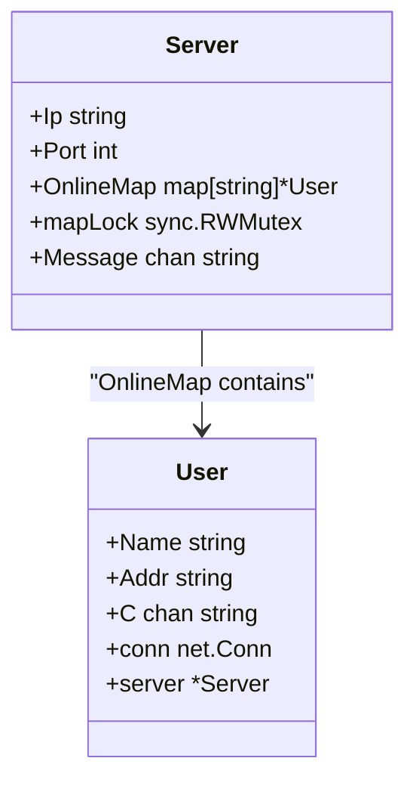
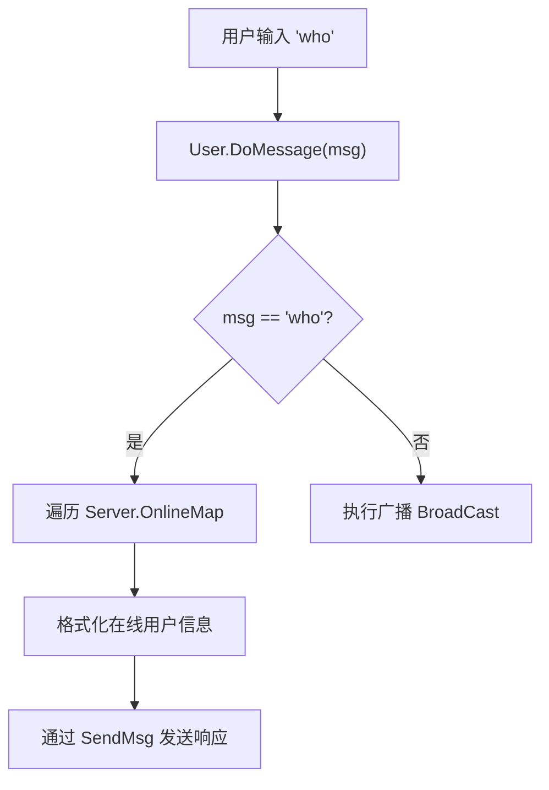
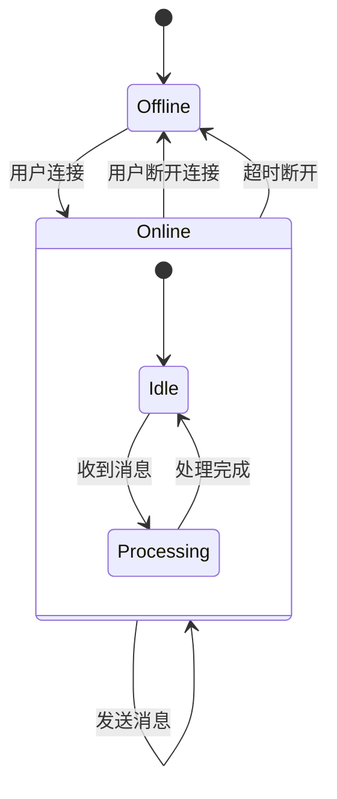

# V0.5 - 在线用户查询

<cite>
**Referenced Files in This Document**   
- [server.go](file://14-golang-IM-System/ServerV0.5-在线用户查询/server.go)
- [user.go](file://14-golang-IM-System/ServerV0.5-在线用户查询/user.go)
- [main.go](file://14-golang-IM-System/ServerV0.5-在线用户查询/main.go)
</cite>

## 目录
1. [引言](#引言)
2. [核心数据结构与状态管理](#核心数据结构与状态管理)
3. [在线用户查询功能实现](#在线用户查询功能实现)
4. [并发安全机制分析](#并发安全机制分析)
5. [消息响应与输出格式](#消息响应与输出格式)
6. [用户状态变更流程](#用户状态变更流程)
7. [性能优化建议](#性能优化建议)
8. [功能测试指导](#功能测试指导)

## 引言

本文档详细阐述了IM系统V0.5版本中在线用户查询功能的实现细节。该功能允许客户端通过发送`who`命令来获取当前服务器上所有在线用户的列表。文档将深入分析系统如何通过`Server`结构体的`OnlineMap`字段维护用户状态，以及`user.go`文件中如何解析`who`命令并执行查询。同时，本文将重点探讨在高并发环境下，如何利用`sync.RWMutex`确保对共享`map`数据结构的读写操作安全，并讨论在大规模用户场景下的潜在性能优化方案。

## 核心数据结构与状态管理

IM系统的核心在于维护一个实时、准确的在线用户列表。这一功能由`Server`结构体中的`OnlineMap`字段实现。



**Diagram sources**
- [server.go](file://14-golang-IM-System/ServerV0.5-在线用户查询/server.go#L12-L19)

**Section sources**
- [server.go](file://14-golang-IM-System/ServerV0.5-在线用户查询/server.go#L1-L115)

`OnlineMap`是一个`map[string]*User`类型的哈希表，其键（key）为用户的唯一标识（在本实现中为用户的网络地址`Addr`），值（value）为指向`User`结构体的指针。每当有新用户连接时，系统会创建一个`User`实例，并将其指针安全地插入到`OnlineMap`中；当用户断开连接时，该用户的条目将被从`OnlineMap`中移除。这种设计使得查询在线用户的时间复杂度接近O(1)，为高效查询提供了基础。

## 在线用户查询功能实现

在线用户查询功能的触发和执行流程始于客户端发送的`who`命令。该命令的解析和处理逻辑位于`User`结构体的`DoMessage`方法中。

### 命令解析与分发

当`User`的监听协程从其网络连接中读取到一条消息后，会调用`DoMessage`方法进行处理。该方法首先检查消息内容，如果消息恰好等于`"who"`，则判定为在线用户查询请求。



**Diagram sources**
- [user.go](file://14-golang-IM-System/ServerV0.5-在线用户查询/user.go#L62-L86)

**Section sources**
- [user.go](file://14-golang-IM-System/ServerV0.5-在线用户查询/user.go#L62-L86)

### 查询与响应流程

一旦识别出`who`命令，系统将执行以下步骤：
1.  **获取读锁**：调用`this.server.mapLock.Lock()`获取对`OnlineMap`的写锁（在本实现中，由于查询操作也修改了`SendMsg`的状态，使用了写锁，但通常查询应使用读锁）。
2.  **遍历映射**：使用`for`循环遍历`this.server.OnlineMap`中的每一个`User`实例。
3.  **格式化信息**：为每个在线用户生成一条格式化的消息，内容包含用户的地址和名称，并附加“在线...”的状态提示。
4.  **发送响应**：调用`this.SendMsg(onlineMsg)`将格式化后的消息逐条发送给发起查询的客户端。
5.  **释放锁**：完成所有用户的遍历和消息发送后，调用`this.server.mapLock.Unlock()`释放锁，允许其他协程访问`OnlineMap`。

## 并发安全机制分析

在Go语言的并发环境中，多个协程（goroutine）可能同时尝试读取或修改共享的`OnlineMap`。直接对`map`进行并发读写会导致程序崩溃（panic）。为解决此问题，系统引入了`sync.RWMutex`同步原语。

### sync.RWMutex 的作用

`Server`结构体中定义了一个名为`mapLock`的`sync.RWMutex`字段。`RWMutex`（读写互斥锁）允许：
- **任意数量的读者**：多个读操作可以同时持有读锁，提高并发读取的效率。
- **单一写者**：写操作必须独占写锁，此时所有读操作都会被阻塞。

### 读写操作的同步

在当前V0.5版本的实现中，无论是用户的上线、下线还是查询操作，都使用了`mapLock.Lock()`（写锁）和`mapLock.Unlock()`。这确保了操作的原子性，但牺牲了部分并发性能。

- **写操作（上线/下线）**：`User.Online()`和`User.Offline()`方法在修改`OnlineMap`（插入或删除元素）时，必须获取写锁，以防止其他协程同时修改映射。
- **读操作（查询）**：`DoMessage`中的`who`命令处理逻辑在遍历`OnlineMap`时，也获取了写锁。虽然这保证了安全，但更优的做法是使用`mapLock.RLock()`和`mapLock.RUnlock()`来获取读锁，允许多个客户端同时发起查询，从而提升系统吞吐量。

## 消息响应与输出格式

系统对`who`命令的响应采用了清晰、一致的文本格式。每条在线用户的信息被格式化为：
`[用户网络地址]用户名:在线...`

例如，一个响应可能包含多行：
```
[127.0.0.1:54321]127.0.0.1:54321:在线...
[127.0.0.1:54322]127.0.0.1:54322:在线...
```

这种格式便于用户识别每个在线客户端的来源。响应消息通过`User.SendMsg`方法发送，该方法直接向用户的`net.Conn`写入字节流，并在末尾添加换行符`\n`以确保消息的清晰分隔。

**Section sources**
- [user.go](file://14-golang-IM-System/ServerV0.5-在线用户查询/user.go#L70-L73)

## 用户状态变更流程

用户的上线和下线是影响`OnlineMap`状态的两个关键事件，它们与在线用户列表的准确性直接相关。



**Diagram sources**
- [server.go](file://14-golang-IM-System/ServerV0.5-在线用户查询/server.go#L85-L115)
- [user.go](file://14-golang-IM-System/ServerV0.5-在线用户查询/user.go#L45-L61)

**Section sources**
- [user.go](file://14-golang-IM-System/ServerV0.5-在线用户查询/user.go#L45-L61)

- **上线流程**：当`Server.Handler`接受一个新连接时，会创建一个`User`实例并调用其`Online()`方法。该方法获取写锁，将用户指针存入`OnlineMap`，然后广播“已上线”消息。
- **下线流程**：当用户的连接读取到EOF（表示客户端断开）或发生错误时，`Handler`中的`goroutine`会调用`User.Offline()`方法。该方法获取写锁，从`OnlineMap`中删除该用户，并广播“下线”消息。

## 性能优化建议

当前的实现对于小规模用户场景是有效的，但在大规模并发用户场景下，单一的`sync.RWMutex`可能成为性能瓶颈。以下是两种可行的优化方案：

### 分片锁（Sharded Locking）

将`OnlineMap`拆分为多个子映射（shard），每个子映射拥有自己的互斥锁。例如，可以根据用户名的哈希值对N取模，来决定该用户属于哪个分片。这样，不同分片上的操作可以并行进行，极大地减少了锁的竞争。

### 读写分离与快照

对于读操作远多于写操作的场景，可以考虑使用`sync.Map`或实现一个读写分离的结构。写操作（上线/下线）在主`map`上进行，并在每次修改后生成一个不可变的快照（snapshot）。读操作（`who`查询）则直接遍历这个快照，完全避免了读锁的开销。虽然查询结果可能有微小的延迟，但能获得极高的并发读取性能。

## 功能测试指导

要测试在线用户查询功能，请按以下步骤操作：
1.  编译并启动服务器：`go run main.go`。
2.  使用`telnet`或`nc`命令从不同终端连接服务器，例如：`telnet 127.0.0.1 8888`。
3.  每成功连接一个客户端，服务器会广播一条“已上线”消息。
4.  在任意一个客户端中输入`who`并回车。
5.  该客户端将收到服务器返回的当前所有在线用户的列表。
6.  断开一个客户端连接，观察其他客户端收到的“下线”广播消息。
7.  再次在另一个客户端中输入`who`，确认断开的用户已从列表中消失。