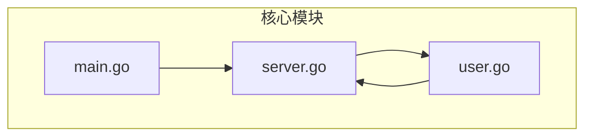
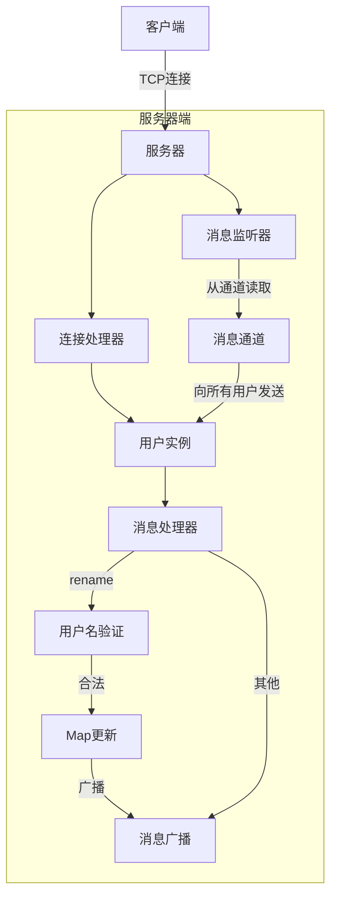
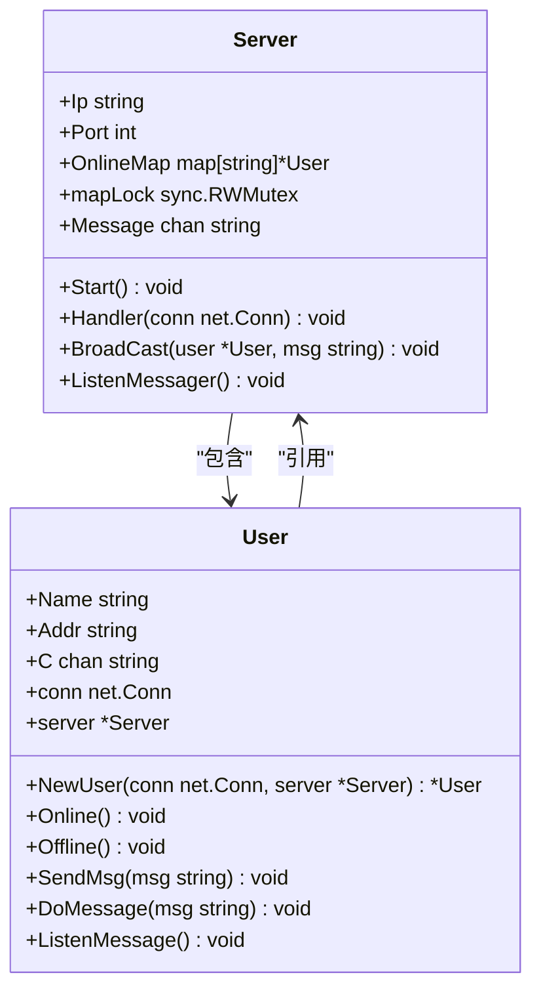
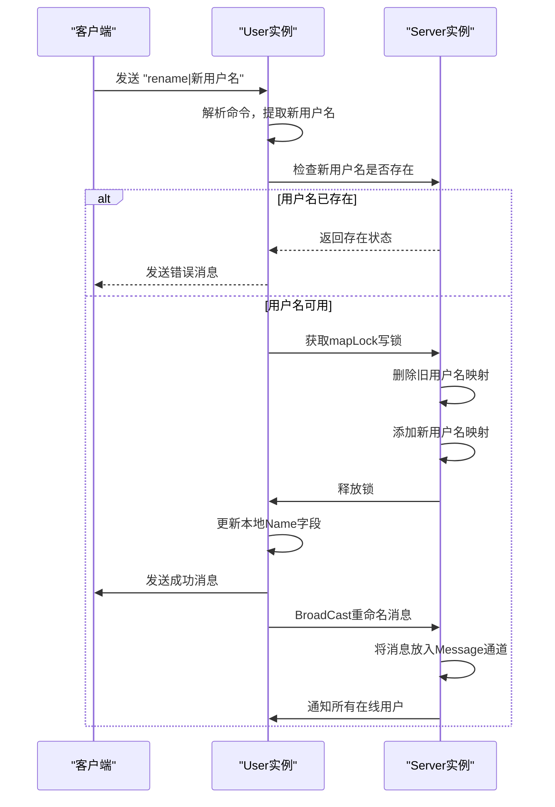
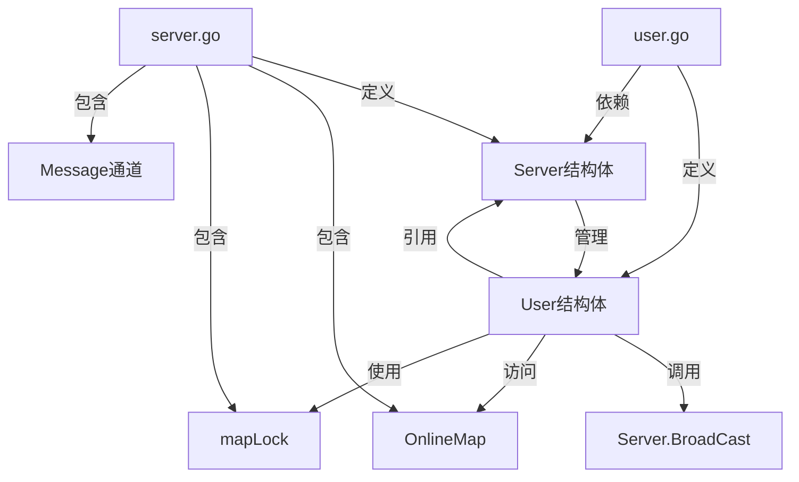

# V0.6 - 修改用户名

<cite>
**Referenced Files in This Document**   
- [main.go](file://14-golang-IM-System/ServerV0.6-修改用户名/main.go)
- [server.go](file://14-golang-IM-System/ServerV0.6-修改用户名/server.go)
- [user.go](file://14-golang-IM-System/ServerV0.6-修改用户名/user.go)
</cite>

## 目录
1. [简介](#简介)
2. [项目结构](#项目结构)
3. [核心组件](#核心组件)
4. [架构概述](#架构概述)
5. [详细组件分析](#详细组件分析)
6. [依赖分析](#依赖分析)
7. [性能考虑](#性能考虑)
8. [故障排除指南](#故障排除指南)
9. [结论](#结论)

## 简介
本文档系统讲解IM系统V0.6版本中用户名修改功能的实现机制。重点分析如何解析`rename|新用户名`格式的命令，验证用户名合法性，并在用户重命名过程中完成原子性更新。说明更新过程中如何通知所有在线用户，保持状态一致性。通过代码实例展示字符串处理、map键值更新和并发控制的综合应用。提供状态转换图说明用户重命名前后的系统行为变化，并指导学习者测试该功能。同时讨论唯一性校验、命名冲突等边界情况的处理策略。

## 项目结构
IM系统V0.6版本的项目结构基于前几个版本逐步演进而来，核心功能模块集中在`ServerV0.6-修改用户名`目录下。该版本在V0.5的基础上增加了用户名修改功能，主要涉及三个核心文件：`main.go`、`server.go`和`user.go`。系统采用Go语言的并发模型，通过goroutine和channel实现消息广播和用户连接处理。



**Diagram sources**
- [main.go](file://14-golang-IM-System/ServerV0.6-修改用户名/main.go#L1-L7)
- [server.go](file://14-golang-IM-System/ServerV0.6-修改用户名/server.go#L1-L116)

**Section sources**
- [main.go](file://14-golang-IM-System/ServerV0.6-修改用户名/main.go#L1-L7)
- [server.go](file://14-golang-IM-System/ServerV0.6-修改用户名/server.go#L1-L116)
- [user.go](file://14-golang-IM-System/ServerV0.6-修改用户名/user.go#L1-L109)

## 核心组件
V0.6版本的核心组件包括服务器主控模块、用户管理模块和消息广播模块。服务器主控模块负责监听端口和建立连接；用户管理模块负责用户的上线、下线和消息处理；消息广播模块负责将消息发送给所有在线用户。用户名修改功能作为用户管理模块的重要扩展，实现了用户身份的动态变更。

**Section sources**
- [server.go](file://14-golang-IM-System/ServerV0.6-修改用户名/server.go#L8-L20)
- [user.go](file://14-golang-IM-System/ServerV0.6-修改用户名/user.go#L6-L15)

## 架构概述
IM系统的整体架构采用经典的C/S模式，服务器端通过TCP协议监听客户端连接。系统核心是一个`Server`结构体，包含在线用户列表`OnlineMap`、读写锁`mapLock`和消息广播通道`Message`。每个连接的客户端对应一个`User`实例，通过`DoMessage`方法处理各种用户指令。



**Diagram sources**
- [server.go](file://14-golang-IM-System/ServerV0.6-修改用户名/server.go#L8-L20)
- [user.go](file://14-golang-IM-System/ServerV0.6-修改用户名/user.go#L66-L109)

## 详细组件分析

### 用户名修改功能分析
用户名修改功能是V0.6版本的核心新增功能，通过解析特定格式的命令来实现。当用户发送`rename|新用户名`格式的消息时，系统会触发重命名流程。

#### 命令解析与字符串处理
系统通过字符串前缀匹配来识别重命名命令。`DoMessage`方法首先检查消息长度是否大于7，并验证前7个字符是否为`"rename|"`。这种设计避免了正则表达式的开销，提高了性能。

```mermaid
flowchart TD
Start([接收到消息]) --> LengthCheck["检查消息长度 > 7?"]
LengthCheck --> |否| IsWho["是who命令?"]
LengthCheck --> |是| PrefixCheck["前7字符 == rename|?"]
PrefixCheck --> |否| IsWho
PrefixCheck --> |是| ExtractName["提取新用户名"]
ExtractName --> Split["strings.Split(msg, \"|\")[1]"]
Split --> ExistCheck["新用户名已存在?"]
ExistCheck --> |是| SendError["发送错误消息"]
ExistCheck --> |否| LockMap["获取mapLock写锁"]
LockMap --> UpdateMap["更新OnlineMap"]
UpdateMap --> UpdateName["更新User.Name"]
UpdateName --> SendSuccess["发送成功消息"]
SendSuccess --> End([处理完成])
IsWho --> |是| HandleWho["处理who命令"]
IsWho --> |否| Broadcast["广播消息"]
```

**Diagram sources**
- [user.go](file://14-golang-IM-System/ServerV0.6-修改用户名/user.go#L77-L95)

**Section sources**
- [user.go](file://14-golang-IM-System/ServerV0.6-修改用户名/user.go#L77-L95)

#### 并发控制与原子性更新
用户名修改过程中的并发控制是关键。系统使用`sync.RWMutex`读写锁来保护`OnlineMap`，确保在更新用户映射时的原子性。写锁的使用保证了在删除旧键和添加新键的过程中，不会有其他goroutine读取到不一致的状态。



**Diagram sources**
- [server.go](file://14-golang-IM-System/ServerV0.6-修改用户名/server.go#L8-L20)
- [user.go](file://14-golang-IM-System/ServerV0.6-修改用户名/user.go#L6-L15)

#### 状态一致性维护
在完成用户名更新后，系统会通过`BroadCast`方法向所有在线用户广播这一变更。这种设计确保了所有客户端都能及时获知用户状态的变化，保持了系统的状态一致性。



**Diagram sources**
- [user.go](file://14-golang-IM-System/ServerV0.6-修改用户名/user.go#L77-L95)
- [server.go](file://14-golang-IM-System/ServerV0.6-修改用户名/server.go#L49-L53)

## 依赖分析
系统各组件之间存在明确的依赖关系。`User`结构体依赖`Server`结构体以访问在线用户列表和广播功能，而`Server`结构体通过`Handler`方法创建和管理`User`实例。这种双向依赖关系通过在`User`结构体中保存`Server`指针来实现。



**Diagram sources**
- [server.go](file://14-golang-IM-System/ServerV0.6-修改用户名/server.go#L8-L20)
- [user.go](file://14-golang-IM-System/ServerV0.6-修改用户名/user.go#L6-L15)

**Section sources**
- [server.go](file://14-golang-IM-System/ServerV0.6-修改用户名/server.go#L8-L20)
- [user.go](file://14-golang-IM-System/ServerV0.6-修改用户名/user.go#L6-L15)

## 性能考虑
用户名修改功能的性能主要受字符串处理、map操作和并发控制的影响。系统通过简单的字符串前缀匹配而非正则表达式来提高命令识别效率。map的删除和插入操作平均时间复杂度为O(1)，配合读写锁的使用，确保了在高并发场景下的性能表现。

## 故障排除指南
在测试用户名修改功能时，可能会遇到以下常见问题：

1. **命令格式错误**：确保发送的命令格式为`rename|新用户名`，中间使用竖线分隔。
2. **用户名冲突**：如果新用户名已被其他在线用户使用，系统会返回"当前用户名被使用"的提示。
3. **连接中断**：在重命名过程中，如果网络中断，用户将自动下线。

**Section sources**
- [user.go](file://14-golang-IM-System/ServerV0.6-修改用户名/user.go#L85-L93)

## 结论
V0.6版本的用户名修改功能成功实现了用户身份的动态变更，通过字符串处理、map键值更新和并发控制的综合应用，确保了功能的正确性和系统的稳定性。该功能的实现展示了Go语言在并发编程和网络服务开发中的优势，为后续功能扩展奠定了基础。建议在实际测试中验证各种边界情况，如超长用户名、特殊字符用户名等，以确保系统的健壮性。