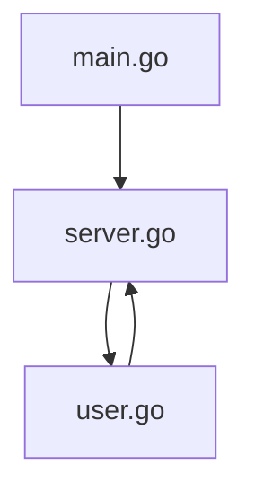
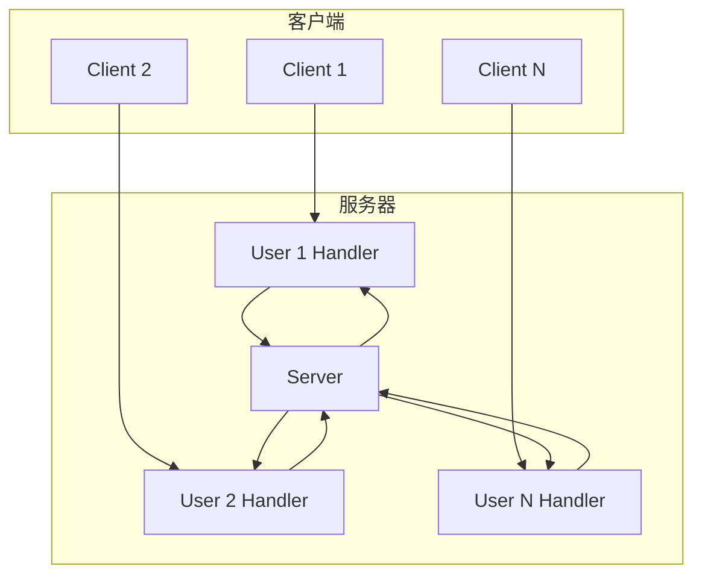
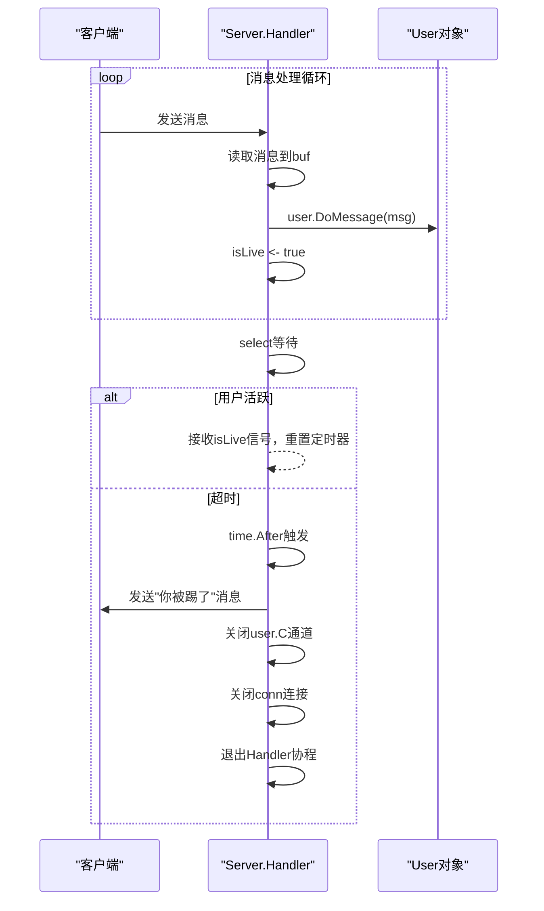
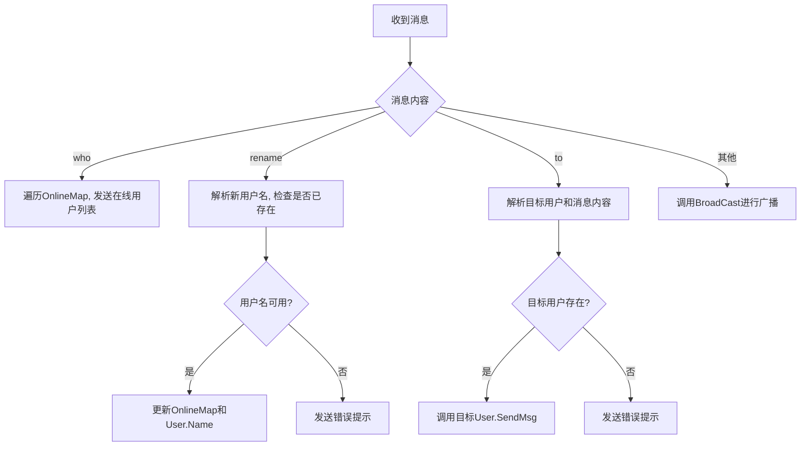

# V0.7 - 超时强踢功能

<cite>
**Referenced Files in This Document**  
- [server.go](file://14-golang-IM-System/ServerV0.7-超时强踢功能/server.go)
- [user.go](file://14-golang-IM-System/ServerV0.7-超时强踢功能/user.go)
- [main.go](file://14-golang-IM-System/ServerV0.7-超时强踢功能/main.go)
</cite>

## 目录
1. [引言](#引言)
2. [项目结构](#项目结构)
3. [核心组件](#核心组件)
4. [架构概述](#架构概述)
5. [详细组件分析](#详细组件分析)
6. [依赖分析](#依赖分析)
7. [性能考量](#性能考量)
8. [故障排除指南](#故障排除指南)
9. [结论](#结论)

## 引言

本文档深入解析IM系统V0.7版本中超时踢出机制的设计与实现。该机制旨在通过检测用户活动状态，自动清理长时间无响应的连接，从而有效管理服务器资源并提升系统稳定性。文档将重点讲解`User`结构体与`Server`结构体之间的协作关系，分析超时检测的触发流程，并探讨其对系统整体性能的影响。

## 项目结构

IM系统V0.7版本位于`14-golang-IM-System/ServerV0.7-超时强踢功能`目录下，包含三个核心文件：`main.go`、`server.go`和`user.go`。该版本在V0.6基础上引入了连接超时自动断开功能，是系统资源管理的关键一环。

**Diagram sources**
- [main.go](file://14-golang-IM-System/ServerV0.7-超时强踢功能/main.go)
- [server.go](file://14-golang-IM-System/ServerV0.7-超时强踢功能/server.go)
- [user.go](file://14-golang-IM-System/ServerV0.7-超时强踢功能/user.go)

**Section sources**
- [main.go](file://14-golang-IM-System/ServerV0.7-超时强踢功能/main.go)
- [server.go](file://14-golang-IM-System/ServerV0.7-超时强踢功能/server.go)

## 核心组件

本版本的核心在于`Server.Handler`方法中实现的超时检测逻辑。当新客户端连接建立后，服务器会为该连接启动一个独立的`Handler`协程。该协程内部通过`select`语句监听两个通道：一个是表示用户活跃状态的`isLive`通道，另一个是由`time.After`创建的定时器通道。任何来自客户端的消息都会触发`isLive <- true`，从而重置定时器。若在指定时间内未收到任何消息，定时器超时，系统将执行强制断开连接的操作。

**Section sources**
- [server.go](file://14-golang-IM-System/ServerV0.7-超时强踢功能/server.go#L55-L115)
- [user.go](file://14-golang-IM-System/ServerV0.7-超时强踢功能/user.go#L61-L63)

## 架构概述

系统采用经典的客户端-服务器架构。`main.go`作为程序入口，负责初始化并启动`Server`实例。`Server`结构体维护着所有在线用户的映射表（`OnlineMap`）和一个用于广播消息的`Message`通道。每个连接由独立的`Handler`协程处理，该协程负责接收客户端消息、调用`User`对象的业务方法，并执行超时检测。`User`结构体则封装了单个用户的状态和行为，包括发送消息、处理指令和管理连接。

**Diagram sources**
- [server.go](file://14-golang-IM-System/ServerV0.7-超时强踢功能/server.go#L55-L115)
- [user.go](file://14-golang-IM-System/ServerV0.7-超时强踢功能/user.go)

## 详细组件分析

### 超时检测与连接关闭流程分析

本节深入分析超时踢出功能的实现细节，重点解析`Server.Handler`方法中的关键逻辑。

#### 超时检测机制

**Diagram sources**
- [server.go](file://14-golang-IM-System/ServerV0.7-超时强踢功能/server.go#L76-L115)

**Section sources**
- [server.go](file://14-golang-IM-System/ServerV0.7-超时强踢功能/server.go#L55-L115)

#### 用户消息处理

**Diagram sources**
- [user.go](file://14-golang-IM-System/ServerV0.7-超时强踢功能/user.go#L66-L123)

**Section sources**
- [user.go](file://14-golang-IM-System/ServerV0.7-超时强踢功能/user.go#L66-L123)

## 依赖分析

通过对代码的分析，可以确定V0.7版本的三个文件构成了一个紧密耦合的模块。`main.go`依赖`server.go`来创建和启动服务器实例。`server.go`不仅依赖`user.go`来创建和管理用户对象，还直接调用了`User`结构体的`Online`、`Offline`、`DoMessage`和`SendMsg`等方法。同时，`user.go`也依赖`server.go`中的`Server`结构体来实现广播和用户管理功能。这种双向依赖关系表明，这三个文件共同构成了IM系统的核心业务逻辑，任何修改都需谨慎考虑其对其他部分的影响。

**Diagram sources**
- [main.go](file://14-golang-IM-System/ServerV0.7-超时强踢功能/main.go)
- [server.go](file://14-golang-IM-System/ServerV0.7-超时强踢功能/server.go)
- [user.go](file://14-golang-IM-System/ServerV0.7-超时强踢功能/user.go)

**Section sources**
- [main.go](file://14-golang-IM-System/ServerV0.7-超时强踢功能/main.go)
- [server.go](file://14-golang-IM-System/ServerV0.7-超时强踢功能/server.go)
- [user.go](file://14-golang-IM-System/ServerV0.7-超时强踢功能/user.go)

## 性能考量

超时踢出机制对系统性能有显著的正面影响。通过`time.After`函数，系统能够以极低的开销监控每个连接的活跃状态。一旦连接超时，系统会立即释放与该连接相关的所有资源，包括网络套接字、内存中的`User`对象以及其监听的`C`通道。这有效防止了因客户端异常断开或网络问题导致的“僵尸连接”累积，避免了内存泄漏和文件描述符耗尽的风险。然而，超时阈值的设置至关重要。V0.7版本中设置的10秒超时（`time.Second * 10`）在测试环境中有效，但在生产环境中可能过于激进，容易误踢正常用户。建议根据实际网络状况和用户行为模式，将阈值调整为更合理的300秒（5分钟），以平衡资源管理和用户体验。

**Section sources**
- [server.go](file://14-golang-IM-System/ServerV0.7-超时强踢功能/server.go#L99)

## 故障排除指南

当遇到连接被意外踢出的问题时，应首先检查`server.go`文件中`time.After`的超时时间设置。确认其值是否符合预期（在V0.7中应为10秒）。其次，检查客户端是否正常发送了心跳消息或任何其他数据包来维持连接活跃。如果客户端长时间不发送任何数据，超时机制将按设计工作。此外，可通过在`Handler`方法中添加日志，观察`isLive`通道是否被正确触发，以诊断消息处理流程是否存在问题。

**Section sources**
- [server.go](file://14-golang-IM-System/ServerV0.7-超时强踢功能/server.go#L99)
- [user.go](file://14-golang-IM-System/ServerV0.7-超时强踢功能/user.go#L66-L123)

## 结论

IM系统V0.7版本成功实现了超时踢出功能，通过在`Server.Handler`中巧妙地运用`select`和`time.After`，构建了一个高效、低开销的连接管理机制。该设计不仅解决了连接资源泄漏的问题，还为后续功能（如心跳包）的实现奠定了基础。未来可考虑将超时阈值配置化，并实现更精细的连接状态管理。