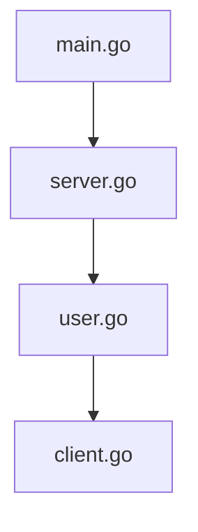
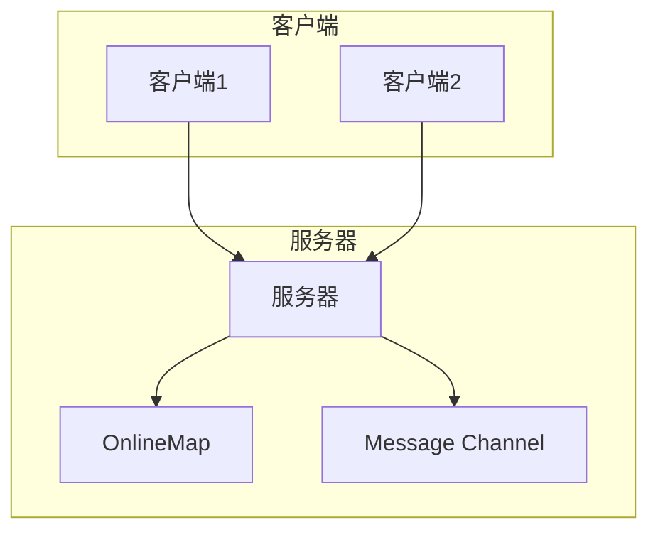
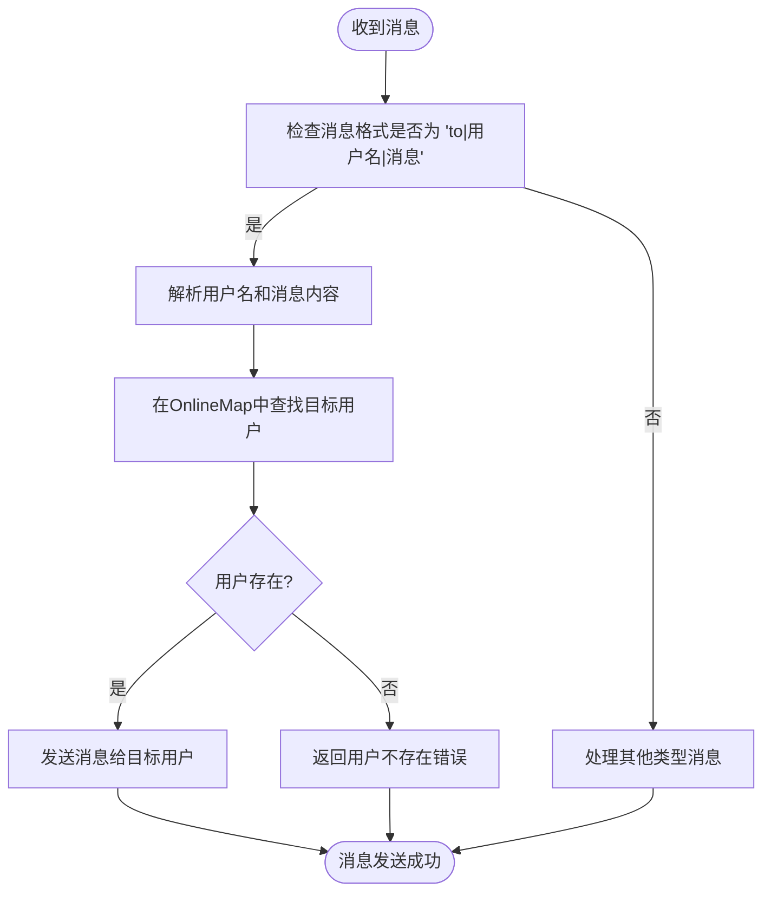
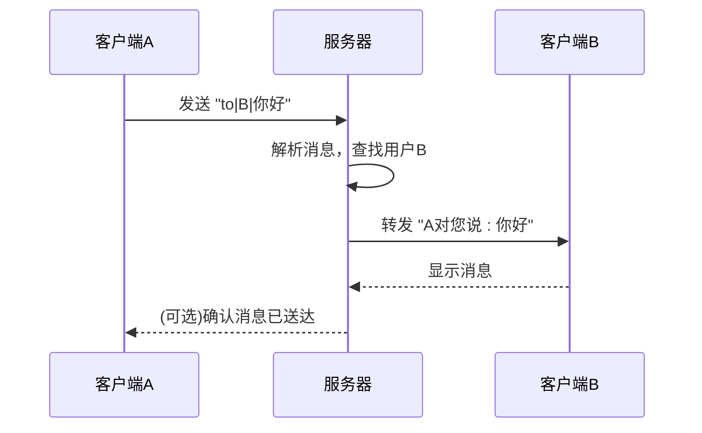
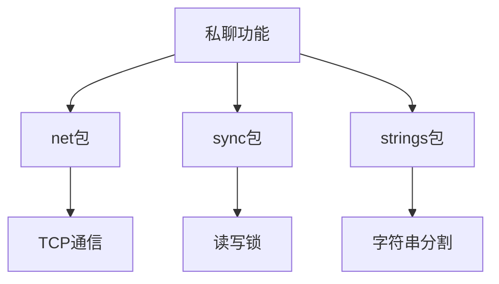

# V0.8 - 私聊功能

<cite>
**Referenced Files in This Document**   
- [main.go](file://14-golang-IM-System/ServerV0.8-私聊功能/main.go)
- [server.go](file://14-golang-IM-System/ServerV0.8-私聊功能/server.go)
- [user.go](file://14-golang-IM-System/ServerV0.8-私聊功能/user.go)
- [client.go](file://14-golang-IM-System/client.go)
</cite>

## 目录
1. [简介](#简介)
2. [项目结构](#项目结构)
3. [核心组件](#核心组件)
4. [架构概述](#架构概述)
5. [详细组件分析](#详细组件分析)
6. [依赖分析](#依赖分析)
7. [性能考虑](#性能考虑)
8. [故障排除指南](#故障排除指南)
9. [结论](#结论)

## 简介
本文档全面解析IM系统V0.8版本中私聊功能的实现原理。重点说明'to|用户名|消息'命令格式的解析逻辑，server.FindUserByName方法如何根据用户名查找目标用户，以及user.go中如何实现点对点消息转发。通过代码示例展示消息路由机制和错误处理（如用户不存在的情况）。提供通信图说明私聊消息的完整路径：发送者→服务器→接收者。指导学习者测试单聊功能，并讨论私聊与群聊的隔离策略、隐私保护等高级话题。同时提出扩展建议，如离线消息存储和消息确认机制。

## 项目结构
IM系统V0.8版本的私聊功能主要由四个核心文件构成：`main.go`、`server.go`、`user.go`和`client.go`。`main.go`是程序入口，负责启动服务器；`server.go`定义了服务器的核心结构和广播机制；`user.go`实现了用户对象及其业务逻辑，包括私聊消息的处理；`client.go`则提供了客户端的实现，支持用户选择私聊模式并发送消息。

**Diagram sources**
- [main.go](file://14-golang-IM-System/ServerV0.8-私聊功能/main.go)
- [server.go](file://14-golang-IM-System/ServerV0.8-私聊功能/server.go)
- [user.go](file://14-golang-IM-System/ServerV0.8-私聊功能/user.go)
- [client.go](file://14-golang-IM-System/client.go)

**Section sources**
- [main.go](file://14-golang-IM-System/ServerV0.8-私聊功能/main.go)
- [server.go](file://14-golang-IM-System/ServerV0.8-私聊功能/server.go)
- [user.go](file://14-golang-IM-System/ServerV0.8-私聊功能/user.go)
- [client.go](file://14-golang-IM-System/client.go)

## 核心组件
私聊功能的核心组件包括`Server`结构体、`User`结构体以及相关的消息处理方法。`Server`结构体维护了一个在线用户列表`OnlineMap`，通过读写锁`mapLock`保证并发安全。`User`结构体包含了用户的基本信息和通信通道，其`DoMessage`方法负责解析和处理来自客户端的消息。

**Section sources**
- [server.go](file://14-golang-IM-System/ServerV0.8-私聊功能/server.go#L1-L143)
- [user.go](file://14-golang-IM-System/ServerV0.8-私聊功能/user.go#L1-L133)

## 架构概述
IM系统的架构采用经典的客户端-服务器模式。服务器端通过`net.Listen`监听TCP连接，为每个新连接创建一个`User`对象并启动相应的处理协程。私聊消息的路由机制基于`OnlineMap`映射表，服务器根据用户名查找目标用户，并通过其通信通道发送消息。整个系统通过`Message`通道实现消息广播，同时利用`ListenMessage`协程监听每个用户的私有消息通道。

**Diagram sources**
- [server.go](file://14-golang-IM-System/ServerV0.8-私聊功能/server.go#L1-L143)
- [user.go](file://14-golang-IM-System/ServerV0.8-私聊功能/user.go#L1-L133)

## 详细组件分析

### 私聊消息处理分析
`User`结构体的`DoMessage`方法是私聊功能的核心。该方法首先检查消息长度和前缀，确认是否为私聊消息格式。然后通过`strings.Split`解析出目标用户名和消息内容。接着在`OnlineMap`中查找目标用户，若存在则调用其`SendMsg`方法发送消息；若不存在则返回错误提示。

#### 私聊消息处理流程

**Diagram sources**
- [user.go](file://14-golang-IM-System/ServerV0.8-私聊功能/user.go#L65-L110)

#### 私聊消息发送序列

**Diagram sources**
- [user.go](file://14-golang-IM-System/ServerV0.8-私聊功能/user.go#L112-L132)
- [client.go](file://14-golang-IM-System/client.go#L75-L140)

**Section sources**
- [user.go](file://14-golang-IM-System/ServerV0.8-私聊功能/user.go#L65-L132)
- [client.go](file://14-golang-IM-System/client.go#L75-L140)

## 依赖分析
私聊功能的实现依赖于Go语言的标准库`net`和`sync`，以及字符串处理包`strings`。服务器与客户端之间通过TCP协议进行通信，使用`net.Conn`接口进行数据读写。并发安全通过`sync.RWMutex`实现，确保对`OnlineMap`的读写操作不会发生竞态条件。消息解析依赖`strings.Split`函数，将命令字符串分解为独立的字段。

**Diagram sources**
- [server.go](file://14-golang-IM-System/ServerV0.8-私聊功能/server.go#L1-L10)
- [user.go](file://14-golang-IM-System/ServerV0.8-私聊功能/user.go#L1-L5)

**Section sources**
- [server.go](file://14-golang-IM-System/ServerV0.8-私聊功能/server.go#L1-L143)
- [user.go](file://14-golang-IM-IM-System/ServerV0.8-私聊功能/user.go#L1-L133)

## 性能考虑
私聊功能的性能主要受`OnlineMap`查找效率和消息广播机制的影响。由于`OnlineMap`是一个哈希表，查找用户的平均时间复杂度为O(1)，这保证了消息路由的高效性。然而，广播消息时需要遍历所有在线用户，时间复杂度为O(n)，在用户数量较多时可能成为性能瓶颈。建议在高并发场景下优化广播机制，例如使用更高效的数据结构或引入消息队列。

## 故障排除指南
常见问题包括消息格式错误、目标用户不存在和网络连接中断。对于消息格式错误，系统会返回明确的提示信息，指导用户使用正确的格式。当目标用户不存在时，服务器会立即反馈"该用户名不存在"的错误。网络连接中断由`Handler`方法中的`conn.Read`检测，一旦发现连接关闭，会自动执行用户下线流程。

**Section sources**
- [user.go](file://14-golang-IM-System/ServerV0.8-私聊功能/user.go#L65-L110)
- [server.go](file://14-golang-IM-System/ServerV0.8-私聊功能/server.go#L100-L120)

## 结论
IM系统V0.8版本的私聊功能通过简洁的设计实现了点对点通信。利用`OnlineMap`哈希表快速定位目标用户，结合Go语言的并发特性，确保了消息传递的实时性和可靠性。未来可扩展的方向包括离线消息存储、消息确认机制和加密通信，以提升系统的完整性和安全性。