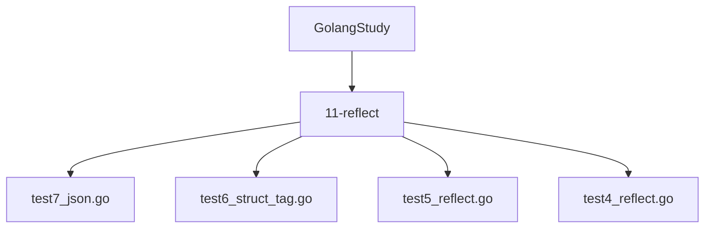
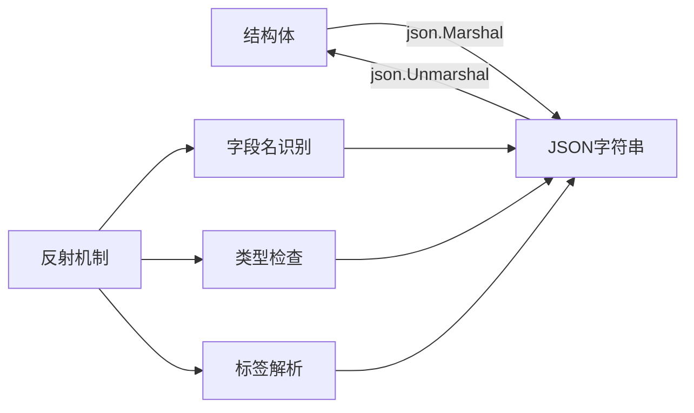
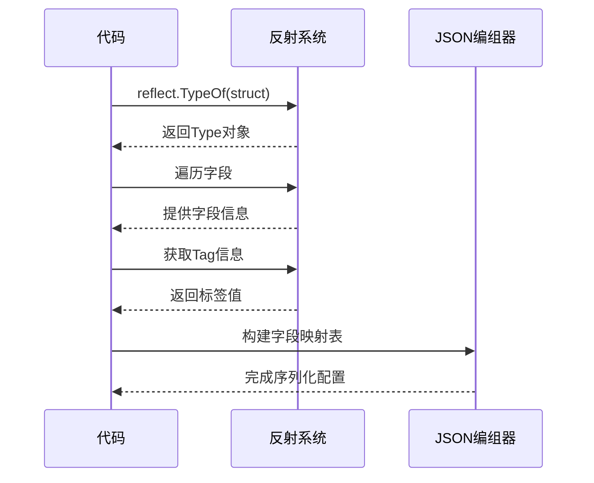
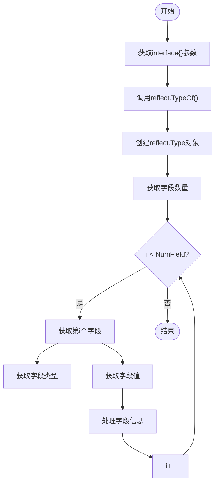
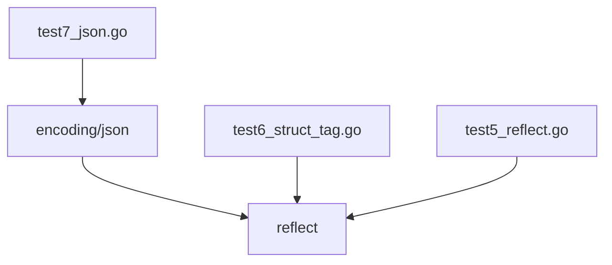

# 反射在JSON序列化中的应用

<cite>
**Referenced Files in This Document**   
- [test7_json.go](file://11-reflect/test7_json.go)
- [test6_struct_tag.go](file://11-reflect/test6_struct_tag.go)
- [test5_reflect.go](file://11-reflect/test5_reflect.go)
- [test4_reflect.go](file://11-reflect/test4_reflect.go)
</cite>

## 目录
1. [简介](#简介)
2. [项目结构](#项目结构)
3. [核心组件](#核心组件)
4. [架构概述](#架构概述)
5. [详细组件分析](#详细组件分析)
6. [依赖分析](#依赖分析)
7. [性能考虑](#性能考虑)
8. [故障排除指南](#故障排除指南)
9. [结论](#结论)

## 简介
本文档深入探讨Go语言中反射机制在JSON编组与解组过程中的实际应用。通过分析`test7_json.go`示例代码，详细阐述`encoding/json`包如何利用反射技术自动识别结构体字段及其json标签（如'title'、'year'、'rmb'），实现结构体与JSON字符串之间的双向转换。文档将揭示`json.Marshal`和`json.Unmarshal`的内部工作原理，说明其如何通过反射获取字段名、类型和标签信息来决定序列化格式，并讨论字段可见性对序列化的影响以及复杂数据类型的处理方式。

## 项目结构
本项目位于`GolangStudy`目录下，包含多个子目录用于组织不同主题的Go语言学习示例。与本文档相关的代码主要位于`11-reflect`目录中，该目录专门用于演示Go语言的反射特性。项目结构清晰地按照功能模块划分，便于学习者逐步掌握Go语言的核心概念。



**Diagram sources**
- [test7_json.go](file://11-reflect/test7_json.go)
- [test6_struct_tag.go](file://11-reflect/test6_struct_tag.go)

**Section sources**
- [test7_json.go](file://11-reflect/test7_json.go)
- [test6_struct_tag.go](file://11-reflect/test6_struct_tag.go)

## 核心组件
本文档的核心组件是`test7_json.go`文件中的`Movie`结构体及其JSON序列化/反序列化操作。该组件展示了如何使用结构体标签控制JSON输出格式，以及如何通过`json.Marshal`和`json.Unmarshal`函数实现数据的双向转换。`Movie`结构体包含字符串、整数和字符串切片等不同类型字段，为演示复杂数据类型的处理提供了完整示例。

**Section sources**
- [test7_json.go](file://11-reflect/test7_json.go#L6-L10)

## 架构概述
Go语言的JSON序列化架构基于反射机制构建，通过`encoding/json`包提供统一的接口。该架构的核心是利用反射在运行时检查结构体的字段信息和标签，从而动态生成JSON表示。整个过程分为编组（结构体到JSON）和解组（JSON到结构体）两个方向，均由`json`包中的相应函数处理。



**Diagram sources**
- [test7_json.go](file://11-reflect/test7_json.go#L13-L21)
- [test7_json.go](file://11-reflect/test7_json.go#L24-L32)

## 详细组件分析

### JSON序列化过程分析
`test7_json.go`文件展示了完整的JSON序列化流程，从结构体定义到数据转换的全过程。该示例使用`Movie`结构体作为数据模型，通过结构体标签精确控制JSON输出的字段名称。

#### 结构体定义与标签使用
```mermaid
classDiagram
class Movie {
+Title string
+Year int
+Price int
+Actors []string
}
Movie : json : "title"
Movie : json : "year"
Movie : json : "rmb"
Movie : json : "actors"
```

**Diagram sources**
- [test7_json.go](file://11-reflect/test7_json.go#L6-L10)

**Section sources**
- [test7_json.go](file://11-reflect/test7_json.go#L6-L10)

#### 反射机制在标签解析中的应用
通过`test6_struct_tag.go`示例可以更深入理解标签的反射处理机制。该文件展示了如何使用`reflect`包获取结构体字段的标签信息，这是`encoding/json`包内部实现的基础。



**Diagram sources**
- [test6_struct_tag.go](file://11-reflect/test6_struct_tag.go#L10-L15)
- [test7_json.go](file://11-reflect/test7_json.go#L6-L10)

### 反射基础机制分析
`test5_reflect.go`和`test4_reflect.go`文件提供了理解JSON序列化所需的基础反射知识。这些示例展示了如何使用`reflect.TypeOf`和`reflect.ValueOf`函数获取接口值的类型和值信息，这是`encoding/json`包实现动态类型检查的基础。

#### 反射类型与值的获取


**Diagram sources**
- [test5_reflect.go](file://11-reflect/test5_reflect.go#L24-L38)
- [test4_reflect.go](file://11-reflect/test4_reflect.go#L8-L10)

**Section sources**
- [test5_reflect.go](file://11-reflect/test5_reflect.go#L24-L45)
- [test4_reflect.go](file://11-reflect/test4_reflect.go#L8-L10)

## 依赖分析
本功能的实现依赖于Go标准库中的`encoding/json`和`reflect`包。`encoding/json`包内部使用`reflect`包来实现动态类型检查和字段访问，形成了明确的依赖关系。`test7_json.go`文件直接依赖`encoding/json`包进行JSON操作，而`test5_reflect.go`和`test6_struct_tag.go`文件则直接使用`reflect`包展示底层机制。



**Diagram sources**
- [test7_json.go](file://11-reflect/test7_json.go#L3-L4)
- [test6_struct_tag.go](file://11-reflect/test6_struct_tag.go#L3-L4)
- [test5_reflect.go](file://11-reflect/test5_reflect.go#L3-L4)

**Section sources**
- [test7_json.go](file://11-reflect/test7_json.go#L3-L4)
- [test6_struct_tag.go](file://11-reflect/test6_struct_tag.go#L3-L4)

## 性能考虑
虽然反射提供了强大的动态能力，但在JSON序列化场景中会带来一定的性能开销。每次调用`json.Marshal`或`json.Unmarshal`时，`encoding/json`包都需要使用反射检查结构体的类型信息，这比直接的类型操作要慢。对于性能敏感的应用，可以考虑使用代码生成工具预先生成序列化代码，避免运行时反射的开销。此外，结构体字段的可见性（首字母大写）直接影响序列化性能，因为只有导出字段才能被反射访问。

## 故障排除指南
在使用JSON序列化功能时，常见的问题包括无效的JSON输入、类型不匹配和字段不可见等。`test7_json.go`示例中包含了基本的错误处理机制，通过检查`json.Marshal`和`json.Unmarshal`的返回错误值来捕获异常。对于无效的JSON输入，应确保输入字符串符合JSON语法规范；对于类型不匹配，需要确认目标结构体的字段类型与JSON数据类型兼容；对于字段不可见问题，必须确保结构体字段以大写字母开头，使其成为导出字段。

**Section sources**
- [test7_json.go](file://11-reflect/test7_json.go#L15-L18)
- [test7_json.go](file://11-reflect/test7_json.go#L26-L29)

## 结论
通过分析`test7_json.go`及其他相关示例文件，可以深入理解Go语言中反射机制在JSON序列化中的关键作用。`encoding/json`包巧妙地利用反射技术，实现了结构体与JSON格式之间的无缝转换，同时通过结构体标签提供了灵活的序列化控制。这种设计既保持了API的简洁性，又提供了足够的灵活性来满足各种序列化需求。理解这一机制对于高效使用Go语言的标准库和开发高质量的JSON处理代码至关重要。