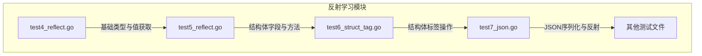
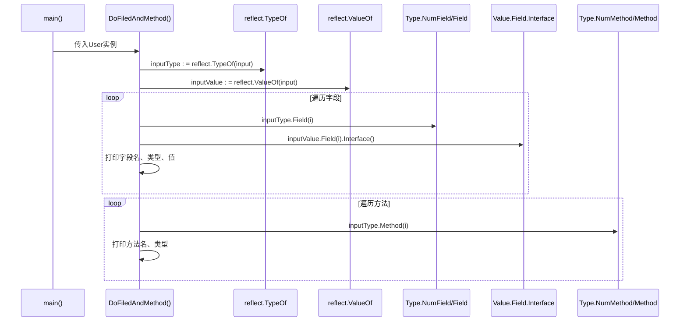
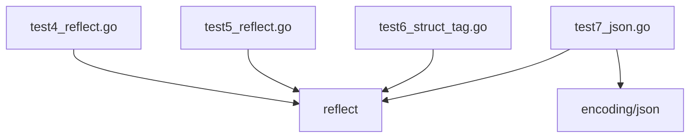

<cite>
**本文档引用的文件**  
- [test4_reflect.go](file://11-reflect/test4_reflect.go)
- [test5_reflect.go](file://11-reflect/test5_reflect.go)
- [test6_struct_tag.go](file://11-reflect/test6_struct_tag.go)
- [test7_json.go](file://11-reflect/test7_json.go)
</cite>

## 目录
1. [引言](#引言)
2. [项目结构](#项目结构)
3. [核心组件](#核心组件)
4. [架构概述](#架构概述)
5. [详细组件分析](#详细组件分析)
6. [依赖分析](#依赖分析)
7. [性能考虑](#性能考虑)
8. [故障排除指南](#故障排除指南)
9. [结论](#结论)

## 引言
本文档旨在深入解析Go语言中反射机制的基础原理与核心API使用方法，重点围绕`reflect.TypeOf`和`reflect.ValueOf`两个关键函数展开。通过分析`test4_reflect.go`和`test5_reflect.go`等示例代码，详细阐述如何在运行时动态获取变量的类型信息和值信息，以及如何将`interface{}`转换为`reflect.Type`和`reflect.Value`对象。文档还将深入探讨结构体字段遍历、方法调用、可设置性（CanSet）等高级特性，并结合实际代码示例说明常见错误及其规避方法。

## 项目结构
本项目`GolangStudy`是一个Go语言学习仓库，其中`11-reflect`目录专门用于学习和演示反射（reflect）机制。该目录下包含多个测试文件，从基础的类型与值获取到复杂的结构体标签和JSON序列化，形成了一个完整的反射学习路径。



**Diagram sources**
- [test4_reflect.go](file://11-reflect/test4_reflect.go)
- [test5_reflect.go](file://11-reflect/test5_reflect.go)
- [test6_struct_tag.go](file://11-reflect/test6_struct_tag.go)
- [test7_json.go](file://11-reflect/test7_json.go)

**Section sources**
- [11-reflect](file://11-reflect)

## 核心组件
本节分析反射机制中最基础的两个操作：获取类型信息和值信息。

### reflect.TypeOf 与 reflect.ValueOf
`reflect.TypeOf`和`reflect.ValueOf`是进入反射世界的两个入口函数。它们接收一个`interface{}`类型的参数，并分别返回该参数的`reflect.Type`和`reflect.Value`对象。`reflect.Type`封装了变量的静态类型信息，而`reflect.Value`则封装了变量的实际值。

**Section sources**
- [test4_reflect.go](file://11-reflect/test4_reflect.go#L1-L17)

## 架构概述
Go反射机制的核心架构围绕`reflect.Type`和`reflect.Value`两个接口构建。`reflect.Type`提供对类型元数据的访问，如字段数量（NumField）、方法数量（NumMethod）等。`reflect.Value`则提供对值的动态操作能力，如获取字段值（Field）、调用方法（Method）等。整个架构通过`interface{}`作为桥梁，将静态的Go类型系统与动态的运行时操作连接起来。

```mermaid
graph LR
A[interface{}] --> B[reflect.TypeOf]
A --> C[reflect.ValueOf]
B --> D[reflect.Type]
C --> E[reflect.Value]
D --> F[NumField, Field]
D --> G[NumMethod, Method]
E --> H[Field, Interface]
E --> I[Method, Call]
F --> J[结构体字段遍历]
G --> K[方法调用]
H --> J
I --> K
```

**Diagram sources**
- [test4_reflect.go](file://11-reflect/test4_reflect.go#L1-L17)
- [test5_reflect.go](file://11-reflect/test5_reflect.go#L1-L51)

## 详细组件分析

### 基础类型与值的反射操作
`test4_reflect.go`文件展示了最基础的反射操作。函数`reflectNum`接收一个`interface{}`参数，通过`reflect.TypeOf(arg)`获取其类型并打印，通过`reflect.ValueOf(arg)`获取其值并打印。在`main`函数中，一个`float64`类型的变量被传递给`reflectNum`，成功输出了其类型`float64`和值`1.2345`。这证明了反射可以穿透`interface{}`的“对偶”结构，获取其内部的类型和值。

**Section sources**
- [test4_reflect.go](file://11-reflect/test4_reflect.go#L1-L17)

### 结构体字段与方法的反射操作
`test5_reflect.go`文件深入展示了如何对结构体进行反射操作。首先，定义了一个`User`结构体和一个`Call`方法。在`DoFiledAndMethod`函数中，通过`reflect.TypeOf(input)`获取`User`的类型信息，通过`reflect.ValueOf(input)`获取其值信息。然后，利用`NumField`和`Field(i)`遍历所有字段，通过`inputValue.Field(i).Interface()`获取字段的实际值并打印。同样，利用`NumMethod`和`Method(i)`遍历所有方法，并打印其名称和类型。此示例成功访问了`Id`、`Name`、`Age`字段，并列出了`Call`方法。



**Diagram sources**
- [test5_reflect.go](file://11-reflect/test5_reflect.go#L1-L51)

### 反射对象的可设置性与寻址性
一个关键的反射概念是“可设置性”（CanSet）。`reflect.Value`对象的`CanSet()`方法返回一个布尔值，指示该值是否可以被修改。只有当`reflect.Value`是由一个可寻址的值（通常是通过指针传递）创建时，它才是可设置的。如果直接传递一个结构体值（如`test5_reflect.go`中的`user`），则其`reflect.Value`是不可设置的，任何修改尝试都会导致panic。要修改结构体字段，必须传递其指针（`&user`），并在反射中使用`Elem()`方法来获取指针指向的值。

**Section sources**
- [test5_reflect.go](file://11-reflect/test5_reflect.go#L1-L51)
- [pointer.go](file://6-pointer/pointer.go)

## 依赖分析
`11-reflect`目录下的文件主要依赖Go标准库中的`reflect`包。`test7_json.go`还依赖`encoding/json`包，这揭示了反射在JSON序列化/反序列化中的核心作用——`json`包正是通过反射来读取结构体字段的标签（tag）和值。



**Diagram sources**
- [test4_reflect.go](file://11-reflect/test4_reflect.go)
- [test5_reflect.go](file://11-reflect/test5_reflect.go)
- [test6_struct_tag.go](file://11-reflect/test6_struct_tag.go)
- [test7_json.go](file://11-reflect/test7_json.go)

**Section sources**
- [go.mod](file://go.mod)

## 性能考虑
反射是一种强大的工具，但它以牺牲性能为代价。反射操作涉及大量的运行时类型检查和动态调用，其性能远低于静态编译的代码。因此，应避免在性能敏感的代码路径中频繁使用反射。例如，在循环中进行反射操作应尽量避免，而应考虑在循环外进行一次反射解析，然后缓存结果。

## 故障排除指南
使用反射时常见的错误包括：
1.  **非指针传递导致无法修改值**：当尝试修改一个通过值传递的结构体字段时，会因`CanSet()`返回`false`而panic。解决方案是传递结构体的指针。
2.  **类型断言失败**：在使用`Interface()`方法后进行类型断言时，如果类型不匹配，会导致panic。应使用带ok返回值的类型断言形式来安全地处理。
3.  **访问不存在的字段或方法**：通过索引访问字段或方法时，如果索引超出范围，会导致panic。应先检查`NumField()`和`NumMethod()`。

**Section sources**
- [test5_reflect.go](file://11-reflect/test5_reflect.go#L1-L51)

## 结论
Go的反射机制为程序提供了在运行时检查和操作对象的能力，极大地增强了语言的灵活性。通过`reflect.TypeOf`和`reflect.ValueOf`，我们可以动态地获取类型和值信息。通过`NumField`、`Field`、`NumMethod`、`Method`等API，我们可以深入探索结构体的内部结构并调用其方法。理解`CanSet`和寻址性是安全使用反射进行值修改的关键。尽管反射性能开销较大，但在元编程、序列化、框架开发等场景下，它是一个不可或缺的工具。