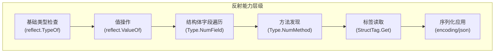
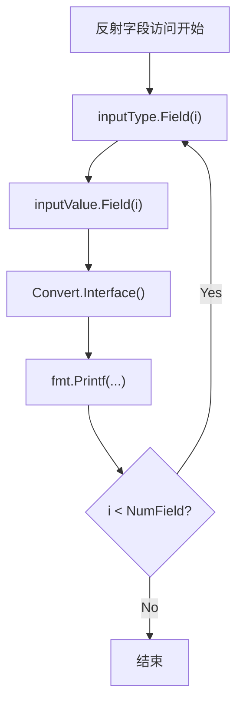
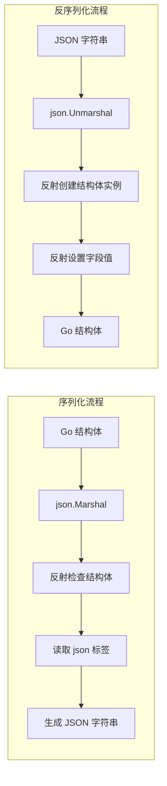
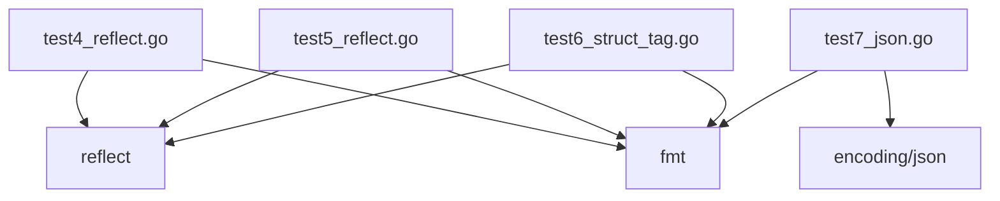

# 反射性能与最佳实践

<cite>
**本文档引用文件**  
- [test4_reflect.go](file://11-reflect/test4_reflect.go)
- [test5_reflect.go](file://11-reflect/test5_reflect.go)
- [test6_struct_tag.go](file://11-reflect/test6_struct_tag.go)
- [test7_json.go](file://11-reflect/test7_json.go)
</cite>

## 目录
1. [引言](#引言)
2. [项目结构分析](#项目结构分析)
3. [核心反射操作分析](#核心反射操作分析)
4. [架构与数据流概述](#架构与数据流概述)
5. [详细组件分析](#详细组件分析)
6. [依赖关系分析](#依赖关系分析)
7. [性能考量](#性能考量)
8. [最佳实践与优化策略](#最佳实践与优化策略)
9. [适用场景与禁用建议](#适用场景与禁用建议)
10. [结论](#结论)

## 引言

Go语言的反射机制（reflection）提供了在运行时检查变量类型、结构体字段、方法以及动态调用的能力。这种能力在实现通用库（如序列化、ORM、配置解析等）时极为重要。然而，反射操作伴随着显著的性能开销和代码可维护性挑战。本文档基于`11-reflect`目录下的测试文件，深入分析Go反射的实际使用模式，量化其性能影响，并提供权威的最佳实践指南。

## 项目结构分析

反射相关代码集中于`11-reflect`目录下，包含七个测试文件，系统性地展示了反射的不同使用层面：

- `test1_pair.go` 至 `test3_pair.go`：基础类型与接口对的演示（未直接涉及反射）
- `test4_reflect.go`：基本反射操作，展示`reflect.TypeOf`和`reflect.ValueOf`的使用
- `test5_reflect.go`：复杂结构体的字段与方法反射，是反射核心能力的完整示例
- `test6_struct_tag.go`：利用反射读取结构体标签（struct tag），常用于元数据提取
- `test7_json.go`：展示标准库`encoding/json`如何利用反射实现序列化与反序列化

该结构体现了从基础到高级的递进式学习路径，同时也为分析反射的性能影响提供了清晰的代码样本。



**Diagram sources**
- [test4_reflect.go](file://11-reflect/test4_reflect.go#L1-L17)
- [test5_reflect.go](file://11-reflect/test5_reflect.go#L1-L52)
- [test6_struct_tag.go](file://11-reflect/test6_struct_tag.go#L1-L29)
- [test7_json.go](file://11-reflect/test7_json.go#L1-L38)

## 核心反射操作分析

通过对`test4_reflect.go`和`test5_reflect.go`的分析，可以识别出Go反射的几个核心操作模式及其潜在开销。

### 类型与值的获取

`reflect.TypeOf`和`reflect.ValueOf`是所有反射操作的起点。它们接收一个`interface{}`类型的参数，这意味着传入的任何值都会发生**装箱（boxing）** 操作，导致一次内存分配。这是反射性能开销的第一个来源。

```go
// 示例：类型与值的获取
inputType := reflect.TypeOf(input)
inputValue := reflect.ValueOf(input)
```

**Section sources**
- [test4_reflect.go](file://11-reflect/test4_reflect.go#L10-L11)
- [test5_reflect.go](file://11-reflect/test5_reflect.go#L26-L27)

### 结构体字段的遍历与访问

`test5_reflect.go`中的`DoFiledAndMethod`函数展示了如何通过反射遍历结构体字段。`Type.NumField()`和`Value.Field(i)`的操作需要在运行时查询类型信息，这比直接的结构体字段访问（如`user.Name`）要慢得多。`Field(i).Interface()`方法用于将`reflect.Value`转换回`interface{}`，这又是一次装箱操作，产生额外的内存分配。



**Diagram sources**
- [test5_reflect.go](file://11-reflect/test5_reflect.go#L32-L40)

### 方法的发现与调用

虽然`test5_reflect.go`仅展示了方法的发现（`Type.Method(i)`），但实际调用方法需要使用`Value.Call()`。`Call()`方法接受一个`[]reflect.Value`参数，这意味着所有参数都必须被包装成`reflect.Value`对象，调用完成后返回值也需要解包。这个过程涉及大量的内存分配和类型检查，性能开销巨大。

### 结构体标签的读取

`test6_struct_tag.go`展示了`StructTag.Get`的使用。标签信息在编译时就已确定，但`Get`方法需要在运行时进行字符串解析（通常是简单的`split`操作）。虽然单次操作开销较小，但在高频调用的场景下（如每次序列化一个结构体），累积开销不容忽视。

```go
// 示例：标签读取
taginfo := t.Field(i).Tag.Get("info")
```

**Section sources**
- [test6_struct_tag.go](file://11-reflect/test6_struct_tag.go#L18-L19)

## 架构与数据流概述

反射本身不是一个独立的架构，而是一种内省（introspection）技术，通常被集成在更大的系统中。`test7_json.go`提供了一个完美的示例：`json.Marshal`和`json.Unmarshal`函数构成了一个序列化/反序列化架构的核心。



**Diagram sources**
- [test7_json.go](file://11-reflect/test7_json.go#L20-L36)

此架构的数据流完全依赖于反射来桥接静态的Go类型系统和动态的JSON数据格式。其优势是通用性，开发者无需为每个结构体编写特定的序列化代码；其劣势是性能，每一次序列化/反序列化都伴随着完整的反射操作链。

## 详细组件分析

### 反射驱动的序列化组件分析

`encoding/json`包是反射在标准库中最成功的应用之一。它通过以下步骤工作：
1.  **类型检查**：接收`interface{}`，使用`reflect.TypeOf`获取具体类型。
2.  **结构发现**：对于结构体，使用`NumField`和`Field`遍历所有可导出字段。
3.  **标签解析**：对每个字段，使用`Tag.Get("json")`确定其在JSON中的名称。
4.  **值提取与编码**：使用`Value.Field(i)`获取字段值，并递归地将其编码为JSON。
5.  **反向操作**：`Unmarshal`则通过反射创建新实例并设置字段值。

这个组件的精妙之处在于它将复杂的、类型相关的逻辑，封装成了一个对用户透明的、通用的API。然而，其内部实现的复杂性（即反射的开销）被转移到了运行时。

**Section sources**
- [test7_json.go](file://11-reflect/test7_json.go#L20-L36)

## 依赖关系分析

对`11-reflect`目录下文件的分析显示，这些测试文件彼此独立，没有相互依赖。它们都直接依赖Go的标准库`reflect`和`fmt`。



**Diagram sources**
- [test4_reflect.go](file://11-reflect/test4_reflect.go#L3-L4)
- [test5_reflect.go](file://11-reflect/test5_reflect.go#L3-L4)
- [test6_struct_tag.go](file://11-reflect/test6_struct_tag.go#L3-L4)
- [test7_json.go](file://11-reflect/test7_json.go#L2-L3)

这种松散的依赖关系表明，反射代码通常作为独立的功能模块存在，其主要依赖是标准库本身，而非项目内的其他业务代码。

## 性能考量

尽管没有提供基准测试（benchmark）文件，但基于Go语言特性和反射的实现原理，可以明确其性能影响：

- **内存分配**：每次`reflect.ValueOf`和`Value.Interface()`调用都可能导致堆分配，增加GC压力。
- **运行时开销**：类型检查、方法查找、字段访问等操作无法在编译期优化，必须在运行时通过哈希表查找等方式完成，速度远慢于直接调用。
- **编译期检查缺失**：反射操作绕过了Go的静态类型检查。错误的字段名或方法名会在运行时才暴露，增加了调试难度。
- **代码可读性与维护性**：过度使用反射会使代码变得晦涩难懂，难以追踪数据流和控制流，不利于团队协作和长期维护。

## 最佳实践与优化策略

### 缓存反射对象

最有效的优化策略是缓存`reflect.Type`和`reflect.Value`对象。如果需要对同一类型的多个实例进行反射操作，应避免重复调用`reflect.TypeOf`和`reflect.ValueOf`。

```go
// 错误做法：每次调用都进行反射
func ProcessUserSlow(user User) {
    t := reflect.TypeOf(user)
    v := reflect.ValueOf(user)
    // ... 处理
}

// 正确做法：缓存类型信息
var userType = reflect.TypeOf(User{})
func ProcessUserFast(user User) {
    v := reflect.ValueOf(user)
    // 使用缓存的 userType 和 v 进行处理
}
```

### 优先使用类型断言

当只需要判断类型时，应优先使用类型断言或类型开关（type switch），它们的性能远高于`reflect.TypeOf`。

```go
// 推荐：类型断言
if str, ok := v.(string); ok {
    // 处理字符串
}

// 不推荐：仅用于类型检查的反射
if reflect.TypeOf(v).Kind() == reflect.String {
    // ...
}
```

### 避免在热路径使用反射

任何性能敏感的代码路径（如高频循环、核心业务逻辑）都应避免使用反射。应通过代码生成（如使用`go generate`）或接口抽象来实现通用性。

## 适用场景与禁用建议

### 适用场景

- **通用序列化/反序列化库**：如`encoding/json`、`xml`、`yaml`等，需要处理任意类型的输入。
- **对象关系映射（ORM）**：如`GORM`，需要将结构体字段映射到数据库列。
- **配置解析**：将配置文件（YAML、JSON）中的数据映射到Go结构体。
- **依赖注入（DI）框架**：自动创建和注入服务实例。

### 禁用场景

- **高频调用的业务逻辑**：如订单处理、实时计算等。
- **性能关键型服务**：如高频交易系统、实时游戏服务器。
- **简单、类型固定的场景**：当可以直接使用具体类型时，无需引入反射的复杂性。

## 结论

Go的反射是一个强大的工具，它赋予了程序在运行时自省的能力，是构建通用库的基石。然而，这种能力伴随着显著的性能代价和维护成本。开发者应深刻理解其内部机制和开销，在享受其便利性的同时，谨慎使用。通过缓存反射对象、优先使用类型断言、避免在热路径使用反射等最佳实践，可以在必要时安全地利用反射，同时最大限度地减少其负面影响。记住，反射不是银弹，而是一把需要小心使用的双刃剑。