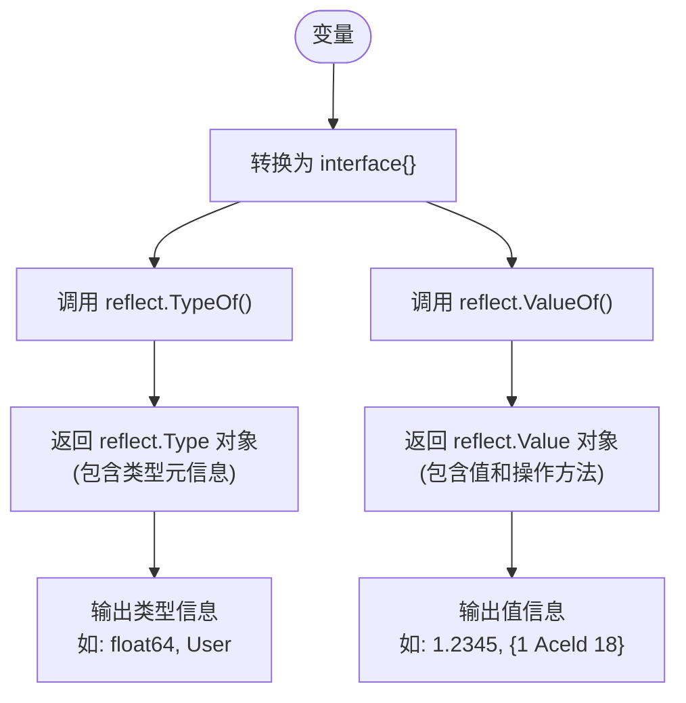
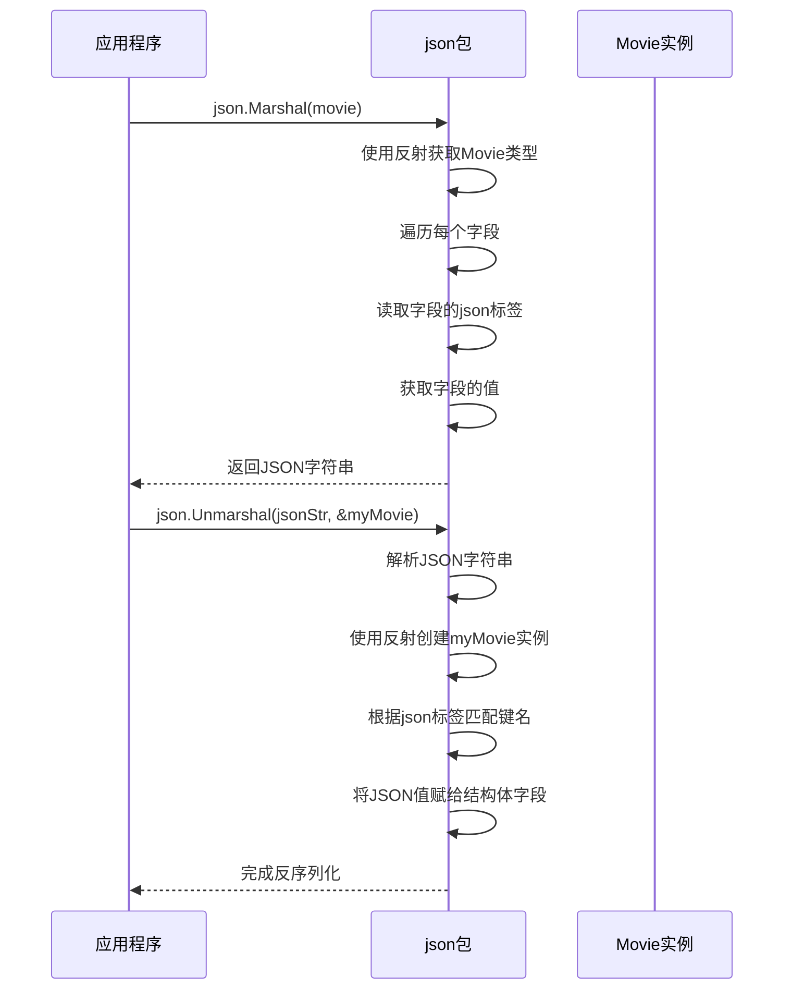

# 反射机制

<cite>
**本文档引用的文件**  
- [test4_reflect.go](file://11-reflect/test4_reflect.go)
- [test5_reflect.go](file://11-reflect/test5_reflect.go)
- [test6_struct_tag.go](file://11-reflect/test6_struct_tag.go)
- [test7_json.go](file://11-reflect/test7_json.go)
</cite>

## 目录
1. [引言](#引言)
2. [核心组件分析](#核心组件分析)
3. [反射基础：类型与值的获取](#反射基础类型与值的获取)
4. [结构体字段与方法的动态访问](#结构体字段与方法的动态访问)
5. [结构体标签的定义与解析](#结构体标签的定义与解析)
6. [反射在JSON序列化中的应用](#反射在json序列化中的应用)
7. [性能开销与使用限制](#性能开销与使用限制)
8. [典型应用场景](#典型应用场景)
9. [安全注意事项与最佳实践](#安全注意事项与最佳实践)
10. [结论](#结论)

## 引言
Go语言的反射机制允许程序在运行时检查变量的类型和值，并动态调用其方法或访问其字段。这种能力为构建高度灵活的通用库（如序列化器、ORM框架和配置解析器）提供了基础。本文档以`11-reflect`目录下的四个核心示例文件为基础，深入剖析Go反射的核心API、实际应用场景、性能特征及潜在风险，旨在为开发者提供一份全面的反射技术指南。

## 核心组件分析
本节将对构成反射机制核心的四个示例文件进行整体分析，明确它们在展示反射能力方面的分工与联系。

**Section sources**
- [test4_reflect.go](file://11-reflect/test4_reflect.go#L1-L17)
- [test5_reflect.go](file://11-reflect/test5_reflect.go#L1-L51)
- [test6_struct_tag.go](file://11-reflect/test6_struct_tag.go#L1-L28)
- [test7_json.go](file://11-reflect/test7_json.go#L1-L37)

## 反射基础：类型与值的获取

`test4_reflect.go` 文件展示了反射最基础的两个函数：`reflect.TypeOf` 和 `reflect.ValueOf`。这两个函数是进入反射世界的入口，它们接收一个空接口 `interface{}` 类型的参数，从而可以处理任何类型的值。

`reflect.TypeOf` 函数返回一个 `reflect.Type` 接口，该接口包含了变量的完整类型信息，例如其名称、种类（如 `int`、`string`、`struct` 等）。`reflect.ValueOf` 函数则返回一个 `reflect.Value` 接口，它封装了变量的实际值，允许我们以统一的方式对其进行操作。通过这两个函数，程序可以在编译时类型未知的情况下，在运行时探知变量的“身份”和“内容”。



**Diagram sources**
- [test4_reflect.go](file://11-reflect/test4_reflect.go#L10-L11)

**Section sources**
- [test4_reflect.go](file://11-reflect/test4_reflect.go#L1-L17)

## 结构体字段与方法的动态访问

`test5_reflect.go` 文件将反射的应用提升到了一个更复杂的层次，即对结构体（struct）的字段和方法进行动态遍历与访问。

该文件定义了一个 `User` 结构体和一个关联方法 `Call`。核心函数 `DoFiledAndMethod` 接收一个 `interface{}` 类型的参数。在函数内部，首先通过 `reflect.TypeOf` 获取输入参数的类型对象，然后利用 `NumField` 方法获取结构体字段的数量，并通过循环调用 `Field(i)` 和 `Value.Field(i).Interface()` 来遍历并打印每个字段的名称、类型和实际值。

同样地，通过 `NumMethod` 和 `Method(i)` 方法，可以遍历结构体的所有公开方法（在Go中，首字母大写的方法是公开的），并获取它们的名称和类型签名。这展示了反射如何实现对对象内部结构的“自省”（introspection），使得程序可以编写出不依赖于具体类型定义的通用处理逻辑。

```mermaid
classDiagram
class User {
+int Id
+string Name
+int Age
+Call()
}
class reflectType {
+Name() string
+NumField() int
+Field(int) StructField
+NumMethod() int
+Method(int) Method
}
class reflectValue {
+Field(int) Value
+Interface() interface{}
}
DoFiledAndMethod --|> User : 接收实例
DoFiledAndMethod --> reflectType : 调用 TypeOf()
DoFiledAndMethod --> reflectValue : 调用 ValueOf()
reflectType --> User : 描述
reflectValue --> User : 封装值
```

**Diagram sources**
- [test5_reflect.go](file://11-reflect/test5_reflect.go#L7-L16)
- [test5_reflect.go](file://11-reflect/test5_reflect.go#L24-L50)

**Section sources**
- [test5_reflect.go](file://11-reflect/test5_reflect.go#L1-L51)

## 结构体标签的定义与解析

`test6_struct_tag.go` 文件介绍了结构体标签（struct tag）这一强大的元数据机制，并展示了如何使用反射来解析它们。

结构体标签是附加在结构体字段声明后面的字符串，通常用于为字段提供额外的元信息。在本例中，`resume` 结构体的 `Name` 和 `Sex` 字段都定义了名为 `info` 和 `doc` 的标签。这些标签在编译后以字符串形式存储在程序的元数据中。

`findTag` 函数演示了如何通过反射读取这些标签。首先，`reflect.TypeOf(str).Elem()` 获取指针所指向的结构体类型（`Elem()` 用于解引用指针）。然后，通过 `Field(i).Tag.Get("tagName")` 方法，可以按名称提取特定标签的值。这种机制在序列化/反序列化库中极为常见，例如，`json` 标签告诉 `json` 包在编组时应使用哪个JSON键名。

```mermaid
flowchart TD
DefineStruct["定义结构体\ntype resume struct {\n Name string `info:\"name\" doc:\"我的名字\"`\n Sex string `info:\"sex\"`\n}"] --> Compile[编译]
Compile --> StoreTags["将标签信息存储在\n程序元数据中"]
StoreTags --> Runtime[运行时]
Runtime --> CallFindTag["调用 findTag(&re)"]
CallFindTag --> GetStructType["reflect.TypeOf().Elem()"]
GetStructType --> LoopFields["遍历每个字段"]
LoopFields --> GetTag["field.Tag.Get(\"info\")\nfield.Tag.Get(\"doc\")"]
GetTag --> PrintInfo["打印标签信息"]
```

**Diagram sources**
- [test6_struct_tag.go](file://11-reflect/test6_struct_tag.go#L7-L10)
- [test6_struct_tag.go](file://11-reflect/test6_struct_tag.go#L12-L20)

**Section sources**
- [test6_struct_tag.go](file://11-reflect/test6_struct_tag.go#L1-L28)

## 反射在JSON序列化中的应用

`test7_json.go` 文件虽然没有直接调用 `reflect` 包，但它完美地诠释了反射在标准库中的实际应用价值。

`Movie` 结构体定义了 `json` 标签，这些标签指导 `encoding/json` 包如何将Go结构体转换为JSON对象。当调用 `json.Marshal(movie)` 时，`json` 包内部会使用反射来遍历 `movie` 实例的每一个字段。对于每个字段，它会检查其 `json` 标签来确定对应的JSON键名（如 `rmb` 对应 `Price` 字段），然后获取字段的值并将其转换为相应的JSON数据类型。

同样地，`json.Unmarshal` 在反序列化时，也会使用反射来创建目标结构体的实例，并根据JSON对象的键名和结构体的 `json` 标签，将JSON值赋给结构体的相应字段。这个例子清晰地表明，反射是实现通用、类型安全的序列化框架的基石。



**Diagram sources**
- [test7_json.go](file://11-reflect/test7_json.go#L7-L12)
- [test7_json.go](file://11-reflect/test7_json.go#L20-L37)

**Section sources**
- [test7_json.go](file://11-reflect/test7_json.go#L1-L37)

## 性能开销与使用限制

尽管反射功能强大，但它伴随着显著的性能开销。反射操作发生在运行时，需要进行大量的类型检查和内存分配，其速度远慢于直接的静态调用。例如，通过反射调用一个方法可能比直接调用慢数十倍甚至上百倍。

此外，反射存在使用限制。它只能访问结构体的公开字段和方法（即首字母大写的成员）。对于未导出的成员，反射无法进行读写操作，这是Go语言封装性的一部分。同时，反射代码的类型安全性在编译时无法得到保证，错误往往在运行时才会暴露，增加了调试难度。

## 典型应用场景

反射的典型应用场景包括：
- **ORM框架**：将数据库表的行映射到Go结构体，通过反射读取结构体标签来确定数据库列名，并动态执行SQL查询和结果扫描。
- **配置解析器**：读取YAML或JSON格式的配置文件，并根据结构体标签将配置值自动填充到对应的结构体字段中。
- **序列化/反序列化库**：如 `json`、`xml`、`protobuf` 等包，都重度依赖反射来实现通用的数据编组功能。
- **依赖注入容器**：在运行时分析结构体的字段，自动查找并注入所需的依赖项。

## 安全注意事项与最佳实践

过度使用反射会严重损害代码的可读性和可维护性。反射代码通常晦涩难懂，IDE的自动补全和重构功能也难以支持。因此，最佳实践是**谨慎使用反射**。

应优先考虑使用接口（interface）和泛型（Go 1.18+）来实现代码的通用性。只有当这些静态方法无法满足需求时，才应考虑使用反射。在使用反射时，应尽量将其封装在库的内部，向用户提供简洁的API，避免将反射的复杂性暴露给库的使用者。同时，务必进行充分的测试，以确保反射逻辑的正确性。

## 结论
Go语言的反射机制是一把双刃剑。它赋予了程序在运行时探知和操作自身结构的惊人能力，是构建高级抽象和通用库不可或缺的工具。通过对 `test4_reflect.go` 到 `test7_json.go` 的分析，我们掌握了从基础的类型检查到复杂的标签解析和序列化应用的完整链条。然而，开发者必须清醒地认识到其带来的性能损耗和维护成本。明智地使用反射，将其作为解决特定复杂问题的利器，而非日常编程的首选方案，是编写高效、健壮Go代码的关键。