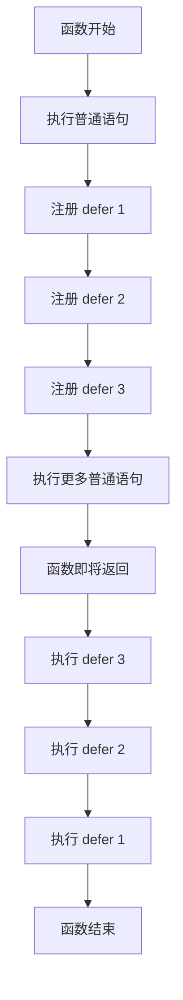
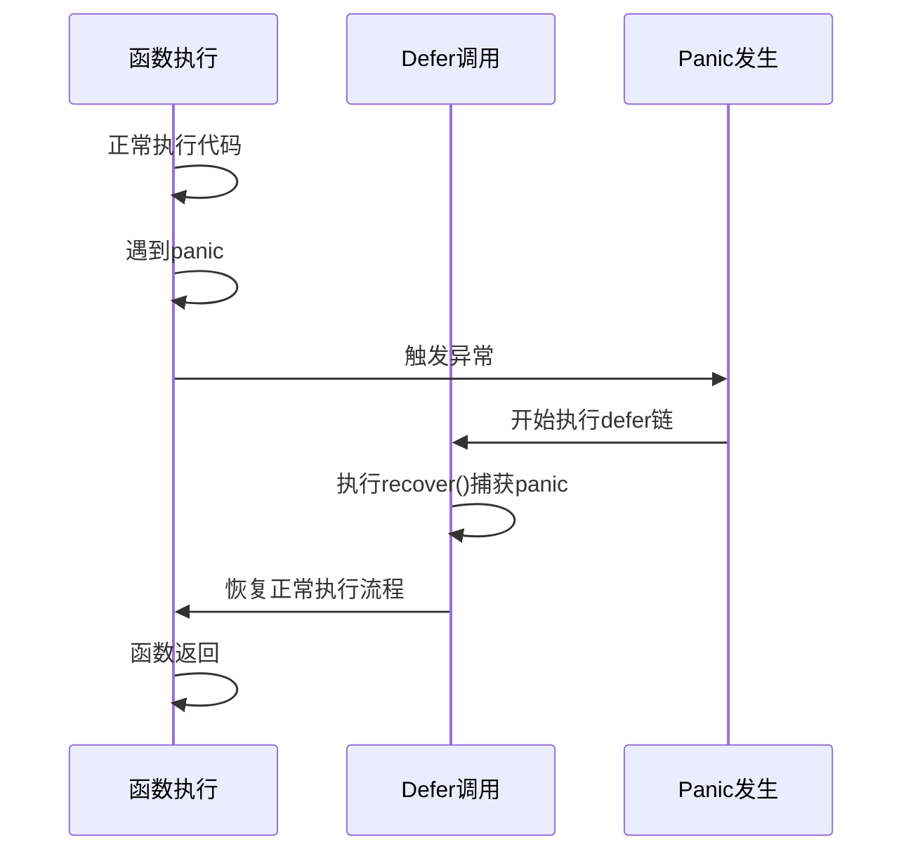
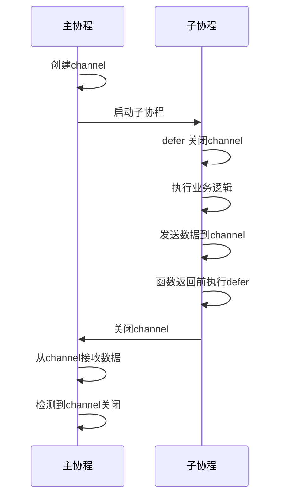
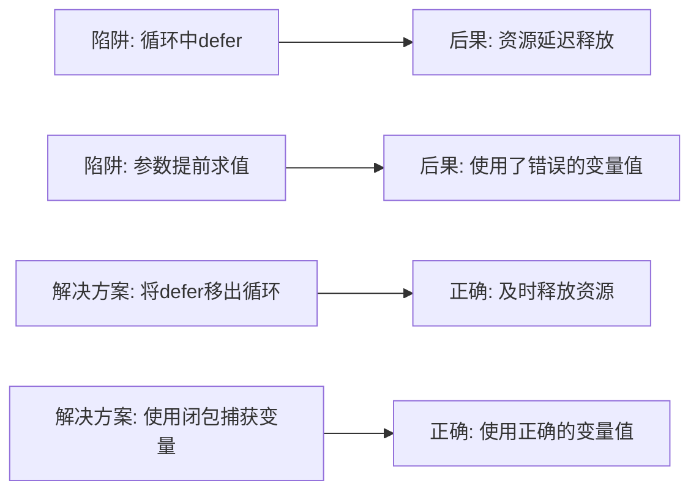

# Defer语句与资源管理

<cite>
**本文档引用文件**   
- [defer.go](file://7-defer/defer.go)
- [test2_goexit.go](file://12-goroutine/test2_goexit.go)
- [test1_channel.go](file://13-channel/test1_channel.go)
- [test2_channel.go](file://13-channel/test2_channel.go)
</cite>

## 目录
1. [简介](#简介)
2. [Defer执行机制](#defer执行机制)
3. [Defer与函数返回的交互](#defer与函数返回的交互)
4. [典型应用场景](#典型应用场景)
5. [性能分析与常见陷阱](#性能分析与常见陷阱)
6. [最佳实践总结](#最佳实践总结)

## 简介
`defer` 是Go语言中用于延迟执行语句的关键特性，主要用于确保资源的正确释放和清理操作的执行。通过将关键的清理代码（如文件关闭、锁释放）使用 `defer` 语句注册，开发者可以保证这些操作在函数返回前一定会被执行，从而提升代码的健壮性和可维护性。

**Section sources**
- [defer.go](file://7-defer/defer.go#L1-L12)

## Defer执行机制

### 执行时机
`defer` 语句的执行时机是在包含它的函数即将返回之前，无论函数是正常返回还是由于 panic 而提前退出。这意味着被 `defer` 的函数或方法调用会被推迟到外围函数的末尾执行。

### LIFO执行顺序
当一个函数中有多个 `defer` 语句时，它们的执行顺序遵循后进先出（LIFO）原则。即最后声明的 `defer` 会最先执行。

**Diagram sources**
- [defer.go](file://7-defer/defer.go#L6-L7)

**Section sources**
- [defer.go](file://7-defer/defer.go#L6-L11)

## Defer与函数返回的交互

### 与return语句的执行顺序
`defer` 会在 `return` 语句之后、函数真正退出之前执行。在有命名返回值的函数中，`defer` 可以修改返回值。

### 在panic恢复中的作用
`defer` 常与 `recover()` 配合使用，用于捕获和处理 panic，防止程序崩溃。

**Diagram sources**
- [test2_goexit.go](file://12-goroutine/test2_goexit.go#L12-L15)

**Section sources**
- [test2_goexit.go](file://12-goroutine/test2_goexit.go#L9-L27)

## 典型应用场景

### 文件资源管理
在打开文件后立即使用 `defer file.Close()` 可确保文件句柄在函数退出时被正确关闭。

### 锁的释放
在获取互斥锁后，使用 `defer mutex.Unlock()` 可以避免因忘记释放锁而导致的死锁问题。

### 通道关闭
在使用通道时，生产者可以通过 `defer close(channel)` 确保通道被正确关闭。

**Diagram sources**
- [test1_channel.go](file://13-channel/test1_channel.go#L9-L13)
- [test2_channel.go](file://13-channel/test2_channel.go#L13-L17)

**Section sources**
- [test1_channel.go](file://13-channel/test1_channel.go#L8-L15)
- [test2_channel.go](file://13-channel/test2_channel.go#L12-L18)

## 性能分析与常见陷阱

### 性能开销
`defer` 会带来轻微的性能开销，因为它需要在运行时维护一个调用栈。在性能敏感的循环中应谨慎使用。

### 常见陷阱及解决方案
1. **循环中的defer**：在循环体内使用 `defer` 可能导致资源延迟释放，应将 `defer` 移出循环或使用闭包。
2. **参数求值时机**：`defer` 后面的函数参数在 `defer` 语句执行时就被求值，而非在实际调用时。

**Diagram sources**
- [defer.go](file://7-defer/defer.go#L6-L7)
- [test2_channel.go](file://13-channel/test2_channel.go#L13-L17)

**Section sources**
- [defer.go](file://7-defer/defer.go#L6-L11)
- [test2_channel.go](file://13-channel/test2_channel.go#L12-L18)

## 最佳实践总结
- 在资源获取后立即使用 `defer` 注册释放操作
- 利用 `defer` 的 LIFO 特性合理安排清理顺序
- 在可能发生 panic 的代码块中使用 `defer` + `recover`
- 避免在热循环中使用 `defer` 以减少性能开销
- 注意 `defer` 函数参数的求值时机，必要时使用闭包

**Section sources**
- [defer.go](file://7-defer/defer.go#L1-L12)
- [test1_channel.go](file://13-channel/test1_channel.go#L9-L13)
- [test2_goexit.go](file://12-goroutine/test2_goexit.go#L12-L15)