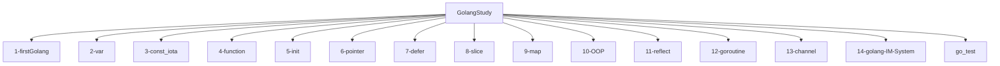
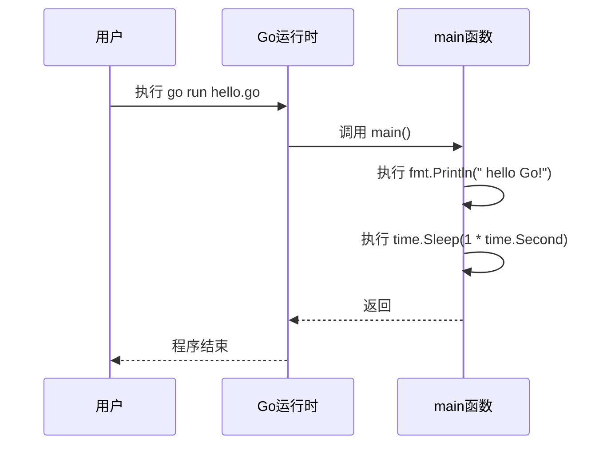
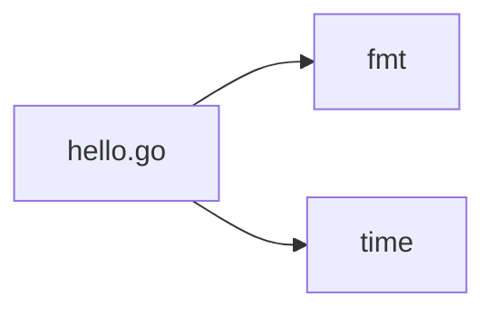

# Go程序基本结构

<cite>
**本文档中引用的文件**   
- [hello.go](file://1-firstGolang/hello.go)
- [hello.go](file://go_test/1.初始golang/hello.go)
- [main.go](file://14-golang-IM-System/ServerV0.1-基础服务构建/main.go)
- [server.go](file://14-golang-IM-System/ServerV0.1-基础服务构建/server.go)
- [main.go](file://5-init/main.go)
- [lib1.go](file://5-init/lib1/lib1.go)
- [lib2.go](file://5-init/lib2/lib2.go)
</cite>

## 目录
1. [简介](#简介)
2. [项目结构](#项目结构)
3. [核心组件](#核心组件)
4. [架构概述](#架构概述)
5. [详细组件分析](#详细组件分析)
6. [依赖分析](#依赖分析)
7. [性能考虑](#性能考虑)
8. [故障排除指南](#故障排除指南)
9. [结论](#结论)

## 简介
本文档旨在全面介绍Go语言程序的基本结构，以`1-firstGolang/hello.go`为例，深入讲解Go源文件的组织方式、包声明、导入语句、main包和main函数的作用与执行流程。通过实际代码示例，帮助初学者理解如何使用`go run`和`go build`编译运行程序，并提供常见错误示例及调试建议。

**Section sources**
- [hello.go](file://1-firstGolang/hello.go#L1-L17)
- [hello.go](file://go_test/1.初始golang/hello.go#L1-L19)

## 项目结构
本项目包含多个目录，每个目录对应不同的学习主题。从基础语法到高级特性，如面向对象编程、反射、并发等，结构清晰，便于循序渐进地学习Go语言。



**Diagram sources **
- [1-firstGolang](file://1-firstGolang)
- [go_test](file://go_test)

**Section sources**
- [project_structure](file://#L1-L50)

## 核心组件
Go程序的核心在于其简洁而强大的结构。每个Go程序都必须包含一个`main`包和一个`main`函数作为程序的入口点。`package main`声明了该文件属于主包，而`import`语句用于引入外部包，如`fmt`和`time`，以实现格式化输入输出和时间操作等功能。

**Section sources**
- [hello.go](file://1-firstGolang/hello.go#L1-L17)
- [hello.go](file://go_test/1.初始golang/hello.go#L1-L19)

## 架构概述
Go程序的执行流程始于`main`函数。当程序启动时，Go运行时系统会自动调用`main`包中的`main`函数。此函数是程序的起点，所有其他逻辑均由此展开。通过`go run`命令可以直接运行Go源文件，而`go build`则用于编译生成可执行文件。



**Diagram sources **
- [hello.go](file://1-firstGolang/hello.go#L1-L17)
- [hello.go](file://go_test/1.初始golang/hello.go#L1-L19)

## 详细组件分析
### main包与main函数
`main`包是Go程序的入口包，每个可执行程序都必须包含一个`main`包。`main`函数是程序的入口点，其签名固定为`func main()`，不接受任何参数也不返回任何值。函数体内的代码按顺序执行，直至函数结束或遇到`return`语句。

#### 包声明与导入
```go
package main // 声明当前文件属于main包

import (
	"fmt"  // 导入fmt包，用于格式化I/O
	"time" // 导入time包，用于时间相关操作
)
```

**Section sources**
- [hello.go](file://1-firstGolang/hello.go#L1-L17)
- [hello.go](file://go_test/1.初始golang/hello.go#L1-L19)

### 编译与运行
使用`go run`命令可以直接运行Go源文件，无需预先编译。例如，`go run hello.go`将直接执行`hello.go`文件中的代码。而`go build`命令则用于编译源文件，生成可执行文件，适用于部署和分发。

**Section sources**
- [hello.go](file://1-firstGolang/hello.go#L1-L17)
- [hello.go](file://go_test/1.初始golang/hello.go#L1-L19)

## 依赖分析
Go程序通过`import`语句引入外部包，形成依赖关系。这些依赖可以是标准库中的包，也可以是第三方库。在`hello.go`中，`fmt`和`time`包是标准库的一部分，提供了基本的输入输出和时间处理功能。



**Diagram sources **
- [hello.go](file://1-firstGolang/hello.go#L1-L17)
- [hello.go](file://go_test/1.初始golang/hello.go#L1-L19)

**Section sources**
- [hello.go](file://1-firstGolang/hello.go#L1-L17)
- [hello.go](file://go_test/1.初始golang/hello.go#L1-L19)

## 性能考虑
虽然`hello.go`是一个简单的示例程序，但了解其背后的性能机制对于编写高效代码至关重要。Go的编译器优化了代码生成，确保程序运行速度快且资源消耗低。此外，Go的垃圾回收机制自动管理内存，减少了开发者的工作负担。

## 故障排除指南
### 常见错误
- **包名错误**：确保每个文件的包声明正确无误，特别是`main`包。
- **函数签名错误**：`main`函数必须没有参数且不返回任何值。
- **导入路径错误**：检查导入的包名是否正确，避免拼写错误。
- **大括号位置错误**：Go语言要求函数的大括号必须与函数名在同一行。

### 调试建议
- 使用`go vet`工具检查代码中的潜在问题。
- 利用`fmt.Println`输出变量值，帮助定位逻辑错误。
- 查阅官方文档和社区资源，获取更多调试技巧。

**Section sources**
- [hello.go](file://1-firstGolang/hello.go#L1-L17)
- [hello.go](file://go_test/1.初始golang/hello.go#L1-L19)

## 结论
通过本文档的学习，读者应能掌握Go程序的基本结构，理解`main`包和`main`函数的重要性，熟悉编译和运行程序的方法，并具备解决常见错误的能力。随着对Go语言的深入了解，开发者将能够构建更加复杂和高效的软件系统。