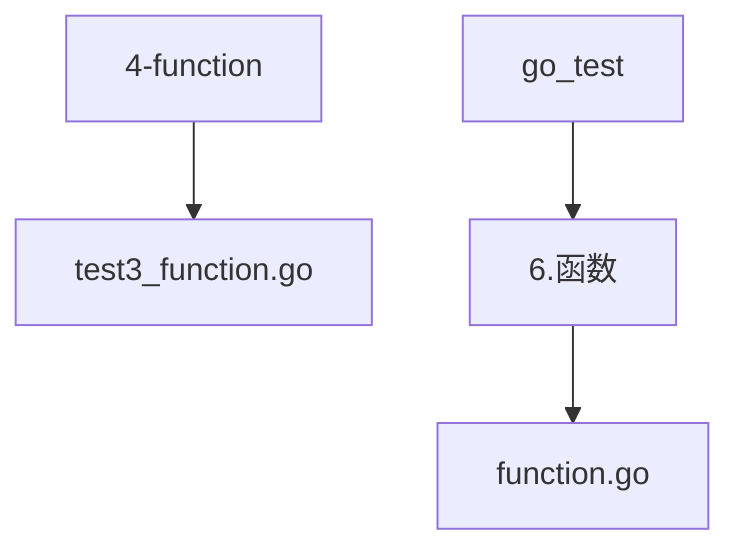
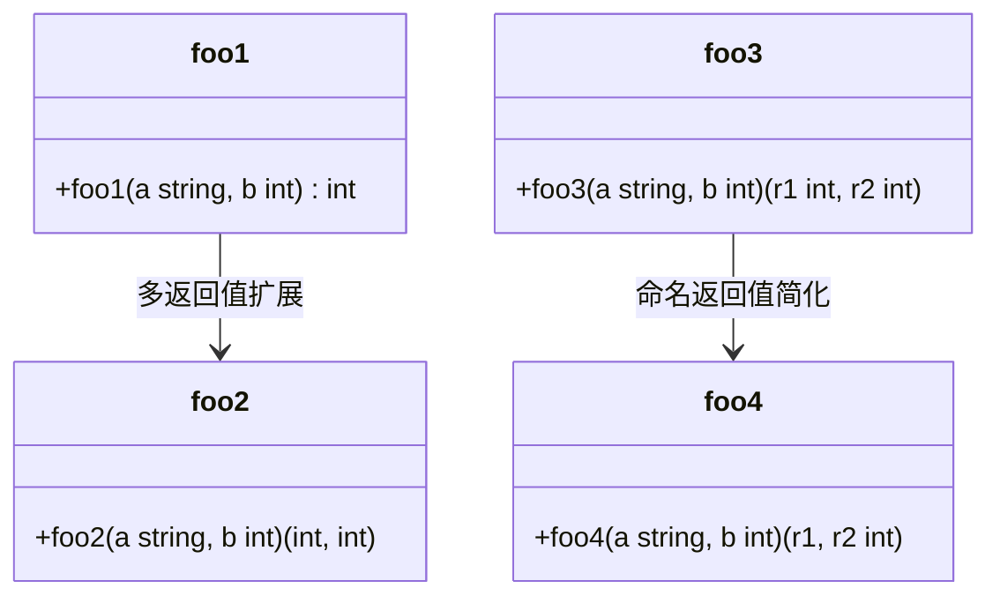
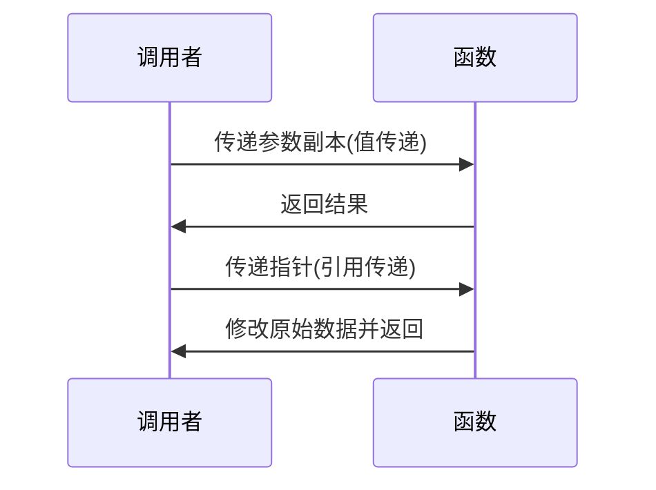
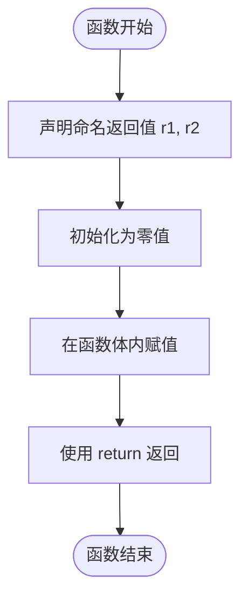

# 函数定义与使用

<cite>
**本文档中引用的文件**   
- [test3_function.go](file://4-function/test3_function.go)
- [function.go](file://go_test/6.函数/function.go)
</cite>

## 目录
1. [项目结构](#项目结构)
2. [核心函数分析](#核心函数分析)
3. [函数声明与返回值机制](#函数声明与返回值机制)
4. [参数传递方式详解](#参数传递方式详解)
5. [命名返回值的使用](#命名返回值的使用)
6. [函数作用域与递归调用](#函数作用域与递归调用)
7. [函数作为值的使用场景](#函数作为值的使用场景)
8. [常见错误分析与优化建议](#常见错误分析与优化建议)

## 项目结构

**图示来源**
- [test3_function.go](file://4-function/test3_function.go)
- [function.go](file://go_test/6.函数/function.go)

**本节来源**
- [4-function/test3_function.go](file://4-function/test3_function.go)
- [go_test/6.函数/function.go](file://go_test/6.函数/function.go)

## 核心函数分析

通过对 `test3_function.go` 文件的分析，可以深入理解 Go 语言中函数的定义、参数传递和返回值机制。该文件展示了多种函数定义方式，包括单返回值、多返回值以及命名返回值的使用。

**本节来源**
- [4-function/test3_function.go](file://4-function/test3_function.go#L1-L67)

## 函数声明与返回值机制

Go 语言中的函数声明语法清晰明了，支持单返回值和多返回值。在 `test3_function.go` 中，`foo1` 函数展示了单返回值的使用，而 `foo2`、`foo3` 和 `foo4` 函数则分别演示了匿名多返回值和命名返回值的实现方式。

**图示来源**
- [test3_function.go](file://4-function/test3_function.go#L1-L67)

**本节来源**
- [4-function/test3_function.go](file://4-function/test3_function.go#L1-L67)

## 参数传递方式详解

Go 语言中的参数传递分为值传递和引用传递。值传递会复制参数的副本，而引用传递则通过指针直接操作原始数据。虽然 `test3_function.go` 主要展示值传递，但结合其他文件可以更好地理解引用传递的应用。

**图示来源**
- [test3_function.go](file://4-function/test3_function.go#L1-L67)
- [pointer.go](file://6-pointer/pointer.go#L1-L43)

## 命名返回值的使用

命名返回值是 Go 语言的一个特色功能，它允许在函数签名中直接声明返回变量。`foo3` 和 `foo4` 函数展示了这一特性，其中 `r1` 和 `r2` 作为命名返回值，在函数体内可以直接赋值，最后通过 `return` 语句返回。

**图示来源**
- [test3_function.go](file://4-function/test3_function.go#L25-L47)

**本节来源**
- [4-function/test3_function.go](file://4-function/test3_function.go#L25-L47)

## 函数作用域与递归调用

函数作用域决定了变量的可见性和生命周期。在 `test3_function.go` 中，`r1` 和 `r2` 的作用域仅限于各自的函数体内部。虽然该文件未展示递归调用，但理解作用域对于编写递归函数至关重要。

**本节来源**
- [4-function/test3_function.go](file://4-function/test3_function.go#L25-L47)

## 函数作为值的使用场景

Go 语言支持将函数作为值进行传递和赋值，这为高阶函数的实现提供了可能。尽管 `test3_function.go` 未直接展示此特性，但在实际开发中，函数作为值的使用非常普遍，如回调函数、事件处理器等。

**本节来源**
- [function.go](file://go_test/6.函数/function.go#L1-L62)

## 常见错误分析与优化建议

在使用函数时，常见的错误包括返回局部变量的指针、忽略多返回值中的某些值等。为了避免这些问题，建议：
1. 避免返回局部变量的指针，以防内存泄漏。
2. 明确处理多返回值，避免忽略重要信息。
3. 使用命名返回值提高代码可读性。
4. 合理选择值传递或引用传递，根据实际需求决定。

**本节来源**
- [4-function/test3_function.go](file://4-function/test3_function.go#L1-L67)
- [function.go](file://go_test/6.函数/function.go#L1-L62)