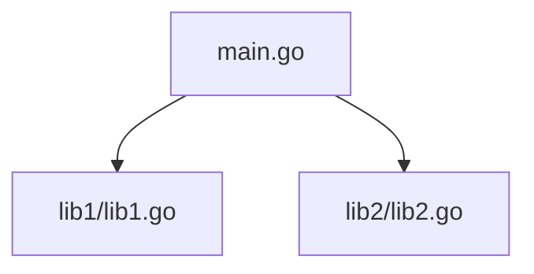
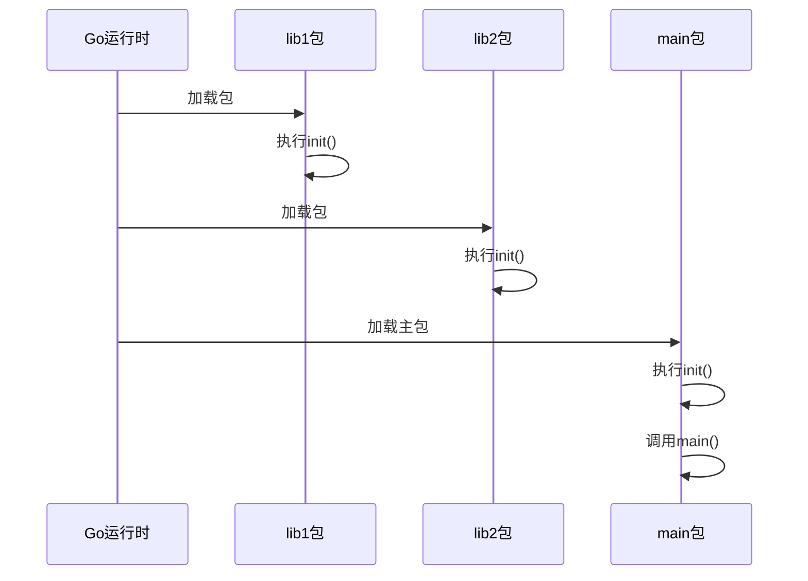
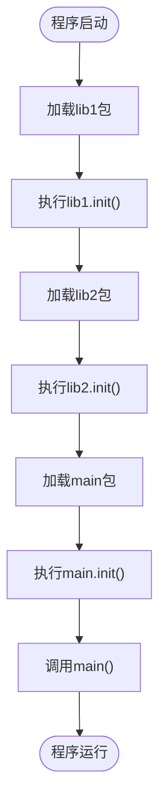

# 包初始化与init函数

<cite>
**Referenced Files in This Document**   
- [main.go](file://5-init/main.go)
- [lib1.go](file://5-init/lib1/lib1.go)
- [lib2.go](file://5-init/lib2/lib2.go)
</cite>

## 目录
1. [引言](#引言)
2. [项目结构](#项目结构)
3. [核心组件](#核心组件)
4. [包初始化机制详解](#包初始化机制详解)
5. [init函数执行顺序分析](#init函数执行顺序分析)
6. [跨包初始化调用链](#跨包初始化调用链)
7. [典型应用场景](#典型应用场景)
8. [副作用风险与调试策略](#副作用风险与调试策略)
9. [结论](#结论)

## 引言

Go语言的包初始化机制是程序启动过程中的关键环节。`init`函数作为Go语言特有的初始化函数，在包级别提供了一种自动执行初始化逻辑的机制。本文以`5-init`目录下的`main.go`、`lib1.go`和`lib2.go`为例，深入解析`init`函数的执行时机、执行顺序以及其在程序启动过程中的作用，帮助开发者正确理解和使用这一重要特性。

## 项目结构

`5-init`目录包含主程序文件`main.go`和两个库包`lib1`与`lib2`，每个包都有独立的Go源文件。这种结构清晰地展示了包间依赖关系，为分析初始化顺序提供了理想的示例环境。



**Diagram sources**
- [main.go](file://5-init/main.go)
- [lib1.go](file://5-init/lib1/lib1.go)
- [lib2.go](file://5-init/lib2/lib2.go)

**Section sources**
- [main.go](file://5-init/main.go)
- [lib1.go](file://5-init/lib1/lib1.go)
- [lib2.go](file://5-init/lib2/lib2.go)

## 核心组件

本示例包含三个核心文件：主程序入口`main.go`和两个库文件`lib1.go`、`lib2.go`。`lib1.go`和`lib2.go`各自定义了`init`函数和公开API函数，而`main.go`通过导入这两个包来触发其初始化过程。

**Section sources**
- [main.go](file://5-init/main.go)
- [lib1.go](file://5-init/lib1/lib1.go)
- [lib2.go](file://5-init/lib2/lib2.go)

## 包初始化机制详解

Go语言的包初始化机制确保在`main`函数执行前，所有导入的包都已完成初始化。每个包可以包含任意数量的`init`函数，这些函数在包被导入时自动执行，无需显式调用。`init`函数的主要用途包括全局变量初始化、配置加载、资源预分配等程序启动前的准备工作。

当一个包被导入时，Go运行时会按特定顺序执行该包内所有的`init`函数。这一机制使得开发者能够在程序启动阶段执行必要的设置操作，确保程序在进入主逻辑前处于正确的初始状态。



**Diagram sources**
- [main.go](file://5-init/main.go)
- [lib1.go](file://5-init/lib1/lib1.go)
- [lib2.go](file://5-init/lib2/lib2.go)

**Section sources**
- [main.go](file://5-init/main.go#L1-L15)
- [lib1.go](file://5-init/lib1/lib1.go#L1-L12)
- [lib2.go](file://5-init/lib2/lib2.go#L1-L12)

## init函数执行顺序分析

`init`函数的执行顺序遵循严格的规则：首先按包的依赖关系确定包的初始化顺序，然后在每个包内部按源文件的字典序执行`init`函数。在本例中，`main.go`导入了`lib1`和`lib2`包，因此这两个库包的`init`函数会在`main`函数执行前被调用。

值得注意的是，虽然`main.go`中导入`lib1`在前，但由于`lib1`和`lib2`之间没有相互依赖，它们的初始化顺序由文件系统字典序决定。这种确定性的执行顺序保证了程序行为的可预测性，是Go语言设计的重要特性之一。



**Diagram sources**
- [main.go](file://5-init/main.go#L1-L15)
- [lib1.go](file://5-init/lib1/lib1.go#L9-L11)
- [lib2.go](file://5-init/lib2/lib2.go#L9-L11)

**Section sources**
- [main.go](file://5-init/main.go#L1-L15)
- [lib1.go](file://5-init/lib1/lib1.go#L9-L11)
- [lib2.go](file://5-init/lib2/lib2.go#L9-L11)

## 跨包初始化调用链

跨包初始化调用链展示了包间依赖如何影响初始化顺序。在本示例中，`main`包依赖`lib1`和`lib2`，形成了清晰的调用链。当`main`包被加载时，Go运行时会递归地确保所有依赖包都已初始化完成。

这种机制支持复杂的依赖关系网络，确保即使在多层嵌套的包依赖结构中，初始化也能按正确的拓扑顺序进行。每个包的`init`函数都只执行一次，无论该包被多少个其他包导入，这避免了重复初始化的问题。

```mermaid
graph TB
subgraph "初始化阶段"
A[lib1.init()] --> B[lib2.init()]
B --> C[main.init()]
end
subgraph "运行阶段"
C --> D[main.main()]
end
```

**Diagram sources**
- [main.go](file://5-init/main.go)
- [lib1.go](file://5-init/lib1/lib1.go)
- [lib2.go](file://5-init/lib2/lib2.go)

**Section sources**
- [main.go](file://5-init/main.go)
- [lib1.go](file://5-init/lib1/lib1.go)
- [lib2.go](file://5-init/lib2/lib2.go)

## 典型应用场景

`init`函数在实际开发中有多种典型应用场景。最常见的包括配置文件加载、数据库连接初始化、全局变量设置、日志系统配置等。例如，在Web应用中，`init`函数可用于预加载配置信息、建立数据库连接池、注册路由等启动时必需的操作。

另一个重要应用是注册机制，如在`database/sql`包中，驱动程序通过`init`函数将自己注册到全局驱动列表中，使得主程序可以通过标准接口访问不同类型的数据库。这种设计模式充分利用了`init`函数的自动执行特性，实现了松耦合的插件架构。

**Section sources**
- [lib1.go](file://5-init/lib1/lib1.go#L9-L11)
- [lib2.go](file://5-init/lib2/lib2.go#L9-L11)

## 副作用风险与调试策略

尽管`init`函数非常有用，但其隐式执行特性也带来了潜在的副作用风险。由于`init`函数在导入时自动运行，可能产生意外的I/O操作、网络请求或全局状态修改，这些都可能影响程序的可测试性和可预测性。

为安全使用`init`函数，建议遵循以下策略：保持`init`函数尽可能简单和幂等；避免在`init`函数中执行可能失败的操作；将复杂的初始化逻辑封装在显式调用的函数中。对于调试`init`逻辑，可以使用构建标签控制特定环境下的初始化行为，或通过单元测试验证初始化后的状态。

**Section sources**
- [lib1.go](file://5-init/lib1/lib1.go#L9-L11)
- [lib2.go](file://5-init/lib2/lib2.go#L9-L11)

## 结论

Go语言的包初始化机制通过`init`函数提供了一种强大而灵活的程序启动配置方式。理解`init`函数的执行时机和顺序对于编写可靠、可维护的Go程序至关重要。通过合理利用这一特性，开发者可以确保程序在启动阶段完成必要的准备工作，同时需要注意避免潜在的副作用，保持初始化逻辑的简洁和可预测性。