# 变量声明与初始化

<cite>
**本文档中引用的文件**  
- [test1_var.go](file://2-var/test1_var.go)
- [var.go](file://go_test/2.变量/var.go)
- [test.go](file://go_test/2.变量/test.go)
</cite>

## 目录
1. [简介](#简介)
2. [变量声明的四种方式](#变量声明的四种方式)
3. [批量变量声明](#批量变量声明)
4. [变量类型推导机制](#变量类型推导机制)
5. [变量作用域规则](#变量作用域规则)
6. [零值机制](#零值机制)
7. [常见陷阱分析](#常见陷阱分析)
8. [最佳实践建议](#最佳实践建议)

## 简介
Go语言中的变量声明与初始化是程序开发的基础环节。通过合理使用不同的声明方式，可以提升代码的可读性和维护性。本文基于`2-var/test1_var.go`文件中的示例代码，系统讲解Go语言中变量的声明语法、类型推导、作用域规则以及常见使用陷阱，帮助学习者掌握变量使用的最佳实践。

**Section sources**
- [test1_var.go](file://2-var/test1_var.go#L1-L10)

## 变量声明的四种方式

Go语言提供了四种主要的变量声明方式，适用于不同场景下的变量定义需求。

### 方法一：指定类型，不初始化
使用`var`关键字声明变量并指定其数据类型，但不进行初始化。此时变量会被赋予对应类型的零值。

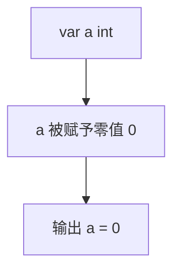

**Diagram sources**
- [test1_var.go](file://2-var/test1_var.go#L15-L18)

### 方法二：指定类型并初始化
在声明变量的同时指定其数据类型并赋予初始值。这是最明确的声明方式，适用于需要显式指定类型的情况。

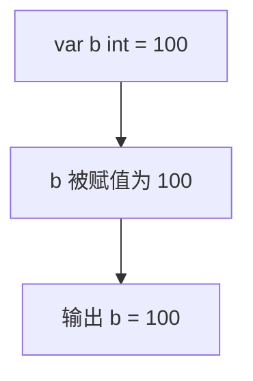

**Diagram sources**
- [test1_var.go](file://2-var/test1_var.go#L21-L24)

### 方法三：省略类型，通过值推导
使用`var`关键字声明变量，但省略数据类型，由编译器根据赋值自动推导变量类型。这种方式既保持了`var`关键字的清晰性，又具有类型推导的便利性。

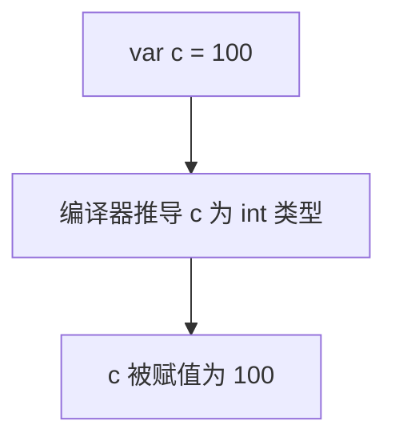

**Diagram sources**
- [test1_var.go](file://2-var/test1_var.go#L33-L36)

### 方法四：短变量声明（:=）
使用`:=`操作符进行短变量声明，省略`var`关键字。这是Go语言中最常用的变量声明方式，简洁且高效，但只能在函数体内使用。

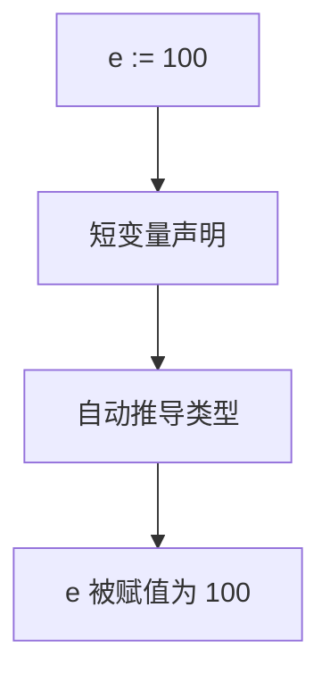

**Diagram sources**
- [test1_var.go](file://2-var/test1_var.go#L44-L47)

**Section sources**
- [test1_var.go](file://2-var/test1_var.go#L15-L50)

## 批量变量声明

Go语言支持多种批量声明变量的方式，可以同时声明多个变量，提高代码效率。

### 多变量单行声明
在同一行中声明多个变量，并分别赋予初始值。变量类型可以相同也可以不同。

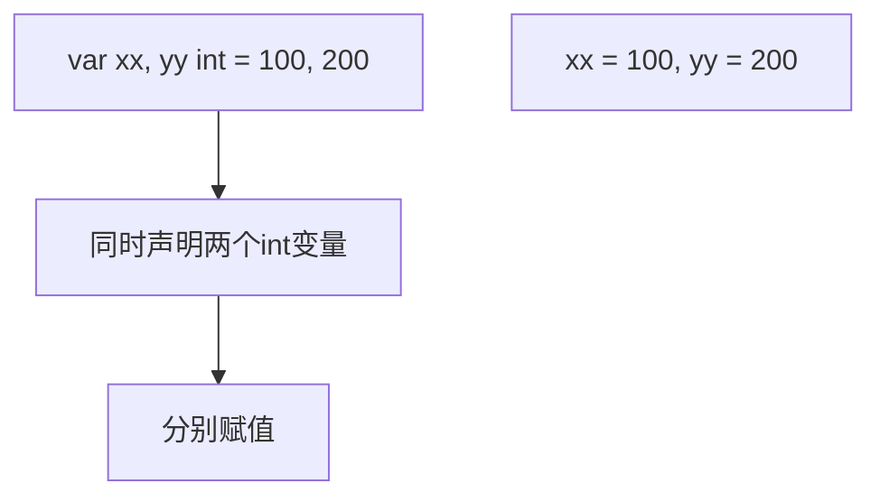

**Diagram sources**
- [test1_var.go](file://2-var/test1_var.go#L57-L58)

### 混合类型批量声明
可以声明不同类型但相关联的变量，Go语言会根据赋值自动推导各自的类型。

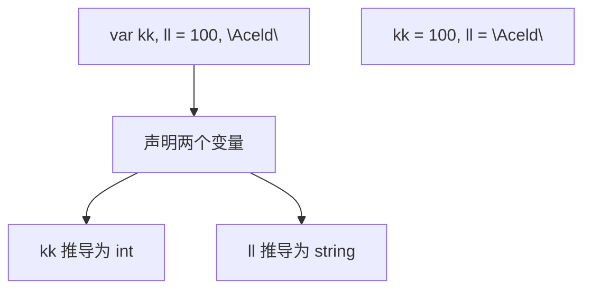

**Diagram sources**
- [test1_var.go](file://2-var/test1_var.go#L59-L60)

### 多行变量声明块
使用`var()`语法块进行多行变量声明，适合声明一组相关的全局变量或配置参数。

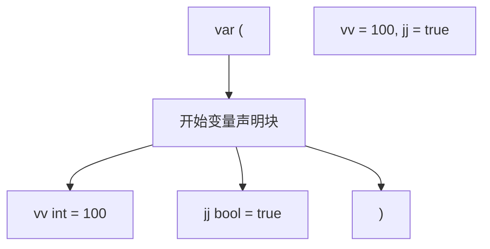

**Diagram sources**
- [test1_var.go](file://2-var/test1_var.go#L63-L66)

**Section sources**
- [test1_var.go](file://2-var/test1_var.go#L57-L67)

## 变量类型推导机制

Go语言的类型推导机制使得变量声明更加灵活和简洁。

### 自动类型匹配
当使用方法三和方法四声明变量时，编译器会根据赋值的字面量自动推导变量的数据类型。

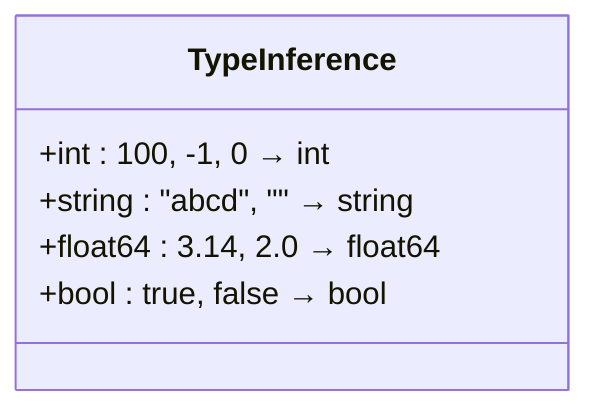

**Diagram sources**
- [test1_var.go](file://2-var/test1_var.go#L33-L47)

### 数据类型示例
不同字面量会推导出不同的数据类型：
- 整数字面量 → int
- 字符串字面量 → string
- 浮点数字面量 → float64
- 布尔字面量 → bool

**Section sources**
- [test1_var.go](file://2-var/test1_var.go#L33-L50)

## 变量作用域规则

Go语言中的变量作用域决定了变量的可见性和生命周期。

### 全局变量声明
在函数外部使用`var`关键字声明的变量为全局变量，可以在整个包内访问。

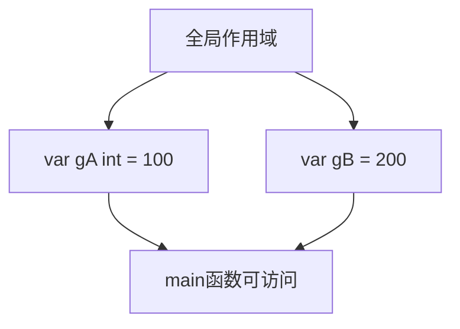

**Diagram sources**
- [test1_var.go](file://2-var/test1_var.go#L12-L13)

### 函数内变量声明
在函数内部声明的变量为局部变量，只能在该函数内访问。

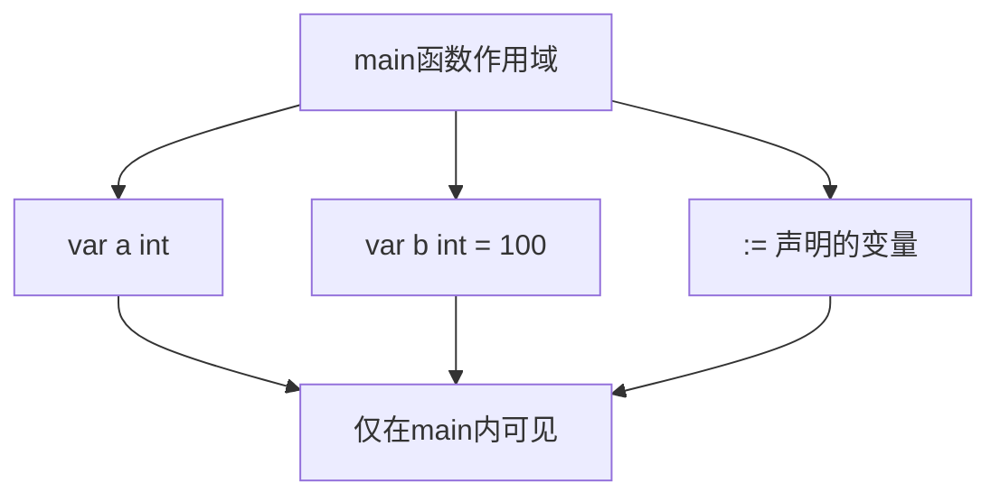

**Diagram sources**
- [test1_var.go](file://2-var/test1_var.go#L15-L47)

### 短声明的作用域限制
`:=`操作符只能在函数体内使用，不能用于声明全局变量。

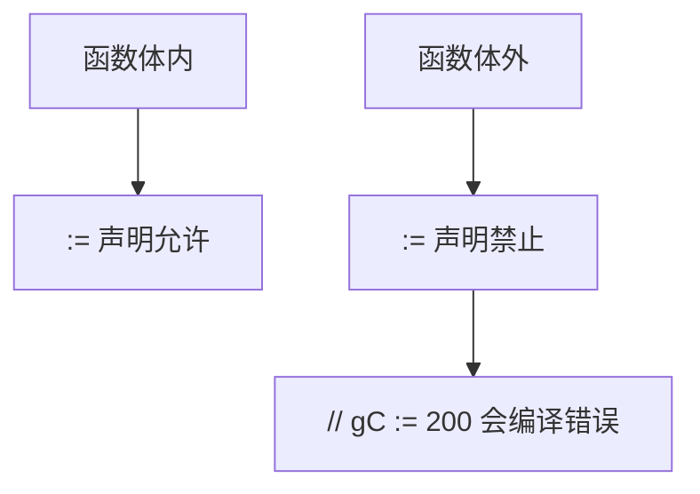

**Diagram sources**
- [test1_var.go](file://2-var/test1_var.go#L14-L15)

**Section sources**
- [test1_var.go](file://2-var/test1_var.go#L12-L15)

## 零值机制

Go语言为所有数据类型提供了默认的零值，当变量声明但未初始化时会自动赋予零值。

### 基本类型的零值
| 数据类型 | 零值 |
|---------|------|
| int | 0 |
| string | ""（空字符串）|
| bool | false |
| float64 | 0.0 |

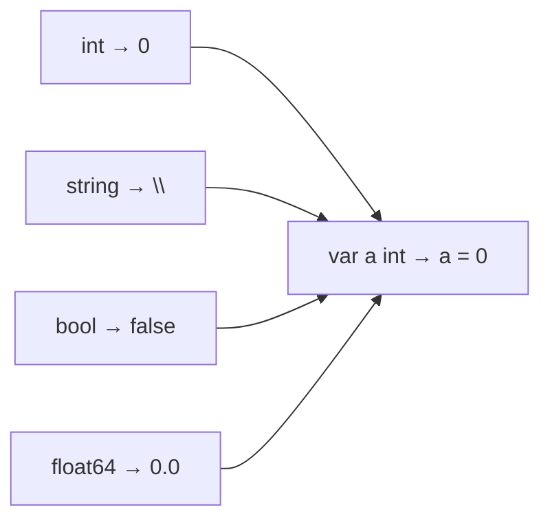

**Diagram sources**
- [test1_var.go](file://2-var/test1_var.go#L15-L18)

**Section sources**
- [test1_var.go](file://2-var/test1_var.go#L15-L18)

## 常见陷阱分析

在使用变量声明时，需要注意一些常见的陷阱和错误。

### 短声明重复定义
在同一作用域内，不能对已经使用`:=`声明的变量再次使用`:=`声明，否则会导致编译错误。

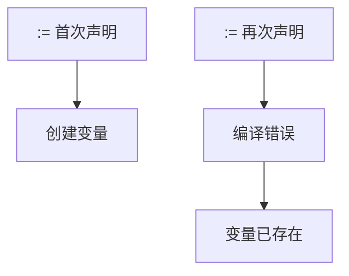

**Diagram sources**
- [test.go](file://go_test/2.变量/test.go#L25-L27)

### 混合声明规则
在短声明中，只要有一个新变量，就可以与已存在的变量一起使用`:=`。

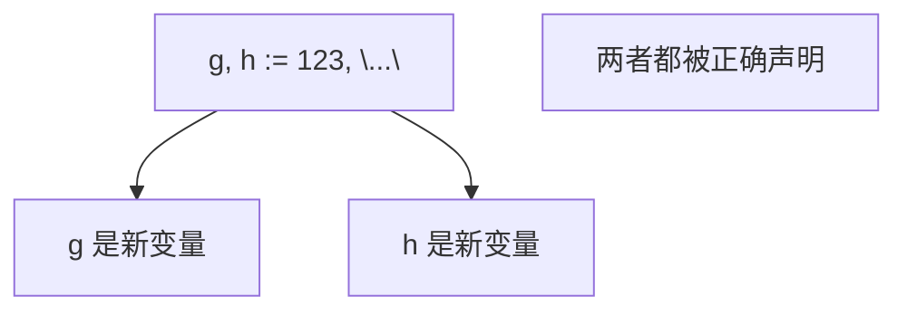

**Diagram sources**
- [test.go](file://go_test/2.变量/test.go#L21-L22)

### 空白标识符
使用`_`作为变量名时，该变量的值会被丢弃，且无法再次读取。

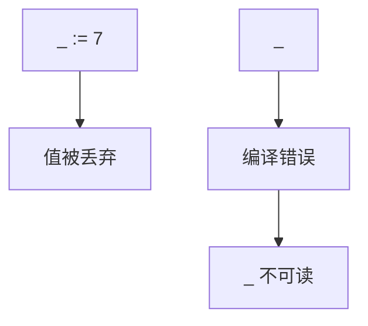

**Diagram sources**
- [test.go](file://go_test/2.变量/test.go#L29-L31)

**Section sources**
- [test.go](file://go_test/2.变量/test.go#L21-L33)

## 最佳实践建议

根据不同的使用场景，选择合适的变量声明方式。

### 声明方式选择指南
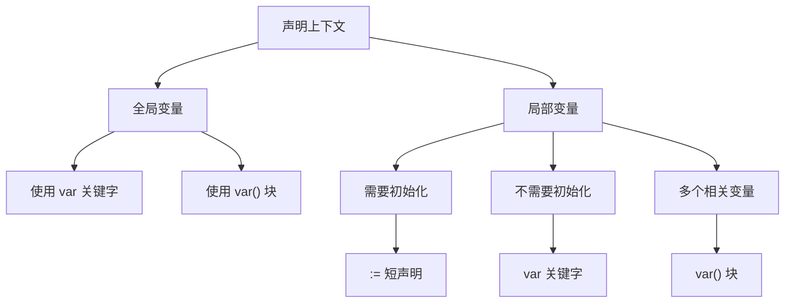

### 推荐使用场景
- **全局变量**：使用`var`关键字或`var()`块声明
- **局部变量初始化**：优先使用`:=`短声明
- **需要明确类型**：使用`var type = value`形式
- **批量相关变量**：使用`var()`多行声明块

**Section sources**
- [test1_var.go](file://2-var/test1_var.go#L12-L67)
- [var.go](file://go_test/2.变量/var.go#L5-L64)