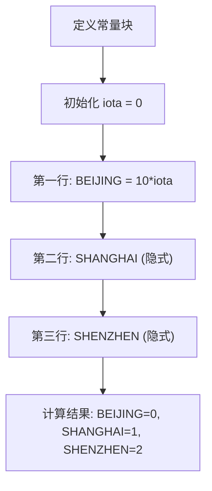
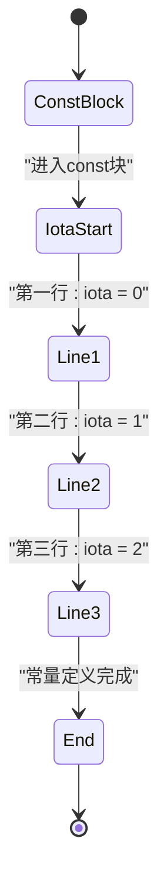
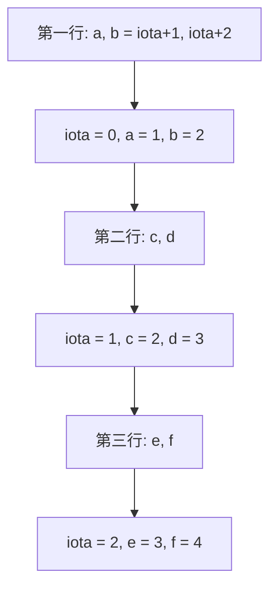
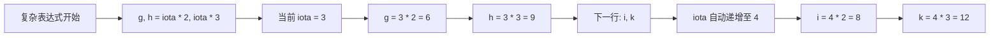
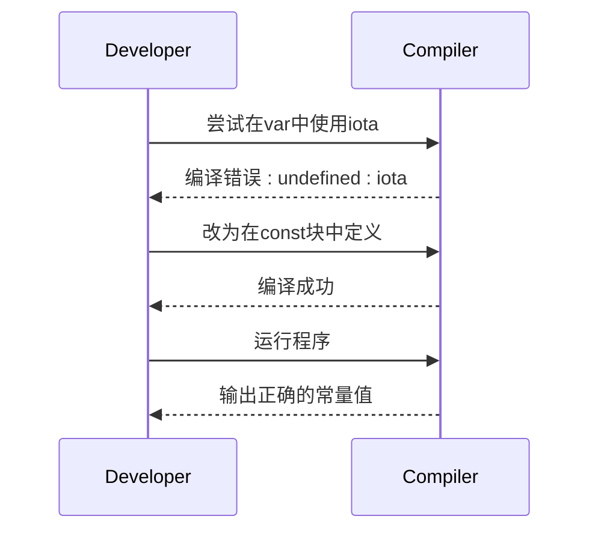

# 常量与iota枚举

<cite>
**本文档引用文件**  
- [test2_const.go](file://3-const_iota/test2_const.go)
- [const.go](file://go_test/3.常量与iota/const.go)
</cite>

## 目录
1. [常量基础概念](#常量基础概念)  
2. [字面常量与枚举常量定义](#字面常量与枚举常量定义)  
3. [iota自增机制详解](#iota自增机制详解)  
4. [iota在单行与多行中的行为](#iota在单行与多行中的行为)  
5. [iota在复杂表达式中的应用](#iota在复杂表达式中的应用)  
6. [常量类型归属与无类型常量](#常量类型归属与无类型常量)  
7. [常见误用案例与修复方法](#常见误用案例与修复方法)  
8. [最佳实践与总结](#最佳实践与总结)

## 常量基础概念

在Go语言中，常量是不可变的值，使用`const`关键字定义。常量在编译期确定其值，具有只读属性，不能在运行时修改。常量可以用于定义配置值、枚举值等需要保持不变的场景。

常量的定义可以是显式类型或隐式类型。显式类型定义需要指定数据类型，而隐式类型则由编译器根据初始值推断类型。常量的生命周期贯穿整个程序运行过程，且不占用运行时内存空间。

**Section sources**  
- [test2_const.go](file://3-const_iota/test2_const.go#L25-L27)

## 字面常量与枚举常量定义

字面常量是指直接在代码中定义的不可变值，如数字、字符串等。枚举常量则是一组相关的常量值，通常用于表示有限的选项集合。在Go中，可以通过`const`块来定义枚举常量，使代码更具可读性和维护性。

例如，在`test2_const.go`文件中，通过`const`块定义了城市枚举常量，使用`iota`关键字实现自动递增赋值。这种方式避免了手动为每个常量指定值，减少了出错的可能性。



**Diagram sources**  
- [test2_const.go](file://3-const_iota/test2_const.go#L6-L11)

**Section sources**  
- [test2_const.go](file://3-const_iota/test2_const.go#L6-L11)

## iota自增机制详解

`iota`是Go语言中的一个特殊标识符，仅在`const`声明块中有效。它从0开始，每遇到新的一行常量声明就自动递增1。`iota`的主要用途是简化枚举类型的定义，特别是在需要连续数值的情况下。

`iota`的值在每个`const`块中独立重置，不同`const`块中的`iota`互不影响。这种机制使得可以在多个独立的枚举类型中使用`iota`，而不会产生值冲突。



**Diagram sources**  
- [test2_const.go](file://3-const_iota/test2_const.go#L6-L11)

**Section sources**  
- [test2_const.go](file://3-const_iota/test2_const.go#L6-L11)

## iota在单行与多行中的行为

`iota`在单行和多行声明中表现出不同的行为模式。在单行声明中，如果多个常量共享同一个`iota`表达式，它们将获得相同的`iota`值。而在多行声明中，每行的`iota`值都会递增。

在`test2_const.go`文件中，展示了`iota`在多行声明中的典型用法：第一行`iota`为0，第二行为1，第三行为2。这种递增模式使得可以轻松创建连续的枚举值。



**Diagram sources**  
- [test2_const.go](file://3-const_iota/test2_const.go#L13-L18)

**Section sources**  
- [test2_const.go](file://3-const_iota/test2_const.go#L13-L18)

## iota在复杂表达式中的应用

`iota`不仅可以用于简单的递增赋值，还可以参与复杂的表达式计算。通过将`iota`与算术运算符结合，可以创建非线性的值序列，满足特定的业务需求。

在`test2_const.go`文件中，展示了`iota`在复杂表达式中的应用：`g, h = iota * 2, iota * 3`。当`iota`为3时，`g`的值为6，`h`的值为9。这种模式可以用于创建倍数关系的常量序列。



**Diagram sources**  
- [test2_const.go](file://3-const_iota/test2_const.go#L20-L23)

**Section sources**  
- [test2_const.go](file://3-const_iota/test2_const.go#L20-L23)

## 常量类型归属与无类型常量

Go语言中的常量分为有类型常量和无类型常量。有类型常量在定义时明确指定了数据类型，而无类型常量则由编译器推断类型。无类型常量具有更好的灵活性，可以在需要时自动转换为适当的类型。

在`const.go`文件中，`aa`、`bb`、`cc`三个常量展示了不同类型常量的定义方式。其中`aa`是字符串常量，`bb`是通过`len()`函数计算得到的整数常量，`cc`是通过`unsafe.Sizeof()`计算得到的大小常量。

```mermaid
classDiagram
class TypedConstant {
+int length
+string width
}
class UntypedConstant {
+string aa
+int bb
+uintptr cc
}
note right of UntypedConstant
无类型常量可以在赋值时
自动转换为所需类型
end note
TypedConstant --> UntypedConstant : "类型推断"
```

**Diagram sources**  
- [const.go](file://go_test/3.常量与iota/const.go#L30-L35)

**Section sources**  
- [const.go](file://go_test/3.常量与iota/const.go#L30-L35)

## 常见误用案例与修复方法

在使用`iota`时，常见的错误包括：在`const`块外部使用`iota`、误解`iota`的重置逻辑、在表达式中错误地使用`iota`等。这些错误会导致编译失败或产生意外的值。

一个典型的误用案例是在`var`声明中尝试使用`iota`，如注释中的`//var a int = iota`。这是无效的语法，因为`iota`只能在`const`块中使用。正确的做法是将相关常量放入`const`块中定义。



**Diagram sources**  
- [test2_const.go](file://3-const_iota/test2_const.go#L41-L43)

**Section sources**  
- [test2_const.go](file://3-const_iota/test2_const.go#L41-L43)

## 最佳实践与总结

使用`iota`定义枚举常量是Go语言中的最佳实践之一。它不仅提高了代码的可读性，还减少了手动赋值可能带来的错误。在实际开发中，建议将相关的常量组织在同一个`const`块中，并充分利用`iota`的自增特性。

对于复杂的枚举需求，可以通过组合`iota`与算术表达式来创建特定的值序列。同时，应注意避免在`const`块之间产生不必要的依赖，保持每个枚举类型的独立性。

通过合理使用`const`和`iota`，可以创建清晰、可维护的常量定义，提高代码质量和开发效率。

**Section sources**  
- [test2_const.go](file://3-const_iota/test2_const.go#L1-L43)
- [const.go](file://go_test/3.常量与iota/const.go#L1-L69)