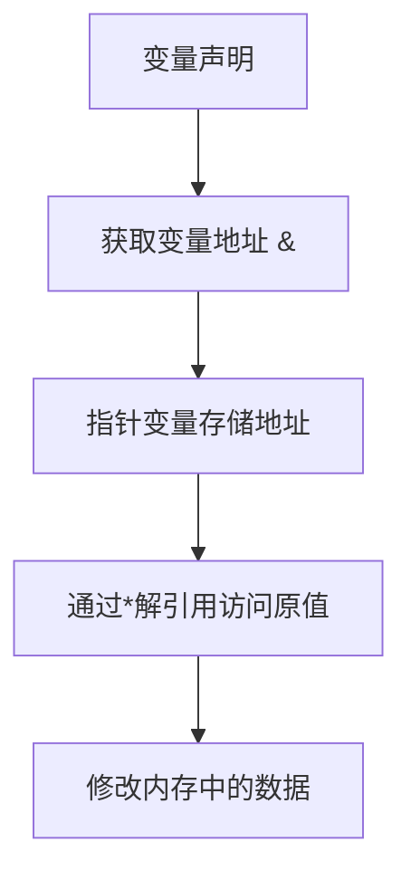
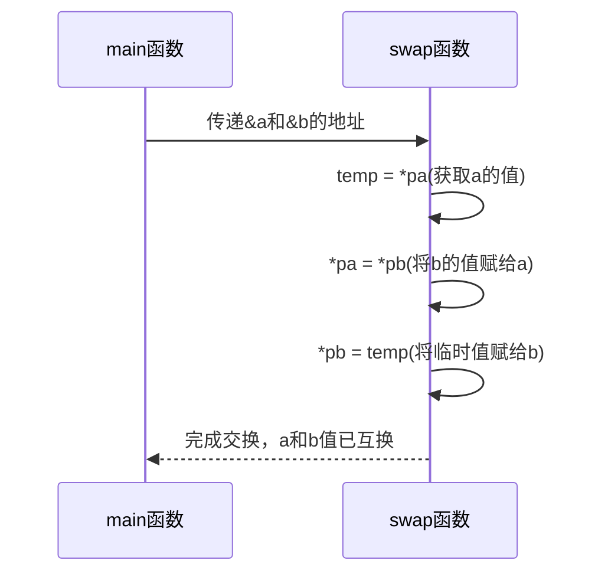

# 指针概念与内存操作

<cite>
**本文档引用文件**   
- [pointer.go](file://6-pointer/pointer.go)
</cite>

## 目录
1. [指针基础概念](#指针基础概念)
2. [指针的声明与操作](#指针的声明与操作)
3. [函数参数中的指针应用](#函数参数中的指针应用)
4. [空指针与安全访问](#空指针与安全访问)
5. [多级指针](#多级指针)
6. [常见错误与预防](#常见错误与预防)

## 指针基础概念

在Go语言中，指针是一种存储变量内存地址的特殊变量类型。通过指针可以实现对内存的直接操作，是理解Go语言内存管理机制的关键。指针使得程序能够高效地传递大型数据结构，并在函数间共享和修改数据。

**Section sources**
- [pointer.go](file://6-pointer/pointer.go#L1-L43)

## 指针的声明与操作

指针的声明使用`*`符号，表示该变量是指向某种类型的指针。获取变量地址使用`&`运算符，而访问指针所指向的值则使用`*`解引用操作符。这种机制允许程序直接操作内存中的数据，而不是创建数据的副本。

**Diagram sources**
- [pointer.go](file://6-pointer/pointer.go#L30-L33)

**Section sources**
- [pointer.go](file://6-pointer/pointer.go#L30-L33)

## 函数参数中的指针应用

当函数需要修改调用者提供的变量时，应使用指针作为参数。这避免了值传递带来的数据复制开销，并允许函数直接修改原始数据。在`pointer.go`文件中，`swap`函数通过接收两个整型指针来交换主函数中变量的值，展示了指针在函数间共享数据的强大能力。

**Diagram sources**
- [pointer.go](file://6-pointer/pointer.go#L13-L18)

**Section sources**
- [pointer.go](file://6-pointer/pointer.go#L13-L18)

## 空指针与安全访问

空指针（nil）表示指针不指向任何有效的内存地址。在Go中，未初始化的指针默认值为nil。访问nil指针会导致运行时panic，因此在解引用指针前必须进行nil检查。这种机制有助于防止非法内存访问，提高程序的健壮性。

**Section sources**
- [pointer.go](file://6-pointer/pointer.go#L30-L33)

## 多级指针

Go语言支持多级指针，即指向指针的指针。在`pointer.go`文件中，`pp`是一个指向`*int`类型的二级指针，它存储了一级指针`p`的地址。多级指针在处理复杂数据结构和实现某些算法时非常有用，但也会增加代码的复杂性和出错风险。

**Diagram sources**
- [pointer.go](file://6-pointer/pointer.go#L35-L39)

**Section sources**
- [pointer.go](file://6-pointer/pointer.go#L35-L39)

## 常见错误与预防

使用指针时常见的错误包括野指针（指向已释放内存的指针）和非法解引用（对nil指针进行*操作）。为预防这些错误，应始终在使用指针前检查其是否为nil，并确保指针始终指向有效的内存区域。良好的编程习惯是声明指针后立即初始化，避免使用未初始化的指针。

**Section sources**
- [pointer.go](file://6-pointer/pointer.go#L1-L43)