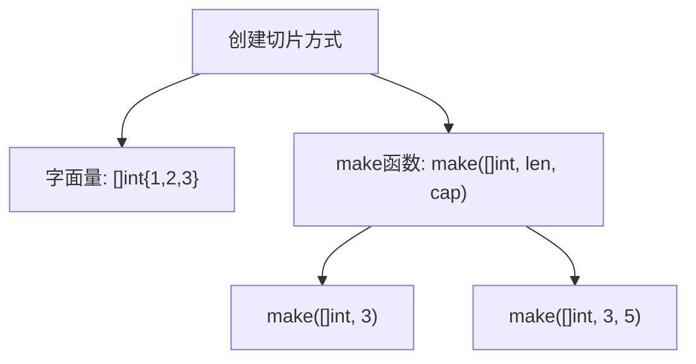
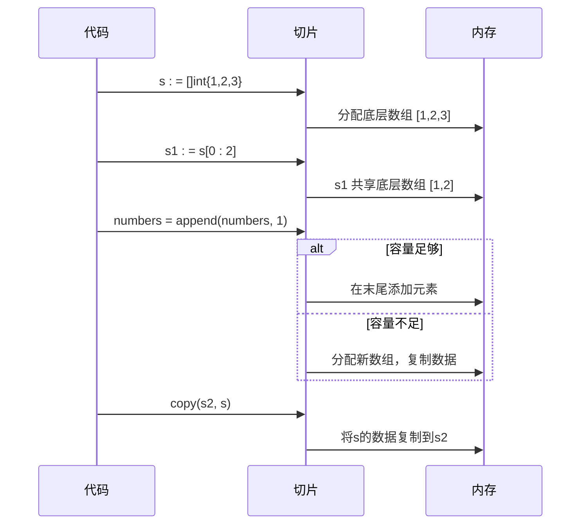
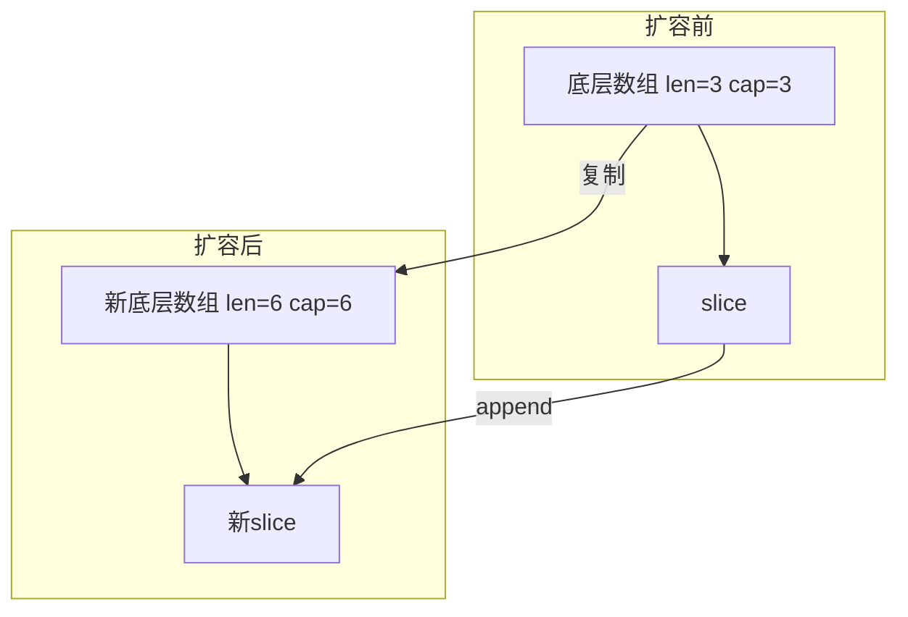

# 切片

<cite>
**Referenced Files in This Document**   
- [test2_slice.go](file://8-slice/test2_slice.go)
- [test3_slice.go](file://8-slice/test3_slice.go)
- [test4_slice.go](file://8-slice/test4_slice.go)
- [test5_slice.go](file://8-slice/test5_slice.go)
</cite>

## 目录
1. [引言](#引言)
2. [切片基础概念](#切片基础概念)
3. [切片的创建与初始化](#切片的创建与初始化)
4. [切片的核心操作](#切片的核心操作)
5. [切片的底层机制](#切片的底层机制)
6. [切片的引用特性与内存管理](#切片的引用特性与内存管理)
7. [性能分析与最佳实践](#性能分析与最佳实践)
8. [总结](#总结)

## 引言

切片（Slice）是Go语言中一种强大且常用的数据结构，它为数组提供了动态的、灵活的抽象层。相较于固定长度的数组，切片能够根据需要动态增长或缩小，这使得它在处理不确定大小的数据集时极为高效。本文档将基于`test2_slice.go`至`test5_slice.go`的示例代码，深入探讨切片的创建、操作、底层机制以及相关的性能考量，旨在为开发者提供一份全面的切片使用指南。

## 切片基础概念

切片是Go语言中对数组的抽象，它本身并不存储数据，而是指向一个底层数组的引用。一个切片由三个要素构成：指针（指向底层数组的起始位置）、长度（len）和容量（cap）。长度表示切片当前包含的元素个数，而容量则表示从切片的起始位置到底层数组末尾的元素总数。理解这三个要素的关系是掌握切片行为的关键。

**Section sources**
- [test3_slice.go](file://8-slice/test3_slice.go#L5-L26)

## 切片的创建与初始化

切片可以通过多种方式创建。最直接的方式是使用字面量语法，如`s := []int{1, 2, 3}`，这会创建一个长度和容量都为3的切片。另一种更灵活的方式是使用内置的`make`函数。`make([]int, 3)`会创建一个长度为3、容量也为3的切片，所有元素被初始化为零值。`make([]int, 3, 5)`则可以指定不同的长度和容量，创建一个长度为3、容量为5的切片，这在预知数据规模时非常有用，可以避免频繁的内存分配。

**Diagram sources**
- [test3_slice.go](file://8-slice/test3_slice.go#L10-L16)
- [test4_slice.go](file://8-slice/test4_slice.go#L5-L25)
- [test5_slice.go](file://8-slice/test5_slice.go#L18)

**Section sources**
- [test3_slice.go](file://8-slice/test3_slice.go#L10-L16)
- [test4_slice.go](file://8-slice/test4_slice.go#L5-L25)
- [test5_slice.go](file://8-slice/test5_slice.go#L18)

## 切片的核心操作

切片的核心操作包括截取、追加和复制。截取操作`s[low:high]`可以创建一个新切片，该切片共享原切片的底层数组。`append`函数用于向切片末尾添加元素，当切片的容量不足以容纳新元素时，Go会自动分配一个更大的底层数组，并将原数据复制过去，这个过程称为扩容。`copy`函数则用于在两个切片之间复制数据，它会将源切片的数据复制到目标切片中，复制的元素数量是两个切片长度的较小值。

**Diagram sources**
- [test4_slice.go](file://8-slice/test4_slice.go#L10-L20)
- [test5_slice.go](file://8-slice/test5_slice.go#L21)

**Section sources**
- [test4_slice.go](file://8-slice/test4_slice.go#L10-L20)
- [test5_slice.go](file://8-slice/test5_slice.go#L21)

## 切片的底层机制

切片的底层机制是其高效性的核心。当使用`append`函数向一个已满容量的切片添加元素时，Go运行时会触发扩容机制。通常，新的容量会是原容量的两倍（当原容量小于1024时），以摊销扩容的成本。这种策略确保了在大量追加操作下，平均时间复杂度接近O(1)。然而，扩容操作涉及内存分配和数据复制，是一次相对昂贵的操作，因此在可能的情况下，预先使用`make`函数指定合适的容量是最佳实践。

**Diagram sources**
- [test4_slice.go](file://8-slice/test4_slice.go#L20)

**Section sources**
- [test4_slice.go](file://8-slice/test4_slice.go#L20)

## 切片的引用特性与内存管理

切片的引用特性是其强大之处，但也可能带来内存泄漏的风险。由于切片共享底层数组，对一个切片的修改会反映到所有共享该数组的切片上。更重要的是，只要有一个切片引用着底层数组的某一部分，整个底层数组就不会被垃圾回收。例如，从一个大数组中截取一个小切片，如果这个小切片长期存在，那么整个大数组都无法被释放，从而造成内存泄漏。为了避免这种情况，可以使用`copy`函数创建一个全新的、独立的切片副本。

**Section sources**
- [test5_slice.go](file://8-slice/test5_slice.go#L18-L21)

## 性能分析与最佳实践

综合分析各示例代码，可以得出以下性能最佳实践：
1.  **预分配容量**：在已知或可预估数据规模时，使用`make([]T, 0, expectedCap)`预先分配足够的容量，避免`append`操作的频繁扩容。
2.  **避免不必要的复制**：在需要共享数据且不修改的情况下，直接传递切片引用是高效的。但在需要独立副本或避免内存泄漏时，应使用`copy`函数。
3.  **理解引用语义**：牢记切片是引用类型，对切片的修改会影响所有共享底层数组的切片，这在函数间传递切片时尤为重要。
4.  **谨慎处理子切片**：从大切片中提取小子切片时，若小子切片生命周期长，应考虑复制数据以释放原底层数组的内存。

**Section sources**
- [test2_slice.go](file://8-slice/test2_slice.go#L5-L26)
- [test3_slice.go](file://8-slice/test3_slice.go#L5-L26)
- [test4_slice.go](file://8-slice/test4_slice.go#L5-L29)
- [test5_slice.go](file://8-slice/test5_slice.go#L5-L24)

## 总结

切片是Go语言编程的基石之一。通过深入理解其作为引用类型的特性、底层数组、长度与容量的关系，以及`make`、`append`、`copy`等核心操作的原理，开发者可以更高效、更安全地使用切片。特别需要注意的是，切片的引用共享机制在带来便利的同时，也要求开发者对内存管理有清晰的认识，以避免潜在的内存泄漏问题。遵循预分配容量、合理使用复制等最佳实践，可以显著提升程序的性能和稳定性。