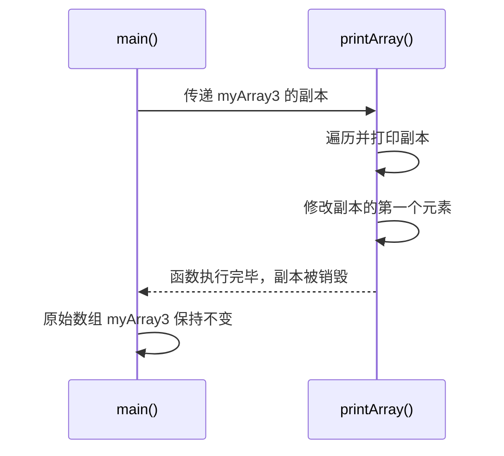

# 数组

<cite>
**Referenced Files in This Document**   
- [test1_array.go](file://8-slice/test1_array.go)
- [test2_slice.go](file://8-slice/test2_slice.go)
</cite>

## 目录
1. [简介](#简介)
2. [数组的声明与初始化](#数组的声明与初始化)
3. [数组的遍历方式](#数组的遍历方式)
4. [数组的内存布局与类型特性](#数组的内存布局与类型特性)
5. [数组的值传递机制](#数组的值传递机制)
6. [数组与切片的对比](#数组与切片的对比)
7. [常见错误与调试建议](#常见错误与调试建议)
8. [总结](#总结)

## 简介

数组是Go语言中最基础的聚合数据类型，表示一组具有相同类型且长度固定的元素序列。作为一种值类型，数组在内存中连续存储，其长度是其类型的一部分，这决定了数组在声明后其大小不可改变。本文将基于`test1_array.go`中的代码示例，系统讲解Go数组的核心概念、使用方法及其在函数调用中的行为特性。

## 数组的声明与初始化

在Go语言中，数组的声明语法为`[长度]类型`，其中长度必须是编译期常量。这体现了数组“固定长度”的核心特性。

数组可以通过多种方式进行初始化：
- **使用`var`关键字声明**：如`var myArray1 [10]int`，这会创建一个长度为10的整型数组，所有元素被初始化为零值（0）。
- **使用短变量声明并指定初始值**：如`myArray2 := [10]int{1,2,3,4}`，这会创建一个长度为10的数组，前四个元素被初始化，其余为0。
- **使用短变量声明并让编译器推断长度**：如`myArray3 := [4]int{11,22,33,44}`，通过初始化列表的元素个数，编译器可以推断出数组的长度。

数组的长度是其类型签名的一部分，这意味着`[4]int`和`[10]int`是两种完全不同的类型，它们之间不能直接赋值或比较。

**Section sources**
- [test1_array.go](file://8-slice/test1_array.go#L17-L20)

## 数组的遍历方式

Go语言提供了两种主要的遍历数组的方式：传统的`for`循环和更简洁的`for-range`循环。

### 传统for循环
通过索引访问数组元素，需要手动管理循环变量。例如，使用`len()`函数获取数组长度，然后从0遍历到`len-1`。
```go
for i := 0; i < len(myArray1); i++ {
    fmt.Println(myArray1[i])    
}
```

### for-range循环
`for-range`是Go语言中推荐的遍历方式，它能自动迭代数组的索引和值。语法为`for index, value := range array`，其中`index`是元素的索引，`value`是元素的副本。如果不需要索引，可以用`_`（空白标识符）忽略它。

**Section sources**
- [test1_array.go](file://8-slice/test1_array.go#L25-L27)
- [test1_array.go](file://8-slice/test1_array.go#L31-L32)

## 数组的内存布局与类型特性

数组在内存中是连续分配的，所有元素按顺序存储。这种布局保证了数组访问的高效性，因为可以通过基地址和偏移量快速定位任意元素。

一个关键的特性是，数组的长度是其类型的一部分。在`test1_array.go`中，通过`fmt.Printf("myArray1 types = %T\n", myArray1)`可以清晰地看到，每个数组变量的类型都包含了其长度，例如`[10]int`和`[4]int`。这使得不同长度的数组属于不同的类型，从而在类型系统上保证了安全性。

**Section sources**
- [test1_array.go](file://8-slice/test1_array.go#L34-L36)

## 数组的值传递机制

Go语言中，数组是**值类型**。这意味着当数组作为参数传递给函数时，会发生**值拷贝**，即传递的是数组的副本，而不是数组本身。

在`test1_array.go`的`printArray`函数中，参数`myArray [4]int`接收的是`myArray3`的一个完整拷贝。因此，在函数内部对`myArray[0] = 111`的修改，只会影响副本，而不会影响原始数组`myArray3`。程序的输出结果清晰地证明了这一点：在`printArray`函数内部打印的数组包含了修改后的值，但在`main`函数中再次遍历`myArray3`时，其第一个元素仍然是初始化的`11`，而非`111`。

这种值传递机制虽然保证了原始数据的安全性，但也带来了性能开销，尤其是对于大型数组，复制整个数组的成本很高。



**Diagram sources**
- [test1_array.go](file://8-slice/test1_array.go#L7-L13)
- [test1_array.go](file://8-slice/test1_array.go#L40-L41)

## 数组与切片的对比

| 特性 | 数组 (Array) | 切片 (Slice) |
| :--- | :--- | :--- |
| **类型** | 值类型 | 引用类型 |
| **长度** | 固定，声明时确定 | 动态，可变 |
| **传递方式** | 值拷贝，开销大 | 传递指针，开销小 |
| **声明** | `[n]T` | `[]T` |
| **初始化** | `[3]int{1,2,3}` | `[]int{1,2,3}` |
| **适用场景** | 长度固定、追求极致性能的小数据集 | 大多数需要动态数组的场景 |

通过对比`test1_array.go`和`test2_slice.go`可以发现，切片在函数参数中使用`[]int`，其行为是引用传递。在`test2_slice.go`的`printArray`函数中修改切片元素后，原始切片的值也会被改变，这与数组的值传递形成鲜明对比。

**Section sources**
- [test1_array.go](file://8-slice/test1_array.go)
- [test2_slice.go](file://8-slice/test2_slice.go)

## 常见错误与调试建议

### 越界访问
最常见的错误是数组索引越界。例如，对于一个长度为4的数组，有效的索引是0到3。访问`array[4]`或`array[-1]`都会导致运行时恐慌（panic）。

**调试建议**：
1.  **使用`len()`函数**：在访问数组前，始终使用`len()`函数检查索引的有效性。
2.  **利用`for-range`循环**：`for-range`循环会自动处理边界，避免越界。
3.  **启用编译器检查**：现代Go编译器和IDE通常能静态检测出一些明显的越界错误。

### 混淆数组与切片
初学者容易混淆`[3]int`和`[]int`。记住，方括号内的数字是数组长度，是其类型的一部分；而切片的方括号内没有数字。

## 总结

Go语言中的数组是一种简单、高效但使用受限的数据结构。其固定长度和值传递的特性决定了它适用于长度已知且较小的场景。理解数组的值拷贝机制对于编写正确的程序至关重要，因为它直接影响函数调用的行为。在大多数需要动态数组的场景下，应优先选择更灵活的切片（Slice）。掌握数组的声明、初始化、遍历以及其与切片的区别，是深入学习Go语言数据结构的基础。