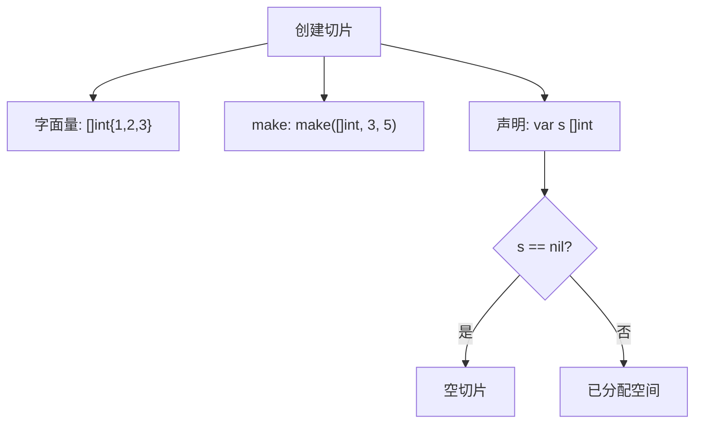
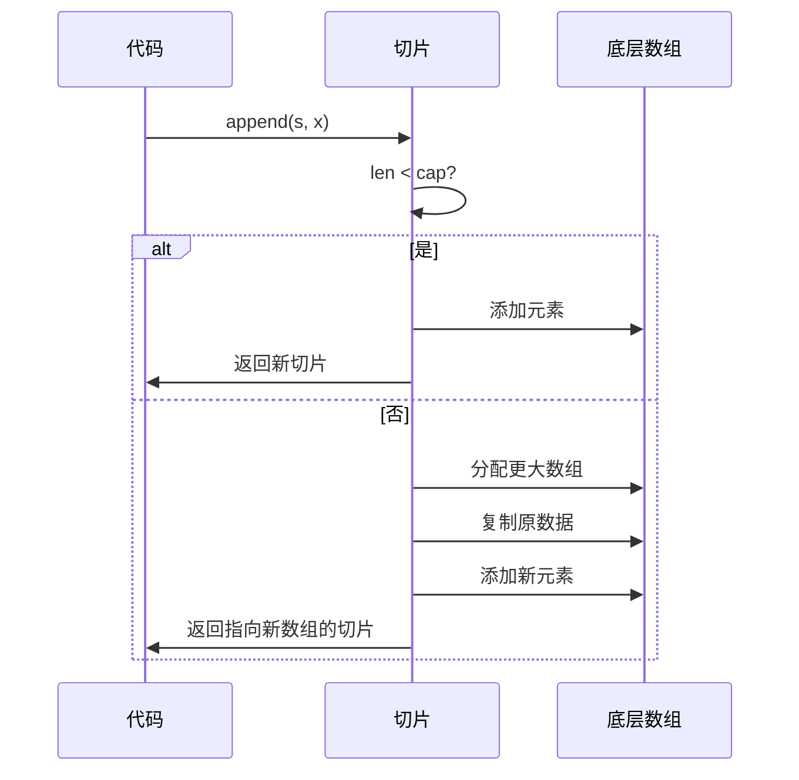

# 数组与切片

<cite>
**本文档引用文件**  
- [test1_array.go](file://8-slice/test1_array.go)
- [test2_slice.go](file://8-slice/test2_slice.go)
- [test3_slice.go](file://8-slice/test3_slice.go)
- [test4_slice.go](file://8-slice/test4_slice.go)
- [test5_slice.go](file://8-slice/test5_slice.go)
</cite>

## 目录
1. [引言](#引言)
2. [数组的声明与遍历](#数组的声明与遍历)
3. [切片的基本概念](#切片的基本概念)
4. [切片的创建与初始化](#切片的创建与初始化)
5. [切片的长度与容量](#切片的长度与容量)
6. [切片的追加与扩容机制](#切片的追加与扩容机制)
7. [切片的截取与内存共享](#切片的截取与内存共享)
8. [切片的拷贝操作](#切片的拷贝操作)
9. [数组与切片的传参特性](#数组与切片的传参特性)
10. [常见陷阱与最佳实践](#常见陷阱与最佳实践)

## 引言
Go语言中的数组和切片是处理集合数据的核心数据结构。数组是固定长度的序列，而切片则是基于数组的动态封装，提供了更灵活的数据操作能力。本文基于`8-slice`目录下的多个测试文件，系统讲解数组与切片的创建、操作方式、底层机制及性能特点，帮助开发者深入理解其工作原理并避免常见错误。

## 数组的声明与遍历
Go语言中的数组是固定长度的同类型元素序列。通过`[n]T`语法声明，其中`n`为长度，`T`为元素类型。数组在函数间传递时采用值拷贝方式，不会影响原始数据。

```go
var myArray1 [10]int
myArray2 := [10]int{1, 2, 3, 4}
```

数组的遍历可通过索引循环或`range`关键字实现，后者返回索引和值的组合。

**Section sources**
- [test1_array.go](file://8-slice/test1_array.go#L1-L41)

## 切片的基本概念
切片（slice）是Go语言中对数组的抽象和扩展，表现为动态数组。它不存储数据，而是指向底层数组的窗口，包含三个属性：指针（指向底层数组）、长度（len）和容量（cap）。切片通过`[]T`语法定义，是引用类型。

**Section sources**
- [test2_slice.go](file://8-slice/test2_slice.go#L1-L27)

## 切片的创建与初始化
切片可通过多种方式创建：
- 字面量初始化：`s := []int{1, 2, 3}`
- `make`函数：`make([]int, len, cap)`，指定长度和容量
- 声明未初始化的切片：`var s []int`，此时切片为`nil`

未初始化的切片长度为0，且可通过`nil`判断其状态。



**Diagram sources**
- [test3_slice.go](file://8-slice/test3_slice.go#L1-L27)

**Section sources**
- [test3_slice.go](file://8-slice/test3_slice.go#L1-L27)

## 切片的长度与容量
切片的`len()`返回当前元素个数，`cap()`返回从起始位置到底层数组末尾的总空间。容量决定了切片在不重新分配内存的情况下可扩展的最大长度。

例如，`make([]int, 3, 5)`创建的切片长度为3，容量为5，可继续追加2个元素而无需扩容。

**Section sources**
- [test4_slice.go](file://8-slice/test4_slice.go#L5-L30)

## 切片的追加与扩容机制
`append`函数用于向切片末尾添加元素。当切片长度达到容量上限时，系统会自动分配更大的底层数组（通常为原容量的2倍，若原容量≥1024则增长1.25倍），并将原数据复制过去。

```go
numbers := make([]int, 3, 5)
numbers = append(numbers, 1, 2) // len=5, cap=5
numbers = append(numbers, 3)     // 触发扩容，cap变为10
```

扩容涉及内存分配与数据复制，频繁扩容会影响性能，建议预估容量并一次性分配。



**Diagram sources**
- [test4_slice.go](file://8-slice/test4_slice.go#L1-L30)

**Section sources**
- [test4_slice.go](file://8-slice/test4_slice.go#L1-L30)

## 切片的截取与内存共享
切片可通过`[low:high]`语法截取子切片，新切片共享原切片的底层数组。修改子切片可能影响原切片，造成意外的数据变更。

```go
s := []int{1, 2, 3}
s1 := s[0:2] // 共享底层数组
s1[0] = 100  // s[0] 也被修改为100
```

此外，长时间持有大底层数组的小切片会导致内存无法释放，形成“内存泄漏”。

**Section sources**
- [test5_slice.go](file://8-slice/test5_slice.go#L1-L26)

## 切片的拷贝操作
`copy(dst, src)`函数可将源切片的数据复制到目标切片，按较小长度复制。该操作断开底层数组的共享关系，实现数据的深拷贝。

```go
s2 := make([]int, 3)
copy(s2, s) // s2 独立于 s
```

`copy`是安全传递数据、避免内存共享副作用的有效手段。

**Section sources**
- [test5_slice.go](file://8-slice/test5_slice.go#L1-L26)

## 数组与切片的传参特性
数组作为函数参数时进行值拷贝，函数内修改不影响原数组；而切片为引用传递，函数内可修改底层数组内容。

```go
func printArray(arr [4]int) { arr[0] = 111 } // 不影响原数组
func printSlice(s []int) { s[0] = 100 }      // 影响原切片
```

此特性决定了在需要修改数据或处理大数据集时应优先使用切片。

**Section sources**
- [test1_array.go](file://8-slice/test1_array.go#L4-L12)
- [test2_slice.go](file://8-slice/test2_slice.go#L4-L10)

## 常见陷阱与最佳实践
1. **避免空切片误用**：`var s []int`与`s := []int{}`不同，前者为`nil`，后者为空但已分配空间。
2. **警惕截取导致的内存泄漏**：若需长期持有子切片，建议使用`copy`创建独立副本。
3. **预分配容量**：对可预估大小的切片使用`make([]T, 0, n)`避免频繁扩容。
4. **使用`copy`而非直接赋值**：确保数据隔离，防止意外修改。

通过理解这些机制，开发者可更高效、安全地使用Go语言的数组与切片。

**Section sources**
- [test3_slice.go](file://8-slice/test3_slice.go#L1-L27)
- [test5_slice.go](file://8-slice/test5_slice.go#L1-L26)