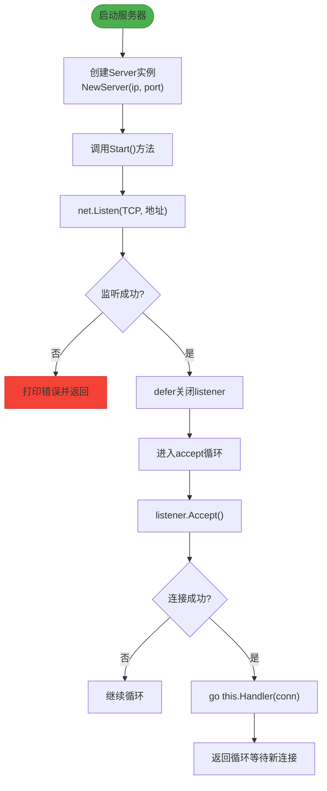

# 学习路径与示例代码

<cite>
**本文档引用文件**  
- [hello.go](file://1-firstGolang/hello.go)
- [test1_var.go](file://2-var/test1_var.go)
- [test2_const.go](file://3-const_iota/test2_const.go)
- [test3_function.go](file://4-function/test3_function.go)
- [main.go](file://5-init/main.go)
- [pointer.go](file://6-pointer/pointer.go)
- [defer.go](file://7-defer/defer.go)
- [test1_array.go](file://8-slice/test1_array.go)
- [test_map1.go](file://9-map/test_map1.go)
- [test1_struct.go](file://10-OOP/test1_struct.go)
- [test1_pair.go](file://11-reflect/test1_pair.go)
- [test1_goroutine.go](file://12-goroutine/test1_goroutine.go)
- [test1_channel.go](file://13-channel/test1_channel.go)
- [ServerV0.1-基础服务构建/main.go](file://14-golang-IM-System/ServerV0.1-基础服务构建/main.go)
- [ServerV0.1-基础服务构建/server.go](file://14-golang-IM-System/ServerV0.1-基础服务构建/server.go)
</cite>

## 目录
1. [引言](#引言)
2. [Go语言基础语法学习路径](#go语言基础语法学习路径)
   - [1. 第一个Go程序](#1-第一个go程序)
   - [2. 变量声明与使用](#2-变量声明与使用)
   - [3. 常量与iota枚举](#3-常量与iota枚举)
   - [4. 函数定义与多返回值](#4-函数定义与多返回值)
   - [5. 包初始化顺序](#5-包初始化顺序)
   - [6. 指针概念理解](#6-指针概念理解)
   - [7. defer延迟执行](#7-defer延迟执行)
   - [8. 切片与数组](#8-切片与数组)
   - [9. 映射（map）操作](#9-映射（map）操作)
3. [进阶主题学习路径](#进阶主题学习路径)
   - [10. 结构体与方法（面向对象风格）](#10-结构体与方法（面向对象风格）)
   - [11. 反射机制](#11-反射机制)
   - [12. Goroutine并发](#12-goroutine并发)
   - [13. Channel通信](#13-channel通信)
4. [实战项目：IM系统开发演进](#实战项目：im系统开发演进)
   - [14. ServerV0.1 - 基础服务构建](#14-serverv01---基础服务构建)
5. [学习建议与常见问题](#学习建议与常见问题)

## 引言
本文档旨在为开发者提供一条从Go语言基础到完整即时通讯（IM）系统开发的系统化学习路径。通过循序渐进的示例代码和阶段性的目标设定，帮助学习者掌握Go语言的核心语法、并发模型以及实际项目中的工程实践。每个学习阶段均包含学习目标、关键知识点、练习建议和常见疑问解答，鼓励动手实践以加深理解。

## Go语言基础语法学习路径

### 1. 第一个Go程序
**学习目标**：理解Go程序的基本结构、包导入方式和main函数执行流程。

**关键知识点**：
- `package main` 表示程序入口包
- 多种import导入方式（单行、括号分组）
- `main()` 函数作为程序唯一入口
- 使用`fmt.Println`输出信息
- 语句末尾分号可省略
- 利用`time.Sleep`控制程序运行时间

**练习建议**：
- 修改输出内容，尝试打印不同字符串
- 调整`time.Sleep`的时间参数观察效果
- 尝试添加新的import语句并调用其他标准库函数

**常见疑问**：
- 为什么左大括号必须与函数名在同一行？  
  Go语言强制要求K&R风格格式，编译器会自动在某些语句后插入分号，避免歧义。
- 如何运行Go程序？  
  使用`go run hello.go`命令即可执行。

**Section sources**
- [hello.go](file://1-firstGolang/hello.go#L1-L18)

### 2. 变量声明与使用
**学习目标**：掌握Go中四种变量声明方式及其适用场景。

**关键知识点**：
- `var 变量名 类型`：显式声明未初始化变量，默认值为零值
- `var 变量名 类型 = 值`：带初始化的声明
- `var 变量名 = 值`：类型推导声明
- `变量名 := 值`：短变量声明（仅限函数内使用）
- 全局变量可在函数外使用前三种方式声明
- 支持多变量同时声明与赋值

**练习建议**：
- 尝试在函数内外分别使用`:=`声明变量，观察编译错误
- 声明不同类型变量（int、string、bool等）并打印其零值
- 使用`var()`块声明多个变量

**常见疑问**：
- 何时使用`var`，何时使用`:=`？  
  在函数内部推荐使用`:=`进行局部变量声明；全局变量或需要显式类型时使用`var`。
- 所有类型的零值是什么？  
  数值类型为0，字符串为""，布尔为false，指针为nil。

**Section sources**
- [test1_var.go](file://2-var/test1_var.go#L1-L70)

### 3. 常量与iota枚举
**学习目标**：理解常量的不可变性及iota在枚举中的应用。

**关键知识点**：
- `const`关键字定义只读常量
- `iota`用于自动生成递增值，配合`const()`使用
- 每行`iota`自动加1，起始值为0
- 支持表达式计算如`iota+1`、`iota*2`
- 可用于定义状态码、配置项等固定集合

**练习建议**：
- 自定义一组HTTP状态码使用iota生成
- 尝试跨行使用iota并观察值的变化
- 定义包含多个字段的常量组

**常见疑问**：
- iota能否在var中使用？  
  不可以，iota仅在const块中有累加效果。
- 如何跳过某个iota值？  
  使用`_`占位符即可跳过。

**Section sources**
- [test2_const.go](file://3-const_iota/test2_const.go#L1-L43)

### 4. 函数定义与多返回值
**学习目标**：掌握Go函数的定义语法、参数传递和多返回值特性。

**关键知识点**：
- 函数定义格式：`func 函数名(参数列表) 返回类型 {}`
- 支持多个返回值，括号包裹
- 可命名返回值变量，在函数体内直接赋值
- 命名返回值具有默认零值，可直接`return`无参数返回
- 参数传递为值拷贝

**练习建议**：
- 编写一个返回错误码和数据的函数模拟API调用
- 尝试使用命名返回值简化逻辑
- 创建变参函数（使用...T）

**常见疑问**：
- 为什么Go支持多返回值？  
  用于同时返回结果和错误信息，提升代码清晰度。
- 命名返回值有什么优势？  
  提高可读性，并可在defer中修改返回值。

**Section sources**
- [test3_function.go](file://4-function/test3_function.go#L1-L67)

### 5. 包初始化顺序
**学习目标**：理解Go程序启动时包的初始化流程。

**关键知识点**：
- 每个包可包含`init()`函数，自动执行
- `init()`无参数无返回值，不能被显式调用
- 初始化顺序：导入包 → 包级变量 → init函数
- 导入时可通过别名或`_`匿名导入控制行为
- `_`导入仅执行init函数，常用于注册驱动

**练习建议**：
- 在lib1和lib2中添加init函数观察执行顺序
- 修改main.go中的导入方式比较差异
- 尝试多个包相互依赖时的初始化顺序

**常见疑问**：
- main函数之前会执行哪些代码？  
  所有导入包的init函数和包级变量初始化。
- 如何控制包的初始化副作用？  
  使用`_`导入触发初始化，或通过接口暴露控制方法。

**Section sources**
- [main.go](file://5-init/main.go#L1-L15)

### 6. 指针概念理解
**学习目标**：掌握指针的基本用法及在函数间传递引用。

**关键知识点**：
- `*T`表示指向T类型的指针
- `&`取地址，`*`解引用
- 函数参数传指针可实现“引用传递”
- 支持二级指针`**T`
- 指针零值为nil

**练习建议**：
- 编写交换两个变量值的函数使用指针
- 创建指向结构体的指针并访问成员
- 尝试判断指针是否为nil

**常见疑问**：
- Go有指针为什么还算安全？  
  不支持指针运算，防止越界访问。
- 什么时候该用指针？  
  需修改原值、避免大对象拷贝、实现方法接收者时。

**Section sources**
- [pointer.go](file://6-pointer/pointer.go#L1-L43)

### 7. defer延迟执行
**学习目标**：理解defer语句的执行时机及其在资源管理中的作用。

**关键知识点**：
- `defer`语句将其后函数延迟到当前函数返回前执行
- 多个defer遵循后进先出（LIFO）顺序
- 常用于关闭文件、解锁、recover异常处理
- defer表达式在声明时求值，执行时调用

**练习建议**：
- 在文件操作中使用defer关闭文件
- 模拟数据库事务使用defer回滚
- 结合recover捕获panic

**常见疑问**：
- defer是在return之后执行吗？  
  在return赋值后、函数真正退出前执行。
- defer会影响性能吗？  
  轻量级，适合常规使用，但避免在热路径大量使用。

**Section sources**
- [defer.go](file://7-defer/defer.go#L1-L12)

### 8. 切片与数组
**学习目标**：区分数组与切片，掌握切片的动态特性。

**关键知识点**：
- 数组是固定长度的集合，类型包含长度如`[4]int`
- 切片是对数组的抽象，具有动态长度
- 使用`make([]T, len, cap)`创建切片
- 切片作为参数传递时不复制底层数组
- 支持`range`遍历

**练习建议**：
- 创建不同长度的数组并尝试越界访问
- 使用append向切片添加元素观察扩容机制
- 传递切片到函数内部修改并验证外部变化

**常见疑问**：
- 数组和切片哪个更常用？  
  切片更常用，因其灵活性。
- 切片扩容策略是怎样的？  
  一般情况下容量不足时翻倍增长。

**Section sources**
- [test1_array.go](file://8-slice/test1_array.go#L1-L41)

### 9. 映射（map）操作
**学习目标**：掌握map的声明、初始化和基本操作。

**关键知识点**：
- `map[KeyType]ValueType`定义映射类型
- 必须使用`make`初始化后才能使用
- 支持字面量初始化
- 提供键值对存储，类似哈希表
- 支持多方式声明：var+make、make、字面量

**练习建议**：
- 创建用户ID到用户名的映射
- 实现一个简单的计数器统计单词出现次数
- 遍历map并打印所有键值对

**常见疑问**：
- map是线程安全的吗？  
  不是，多协程读写需加锁。
- 如何删除map中的键？  
  使用`delete(map, key)`函数。

**Section sources**
- [test_map1.go](file://9-map/test_map1.go#L1-L38)

## 进阶主题学习路径

### 10. 结构体与方法（面向对象风格）
**学习目标**：理解Go的结构体定义及如何为其绑定方法。

**关键知识点**：
- `type StructName struct {}`定义结构体
- 支持字段直接赋值
- 方法可通过值接收者或指针接收者定义
- 指针接收者可修改原对象，值接收者为副本
- 支持自定义类型别名（如`type myint int`）

**练习建议**：
- 定义Person结构体包含姓名和年龄
- 为其添加`SetName`和`GetAge`方法
- 比较值接收者与指针接收者的调用差异

**常见疑问**：
- Go有类吗？  
  没有class，但结构体+方法可实现类似封装。
- 何时使用值接收者，何时用指针？  
  小对象或无需修改时用值，大对象或需修改时用指针。

**Section sources**
- [test1_struct.go](file://10-OOP/test1_struct.go#L1-L44)

### 11. 反射机制
**学习目标**：了解Go反射的基本概念及其在运行时类型检查中的应用。

**关键知识点**：
- 空接口`interface{}`可存储任意类型
- 类型断言`value, ok := interface.(Type)`用于类型还原
- 反射用于处理未知类型的数据（如JSON解析）
- `reflect`包提供更强大的运行时类型操作能力

**练习建议**：
- 创建一个接受`interface{}`参数的打印函数
- 使用类型断言区分不同类型并分别处理
- 尝试将map[string]interface{}用于模拟动态数据

**常见疑问**：
- 反射性能如何？  
  相对较慢，应避免在性能敏感路径频繁使用。
- 反射主要用在哪些场景？  
  ORM、序列化库、通用工具函数等。

**Section sources**
- [test1_pair.go](file://11-reflect/test1_pair.go#L1-L17)

### 12. Goroutine并发
**学习目标**：掌握Go中最基本的并发单元——goroutine的使用。

**关键知识点**：
- `go function()`启动一个新协程
- 主协程退出会导致整个程序结束
- 协程间独立运行，调度由Go运行时管理
- 轻量级，可创建成千上万个

**练习建议**：
- 启动多个goroutine打印不同信息
- 观察主协程不等待时子协程是否能完成
- 使用time.Sleep让主协程等待子协程输出

**常见疑问**：
- goroutine和线程有什么区别？  
  goroutine更轻量，由Go runtime调度，数量不受系统限制。
- 如何控制goroutine生命周期？  
  通常通过channel通信或context取消。

**Section sources**
- [test1_goroutine.go](file://12-goroutine/test1_goroutine.go#L1-L33)

### 13. Channel通信
**学习目标**：理解channel作为goroutine间通信机制的核心作用。

**关键知识点**：
- `make(chan T)`创建无缓冲channel
- `<-`操作符用于发送和接收数据
- 无缓冲channel要求发送和接收同时就绪
- defer可用于清理资源
- channel是goroutine间同步和通信的主要手段

**练习建议**：
- 创建两个goroutine通过channel传递数据
- 尝试关闭channel并检测是否关闭
- 使用select监听多个channel

**常见疑问**：
- 什么是无缓冲channel？  
  必须发送和接收双方都准备好才能通信。
- 如何避免goroutine泄漏？  
  确保每个启动的goroutine都有退出机制。

**Section sources**
- [test1_channel.go](file://13-channel/test1_channel.go#L1-L21)

## 实战项目：IM系统开发演进

### 14. ServerV0.1 - 基础服务构建
**学习目标**：理解IM服务器的基本网络架构和TCP服务启动流程。

**关键知识点**：
- `Server`结构体封装IP和端口
- `NewServer`构造函数返回指针
- `Start()`方法监听TCP端口
- 使用`net.Listen`创建监听套接字
- 循环接受连接并为每个连接启动独立goroutine处理
- `Handler`方法处理单个连接业务逻辑

**练习建议**：
- 修改IP和端口号启动服务
- 在Handler中添加客户端地址打印
- 添加连接数统计功能
- 增加日志输出记录连接建立事件

**常见疑问**：
- 为什么每个连接要用goroutine处理？  
  实现并发处理多个客户端，避免阻塞其他连接。
- 如何优雅关闭服务器？  
  可通过channel接收信号并关闭listener。

**Diagram sources**
- [main.go](file://14-golang-IM-System/ServerV0.1-基础服务构建/main.go#L1-L6)
- [server.go](file://14-golang-IM-System/ServerV0.1-基础服务构建/server.go#L1-L50)

**Section sources**
- [main.go](file://14-golang-IM-System/ServerV0.1-基础服务构建/main.go#L1-L6)
- [server.go](file://14-golang-IM-System/ServerV0.1-基础服务构建/server.go#L1-L50)

## 学习建议与常见问题
- **动手实践最重要**：每一阶段都应修改代码并观察结果
- **逐步迭代**：从ServerV0.1开始，逐版本升级功能理解设计演进
- **调试技巧**：善用fmt.Println进行简单调试
- **阅读文档**：结合官方文档深入理解语言特性
- **避免陷阱**：注意goroutine生命周期管理，防止资源泄漏
- **性能意识**：了解基本性能特征，如切片扩容、map非线程安全等

通过本路径的学习，开发者将建立起从语法基础到实际项目开发的完整知识体系，为后续深入Go语言开发打下坚实基础。