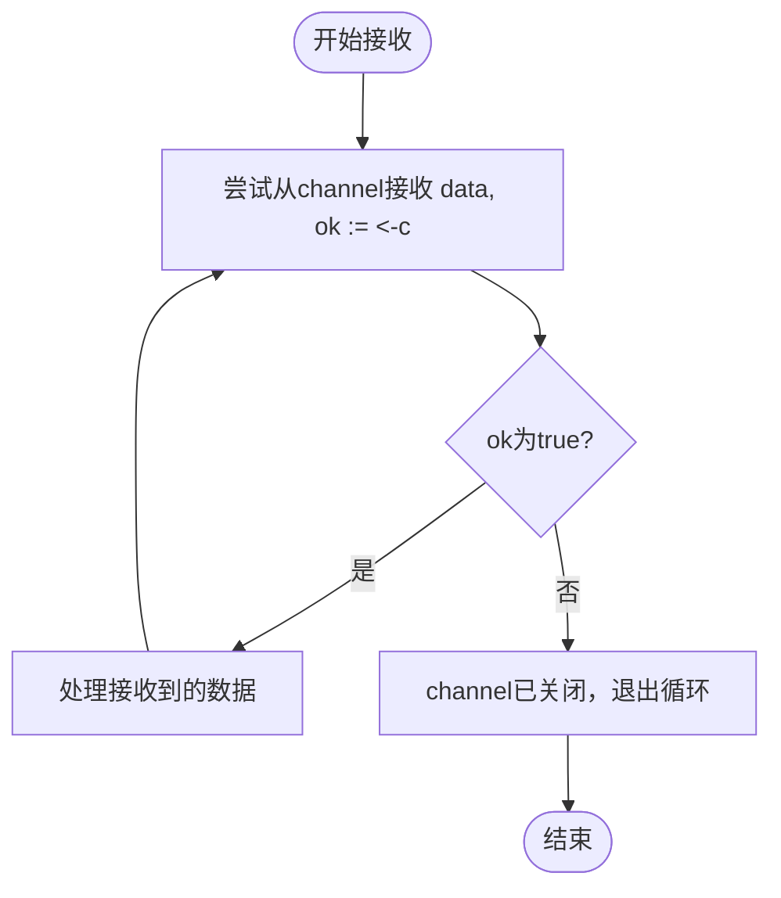

<cite>
**本文档中引用的文件**   
- [test3_channel.go](file://13-channel/test3_channel.go)
- [test4_channel.go](file://13-channel/test4_channel.go)
</cite>

## 目录
1. [引言](#引言)
2. [Channel关闭语义详解](#channel关闭语义详解)
3. [多值接收模式与安全检测](#多值接收模式与安全检测)
4. [手动循环与range遍历对比分析](#手动循环与range遍历对比分析)
5. [发送方关闭原则与接收方感知机制](#发送方关闭原则与接收方感知机制)
6. [常见错误模式及规避策略](#常见错误模式及规避策略)
7. [结论](#结论)

## 引言
在Go语言并发编程中，channel是实现goroutine间通信的核心机制。正确理解和使用channel的关闭语义对于构建健壮的并发程序至关重要。本文将深入剖析channel的关闭行为，重点分析`test3_channel.go`和`test4_channel.go`两个示例代码中的关键差异，阐明如何安全地检测channel状态、合理使用range遍历以及遵循最佳实践来避免常见陷阱。

## Channel关闭语义详解

Channel的关闭是单向操作，通过`close()`函数显式触发。一旦channel被关闭，其核心语义表现为：
- **允许继续接收**：已关闭的channel仍可从中读取剩余数据，直至缓冲区耗尽。
- **禁止继续发送**：向已关闭的channel发送数据会引发panic。
- **零值返回**：当channel为空且已关闭时，后续接收操作将返回对应类型的零值。

这一机制确保了生产者可以安全通知消费者“不再有新数据”，而消费者能够优雅处理尾部数据并最终退出。

**Section sources**
- [test3_channel.go](file://13-channel/test3_channel.go#L10-L12)
- [test4_channel.go](file://13-channel/test4_channel.go#L13-L15)

## 多值接收模式与安全检测

在`test3_channel.go`中，采用多值接收语法`if data, ok := <-c; ok`来安全判断channel状态。其中`ok`布尔值指示接收是否成功：
- `ok == true`：成功接收到有效数据，channel可能仍开放或虽关闭但有缓存数据。
- `ok == false`：channel已关闭且无剩余数据，此时`data`为零值。

该模式使接收方能主动检测channel关闭状态，避免盲目读取导致逻辑错误。特别适用于需要精确控制退出时机的场景。



**Diagram sources**
- [test3_channel.go](file://13-channel/test3_channel.go#L15-L21)

**Section sources**
- [test3_channel.go](file://13-channel/test3_channel.go#L15-L21)

## 手动循环与range遍历对比分析

### 手动循环检查（test3_channel.go）
该方式使用无限`for`循环配合`ok`判断实现退出条件。优点在于控制精细，可在每次接收后插入额外逻辑；缺点是代码冗长，易出错。

### range自动遍历（test4_channel.go）
`for data := range c`语法自动处理channel关闭逻辑：当channel关闭且数据耗尽后，range循环自然终止。该方式代码简洁、语义清晰，是推荐的惯用写法。

两者功能等价，但range版本更符合Go语言“简洁即美”的设计哲学，减少了出错概率。

```mermaid
graph TB
subgraph "手动循环"
A[for {}] --> B[<-c]
B --> C{ok?}
C --> |true| D[处理数据]
D --> B
C --> |false| E[break]
end
subgraph "range遍历"
F[for range c] --> G[自动接收]
G --> H{channel关闭?}
H --> |否| I[处理数据]
I --> G
H --> |是且空| J[自动退出]
end
```

**Diagram sources**
- [test3_channel.go](file://13-channel/test3_channel.go#L15-L21)
- [test4_channel.go](file://13-channel/test4_channel.go#L17-L19)

**Section sources**
- [test3_channel.go](file://13-channel/test3_channel.go#L15-L21)
- [test4_channel.go](file://13-channel/test4_channel.go#L17-L19)

## 发送方关闭原则与接收方感知机制

最佳实践要求**由发送方负责关闭channel**。原因如下：
- **职责分离**：发送方最清楚何时完成数据发送。
- **避免重复关闭**：多个接收方无法协调谁应执行`close`。
- **防止向关闭channel发送**：若接收方关闭，则其他发送方可能panic。

接收方无法主动“感知”channel状态，只能通过接收操作的返回值间接判断。底层机制是channel内部维护一个关闭标志位，每次接收操作都会检查该标志及缓冲区状态，决定返回数据还是零值。

**Section sources**
- [test3_channel.go](file://13-channel/test3_channel.go#L10-L12)
- [test4_channel.go](file://13-channel/test4_channel.go#L13-L15)

## 常见错误模式及规避策略

### 错误模式一：重复关闭channel
对同一channel多次调用`close()`会引发panic。规避方法：
- 确保关闭逻辑只存在于单一发送者。
- 使用`sync.Once`等同步原语保证关闭操作的幂等性。

### 错误模式二：向已关闭channel发送数据
任何向已关闭channel的发送操作均会导致运行时panic。规避方法：
- 遵循“发送方关闭”原则，确保关闭后不再有发送逻辑。
- 使用select配合ok判断，在不确定channel状态时安全发送。

### 错误模式三：接收方尝试关闭channel
接收方关闭channel违反职责划分，可能导致其他发送方panic。应始终由数据生产者执行关闭。

**Section sources**
- [test3_channel.go](file://13-channel/test3_channel.go#L10-L12)
- [test4_channel.go](file://13-channel/test4_channel.go#L13-L15)

## 结论

Channel的关闭机制是Go并发模型的重要组成部分。通过`test3_channel.go`和`test4_channel.go`的对比可见，`range`遍历提供了更简洁安全的关闭处理方式，而多值接收模式则适用于需要精细控制的场景。始终坚持“发送方关闭”原则，并警惕重复关闭与向关闭channel发送等常见错误，是编写可靠并发程序的关键。掌握这些语义细节，有助于开发者构建高效、稳定的Go应用。