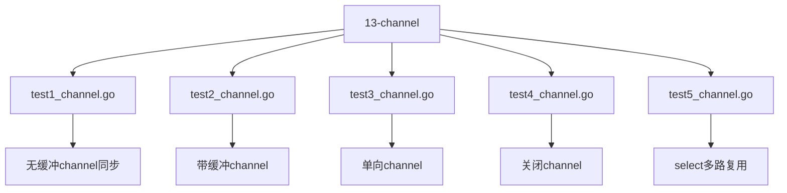
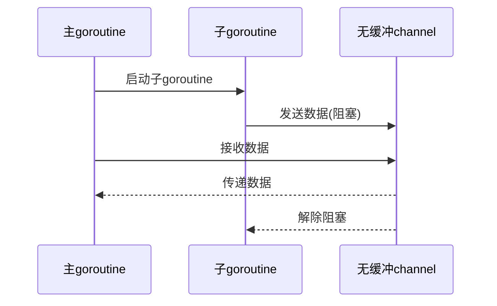
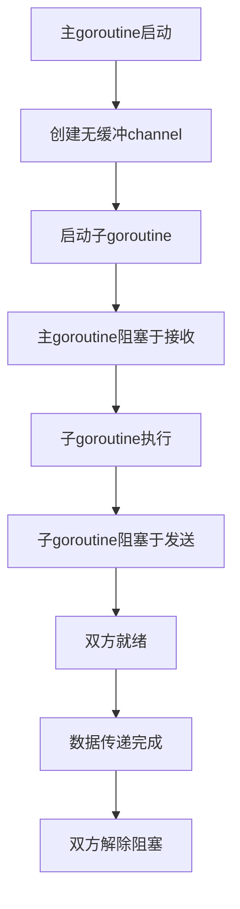
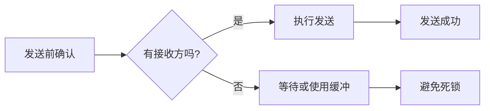

# Channel基础操作

<cite>
**Referenced Files in This Document**   
- [test1_channel.go](file://13-channel/test1_channel.go)
- [test2_channel.go](file://13-channel/test2_channel.go)
- [test3_channel.go](file://13-channel/test3_channel.go)
- [defer.go](file://7-defer/defer.go)
</cite>

## 目录
1. [引言](#引言)
2. [项目结构](#项目结构)
3. [核心组件](#核心组件)
4. [无缓冲Channel同步机制](#无缓冲channel同步机制)
5. [执行顺序与阻塞行为](#执行顺序与阻塞行为)
6. [defer语句执行时机](#defer语句执行时机)
7. [死锁预防实践](#死锁预防实践)
8. [结论](#结论)

## 引言

Go语言中的channel是实现goroutine间通信的核心机制。本文基于`test1_channel.go`中的代码示例，深入分析无缓冲channel的同步通信机制。通过详细解析发送与接收操作的配对要求、主goroutine与子goroutine的执行顺序依赖关系，以及defer语句在并发环境中的执行时机，全面展示如何使用无缓冲channel实现严格的同步控制，并提供避免死锁的编程实践建议。

## 项目结构

本项目包含多个Go语言学习模块，其中`13-channel`目录专门用于演示channel的各种使用场景。该目录下包含五个测试文件，分别展示了不同类型的channel操作模式。

**Diagram sources**
- [test1_channel.go](file://13-channel/test1_channel.go)
- [test2_channel.go](file://13-channel/test2_channel.go)
- [test3_channel.go](file://13-channel/test3_channel.go)

**Section sources**
- [13-channel](file://13-channel)

## 核心组件

`test1_channel.go`文件实现了最基本的无缓冲channel同步模式，包含主goroutine与子goroutine之间的数据传递。`test2_channel.go`展示了带缓冲channel的行为差异，而`test3_channel.go`演示了channel关闭机制。这些文件共同构成了理解Go语言并发通信的基础。

**Section sources**
- [test1_channel.go](file://13-channel/test1_channel.go)
- [test2_channel.go](file://13-channel/test2_channel.go)
- [test3_channel.go](file://13-channel/test3_channel.go)

## 无缓冲Channel同步机制

无缓冲channel提供了一种严格的同步通信方式，其核心特性是发送和接收操作必须同时准备好才能完成。在`test1_channel.go`中，通过`make(chan int)`创建了一个无缓冲的整型channel，这种channel没有内部存储空间，因此发送方必须等待接收方准备好才能完成发送操作。

当子goroutine执行`c <- 666`时，该操作会立即阻塞，直到主goroutine执行`num := <-c`进行接收。这种"交接棒"式的通信确保了两个goroutine在数据传递点上完全同步。与带缓冲channel不同，无缓冲channel强制实现了goroutine间的协调，使得数据传递成为一个同步事件。

**Diagram sources**
- [test1_channel.go](file://13-channel/test1_channel.go#L6-L18)

**Section sources**
- [test1_channel.go](file://13-channel/test1_channel.go#L6-L18)

## 执行顺序与阻塞行为

在无缓冲channel的通信中，goroutine的执行顺序受到严格的控制。分析`test1_channel.go`的执行流程可以发现：主goroutine首先创建channel并启动子goroutine，然后立即在接收操作上阻塞。子goroutine在打印"goroutine 正在运行..."后，尝试通过`c <- 666`发送数据，但由于无缓冲channel的特性，该发送操作也会阻塞，直到有接收方出现。

这种双向阻塞机制确保了数据传递的原子性。只有当主goroutine和子goroutine都到达通信点时，数据传递才能完成，随后两个goroutine继续各自的执行。这种同步模式避免了竞态条件，保证了程序行为的可预测性。

**Diagram sources**
- [test1_channel.go](file://13-channel/test1_channel.go)

**Section sources**
- [test1_channel.go](file://13-channel/test1_channel.go)

## defer语句执行时机

在并发编程中，defer语句的执行时机尤为重要。在`test1_channel.go`的子goroutine中，`defer fmt.Println("goroutine结束")`展示了defer在goroutine中的行为特点。defer语句会在函数返回前执行，但在本例中，由于channel的同步机制，子goroutine的执行顺序受到严格控制。

当子goroutine完成数据发送后，函数逻辑结束，此时defer语句被执行，打印"goroutine结束"消息。值得注意的是，defer的执行发生在goroutine函数返回之前，但在channel通信完成之后。这种执行顺序确保了资源清理操作在正确的时机进行，即使在复杂的并发环境中也能保证程序的正确性。

**Section sources**
- [test1_channel.go](file://13-channel/test1_channel.go#L9-L14)

## 死锁预防实践

使用无缓冲channel时，死锁是常见的编程错误。死锁通常发生在发送方和接收方无法同时就绪的情况下。基于代码示例，以下是避免死锁的关键实践：

1. **确保配对操作存在**：每个发送操作`c <- value`都必须有对应的接收操作`<-c`，反之亦然。
2. **合理安排执行顺序**：确保至少有一个goroutine不会在channel操作上无限期阻塞。
3. **使用超时机制**：对于可能阻塞的操作，考虑使用`select`语句配合`time.After()`设置超时。
4. **避免循环等待**：防止多个goroutine相互等待对方完成channel操作。

在`test3_channel.go`中，通过`close(c)`显式关闭channel，并使用逗号ok语法检查channel状态，这是一种安全的编程模式，可以防止从已关闭的channel接收数据导致的panic。

**Diagram sources**
- [test1_channel.go](file://13-channel/test1_channel.go)
- [test3_channel.go](file://13-channel/test3_channel.go#L13-L18)

**Section sources**
- [test1_channel.go](file://13-channel/test1_channel.go)
- [test3_channel.go](file://13-channel/test3_channel.go)

## 结论

无缓冲channel是Go语言并发编程的基石，它通过强制同步机制确保了goroutine间通信的可靠性和可预测性。通过`test1_channel.go`的示例可以看出，无缓冲channel实现了严格的goroutine配对，使得数据传递成为一个同步事件。理解发送与接收操作的阻塞行为、执行顺序依赖关系以及defer语句的执行时机，对于编写正确的并发程序至关重要。遵循死锁预防的最佳实践，如确保操作配对、合理安排执行顺序和使用channel关闭机制，能够有效避免常见的并发错误，构建健壮的并发应用程序。