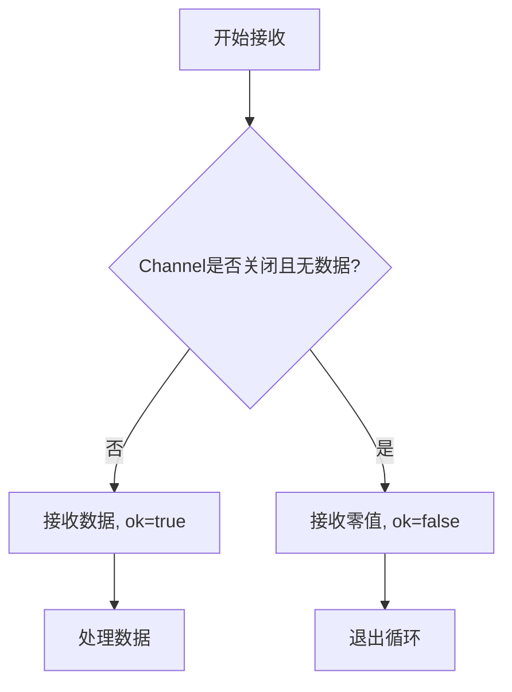
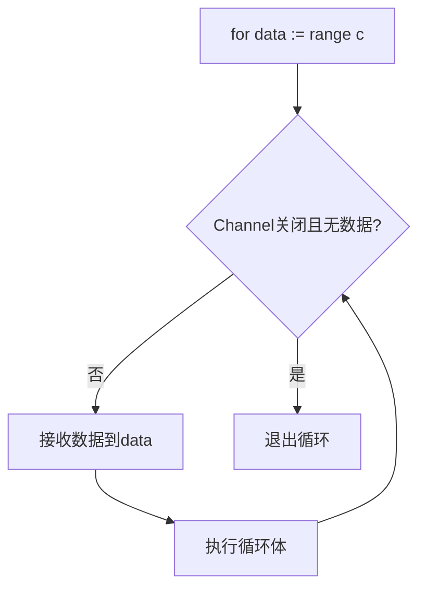
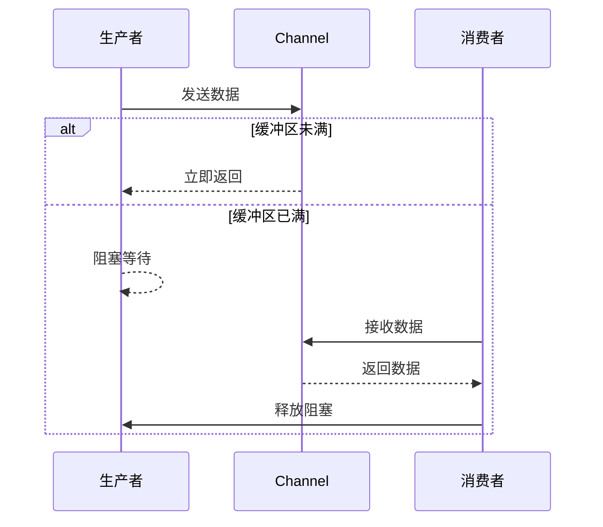
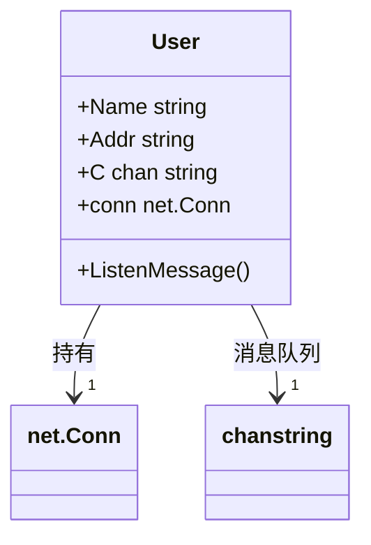

# Channel通信机制

<cite>
**本文档引用文件**  
- [test1_channel.go](file://13-channel/test1_channel.go)
- [test2_channel.go](file://13-channel/test2_channel.go)
- [test3_channel.go](file://13-channel/test3_channel.go)
- [test4_channel.go](file://13-channel/test4_channel.go)
- [test5_channel.go](file://13-channel/test5_channel.go)
</cite>

## 目录
1. [引言](#引言)
2. [无缓冲Channel的同步阻塞特性](#无缓冲channel的同步阻塞特性)
3. [带缓冲Channel的工作机制与容量管理](#带缓冲channel的工作机制与容量管理)
4. [Channel的关闭语义与多值接收模式](#channel的关闭语义与多值接收模式)
5. [range遍历Channel的正确用法](#range遍历channel的正确用法)
6. [无缓冲与有缓冲Channel的适用场景对比](#无缓冲与有缓冲channel的适用场景对比)
7. [死锁产生的条件及避免策略](#死锁产生的条件及避免策略)
8. [使用Channel实现安全的数据传递与状态同步](#使用channel实现安全的数据传递与状态同步)
9. [总结](#总结)

## 引言
Channel是Go语言中Goroutine之间通信的核心机制，基于CSP（Communicating Sequential Processes）模型设计。它提供了一种类型安全、线程安全的通信方式，用于在并发的Goroutine之间传递数据和同步状态。本文将通过分析`test1_channel.go`至`test5_channel.go`五个示例文件，系统讲解Channel的实现原理、工作机制、关闭语义、遍历方法以及在实际开发中的最佳实践。

## 无缓冲Channel的同步阻塞特性

无缓冲Channel在创建时未指定容量，即`make(chan T)`。其核心特性是**同步阻塞**：发送操作（`c <- data`）会阻塞发送Goroutine，直到有另一个Goroutine执行接收操作（`<-c`）；反之亦然。这种“手递手”（hand-off）的机制确保了两个Goroutine在通信点上会合。

在`test1_channel.go`中，主Goroutine创建了一个无缓冲的`int`类型Channel `c`。随后启动一个子Goroutine，该Goroutine向`c`发送值`666`。此时，子Goroutine会被阻塞，因为没有接收者。主Goroutine执行`num := <-c`时，才开始接收数据，此时两个Goroutine完成同步，数据传递成功，子Goroutine继续执行并结束，主Goroutine打印接收到的值后结束。

这种同步特性使得无缓冲Channel非常适合用于精确的Goroutine同步，例如信号量、任务分发等场景。

**Section sources**
- [test1_channel.go](file://13-channel/test1_channel.go#L6-L20)

## 带缓冲Channel的工作机制与容量管理

带缓冲Channel在创建时指定了缓冲区大小，即`make(chan T, n)`。它内部维护一个FIFO（先进先出）的队列，其行为类似于一个有容量限制的管道。

在`test2_channel.go`中，创建了一个容量为3的`int`类型Channel `c`。程序通过`len(c)`和`cap(c)`分别获取当前队列中的元素数量和总容量。子Goroutine向`c`发送4个整数。由于缓冲区容量为3，前3次发送操作会立即成功（数据进入缓冲区），而第4次发送操作会阻塞，因为缓冲区已满。主Goroutine在`time.Sleep`后开始接收数据，每次接收都会释放一个缓冲区空间，使得之前阻塞的发送操作得以继续。

带缓冲Channel解耦了发送者和接收者的执行时机。只要缓冲区未满，发送者就可以非阻塞地发送数据；只要缓冲区不为空，接收者就可以非阻塞地接收数据。这提高了程序的吞吐量和响应性。

**Section sources**
- [test2_channel.go](file://13-channel/test2_channel.go#L8-L29)

## Channel的关闭语义与多值接收模式

Channel可以被关闭，表示不再有数据发送。关闭操作由发送方执行，使用`close(c)`。关闭后，不能再向该Channel发送数据，否则会引发panic。但可以从已关闭的Channel接收数据。

在`test3_channel.go`中，子Goroutine在发送第一个元素`0`后立即调用`close(c)`。这导致Channel被关闭。主Goroutine使用一个无限循环和多值接收语法`data, ok := <-c`来接收数据。`ok`是一个布尔值，当Channel关闭且所有数据被读取后，`ok`为`false`，此时`data`为零值。程序通过检查`ok`的值来判断Channel是否已关闭，从而跳出循环。

**Diagram sources**
- [test3_channel.go](file://13-channel/test3_channel.go#L11-L25)

## range遍历Channel的正确用法

`for-range`语句可以用于遍历Channel，它会自动从Channel中接收数据，直到Channel被关闭。当Channel关闭且所有缓冲数据被读取后，`range`循环会自动终止。

在`test4_channel.go`中，子Goroutine向Channel `c`发送5个整数，然后调用`close(c)`。主Goroutine使用`for data := range c`来遍历Channel。`range`会持续接收数据并赋值给`data`，当子Goroutine关闭Channel后，`range`检测到这一状态，循环自动结束，无需手动检查`ok`值。

这种方法比使用`ok`标志的无限循环更简洁、更安全，是遍历Channel的推荐方式。

**Diagram sources**
- [test4_channel.go](file://13-channel/test4_channel.go#L13-L22)

**Section sources**
- [test4_channel.go](file://13-channel/test4_channel.go#L5-L22)

## 无缓冲与有缓冲Channel的适用场景对比

| 特性 | 无缓冲Channel | 有缓冲Channel |
| :--- | :--- | :--- |
| **同步性** | 强同步，发送/接收必须同时就绪 | 弱同步，通过缓冲区解耦 |
| **阻塞条件** | 发送者阻塞直到接收者就绪，反之亦然 | 发送者阻塞当缓冲区满，接收者阻塞当缓冲区空 |
| **适用场景** | 需要精确同步的场景，如信号量、任务分发、Goroutine配对 | 需要提高吞吐量的场景，如生产者-消费者模式、事件队列 |
| **死锁风险** | 较高，易因双方等待而死锁 | 相对较低，但不当使用仍可能导致 |
| **代码示例** | `make(chan int)` | `make(chan int, 3)` |

**Section sources**
- [test1_channel.go](file://13-channel/test1_channel.go#L6-L20)
- [test2_channel.go](file://13-channel/test2_channel.go#L8-L29)

## 死锁产生的条件及避免策略

死锁是指所有Goroutine都处于等待状态，程序无法继续执行。在Channel使用中，死锁通常由以下原因引起：

1.  **无缓冲Channel的单向操作**：如果只向无缓冲Channel发送数据而没有接收者，或只尝试接收而没有发送者，Goroutine会永久阻塞。
2.  **Goroutine启动顺序不当**：如`test3_channel.go`中，如果子Goroutine在发送数据前就关闭Channel，主Goroutine可能接收不到任何数据。
3.  **循环等待**：多个Goroutine相互等待对方的Channel操作。

在`test5_channel.go`中，`fibonacii`函数使用`select`语句来避免死锁。`select`会监听多个Channel操作，哪个Channel就绪就执行哪个。主Goroutine启动一个子Goroutine来接收`c`中的斐波那契数列，并在接收10个数后向`quit` Channel发送信号。`fibonacii`函数通过`select`同时监听`c <- x`（发送）和`<-quit`（接收）两个操作。当`quit` Channel有数据时，函数立即返回，避免了在`c`上无限等待。

避免死锁的策略包括：
- 确保有配对的发送和接收操作。
- 使用带缓冲Channel或`select`语句来增加灵活性。
- 在可能阻塞的操作上设置超时（使用`time.After`）。
- 由发送方负责关闭Channel。

**Diagram sources**
- [test5_channel.go](file://13-channel/test5_channel.go#L8-L35)

**Section sources**
- [test5_channel.go](file://13-channel/test5_channel.go#L21-L35)

## 使用Channel实现安全的数据传递与状态同步

Channel是Go语言中实现并发安全的核心。它通过“通信来共享内存”，而不是通过“共享内存来通信”，从根本上避免了竞态条件（race condition）。

在`14-golang-IM-System`项目中，`User`结构体包含一个`C chan string`字段，用于接收消息。`ListenMessage`方法在一个独立的Goroutine中运行，不断从`C`中接收消息并写入网络连接。当服务器需要向用户发送消息时，只需向该用户的`C` Channel发送字符串。这种设计确保了消息的发送和接收是线程安全的，无需额外的锁机制。

**Diagram sources**
- [user.go](file://14-golang-IM-System/user.go#L18-L35)

## 总结
Channel是Go语言并发编程的基石。无缓冲Channel提供强同步，适用于精确的Goroutine协调；带缓冲Channel通过缓冲区解耦生产者和消费者，提高程序性能。正确理解Channel的关闭语义和使用`range`遍历是避免常见错误的关键。通过`select`语句可以构建更复杂的并发控制逻辑。合理使用Channel，可以编写出简洁、高效、安全的并发程序。