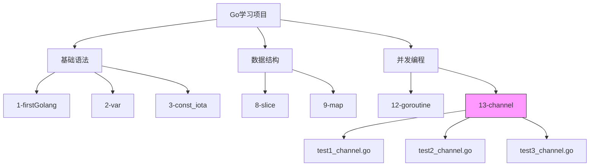
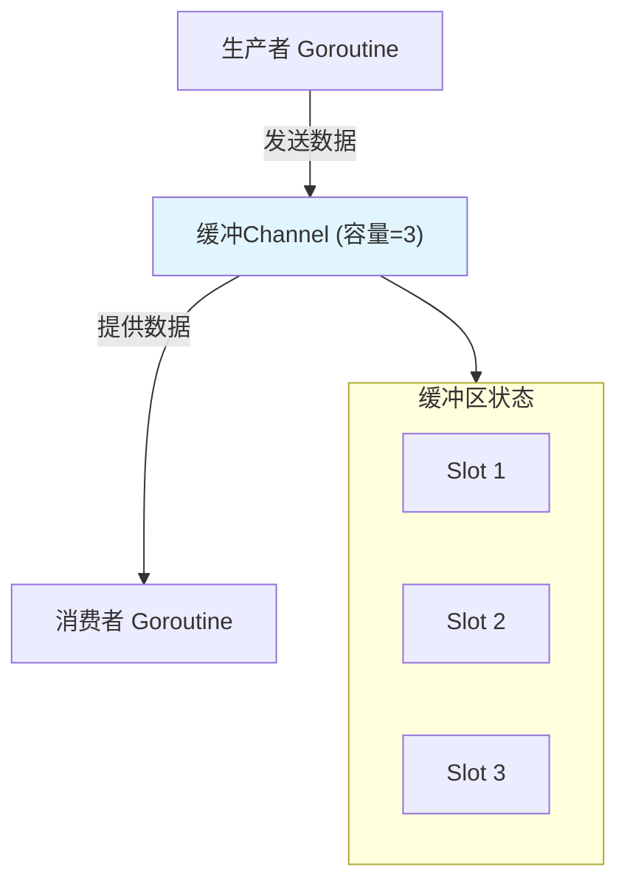
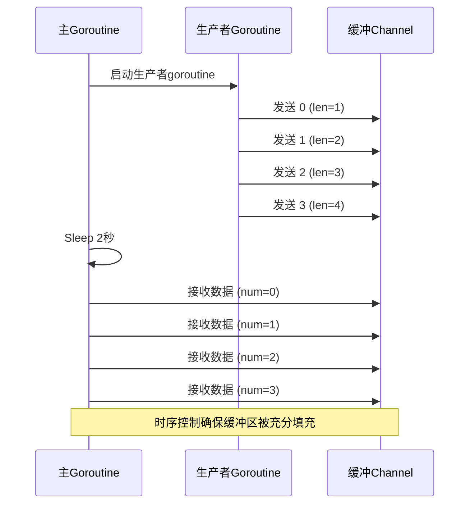
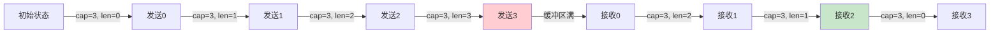
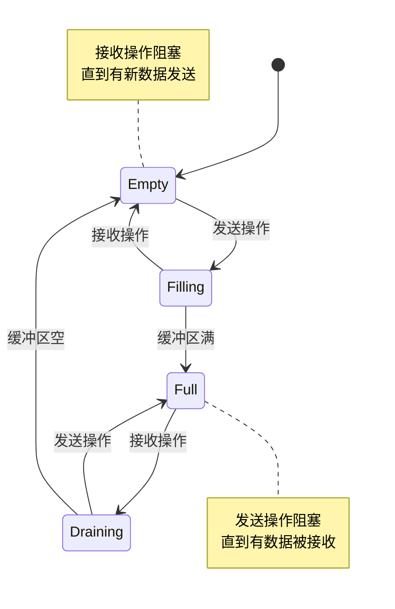
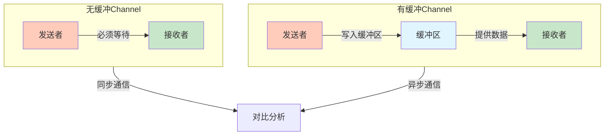

# 缓冲Channel机制

<cite>
**Referenced Files in This Document**   
- [test2_channel.go](file://13-channel/test2_channel.go)
- [test1_channel.go](file://13-channel/test1_channel.go)
- [test3_channel.go](file://13-channel/test3_channel.go)
</cite>

## 目录
1. [引言](#引言)
2. [项目结构](#项目结构)
3. [核心组件](#核心组件)
4. [缓冲Channel工作原理解析](#缓冲channel工作原理解析)
5. [生产者-消费者模型时序控制](#生产者-消费者模型时序控制)
6. [缓冲区容量与长度动态变化分析](#缓冲区容量与长度动态变化分析)
7. [阻塞行为特性分析](#阻塞行为特性分析)
8. [性能与稳定性影响因素](#性能与稳定性影响因素)
9. [有缓冲与无缓冲Channel对比](#有缓冲与无缓冲channel对比)
10. [结论](#结论)

## 引言

本文档深入解析Go语言中带缓冲Channel的工作原理，重点分析缓冲区容量（cap）与当前长度（len）的动态变化特性。通过`test2_channel.go`中的示例代码，详细阐述当缓冲区未满时发送操作非阻塞、接收操作阻塞等待的特性，以及缓冲区满后发送操作阻塞的行为模式。同时，探讨`time.Sleep`在生产者-消费者模型中的时序控制作用，并强调合理设置缓冲区大小对程序性能和稳定性的重要影响。

## 项目结构

该Go学习项目采用模块化目录结构，每个数字前缀的文件夹代表不同的学习主题。与本主题直接相关的代码位于`13-channel`目录下，包含多个Channel使用示例文件。

**Diagram sources**
- [test2_channel.go](file://13-channel/test2_channel.go#L1-L5)

## 核心组件

本分析的核心组件是Go语言的带缓冲Channel机制，其实现基于`make(chan T, n)`语法创建具有指定缓冲容量的通信通道。该机制在并发编程中扮演着关键角色，为goroutine之间的数据交换提供了高效且安全的同步手段。

**Section sources**
- [test2_channel.go](file://13-channel/test2_channel.go#L6-L8)

## 缓冲Channel工作原理解析

带缓冲Channel是一种先进先出（FIFO）的队列结构，其内部维护一个固定大小的缓冲区。通过`make(chan int, 3)`语句创建的Channel具有3个元素的缓冲容量，允许在没有接收者就绪的情况下存储最多3个发送值。

缓冲Channel的核心优势在于解耦生产者和消费者的速度差异。生产者可以连续发送数据到缓冲区，而无需立即等待消费者处理，从而提高系统的吞吐量和响应性。这种机制特别适用于处理突发性数据流或平衡不同处理速度的并发任务。

**Diagram sources**
- [test2_channel.go](file://13-channel/test2_channel.go#L6-L8)

## 生产者-消费者模型时序控制

在`test2_channel.go`示例中，通过`time.Sleep(2 * time.Second)`实现了关键的时序控制。该延迟操作确保了生产者goroutine有足够时间填充缓冲区，然后再由主goroutine进行消费。

这种时序安排展示了生产者-消费者模式的典型工作流程：生产者首先向缓冲Channel发送数据，主程序通过睡眠模拟处理其他任务或等待特定时机，最后消费者按需从Channel中读取数据。`time.Sleep`的使用突显了在并发程序中精确控制执行顺序的重要性。

**Diagram sources**
- [test2_channel.go](file://13-channel/test2_channel.go#L14-L27)

## 缓冲区容量与长度动态变化分析

缓冲Channel的`cap`函数返回缓冲区的总容量，而`len`函数返回当前缓冲区中待处理元素的数量。在`test2_channel.go`示例中，初始状态下`len(c)=0`，`cap(c)=3`，表明缓冲区为空但可容纳3个元素。

随着生产者goroutine连续发送4个整数，缓冲区的长度动态变化：从0增加到3（缓冲区满），然后在消费者开始接收后逐步减少至0。这种动态变化反映了Channel作为数据流中介的核心功能，其状态变化为程序提供了重要的运行时信息。

**Diagram sources**
- [test2_channel.go](file://13-channel/test2_channel.go#L8-L27)

## 阻塞行为特性分析

带缓冲Channel的阻塞行为取决于缓冲区的当前状态。当缓冲区未满时，发送操作是非阻塞的，生产者可以立即写入数据。然而，当缓冲区已满时，任何额外的发送操作都将阻塞，直到有消费者从Channel中取出数据腾出空间。

接收操作的行为则相反：只要缓冲区中有数据，接收操作就是非阻塞的；当缓冲区为空时，接收操作将阻塞，直到有新的数据被发送到Channel。这种双向阻塞机制确保了数据的一致性和goroutine间的有效同步。

**Diagram sources**
- [test2_channel.go](file://13-channel/test2_channel.go#L16-L27)

## 性能与稳定性影响因素

缓冲区大小的设置对程序性能和稳定性有重大影响。过小的缓冲区可能导致频繁的阻塞，降低并发效率；过大的缓冲区则可能占用过多内存，并延迟错误的暴露。

理想情况下，缓冲区大小应根据预期的生产者和消费者速度差异、内存限制和延迟要求来确定。在高吞吐量场景中，适当大小的缓冲区可以平滑处理峰值负载，避免goroutine因频繁阻塞而影响整体性能。

**Section sources**
- [test2_channel.go](file://13-channel/test2_channel.go#L6-L8)

## 有缓冲与无缓冲Channel对比

有缓冲Channel与无缓冲Channel在解耦并发任务方面各有优势。无缓冲Channel（同步Channel）要求发送者和接收者必须同时就绪，提供了严格的同步保证，适用于需要即时响应的场景。

相比之下，有缓冲Channel（异步Channel）通过缓冲区实现了发送者和接收者的时间解耦，提高了系统的灵活性和吞吐量。在`test1_channel.go`的无缓冲示例与`test2_channel.go`的有缓冲示例对比中，可以清晰看到两种模式在执行流程和同步行为上的差异。

**Diagram sources**
- [test1_channel.go](file://13-channel/test1_channel.go#L6-L15)
- [test2_channel.go](file://13-channel/test2_channel.go#L6-L27)

## 结论

带缓冲Channel是Go语言并发编程中的核心机制，通过`cap`和`len`函数提供了对缓冲区状态的精确监控。其非阻塞发送（当缓冲区未满）和阻塞接收（当缓冲区为空）的特性，结合`time.Sleep`等时序控制手段，为构建高效的生产者-消费者模型提供了强大支持。

合理设置缓冲区大小是平衡程序性能、内存使用和响应延迟的关键。与无缓冲Channel相比，有缓冲Channel在解耦并发任务、提高系统吞吐量方面具有明显优势，是构建高性能并发应用的重要工具。