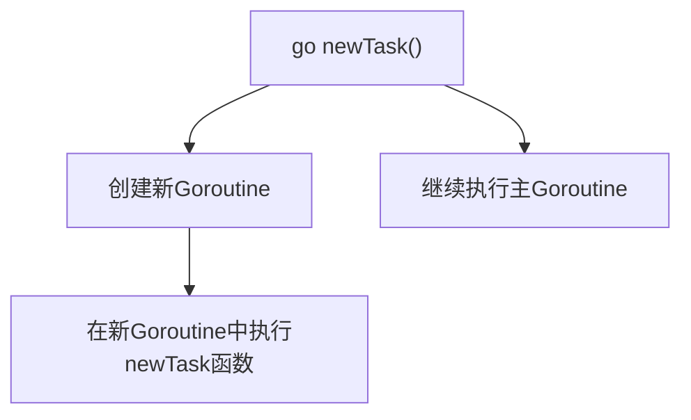
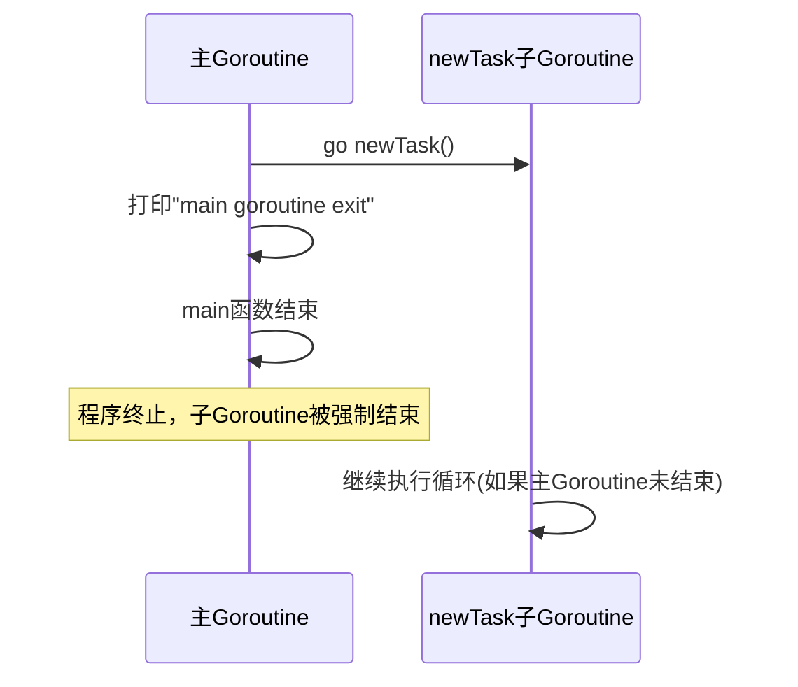
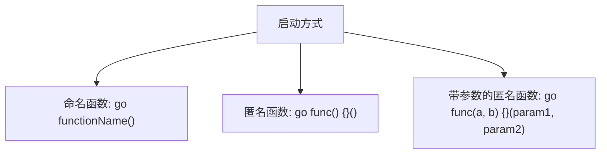

# Goroutine基础

<cite>
**Referenced Files in This Document**   
- [test1_goroutine.go](file://12-goroutine/test1_goroutine.go)
- [test2_goexit.go](file://12-goroutine/test2_goexit.go)
</cite>

## 目录
1. [Goroutine基本概念](#goroutine基本概念)
2. [Goroutine启动方式](#goroutine启动方式)
3. [主协程与子协程执行流程](#主协程与子协程执行流程)
4. [Goroutine调度机制](#goroutine调度机制)
5. [Goroutine资源开销优势](#goroutine资源开销优势)
6. [多Goroutine正确启动方式](#多goroutine正确启动方式)
7. [Goroutine泄漏防范](#goroutine泄漏防范)
8. [pprof工具使用建议](#pprof工具使用建议)

## Goroutine基本概念

Goroutine是Go语言中轻量级的执行单元，由Go运行时（runtime）管理。与操作系统线程相比，Goroutine具有极小的内存开销和高效的调度性能。在Go程序中，每个程序至少包含一个Goroutine，即主Goroutine，它从main函数开始执行。

Goroutine的设计目标是让并发编程变得简单高效。通过`go`关键字，开发者可以轻松创建新的Goroutine来并发执行函数或方法。这些Goroutine由Go运行时调度器在少量操作系统线程上多路复用，实现了高并发性能。

**Section sources**
- [test1_goroutine.go](file://12-goroutine/test1_goroutine.go#L8-L15)

## Goroutine启动方式

在Go语言中，使用`go`关键字后跟一个函数调用即可启动一个新的Goroutine。这个函数可以是命名函数、匿名函数或方法。当`go`语句执行时，函数会立即在新的Goroutine中并发执行，而不会阻塞当前Goroutine的执行。

例如，在`test1_goroutine.go`文件中，通过`go newTask()`语句启动了一个新的Goroutine来执行`newTask`函数。这种方式使得`newTask`函数与主Goroutine中的其他代码并发执行。

**Diagram sources**
- [test1_goroutine.go](file://12-goroutine/test1_goroutine.go#L20)

**Section sources**
- [test1_goroutine.go](file://12-goroutine/test1_goroutine.go#L20)

## 主协程与子协程执行流程

主Goroutine与子Goroutine的执行流程存在重要差异。主Goroutine从main函数开始执行，当main函数返回时，整个程序结束，所有其他Goroutine也会随之终止，无论它们是否完成执行。

在`test1_goroutine.go`示例中，主Goroutine启动`newTask`子Goroutine后立即打印"main goroutine exit"并结束。此时，即使`newTask`函数中的无限循环仍在运行，程序也会终止。这说明主Goroutine的生命周期决定了整个程序的生命周期。

如果取消注释主Goroutine中的无限循环代码，主Goroutine将持续运行，允许`newTask`子Goroutine有足够时间执行并输出其计数器值。这种设计模式常用于需要长时间运行的服务程序。

**Diagram sources**
- [test1_goroutine.go](file://12-goroutine/test1_goroutine.go#L20-L24)

**Section sources**
- [test1_goroutine.go](file://12-goroutine/test1_goroutine.go#L17-L32)

## Goroutine调度机制

Go运行时采用M:P:G调度模型来管理Goroutine的执行。其中，M代表操作系统线程（Machine），P代表逻辑处理器（Processor），G代表Goroutine。这种三级调度模型使得Go能够高效地在多核处理器上调度大量Goroutine。

调度器负责将Goroutine分配给可用的P，并在M上执行。当Goroutine进行阻塞操作（如I/O、channel操作或time.Sleep）时，调度器可以将其从M上移出，让其他Goroutine使用该M，从而实现高效的并发执行。这种协作式调度机制避免了传统线程上下文切换的高开销。

虽然具体的M:P:G调度实现细节未在提供的代码文件中直接体现，但`time.Sleep`的使用展示了Goroutine如何主动让出执行权，这是调度机制的重要组成部分。

**Section sources**
- [test1_goroutine.go](file://12-goroutine/test1_goroutine.go#L13)

## Goroutine资源开销优势

Goroutine相比操作系统线程具有显著的资源开销优势。每个Goroutine的初始栈大小仅为2KB，而操作系统线程通常需要1MB或更多内存。Goroutine的栈可以按需增长和收缩，这使得创建成千上万个Goroutine成为可能而不会耗尽内存。

此外，Goroutine之间的切换开销远小于线程切换，因为Goroutine切换由用户态的Go运行时调度器管理，避免了内核态和用户态之间的模式切换。这种轻量级特性使得Go程序能够轻松实现高并发，处理大量并发连接或任务。

在`test1_goroutine.go`示例中，`newTask`函数创建的Goroutine可以长时间运行而不会对系统资源造成显著压力，这体现了Goroutine的轻量级优势。

**Section sources**
- [test1_goroutine.go](file://12-goroutine/test1_goroutine.go#L8-L15)

## 多Goroutine正确启动方式

正确启动多个Goroutine需要考虑同步和通信机制。在提供的代码库中，可以看到多种启动Goroutine的方式。最常见的是使用`go`关键字后跟函数调用，如`go newTask()`。

对于匿名函数，可以直接在`go`关键字后定义函数体，如`test2_goexit.go`文件中所示的`go func() { ... }()`。这种方式常用于需要传递参数或创建闭包的场景。

当启动多个Goroutine时，通常需要使用channel或其他同步原语来协调它们的执行，确保程序正确完成所有任务后再退出。简单的无限循环（如`test2_goexit.go`中的`for { time.Sleep(1 * time.Second) }`）也可以用于保持主Goroutine运行，但这不是最佳实践。

**Diagram sources**
- [test1_goroutine.go](file://12-goroutine/test1_goroutine.go#L20)
- [test2_goexit.go](file://12-goroutine/test2_goexit.go#L11)

**Section sources**
- [test1_goroutine.go](file://12-goroutine/test1_goroutine.go#L20)
- [test2_goexit.go](file://12-goroutine/test2_goexit.go#L11-L24)

## Goroutine泄漏防范

Goroutine泄漏是指Goroutine因无法正常退出而持续占用系统资源的情况。常见原因包括：无限循环中缺少退出条件、channel操作死锁、等待永远不会发生的事件等。

在`test1_goroutine.go`中，`newTask`函数包含一个无限循环，如果主Goroutine不等待它完成就退出，这个Goroutine会被强制终止。但在实际应用中，应使用context、channel或sync.WaitGroup等机制来正确管理Goroutine的生命周期，确保它们能够优雅地退出。

防范Goroutine泄漏的最佳实践包括：为长时间运行的Goroutine设置超时、使用context传递取消信号、避免在Goroutine中持有不必要的引用，以及使用pprof等工具监控Goroutine数量。

**Section sources**
- [test1_goroutine.go](file://12-goroutine/test1_goroutine.go#L9-L15)

## pprof工具使用建议

pprof是Go语言内置的性能分析工具，可用于调试Goroutine行为。通过导入`net/http/pprof`包并启动HTTP服务器，可以收集程序运行时的Goroutine信息。

使用pprof可以查看当前运行的Goroutine堆栈跟踪，识别潜在的Goroutine泄漏。通过访问`/debug/pprof/goroutine`端点，可以获得Goroutine的详细信息，包括它们的调用栈和状态。

建议在开发和测试环境中启用pprof，在生产环境中根据安全策略谨慎使用。定期检查Goroutine数量和堆栈可以帮助发现并发问题，如死锁、资源泄漏和不合理的并发模式。

虽然pprof的具体使用代码未在提供的文件中体现，但它是调试Goroutine相关问题的重要工具，应作为Go开发者工具箱的一部分。

**Section sources**
- [test1_goroutine.go](file://12-goroutine/test1_goroutine.go)