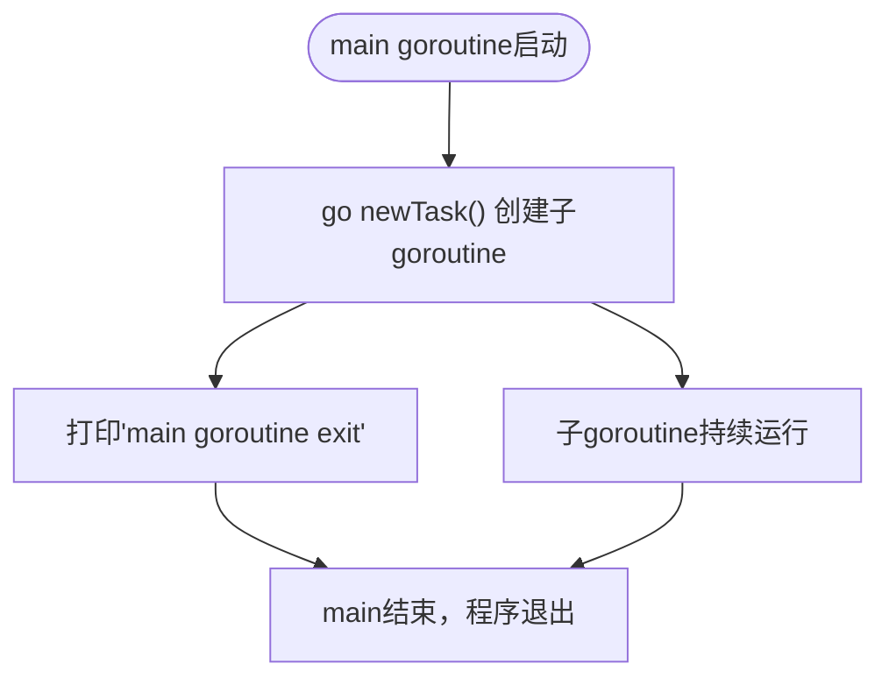
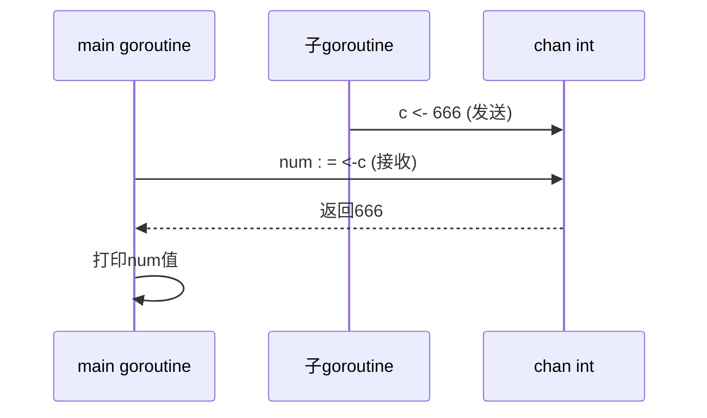
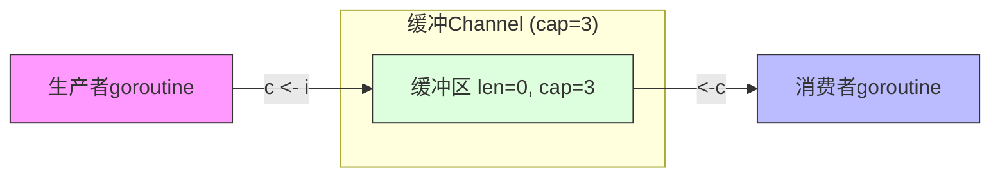
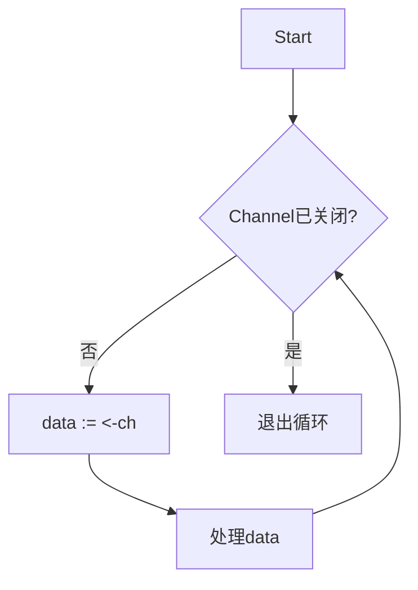
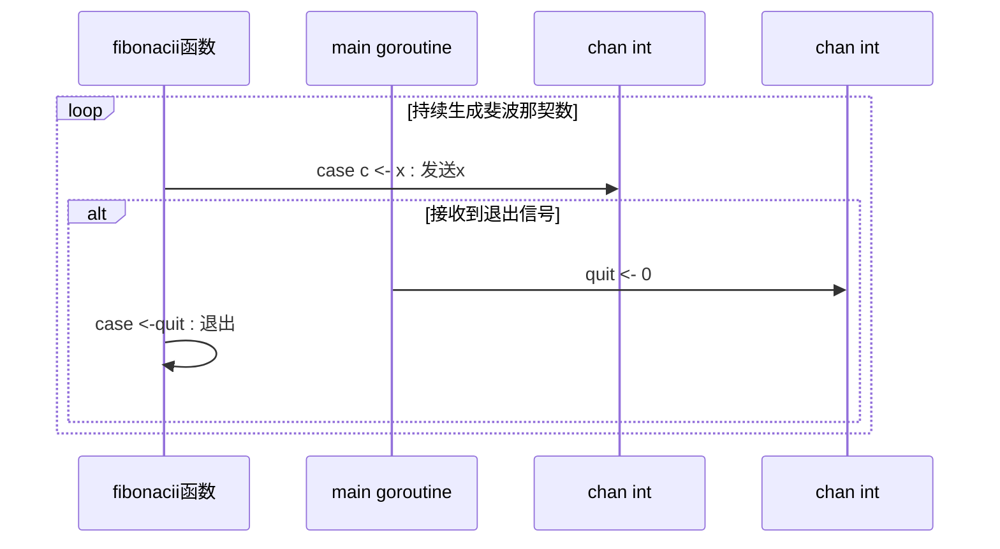

# 并发编程

<cite>
**本文档中引用的文件**   
- [test1_goroutine.go](file://12-goroutine/test1_goroutine.go)
- [test2_goexit.go](file://12-goroutine/test2_goexit.go)
- [test1_channel.go](file://13-channel/test1_channel.go)
- [test2_channel.go](file://13-channel/test2_channel.go)
- [test3_channel.go](file://13-channel/test3_channel.go)
- [test4_channel.go](file://13-channel/test4_channel.go)
- [test5_channel.go](file://13-channel/test5_channel.go)
</cite>

## 目录
1. [引言](#引言)
2. [Goroutine 基础](#goroutine-基础)
3. [Channel 核心机制](#channel-核心机制)
4. [并发模式实践](#并发模式实践)
5. [同步原语与协作](#同步原语与协作)
6. [常见并发陷阱](#常见并发陷阱)
7. [性能调优与调试](#性能调优与调试)
8. [总结](#总结)

## 引言
Go语言以其简洁高效的并发模型著称，核心在于Goroutine和Channel两大机制。本指南基于`12-goroutine`与`13-channel`目录下的示例代码，系统性地阐述Go并发编程的核心概念、典型模式与最佳实践。通过分析实际代码片段，帮助开发者深入理解轻量级线程调度、通信同步机制及常见问题规避策略。

## Goroutine 基础

Goroutine是Go运行时管理的轻量级线程，由`go`关键字启动，具有极低的内存开销（初始栈仅2KB）和高效的调度性能。

### 启动与执行
通过`go`关键字可启动一个函数或匿名函数作为独立的Goroutine运行。主Goroutine（main函数）结束后，所有子Goroutine将被强制终止。



**图示来源**
- [test1_goroutine.go](file://12-goroutine/test1_goroutine.go#L20)

**本节来源**
- [test1_goroutine.go](file://12-goroutine/test1_goroutine.go#L8-L32)
- [test2_goexit.go](file://12-goroutine/test2_goexit.go#L11-L24)

### 调度与生命周期
Goroutine由Go调度器（GMP模型）在用户态进行高效调度，无需操作系统介入。其生命周期独立于创建者，但受主程序运行状态影响。使用`runtime.Goexit()`可显式终止当前Goroutine，触发延迟调用（defer）后退出。

## Channel 核心机制

Channel是Goroutine间通信的管道，遵循“不要通过共享内存来通信，而应通过通信来共享内存”的哲学。

### 创建与基本操作
Channel通过`make(chan T)`创建，支持发送（`ch <- data`）和接收（`data := <-ch`）操作，两者均为阻塞式。



**图示来源**
- [test1_channel.go](file://13-channel/test1_channel.go#L8-L15)

**本节来源**
- [test1_channel.go](file://13-channel/test1_channel.go#L6-L20)

### 缓冲机制
带缓冲的Channel（`make(chan T, cap)`）提供有限容量的队列，发送操作在缓冲未满时非阻塞，接收在缓冲非空时非阻塞。



**图示来源**
- [test2_channel.go](file://13-channel/test2_channel.go#L8)

**本节来源**
- [test2_channel.go](file://13-channel/test2_channel.go#L8-L30)

### 关闭与遍历
Channel可被关闭（`close(ch)`），表示不再有数据发送。接收方可通过`v, ok := <-ch`判断Channel是否已关闭（ok为false）。推荐使用`for range`语法安全遍历已关闭的Channel。



**图示来源**
- [test3_channel.go](file://13-channel/test3_channel.go#L14-L18)
- [test4_channel.go](file://13-channel/test4_channel.go#L14-L16)

**本节来源**
- [test3_channel.go](file://13-channel/test3_channel.go#L5-L26)
- [test4_channel.go](file://13-channel/test4_channel.go#L5-L23)

### 多路复用（Select）
`select`语句用于监听多个Channel的操作，实现非阻塞或多路等待，是构建复杂并发逻辑的关键。



**图示来源**
- [test5_channel.go](file://13-channel/test5_channel.go#L8-L18)

**本节来源**
- [test5_channel.go](file://13-channel/test5_channel.go#L4-L36)

## 并发模式实践

### 生产者-消费者模型
一个或多个Goroutine生产数据到Channel，另一个或多个Goroutine从Channel消费数据，实现解耦与异步处理。

**本节来源**
- [test2_channel.go](file://13-channel/test2_channel.go#L12-L25)

### 扇入（Fan-in）与扇出（Fan-out）
- **扇出**：将一个Channel的数据分发给多个Worker Goroutine处理，提升处理能力。
- **扇入**：将多个Goroutine的处理结果汇聚到一个Channel，便于统一处理。

**本节来源**
- [test5_channel.go](file://13-channel/test5_channel.go#L25-L33)

### 信号量控制
利用带缓冲的Channel实现信号量，控制并发访问资源的数量，防止资源过载。

```go
// 示例：限制最大并发数为3
semaphore := make(chan struct{}, 3)
// 获取信号量
semaphore <- struct{}{}
// ... 执行操作 ...
// 释放信号量
<-semaphore
```

## 同步原语与协作

虽然Channel是首选，但`sync`包提供的原语在特定场景下不可或缺。

### Mutex（互斥锁）
用于保护临界区，防止多个Goroutine同时访问共享资源，避免竞态条件。

### WaitGroup
用于等待一组Goroutine完成。通过`Add()`增加计数，`Done()`减少计数，`Wait()`阻塞直到计数归零。

**本节来源**
- [test2_goexit.go](file://12-goroutine/test2_goexit.go#L24-L34) (虽未直接使用，但展示了多Goroutine协作场景)

## 常见并发陷阱

### 竞态条件（Race Condition）
多个Goroutine无序访问共享变量导致结果不确定。解决方案：使用Channel通信或`sync.Mutex`加锁。

### 死锁（Deadlock）
Goroutine因相互等待而永久阻塞。常见原因：Channel操作不匹配（如发送无接收）、锁获取顺序不当。

### 资源泄漏
Goroutine因Channel阻塞而无法退出，导致内存和资源泄漏。确保所有启动的Goroutine都有明确的退出路径。

**本节来源**
- [test1_goroutine.go](file://12-goroutine/test1_goroutine.go#L20) (潜在泄漏：子goroutine无限循环)
- [test1_channel.go](file://13-channel/test1_channel.go#L15) (潜在死锁：若无接收者，发送会阻塞)

## 性能调优与调试

### 调优建议
- **合理使用缓冲**：根据生产消费速度差异设置Channel缓冲大小，减少阻塞。
- **避免过度同步**：优先使用无锁的Channel通信，减少锁竞争。
- **控制Goroutine数量**：使用`sync.WaitGroup`或信号量模式管理Goroutine生命周期，防止泛滥。

### 调试技巧
- **使用`-race`标志**：编译时添加`-race`启用竞态检测器，帮助发现数据竞争。
- **日志与监控**：在关键路径添加日志，监控Goroutine数量和Channel状态。

## 总结
Go的并发模型以Goroutine和Channel为核心，提供了强大而简洁的并发编程能力。掌握其启动、通信、同步机制，并熟练运用生产者-消费者、扇入扇出等模式，同时警惕竞态、死锁等陷阱，是构建高效稳定并发程序的关键。结合`sync`包原语和有效的调试手段，开发者能够充分发挥Go在并发领域的优势。