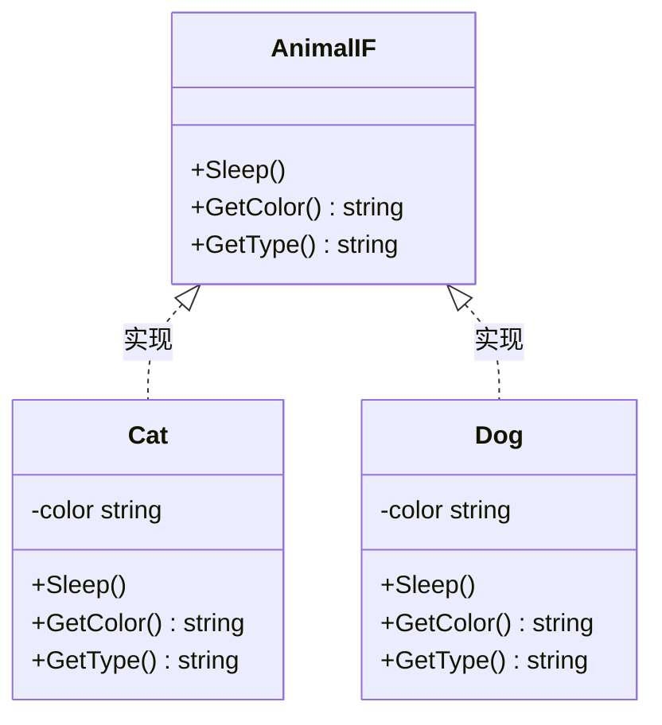
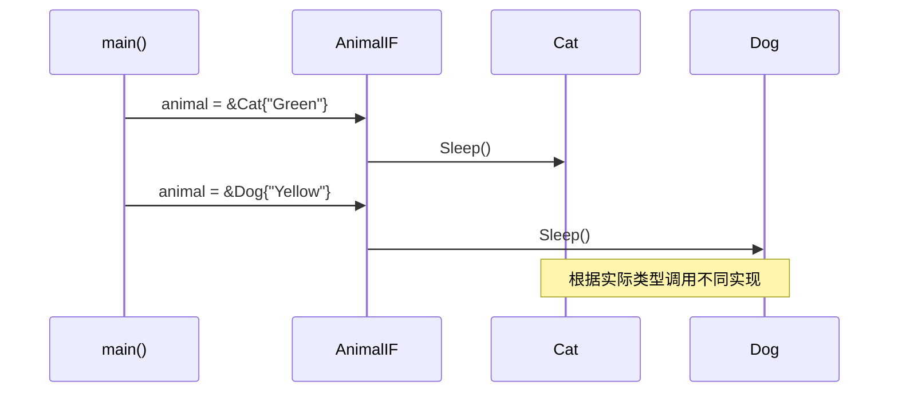
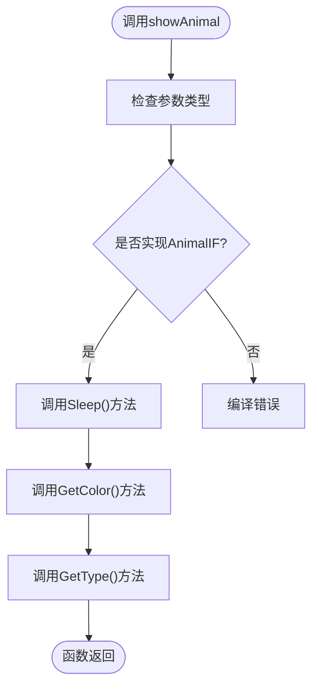
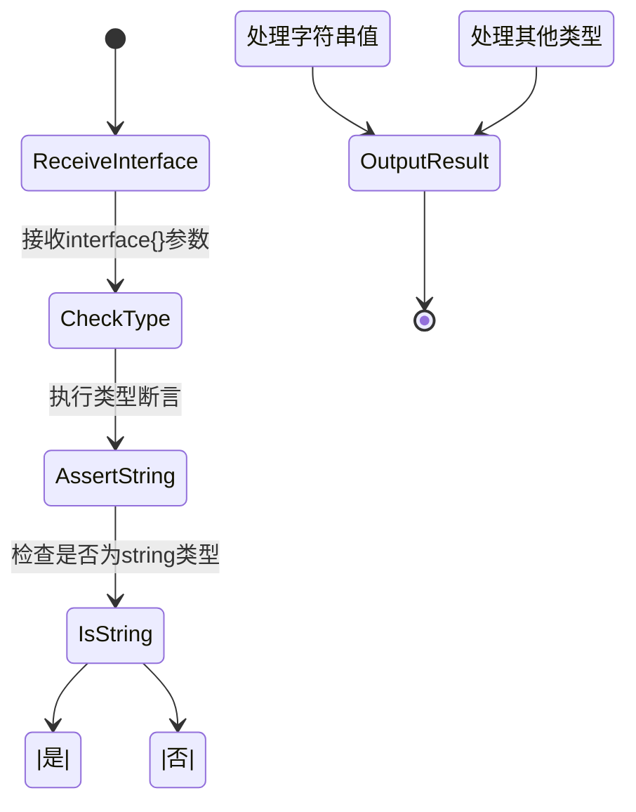

# 接口定义与多态机制

<cite>
**Referenced Files in This Document**  
- [test4_interface.go](file://10-OOP/test4_interface.go)
- [test5_interface.go](file://10-OOP/test5_interface.go)
</cite>

## 目录
1. [引言](#引言)
2. [接口定义与实现](#接口定义与实现)
3. [多态行为分析](#多态行为分析)
4. [接口作为函数参数](#接口作为函数参数)
5. [空接口与类型断言](#空接口与类型断言)
6. [接口设计哲学](#接口设计哲学)
7. [结论](#结论)

## 引言
本文档深入解析Go语言中接口的核心机制，重点分析`test4_interface.go`和`test5_interface.go`两个示例文件。通过具体代码实例，详细阐述Go语言中接口的定义、隐式实现、多态行为以及空接口的使用方法。文档旨在帮助开发者理解接口在解耦组件、实现依赖倒置原则中的重要作用，并掌握Go语言特有的小接口设计哲学与测试便利性。

## 接口定义与实现

在Go语言中，接口是一种类型，它定义了一组方法签名。`AnimalIF`接口定义了三个方法：`Sleep()`、`GetColor()`和`GetType()`，这些方法共同构成了动物行为的抽象规范。

`Cat`和`Dog`结构体通过实现`AnimalIF`接口的所有方法，隐式地实现了该接口。这种实现方式不需要显式的`implements`关键字，只要结构体实现了接口的所有方法，就自动被视为实现了该接口。这种隐式实现机制降低了代码的耦合度，使得类型与接口之间的关系更加灵活。

**Diagram sources**
- [test4_interface.go](file://10-OOP/test4_interface.go#L5-L9)
- [test4_interface.go](file://10-OOP/test4_interface.go#L12-L14)
- [test4_interface.go](file://10-OOP/test4_interface.go#L29-L31)

**Section sources**
- [test4_interface.go](file://10-OOP/test4_interface.go#L5-L49)

## 多态行为分析

Go语言中的多态通过接口变量实现。当一个接口变量被赋值为某个具体类型的实例时，调用接口方法会根据实际类型执行相应的方法实现。在`test4_interface.go`的`main`函数中，`animal`变量先后被赋值为`Cat`和`Dog`的实例，调用`animal.Sleep()`时会根据实际类型分别执行`Cat`和`Dog`的`Sleep`方法。

这种多态机制使得程序可以在运行时动态决定执行哪个具体实现，提高了代码的灵活性和可扩展性。接口变量本质上是一个指针，指向具体类型的实例，这种设计保证了方法调用的高效性。

**Diagram sources**
- [test4_interface.go](file://10-OOP/test4_interface.go#L52-L68)

**Section sources**
- [test4_interface.go](file://10-OOP/test4_interface.go#L52-L68)

## 接口作为函数参数

接口作为函数参数是Go语言实现代码解耦的重要手段。`showAnimal`函数接受`AnimalIF`接口类型的参数，这意味着它可以处理任何实现了`AnimalIF`接口的类型实例。这种设计使得函数具有高度的通用性和扩展性。

当`showAnimal`函数被调用时，传入的`Cat`或`Dog`实例会自动转换为`AnimalIF`接口类型，函数内部通过接口调用相应的方法。这种机制实现了依赖倒置原则，即高层模块（函数）不依赖于低层模块（具体类型）的实现细节，而是依赖于抽象（接口）。

**Diagram sources**
- [test4_interface.go](file://10-OOP/test4_interface.go#L45-L49)

**Section sources**
- [test4_interface.go](file://10-OOP/test4_interface.go#L45-L49)

## 空接口与类型断言

空接口`interface{}`是Go语言中的万能数据类型，它可以存储任何类型的值。在`test5_interface.go`中，`myFunc`函数接受`interface{}`类型的参数，可以接收`Book`、整数、字符串、浮点数等各种类型的值。

由于空接口隐藏了具体类型信息，需要使用类型断言来安全地获取底层数据类型。类型断言`arg.(string)`尝试将接口值转换为字符串类型，返回转换后的值和一个布尔标志，用于判断转换是否成功。这种机制避免了类型转换时的运行时错误，提高了程序的健壮性。

**Diagram sources**
- [test5_interface.go](file://10-OOP/test5_interface.go#L5-L20)

**Section sources**
- [test5_interface.go](file://10-OOP/test5_interface.go#L5-L20)

## 接口设计哲学

Go语言推崇小接口设计哲学，即接口应该只包含少量紧密相关的方法。`AnimalIF`接口只定义了三个与动物行为直接相关的方法，这种小接口设计使得接口更容易被实现和测试。

隐式实现机制带来了显著的测试便利性。在单元测试中，可以轻松创建模拟对象（mock）来实现接口，而无需修改被测试代码。这种设计降低了测试的复杂性，提高了代码的可测试性。

接口在解耦组件方面发挥着关键作用。通过定义清晰的接口契约，不同的组件可以独立开发和演化，只要保持接口兼容性，就可以无缝集成。这种设计模式促进了代码的模块化和重用，是构建大型可维护系统的基础。

## 结论

Go语言的接口机制通过隐式实现和小接口设计，提供了一种简洁而强大的抽象手段。多态行为使得程序具有高度的灵活性和可扩展性，空接口和类型断言机制则提供了类型安全的泛型编程能力。接口作为函数参数的设计模式实现了代码解耦和依赖倒置，是构建高质量Go应用程序的核心实践。掌握这些接口机制对于编写优雅、可维护的Go代码至关重要。