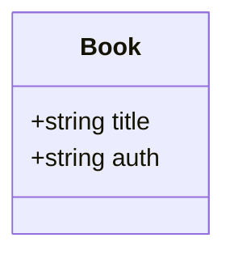
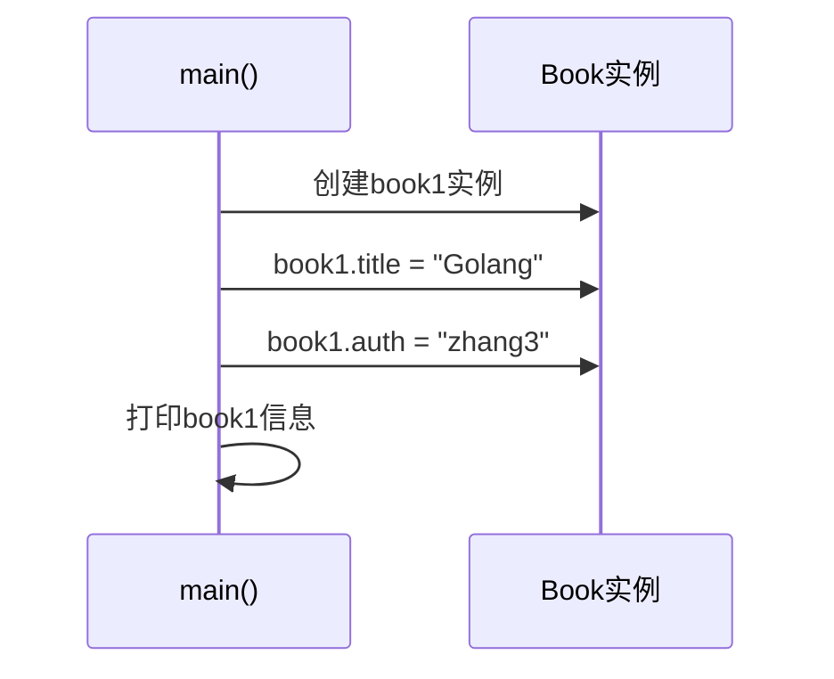
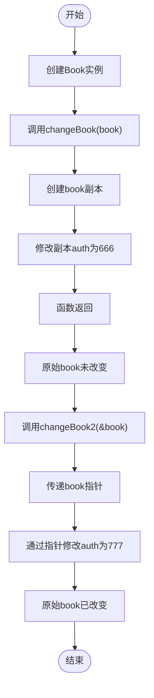
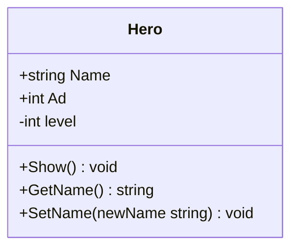
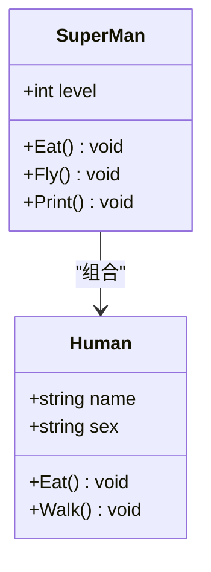
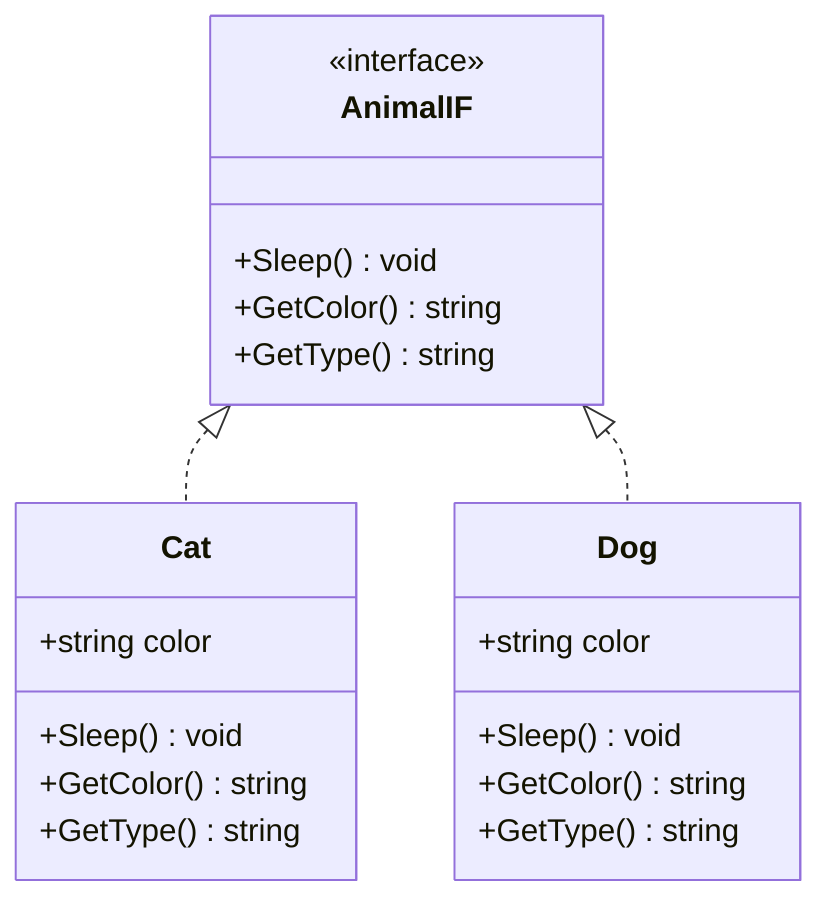

# 结构体定义与使用

<cite>
**Referenced Files in This Document**   
- [test1_struct.go](file://10-OOP/test1_struct.go)
- [test2_class.go](file://10-OOP/test2_class.go)
- [test3_class2.go](file://10-OOP/test3_class2.go)
- [test4_interface.go](file://10-OOP/test4_interface.go)
- [test5_interface.go](file://10-OOP/test5_interface.go)
</cite>

## 目录
1. [结构体基础定义](#结构体基础定义)
2. [结构体变量操作](#结构体变量操作)
3. [函数参数传递机制](#函数参数传递机制)
4. [结构体方法与接收器](#结构体方法与接收器)
5. [结构体继承与组合](#结构体继承与组合)
6. [接口与多态](#接口与多态)
7. [常见误区与最佳实践](#常见误区与最佳实践)

## 结构体基础定义

Go语言中的结构体（struct）是一种复合数据类型，用于将多个不同类型的数据字段组合在一起。通过`type`关键字可以定义新的结构体类型，为数据建模提供强大的支持。

在`test1_struct.go`文件中，定义了`Book`结构体类型，包含`title`和`auth`两个字符串字段。这种定义方式清晰地描述了一本书的基本属性，是Go语言中常见的数据建模方法。

**Diagram sources**
- [test1_struct.go](file://10-OOP/test1_struct.go#L8-L11)

**Section sources**
- [test1_struct.go](file://10-OOP/test1_struct.go#L8-L11)

## 结构体变量操作

结构体变量的创建、字段赋值与访问是日常开发中的基本操作。通过实例化结构体类型，可以创建具体的对象实例，并通过点号操作符访问和修改其字段值。

在`test1_struct.go`的`main`函数中，通过`var book1 Book`声明了一个`Book`类型的变量，然后分别通过`book1.title = "Golang"`和`book1.auth = "zhang3"`对字段进行赋值。这种方式直观地展示了如何操作结构体实例的各个属性。

**Diagram sources**
- [test1_struct.go](file://10-OOP/test1_struct.go#L25-L32)

**Section sources**
- [test1_struct.go](file://10-OOP/test1_struct.go#L25-L32)

## 函数参数传递机制

Go语言中的函数参数传递机制对于理解结构体行为至关重要。通过对比值传递和指针传递，可以深入理解Go语言的内存模型和数据共享方式。

`changeBook`函数采用值传递方式，接收`Book`类型的副本，对参数的修改不会影响原始对象；而`changeBook2`函数采用指针传递方式，接收`*Book`类型的指针，可以直接修改原始对象的数据。这种设计体现了Go语言在性能和安全性之间的平衡。

**Diagram sources**
- [test1_struct.go](file://10-OOP/test1_struct.go#L13-L21)
- [test1_struct.go](file://10-OOP/test1_struct.go#L25-L32)

**Section sources**
- [test1_struct.go](file://10-OOP/test1_struct.go#L13-L21)
- [test1_struct.go](file://10-OOP/test1_struct.go#L25-L32)

## 结构体方法与接收器

在Go语言中，可以为结构体定义方法，从而实现面向对象编程的特性。方法接收器可以是值类型或指针类型，这决定了方法是操作对象的副本还是直接操作对象本身。

`test2_class.go`文件中的`Hero`结构体展示了如何定义结构体方法。`SetName`方法使用指针接收器`*Hero`，确保能够修改调用对象的实际数据，而不是其副本。这种设计模式在需要修改对象状态时非常有用。

**Diagram sources**
- [test2_class.go](file://10-OOP/test2_class.go#L5-L10)
- [test2_class.go](file://10-OOP/test2_class.go#L28-L41)

**Section sources**
- [test2_class.go](file://10-OOP/test2_class.go#L5-L10)
- [test2_class.go](file://10-OOP/test2_class.go#L28-L41)

## 结构体继承与组合

Go语言不支持传统的类继承，而是通过结构体嵌套实现组合，这是一种更灵活的设计方式。通过将一个结构体作为另一个结构体的匿名字段，可以实现方法和属性的"继承"。

`test3_class2.go`文件中的`SuperMan`结构体嵌套了`Human`结构体，从而继承了`Human`的所有方法。同时，`SuperMan`可以重写父类方法（如`Eat`方法）并添加新方法（如`Fly`方法），展示了Go语言组合机制的强大功能。

**Diagram sources**
- [test3_class2.go](file://10-OOP/test3_class2.go#L4-L7)
- [test3_class2.go](file://10-OOP/test3_class2.go#L19-L23)
- [test3_class2.go](file://10-OOP/test3_class2.go#L9-L15)
- [test3_class2.go](file://10-OOP/test3_class2.go#L26-L39)

**Section sources**
- [test3_class2.go](file://10-OOP/test3_class2.go#L4-L7)
- [test3_class2.go](file://10-OOP/test3_class2.go#L19-L23)
- [test3_class2.go](file://10-OOP/test3_class2.go#L9-L15)
- [test3_class2.go](file://10-OOP/test3_class2.go#L26-L39)

## 接口与多态

Go语言的接口机制实现了多态性，允许不同类型的对象以统一的方式被处理。接口定义了一组方法签名，任何实现了这些方法的类型都自动满足该接口。

`test4_interface.go`文件中的`AnimalIF`接口定义了动物的通用行为，`Cat`和`Dog`结构体分别实现了该接口。通过接口变量，可以统一处理不同类型的动物对象，体现了多态编程的核心思想。

**Diagram sources**
- [test4_interface.go](file://10-OOP/test4_interface.go#L5-L9)
- [test4_interface.go](file://10-OOP/test4_interface.go#L12-L14)
- [test4_interface.go](file://10-OOP/test4_interface.go#L29-L31)

**Section sources**
- [test4_interface.go](file://10-OOP/test4_interface.go#L5-L9)
- [test4_interface.go](file://10-OOP/test4_interface.go#L12-L14)
- [test4_interface.go](file://10-OOP/test4_interface.go#L29-L31)

## 常见误区与最佳实践

在使用Go语言结构体时，开发者常会遇到一些误区。首先是字段可见性规则：字段名首字母大写表示导出（public），可在包外访问；首字母小写表示非导出（private），仅在包内可见。这一规则简单而有效，避免了复杂的访问修饰符。

其次是接收器选择问题：当方法需要修改接收器对象时，应使用指针接收器；当方法仅读取对象数据且结构体较大时，也建议使用指针接收器以避免不必要的复制开销。对于小型结构体的只读操作，值接收器可能是更好的选择。

最后，`test5_interface.go`文件展示了`interface{}`作为万能数据类型的使用，以及类型断言机制的重要性。这为编写通用函数提供了可能，但也需要谨慎处理类型安全问题。

**Section sources**
- [test1_struct.go](file://10-OOP/test1_struct.go#L8-L11)
- [test2_class.go](file://10-OOP/test2_class.go#L5-L10)
- [test5_interface.go](file://10-OOP/test5_interface.go#L3-L15)