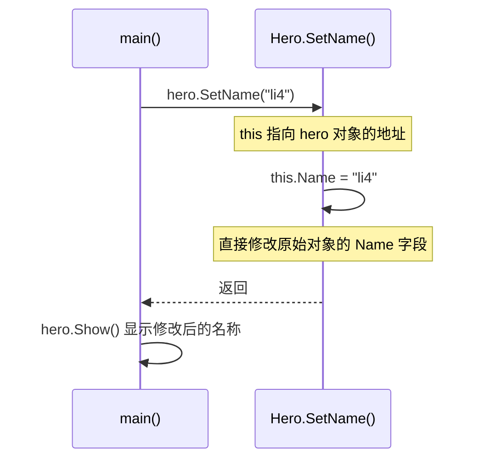
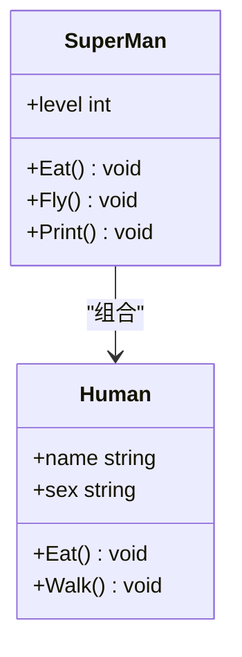

# 结构体方法与类行为模拟

<cite>
**Referenced Files in This Document**   
- [test2_class.go](file://10-OOP/test2_class.go)
- [test3_class2.go](file://10-OOP/test3_class2.go)
</cite>

## 目录
1. [引言](#引言)
2. [结构体方法与接收器](#结构体方法与接收器)
3. [值接收器与指针接收器](#值接收器与指针接收器)
4. [组合实现的继承机制](#组合实现的继承机制)
5. [方法重写与新方法定义](#方法重写与新方法定义)
6. [组合优于继承的设计理念](#组合优于继承的设计理念)
7. [对象模型构建指导](#对象模型构建指导)
8. [结论](#结论)

## 引言
Go语言作为一门结构化编程语言，虽然没有传统面向对象语言中的类（class）概念，但通过结构体（struct）和方法（method）的结合，能够有效地模拟类的行为。本文将深入探讨如何在Go语言中为结构体定义方法，实现类似类的封装特性，并通过`test2_class.go`和`test3_class2.go`中的具体示例，详细解析值接收器与指针接收器的区别、通过匿名字段实现的组合继承机制，以及方法重写等核心概念。

## 结构体方法与接收器

在Go语言中，方法是与特定类型关联的函数。通过为结构体定义方法，可以将数据和操作数据的行为封装在一起，形成一个完整的对象模型。方法的定义使用特殊的语法，在`func`关键字后紧跟一个接收器（receiver），接收器指定了该方法所属的类型。

**Section sources**
- [test2_class.go](file://10-OOP/test2_class.go#L5-L10)
- [test2_class.go](file://10-OOP/test2_class.go#L28-L32)

## 值接收器与指针接收器

Go语言中的方法接收器分为两种：值接收器和指针接收器。理解它们的区别对于正确设计对象的行为至关重要。

### 值接收器
当使用值接收器时，方法内部操作的是调用该方法的对象的一个副本。这意味着在方法内部对结构体字段的任何修改都只会影响这个副本，而不会影响原始对象。这在`test2_class.go`文件中最初被注释掉的`SetName`方法中有所体现，其接收器为`this Hero`。

### 指针接收器
当使用指针接收器时，方法内部操作的是原始对象的引用。因此，对结构体字段的修改会直接反映在原始对象上。在`test2_class.go`中，`SetName`方法的接收器被定义为`this *Hero`，即一个指向`Hero`结构体的指针。这是该方法能够真正修改`hero`对象名称的关键。当`hero.SetName("li4")`被调用时，传递给方法的是`hero`对象的地址，方法内部通过解引用修改了该地址处的`Name`字段，从而实现了状态的持久化变更。

**Diagram sources**
- [test2_class.go](file://10-OOP/test2_class.go#L38-L41)

**Section sources**
- [test2_class.go](file://10-OOP/test2_class.go#L38-L41)

## 组合实现的继承机制

Go语言不支持传统的类继承，而是推崇通过“组合”（Composition）来实现代码复用和类型扩展。`test3_class2.go`文件中的`SuperMan`结构体完美地展示了这一理念。

`SuperMan`结构体通过将`Human`结构体作为其一个匿名字段（即不指定字段名，只写类型名）来“继承”`Human`的所有字段和方法。这种组合方式使得`SuperMan`实例可以直接访问`Human`的`name`和`sex`字段，并调用`Eat`和`Walk`等方法，仿佛它们是`SuperMan`自身的一部分。

**Diagram sources**
- [test3_class2.go](file://10-OOP/test3_class2.go#L4-L7)
- [test3_class2.go](file://10-OOP/test3_class2.go#L19-L23)

**Section sources**
- [test3_class2.go](file://10-OOP/test3_class2.go#L19-L23)

## 方法重写与新方法定义

组合不仅带来了继承，还允许子类型对父类型的行为进行定制。

### 方法重写
当`SuperMan`需要改变从`Human`继承来的`Eat`方法的行为时，它可以在自己的定义中提供一个同名的方法。在`test3_class2.go`中，`func (this *SuperMan) Eat()`方法就重写了`Human`的`Eat`方法。当一个`SuperMan`实例调用`Eat()`时，Go运行时会优先调用`SuperMan`自身定义的方法，而不是`Human`的方法，从而实现了多态性。

### 新方法定义
除了重写，`SuperMan`还可以定义全新的、`Human`所不具备的方法。例如，`Fly()`方法就是`SuperMan`特有的能力，它扩展了`SuperMan`的功能，使其超越了普通`Human`的范畴。

**Section sources**
- [test3_class2.go](file://10-OOP/test3_class2.go#L26-L28)
- [test3_class2.go](file://10-OOP/test3_class2.go#L31-L33)

## 组合优于继承的设计理念

Go语言的设计哲学强调“组合优于继承”。与传统的继承相比，组合提供了更大的灵活性和更低的耦合度。

- **灵活性**：一个类型可以组合多个不同的类型，从而获得多种能力，这在单继承的语言中是难以实现的。
- **低耦合**：组合关系比继承关系更松散。子类型不依赖于父类型的内部实现细节，只需关心其公开的接口。
- **清晰性**：组合明确地表达了“A由B和C组成”的关系，语义上比“D是B的一种”更直接和易于理解。

在`SuperMan`的例子中，我们清晰地看到`SuperMan`是由一个`Human`和一个`level`整数组成的，这种构成关系一目了然。

## 对象模型构建指导

基于以上分析，开发者在Go语言中构建对象模型时应遵循以下指导原则：

1.  **优先使用结构体和方法**：将相关的数据和操作封装在结构体中，通过方法来定义其行为。
2.  **谨慎选择接收器**：如果方法需要修改接收器的状态，必须使用指针接收器；如果只是读取状态，值接收器通常是安全且高效的。
3.  **拥抱组合**：当需要代码复用或扩展功能时，优先考虑将现有类型作为匿名字段嵌入新类型中，而不是寻找继承的替代方案。
4.  **利用方法重写进行定制**：通过在组合类型中定义同名方法来覆盖嵌入类型的行为，实现多态。

## 结论

通过`test2_class.go`和`test3_class2.go`中的示例，我们可以看到Go语言虽然没有类和继承的语法糖，但通过结构体方法、指针接收器和匿名字段组合，完全能够构建出强大、灵活且易于维护的面向对象程序。理解值/指针接收器的区别和组合机制是掌握Go语言面向对象编程范式的关键。开发者应充分利用这些特性，遵循“组合优于继承”的设计原则，构建出符合Go语言哲学的高质量代码。