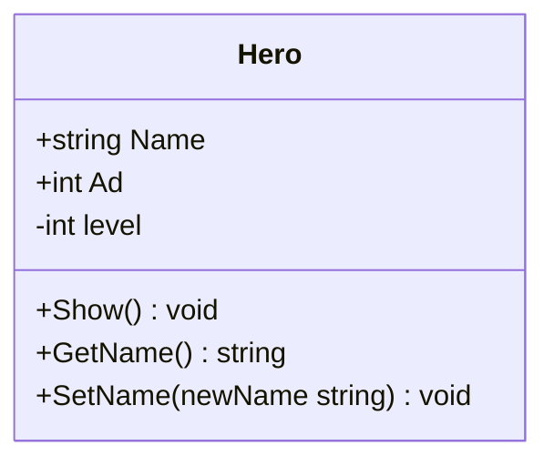
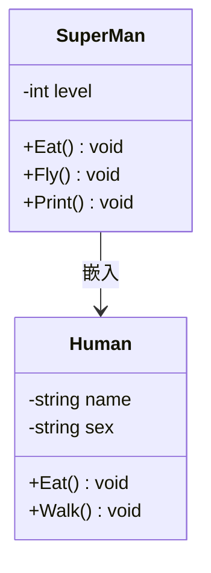
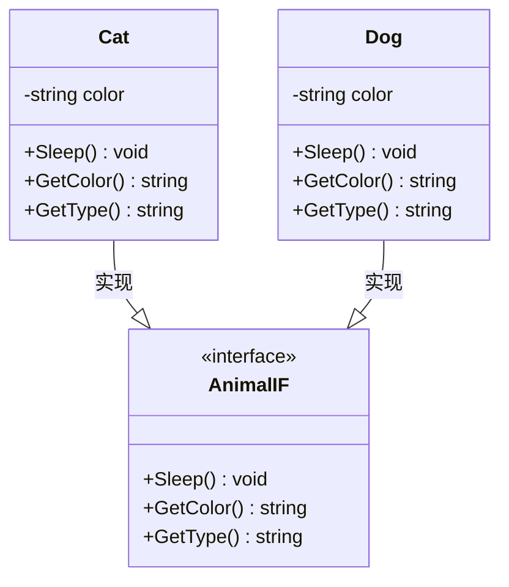
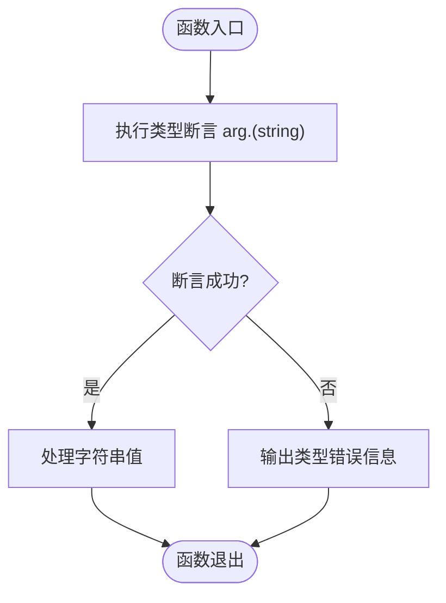

# 面向对象编程

<cite>
**本文档中引用的文件**  
- [test1_struct.go](file://10-OOP/test1_struct.go)
- [test2_class.go](file://10-OOP/test2_class.go)
- [test3_class2.go](file://10-OOP/test3_class2.go)
- [test4_interface.go](file://10-OOP/test4_interface.go)
- [test5_interface.go](file://10-OOP/test5_interface.go)
</cite>

## 目录
1. [简介](#简介)
2. [结构体定义与使用](#结构体定义与使用)
3. [方法与类行为模拟](#方法与类行为模拟)
4. [继承与组合机制](#继承与组合机制)
5. [接口与多态实现](#接口与多态实现)
6. [空接口与类型断言](#空接口与类型断言)
7. [常见设计模式应用](#常见设计模式应用)
8. [初学者常见误区](#初学者常见误区)
9. [总结](#总结)

## 简介
Go语言虽然没有传统意义上的“类”概念，但通过结构体（struct）、方法（method）和接口（interface）的组合，实现了完整的面向对象编程范式。本文基于`10-OOP`目录下的五个核心示例文件，系统讲解Go语言中面向对象编程的核心机制，包括结构体的定义与使用、方法绑定、嵌入式继承、接口的隐式实现与多态特性，并深入探讨组合优于继承的设计哲学。

## 结构体定义与使用
结构体是Go语言中组织数据的基本单元，用于将不同类型的数据字段组合成一个复合类型。在`test1_struct.go`中，定义了`Book`结构体，包含`title`和`auth`两个字段。

结构体的使用支持值传递和指针传递两种方式。值传递会创建副本，对副本的修改不会影响原始对象；而指针传递则直接操作原对象。示例中`changeBook`函数接收值类型参数，修改无效；而`changeBook2`接收指针类型参数，成功修改了原始结构体的`auth`字段。

**Section sources**
- [test1_struct.go](file://10-OOP/test1_struct.go#L8-L11)

## 方法与类行为模拟
Go语言通过在函数签名中添加“接收者”（receiver）来为结构体定义方法，从而模拟类的行为。接收者可以是值类型或指针类型。在`test2_class.go`中，`Hero`结构体定义了`Show`、`GetName`和`SetName`三个方法。

当接收者为指针类型（如`*Hero`）时，方法可以直接修改结构体的字段；若为值类型，则操作的是副本。示例中`SetName`方法使用指针接收者，能够成功修改`Name`字段。此外，Go语言通过字段名首字母大小写控制可见性：大写为导出（public），小写为私有（private）。

**Diagram sources**
- [test2_class.go](file://10-OOP/test2_class.go#L5-L10)
- [test2_class.go](file://10-OOP/test2_class.go#L28-L41)

**Section sources**
- [test2_class.go](file://10-OOP/test2_class.go#L5-L41)

## 继承与组合机制
Go语言不支持传统类继承，而是通过结构体嵌入（embedding）实现类似继承的效果，这体现了“组合优于继承”的设计原则。在`test3_class2.go`中，`SuperMan`结构体嵌入了`Human`结构体，从而自动获得了`Human`的字段和方法。

子类可以重写父类方法（如`SuperMan`重写了`Eat`方法），也可以定义新方法（如`Fly`）。通过嵌入，`SuperMan`实例可以直接调用`Walk`等继承自`Human`的方法。这种组合方式避免了多继承的复杂性，同时保持了代码的灵活性和可维护性。

**Diagram sources**
- [test3_class2.go](file://10-OOP/test3_class2.go#L19-L23)
- [test3_class2.go](file://10-OOP/test3_class2.go#L9-L15)
- [test3_class2.go](file://10-OOP/test3_class2.go#L26-L39)

**Section sources**
- [test3_class2.go](file://10-OOP/test3_class2.go#L1-L60)

## 接口与多态实现
接口是Go语言实现多态的核心机制。接口定义了一组方法签名，任何类型只要实现了这些方法，就自动实现了该接口，无需显式声明。在`test4_interface.go`中，`AnimalIF`接口定义了`Sleep`、`GetColor`和`GetType`三个方法。

`Cat`和`Dog`结构体分别实现了`AnimalIF`接口的所有方法，因此它们的实例可以赋值给`AnimalIF`类型的变量。函数`showAnimal`接收`AnimalIF`接口类型参数，能够接受任何实现了该接口的类型实例，体现了多态性。这种隐式实现机制降低了类型间的耦合度。

**Diagram sources**
- [test4_interface.go](file://10-OOP/test4_interface.go#L5-L9)
- [test4_interface.go](file://10-OOP/test4_interface.go#L12-L14)
- [test4_interface.go](file://10-OOP/test4_interface.go#L29-L31)
- [test4_interface.go](file://10-OOP/test4_interface.go#L16-L26)
- [test4_interface.go](file://10-OOP/test4_interface.go#L33-L43)

**Section sources**
- [test4_interface.go](file://10-OOP/test4_interface.go#L5-L68)

## 空接口与类型断言
`interface{}`是Go语言中的万能类型，可以存储任何类型的值。在`test5_interface.go`中，`myFunc`函数接收`interface{}`类型参数，能够接受`Book`、整数、字符串、浮点数等各种类型。

由于`interface{}`在使用时需要知道其底层具体类型，Go提供了“类型断言”机制。通过`value, ok := arg.(string)`语法，可以安全地判断接口变量是否为特定类型，并获取其具体值。若断言失败，`ok`为`false`，避免程序崩溃。

**Diagram sources**
- [test5_interface.go](file://10-OOP/test5_interface.go#L5-L19)
- [test5_interface.go](file://10-OOP/test5_interface.go#L22-L24)

**Section sources**
- [test5_interface.go](file://10-OOP/test5_interface.go#L1-L34)

## 常见设计模式应用
### 工厂模式
可通过函数返回接口类型来实现工厂模式。例如，定义一个`NewAnimal(color string, kind string)`函数，根据`kind`参数返回`*Cat`或`*Dog`实例，而返回类型为`AnimalIF`接口，调用者无需关心具体实现类型。

### 适配器模式
当现有类型的方法签名与接口不匹配时，可创建一个适配器结构体，嵌入原类型并实现所需接口方法，从而让原类型适配新接口。

## 初学者常见误区
1. **混淆值接收者与指针接收者**：值接收者无法修改原对象，应根据是否需要修改状态选择接收者类型。
2. **误以为需要显式实现接口**：Go接口是隐式实现的，只要方法签名匹配即视为实现。
3. **滥用嵌入导致结构体膨胀**：嵌入应有明确语义，避免无意义的字段引入。
4. **忽略接口的零值行为**：未初始化的接口变量为`nil`，调用其方法会导致panic。

## 总结
Go语言通过结构体、方法和接口的巧妙组合，提供了一套简洁而强大的面向对象编程模型。其设计哲学强调组合而非继承、接口的隐式实现以及通过空接口和类型断言实现泛型编程的雏形。理解这些核心机制对于编写高效、可维护的Go代码至关重要。