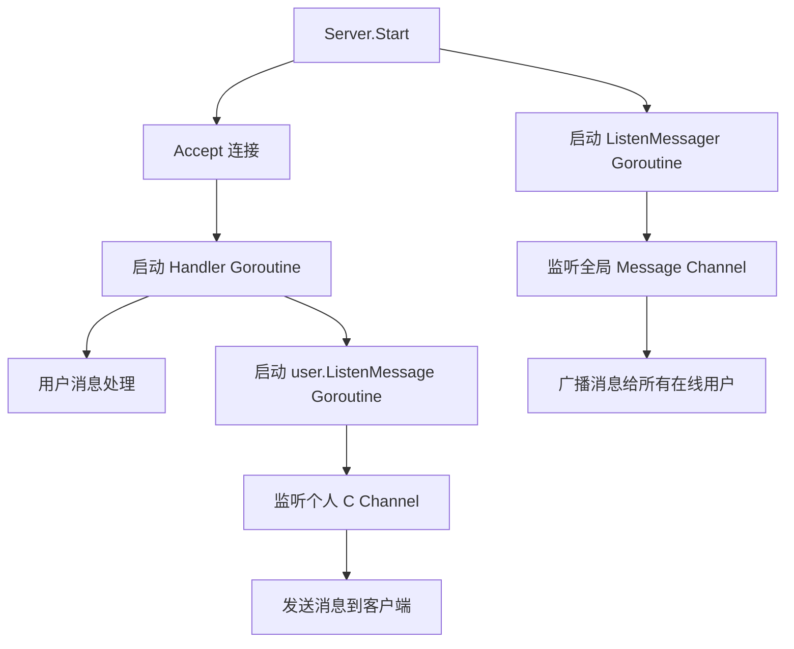
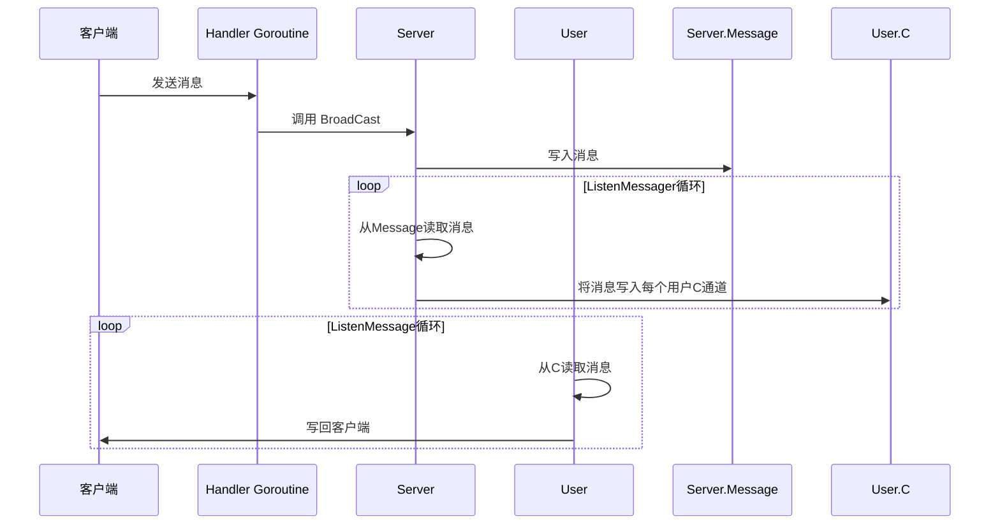
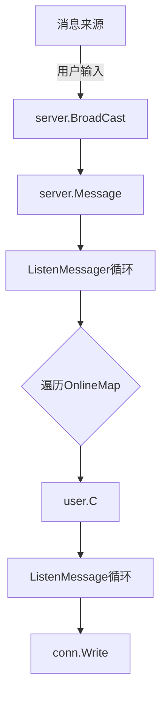

# 并发处理设计

<cite>
**本文档引用的文件**   
- [main.go](file://14-golang-IM-System/main.go)
- [server.go](file://14-golang-IM-System/server.go)
- [user.go](file://14-golang-IM-System/user.go)
- [test1_goroutine.go](file://12-goroutine/test1_goroutine.go)
- [test1_channel.go](file://13-channel/test1_channel.go)
- [test2_channel.go](file://13-channel/test2_channel.go)
- [test3_channel.go](file://13-channel/test3_channel.go)
- [test4_channel.go](file://13-channel/test4_channel.go)
- [test5_channel.go](file://13-channel/test5_channel.go)
</cite>

## 目录
1. [引言](#引言)
2. [核心并发模型](#核心并发模型)
3. [Goroutine 的应用模式](#goroutine-的应用模式)
4. [Channel 的设计与使用](#channel-的设计与使用)
5. [同步与锁机制](#同步与锁机制)
6. [Select 多路复用机制](#select-多路复用机制)
7. [性能调优建议](#性能调优建议)
8. [常见并发陷阱与规避策略](#常见并发陷阱与规避策略)
9. [总结](#总结)

## 引言
本项目是一个基于Go语言的即时通讯系统，其核心架构依赖于Go强大的并发模型。通过goroutine和channel的组合使用，实现了高并发、低延迟的网络服务。本文将深入分析该项目中的并发设计，重点探讨goroutine的轻量级调度、channel的异步通信机制、sync.RWMutex的读写保护以及select的多路复用能力，揭示其在高并发场景下的优势与最佳实践。

## 核心并发模型

本系统采用“主-从”式并发架构，服务器启动后通过`server.Start()`方法监听TCP连接，并为每个新连接启动一个独立的`Handler` goroutine。同时，系统还运行着多个长期存在的goroutine，如`server.ListenMessager`用于全局消息广播，`user.ListenMessage`用于监听个人消息队列。这种设计实现了连接处理、消息分发与用户状态管理的完全解耦。



**图示来源**
- [server.go](file://14-golang-IM-System/server.go#L118-L142)
- [user.go](file://14-golang-IM-System/user.go#L126-L132)

**本节来源**
- [server.go](file://14-golang-IM-System/server.go#L118-L142)
- [user.go](file://14-golang-IM-System/user.go#L126-L132)

## Goroutine 的应用模式

### 连接级并发处理
在`server.Handler`方法中，每当有新连接建立，系统立即通过`go this.Handler(conn)`启动一个新的goroutine来处理该连接的全部生命周期。这种“每个连接一个goroutine”的模式是Go网络编程的经典范式，它将复杂的异步IO操作简化为同步的阻塞调用，极大地提升了代码的可读性和可维护性。

### 持续运行的后台任务
系统中存在两类长期运行的goroutine：
1. **server.ListenMessager**：在`server.Start`中启动，无限循环监听`server.Message` channel，一旦收到消息即广播给所有在线用户。
2. **user.ListenMessage**：在`NewUser`时启动，为每个用户创建一个独立的goroutine，持续监听其个人消息队列`user.C`，并将消息写回客户端连接。

这种设计实现了消息生产与消费的完全异步化，发送方无需关心接收方的状态，只需将消息写入对应的channel即可。



**图示来源**
- [server.go](file://14-golang-IM-System/server.go#L35-L46)
- [user.go](file://14-golang-IM-System/user.go#L126-L132)

**本节来源**
- [server.go](file://14-golang-IM-System/server.go#L35-L46)
- [user.go](file://14-golang-IM-System/user.go#L126-L132)

## Channel 的设计与使用

### 全局广播通道 (server.Message)
`server.Message`是一个无缓冲的`chan string`，作为系统的全局消息广播中心。任何用户发送的消息，经过`server.BroadCast`方法处理后，都会被写入此channel。`ListenMessager` goroutine负责从此channel读取消息并分发给所有在线用户。无缓冲channel确保了消息的即时性，发送方会一直阻塞直到消息被消费，这在广播场景下保证了消息不会丢失。

### 个人消息队列 (user.C)
每个`User`结构体都包含一个`C chan string`字段，作为该用户的个人消息队列。当`ListenMessager`需要向某个用户发送消息时，会直接将消息写入其`C` channel。用户的`ListenMessage` goroutine则负责从`C`中读取消息并写回网络连接。这种设计实现了消息的点对点投递，且每个用户的IO操作相互独立，避免了单点瓶颈。

### 同步与异步Channel对比
通过`13-channel`目录下的测试文件可以清晰地看到channel的不同使用模式：
- `test1_channel.go`展示了无缓冲channel的同步特性，发送方和接收方必须同时就绪。
- `test2_channel.go`展示了带缓冲channel的异步特性，发送方可以在缓冲区未满时立即返回。
- `test3_channel.go`和`test4_channel.go`演示了如何安全地关闭channel并使用`ok`判断或`range`循环来避免从已关闭的channel读取。
- `test5_channel.go`展示了`select`语句如何在多个channel上进行多路复用。



**图示来源**
- [server.go](file://14-golang-IM-System/server.go#L19-L19)
- [user.go](file://14-golang-IM-System/user.go#L10-L10)

**本节来源**
- [server.go](file://14-golang-IM-System/server.go#L19-L19)
- [user.go](file://14-golang-IM-System/user.go#L10-L10)
- [test1_channel.go](file://13-channel/test1_channel.go)
- [test2_channel.go](file://13-channel/test2_channel.go)

## 同步与锁机制

### sync.RWMutex 的必要性
`OnlineMap`是一个存储所有在线用户的`map[string]*User`，它被多个goroutine并发访问：
- `Handler` goroutine在用户上线/下线时修改`OnlineMap`。
- `DoMessage`方法在处理`who`命令时需要读取`OnlineMap`。
- `ListenMessager`在广播消息时需要遍历`OnlineMap`。

由于Go的`map`不是并发安全的，直接并发读写会导致程序panic。因此，系统使用`sync.RWMutex`来保护`OnlineMap`：
- 写操作（如`Online`, `Offline`）使用`mapLock.Lock()`获取写锁。
- 读操作（如`DoMessage`中的`who`命令，`ListenMessager`中的遍历）使用`mapLock.RLock()`获取读锁。

`RWMutex`允许多个读操作同时进行，但写操作是独占的，这在读多写少的场景下（如在线用户查询）提供了比`Mutex`更高的并发性能。

**本节来源**
- [server.go](file://14-golang-IM-System/server.go#L16-L16)
- [server.go](file://14-golang-IM-System/server.go#L15-L15)

## Select 多路复用机制

`select`语句是Go并发编程的核心控制结构，它允许一个goroutine同时等待多个channel操作。在`server.Handler`方法中，`select`被用于实现用户活跃度检测和超时踢出功能：

```go
for {
    select {
    case <-isLive:
        // 用户活跃，重置定时器
    case <-time.After(time.Second * 300):
        // 超时，强制下线
        user.SendMsg("你被踢了")
        return
    }
}
```

这里，`isLive`是一个`chan bool`，每当用户发送一条消息，`isLive <- true`就会被触发。`time.After`返回一个在指定时间后发送当前时间的channel。`select`会随机选择一个就绪的case执行。如果用户在300秒内发送了消息，`isLive` case会被选中，定时器被重置；否则，`time.After` case执行，用户被强制踢出。这种设计高效地实现了连接的保活与清理。

**本节来源**
- [server.go](file://14-golang-IM-System/server.go#L95-L115)

## 性能调优建议

1. **避免Goroutine泄漏**：确保每个启动的goroutine都有明确的退出路径。例如，`ListenMessage` goroutine应在`conn.Close()`后通过关闭`user.C`来退出循环。
2. **合理设置Channel容量**：对于高吞吐量的消息队列，可以考虑使用带缓冲的channel（如`make(chan string, 100)`）来平滑突发流量，避免发送方长时间阻塞。
3. **减少锁竞争范围**：`sync.RWMutex`的锁定范围应尽可能小。例如，在`ListenMessager`中，只在遍历`OnlineMap`时加锁，避免在IO操作期间持有锁。
4. **重用Buffer**：在`Handler`中频繁创建`buf := make([]byte, 4096)`，可以考虑使用`sync.Pool`来重用内存，减少GC压力。

## 常见并发陷阱与规避策略

| 陷阱 | 描述 | 规避策略 |
| :--- | :--- | :--- |
| **向已关闭的channel发送** | 会导致panic | 发送方不应负责关闭channel，通常由数据生产者在完成时关闭。 |
| **从nil channel读写** | 操作会永久阻塞 | 初始化channel时确保不为nil，或在`select`中动态管理channel。 |
| **死锁** | 所有goroutine都在等待彼此，程序无法前进 | 避免循环等待，使用超时机制（如`time.After`），并确保有明确的退出条件。 |
| **并发map访问** | 导致程序panic | 始终使用`sync.Mutex`或`sync.RWMutex`保护map的读写操作。 |
| **Goroutine泄漏** | goroutine无法退出，消耗系统资源 | 确保每个goroutine都有接收`context.Done()`或关闭channel的退出机制。 |

## 总结
本项目通过精巧地运用Go的goroutine和channel，构建了一个高效、可扩展的并发网络服务。`goroutine`提供了轻量级的并发执行单元，`channel`实现了goroutine间的通信与同步，`select`提供了灵活的多路复用控制，而`sync.RWMutex`则解决了共享资源的并发访问问题。这些原语的组合使用，使得开发者能够以接近同步编程的简洁性，实现高性能的异步系统。理解并掌握这些并发模式，是构建健壮Go应用的关键。