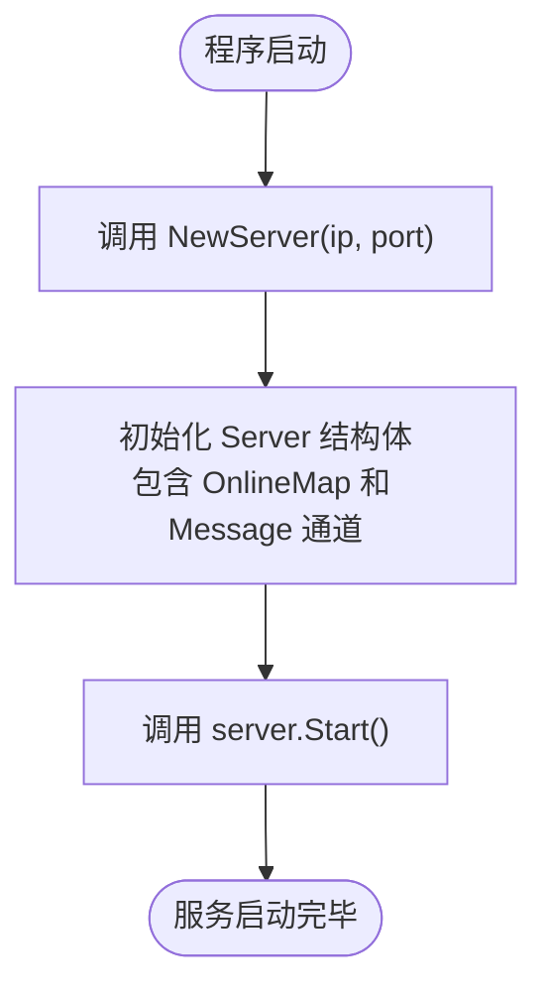

# 快速入门指南

<cite>
**本文档中引用的文件**   
- [main.go](file://14-golang-IM-System/main.go)
- [server.go](file://14-golang-IM-System/server.go)
- [user.go](file://14-golang-IM-System/user.go)
- [ServerV0.1-基础服务构建/main.go](file://14-golang-IM-System/ServerV0.1-基础服务构建/main.go)
- [ServerV0.1-基础服务构建/server.go](file://14-golang-IM-System/ServerV0.1-基础服务构建/server.go)
- [ServerV0.8-私聊功能/user.go](file://14-golang-IM-System/ServerV0.8-私聊功能/user.go)
- [ServerV0.7-超时强踢功能/server.go](file://14-golang-IM-System/ServerV0.7-超时强踢功能/server.go)
</cite>

## 目录
1. [环境准备](#环境准备)
2. [编译与运行](#编译与运行)
3. [服务初始化流程](#服务初始化流程)
4. [TCP连接与并发处理机制](#tcp连接与并发处理机制)
5. [客户端交互功能说明](#客户端交互功能说明)
6. [完整交互示例](#完整交互示例)
7. [常见问题与排查](#常见问题与排查)
8. [学习建议与版本演进](#学习建议与版本演进)

## 环境准备
在开始使用GolangStudy中的IM系统之前，请确保您的开发环境满足以下要求：

- **Go版本**：需要安装Go 1.16或更高版本。您可以通过在终端执行 `go version` 命令来验证当前安装的Go版本。
- **环境变量配置**：确认 `GOROOT` 和 `GOPATH` 环境变量已正确设置。`GOROOT` 指向Go的安装目录，`GOPATH` 指向您的工作空间目录。您可以通过 `go env` 命令查看当前的环境配置。

完成环境检查后，即可进入项目目录进行后续操作。

## 编译与运行
按照以下步骤启动IM系统服务器：

1. 打开命令行终端，进入项目目录：
   ```bash
   cd 14-golang-IM-System
   ```

2. 执行以下命令启动服务器：
   ```bash
   go run main.go
   ```

3. 服务器默认将在本地IP `127.0.0.1` 的 `8888` 端口上监听连接请求。

4. 使用 `telnet` 或 `nc`（netcat）工具作为客户端进行连接测试：
   ```bash
   telnet 127.0.0.1 8888
   ```
   或
   ```bash
   nc 127.0.0.1 8888
   ```

成功连接后，您将看到服务器广播的上线消息，并可以开始发送消息。

**Section sources**
- [main.go](file://14-golang-IM-System/main.go#L1-L7)

## 服务初始化流程
IM系统的服务初始化过程由 `main.go` 文件中的代码驱动，核心是 `NewServer` 和 `server.Start()` 的调用链。

1. 在 `main()` 函数中，通过 `NewServer("127.0.0.1", 8888)` 创建一个服务器实例。该函数位于 `server.go` 中，负责初始化服务器的基本属性，包括IP地址、端口号、在线用户映射表（`OnlineMap`）和消息广播通道（`Message`）。

2. 创建服务器实例后，立即调用 `server.Start()` 方法启动服务。此方法是整个系统运行的入口点。



**Diagram sources**
- [main.go](file://14-golang-IM-System/main.go#L4-L6)
- [server.go](file://14-golang-IM-System/server.go#L23-L32)

**Section sources**
- [main.go](file://14-golang-IM-System/main.go#L4-L6)
- [server.go](file://14-golang-IM-System/server.go#L23-L32)

## TCP连接与并发处理机制
服务器的网络通信基于Go的 `net` 包实现TCP连接的建立与并发处理。

1. **监听连接**：`server.Start()` 方法内部调用 `net.Listen("tcp", "127.0.0.1:8888")`，创建一个TCP监听器，等待客户端的连接请求。

2. **接受连接**：在一个无限循环中，服务器调用 `listener.Accept()` 来接受新的客户端连接。每当有新连接建立，都会返回一个 `net.Conn` 对象。

3. **并发处理**：对于每一个新接受的连接，服务器都会启动一个新的Goroutine（协程），并调用 `this.Handler(conn)` 方法来处理该连接的全部业务逻辑。这使得服务器能够同时处理成百上千个客户端连接，而不会相互阻塞。

4. **消息处理**：`Handler` 方法内部，会为每个用户创建一个 `User` 对象，并启动一个子Goroutine来持续读取客户端发送的消息。主Goroutine则通过 `select` 语句监听用户活跃状态和超时事件。


**Diagram sources**
- [server.go](file://14-golang-IM-System/server.go#L118-L142)
- [server.go](file://14-golang-IM-System/server.go#L55-L115)

**Section sources**
- [server.go](file://14-golang-IM-System/server.go#L118-L142)
- [server.go](file://14-golang-IM-System/server.go#L55-L115)

## 客户端交互功能说明
连接成功后，客户端可以通过发送特定命令与服务器进行交互。以下是支持的主要功能：

- **普通消息广播**：直接输入文本并按回车，消息将被广播给所有在线用户。
- **查询在线用户**：输入 `who` 命令，服务器将返回当前所有在线用户的列表。
- **修改用户名**：输入 `rename|新用户名`（例如 `rename|张三`），可以更改当前用户的昵称。如果新用户名已被占用，服务器会提示错误。
- **私聊功能**：输入 `to|用户名|消息内容`（例如 `to|李四|你好`），可以向指定用户发送私密消息。

这些功能的实现逻辑主要封装在 `user.go` 文件的 `DoMessage` 方法中，该方法会根据消息内容的不同前缀来分发处理。

**Section sources**
- [user.go](file://14-golang-IM-System/user.go#L66-L107)

## 完整交互示例
以下是一个多客户端交互的完整示例：

1.  **客户端A连接**：
    ```
    $ telnet 127.0.0.1 8888
    Connected to 127.0.0.1.
    Escape character is '^]'.
    [::1:50123]::1:50123:已上线
    hello everyone!
    ```

2.  **客户端B连接并修改昵称**：
    ```
    $ telnet 127.0.0.1 8888
    Connected to 127.0.0.1.
    Escape character is '^]'.
    [::1:50123]::1:50123:已上线
    [::1:50124]::1:50124:已上线
    rename|李四
    您已经更新用户名:李四
    ```

3.  **客户端A查询在线用户**：
    ```
    who
    [::1:50123]::1:50123:在线...
    [::1:50124]李四:在线...
    ```

4.  **客户端B向客户端A发送私聊**：
    ```
    to|::1:50123|hi, how are you?
    ```

5.  **客户端A收到私聊消息**：
    ```
    李四对您说:hi, how are you?
    ```

**Section sources**
- [user.go](file://14-golang-IM-System/user.go#L66-L110)
- [ServerV0.8-私聊功能/user.go](file://14-golang-IM-System/ServerV0.8-私聊功能/user.go#L65-L110)

## 常见问题与排查
在运行和测试过程中，可能会遇到以下常见问题：

- **端口被占用**：如果启动服务器时出现 `listen tcp :8888: bind: address already in use` 错误，说明8888端口已被其他程序占用。解决方案是使用 `netstat -ano | findstr :8888` (Windows) 或 `lsof -i :8888` (Linux/Mac) 查找并终止占用该端口的进程，或修改 `main.go` 中的端口号。

- **防火墙阻止连接**：如果客户端无法连接，检查操作系统防火墙是否阻止了8888端口的入站连接。请确保防火墙允许该端口的通信。

- **客户端发送消息无响应**：如果客户端发送消息后没有收到任何回显，最常见的原因是未在消息末尾添加换行符（即按回车键）。`telnet` 和 `nc` 工具通常需要回车来结束输入并发送数据包。此外，请检查服务器端是否因读取错误而关闭了连接。

- **超时被踢出**：服务器设置了300秒（5分钟）的不活跃超时机制。如果用户在5分钟内没有任何消息交互，服务器会自动将其断开连接。这是 `Handler` 方法中 `time.After` 超时控制的正常行为。

**Section sources**
- [server.go](file://14-golang-IM-System/server.go#L55-L115)
- [server.go](file://14-golang-IM-System/ServerV0.7-超时强踢功能/server.go#L76-L142)

## 学习建议与版本演进
为了更好地理解IM系统的构建过程，建议从最基础的版本开始逐步学习：

1.  **从ServerV0.1开始**：进入 `14-golang-IM-System/ServerV0.1-基础服务构建` 目录，阅读 `main.go` 和 `server.go`。此版本仅实现了最基础的TCP服务器监听和连接处理，是理解整个项目基石的最佳起点。

2.  **逐步对比学习**：依次查看 `ServerV0.2` 到 `ServerV0.8` 的各个版本。每个版本都专注于实现一个新功能（如广播上线、消息广播、在线查询、改名、超时踢人、私聊等）。通过对比不同版本 `server.go` 和 `user.go` 文件的差异，您可以清晰地看到功能是如何一步步被添加和完善的。

3.  **最小化可运行代码**：`ServerV0.1` 中的代码就是一个最小化可运行的TCP服务器示例，其核心结构如下：
    ```go
    func main() {
        server := NewServer("127.0.0.1", 8888)
        server.Start()
    }
    ```
    这个简单的结构是所有后续复杂功能的基础。

通过这种渐进式的学习方法，您可以系统地掌握Go语言网络编程、并发处理和IM系统设计的核心概念。

**Section sources**
- [ServerV0.1-基础服务构建/main.go](file://14-golang-IM-System/ServerV0.1-基础服务构建/main.go#L1-L7)
- [ServerV0.1-基础服务构建/server.go](file://14-golang-IM-System/ServerV0.1-基础服务构建/server.go#L13-L30)