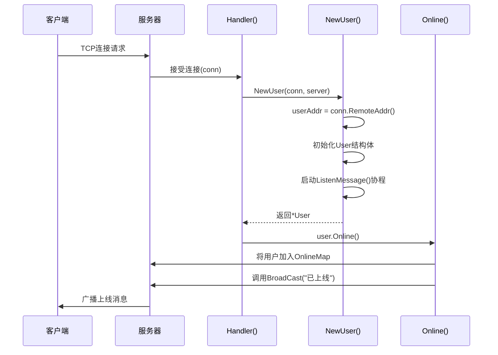

# 数据模型与结构

<cite>
**Referenced Files in This Document**   
- [server.go](file://14-golang-IM-System/server.go)
- [user.go](file://14-golang-IM-System/user.go)
</cite>

## 目录
1. [Server结构体详解](#server结构体详解)
2. [User结构体详解](#user结构体详解)
3. [NewUser构造函数分析](#newuser构造函数分析)
4. [实例化时序图](#实例化时序图)
5. [字段访问与扩展建议](#字段访问与扩展建议)

## Server结构体详解

`Server`结构体是即时通讯系统的核心服务端实体，负责管理所有客户端连接、用户状态和消息广播。其字段定义如下：

- **Ip (string)**: 服务器监听的IP地址，用于网络绑定和客户端连接。
- **Port (int)**: 服务器监听的端口号，与IP共同构成服务的网络地址。
- **OnlineMap (map[string]*User)**: 在线用户注册表，以用户名为键，用户指针为值的映射，是系统维护在线用户状态的核心数据结构。通过`sync.RWMutex`实现并发安全的读写操作，确保多goroutine环境下的数据一致性。
- **Message (chan string)**: 消息广播中枢，一个无缓冲的字符串通道，作为发布-订阅模式的消息总线。所有需要广播的消息都发送至此通道，由`ListenMessager`协程统一处理并分发给所有在线用户。

`Message`通道作为广播中枢，实现了消息的集中管理和异步分发。当`BroadCast`方法被调用时，消息被推入`Message`通道，`ListenMessager`协程立即从通道中取出消息，并通过遍历`OnlineMap`将消息推送到每个在线用户的`C`通道，从而实现高效的全局广播。

**Section sources**
- [server.go](file://14-golang-IM-System/server.go#L10-L20)
- [server.go](file://14-golang-IM-System/server.go#L35-L46)
- [server.go](file://14-golang-IM-System/server.go#L49-L53)

## User结构体详解

`User`结构体代表一个连接到服务器的客户端会话，兼具用户状态信息和通信能力，是一个复合型数据结构。

- **Name (string)**: 用户的唯一标识名，初始值为客户端的远程地址，可通过`rename`命令修改。
- **Addr (string)**: 客户端的网络地址（IP:Port），用于在消息广播中标识消息来源。
- **C (chan string)**: 消息推送通道，用于向客户端异步发送消息。`ListenMessage`协程持续监听此通道，一旦有消息到达，立即通过`conn`写入网络连接。
- **conn (net.Conn)**: 原始的TCP连接对象，是与客户端进行底层I/O读写的唯一通道，用于接收客户端消息和发送原始字节流。
- **server (*Server)**: 指向所属`Server`实例的指针，使`User`能够访问服务器的全局资源，如`OnlineMap`和`Message`通道，实现用户与服务器的紧密耦合。

该结构体的设计体现了Go语言中“通过通信共享内存”的哲学。`C`通道是goroutine间通信的桥梁，将消息的生成（在`ListenMessager`或`DoMessage`中）与消费（在`ListenMessage`中）解耦，确保了高并发下的响应性和稳定性。

**Section sources**
- [user.go](file://14-golang-IM-System/user.go#L7-L14)
- [user.go](file://14-golang-IM-System/user.go#L126-L132)
- [user.go](file://14-golang-IM-System/user.go#L61-L63)

## NewUser构造函数分析

`NewUser`函数是`User`结构体的构造函数，负责初始化一个新的用户实例并建立与服务器的关联。

**Diagram sources**
- [user.go](file://14-golang-IM-System/user.go#L17-L33)
- [server.go](file://14-golang-IM-System/server.go#L49-L53)
- [user.go](file://14-golang-IM-System/user.go#L36-L45)

**Section sources**
- [user.go](file://14-golang-IM-System/user.go#L17-L33)

## 实例化时序图

上图详细展示了从TCP连接建立到用户成功上线的完整时序：
1.  客户端发起TCP连接。
2.  服务器的`Handler`方法接受连接，获得`net.Conn`对象。
3.  `Handler`调用`NewUser(conn, server)`构造函数。
4.  `NewUser`使用`conn.RemoteAddr()`获取客户端地址，初始化`User`结构体的各字段，并启动`ListenMessage`协程。
5.  `NewUser`返回`User`实例。
6.  `Handler`调用`user.Online()`方法。
7.  `Online()`方法将用户添加到`Server`的`OnlineMap`中，并调用`BroadCast`广播上线消息。
8.  上线消息通过`Message`通道被`ListenMessager`协程捕获，并分发给所有在线用户。

## 字段访问与扩展建议

所有字段均为公开（首字母大写），允许包外代码直接访问，这简化了开发但也要求调用者注意并发安全。`mapLock`的存在表明直接修改`OnlineMap`是不安全的，应通过`Server`提供的方法进行操作。

**内存布局考虑**：结构体字段按声明顺序在内存中连续排列。`*Server`指针（8字节）和`net.Conn`接口（包含指针和类型信息）是较大的字段，但整体结构紧凑，适合高并发场景下的频繁创建和销毁。

**序列化可能性**：当前结构体未包含JSON标签，无法直接序列化。若需持久化或通过HTTP API暴露，可添加`json`标签，例如`Name string json:"name"`。但需注意`C`通道和`conn`连接无法序列化，通常在序列化前需转换为纯数据结构。

**数据模型扩展建议**：
- **添加LoginTime (time.Time)**: 记录用户登录时间，用于会话管理和统计分析。
- **添加DeviceInfo (string)**: 存储客户端设备信息（如操作系统、客户端版本），便于提供差异化服务。
- **添加Status (string)**: 用户状态标志（如"在线"、"离开"、"忙碌"），丰富用户状态表达。
- **添加Avatar (string)**: 用户头像URL，用于UI展示。
- **添加MessageHistory ([]string)**: 简单的消息历史记录，实现消息回溯功能（需考虑内存和性能）。

这些扩展字段能显著提升系统的功能性和用户体验，但需权衡内存占用和复杂性。