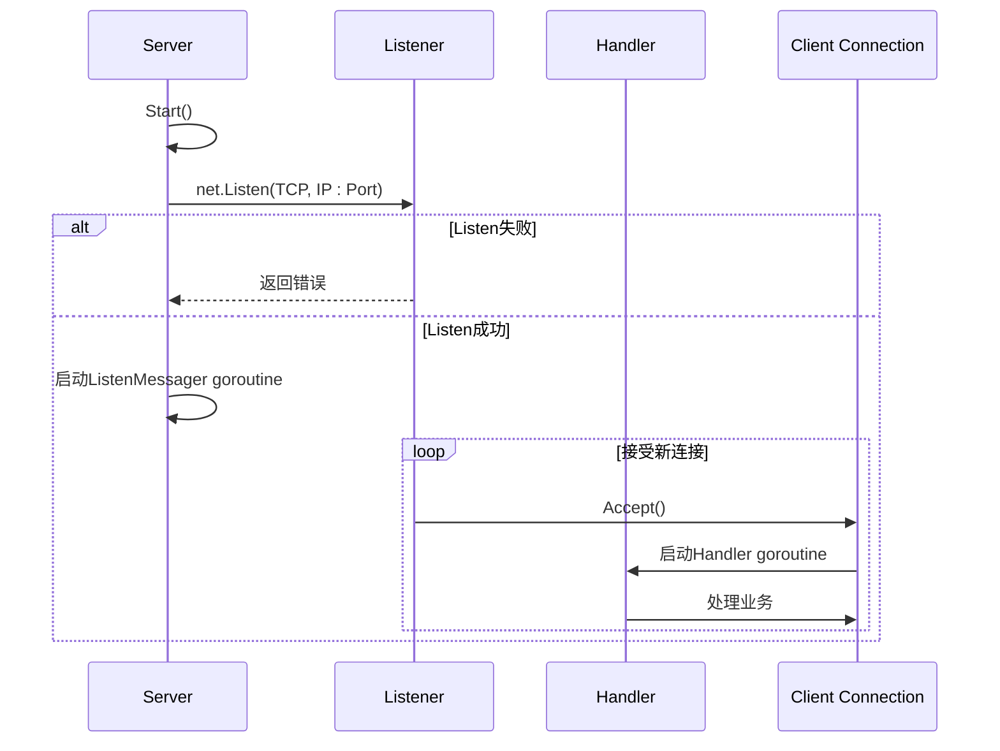
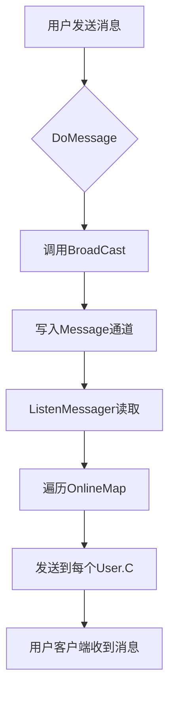
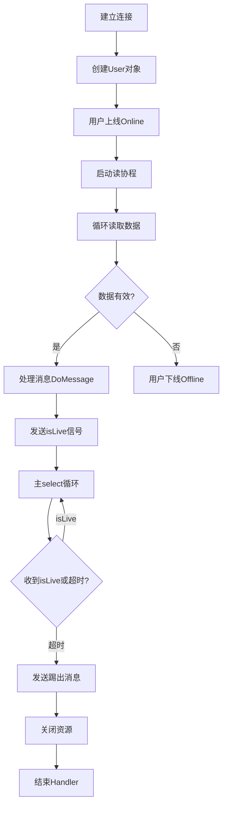

# 服务器主控

<cite>
**本文档中引用的文件**   
- [server.go](file://14-golang-IM-System/server.go)
- [user.go](file://14-golang-IM-System/user.go)
- [main.go](file://14-golang-IM-System/main.go)
</cite>

## 目录
1. [引言](#引言)
2. [Server结构体核心字段解析](#server结构体核心字段解析)
3. [NewServer初始化机制](#newserver初始化机制)
4. [Start方法与TCP监听架构](#start方法与tcp监听架构)
5. [消息广播中枢设计](#消息广播中枢设计)
6. [连接处理与超时控制](#连接处理与超时控制)
7. [并发安全机制](#并发安全机制)
8. [性能调优建议](#性能调优建议)
9. [错误恢复与健壮性](#错误恢复与健壮性)
10. [总结](#总结)

## 引言
`Server`结构体是即时通讯（IM）系统的核心控制器，负责管理网络监听、用户连接、消息广播和在线状态维护。该结构体通过Go语言的并发特性实现了高并发、低延迟的通信服务。本文将深入剖析其设计原理与实现机制，为开发者提供全面的技术参考。

**Section sources**
- [server.go](file://14-golang-IM-System/server.go#L10-L20)

## Server结构体核心字段解析

### Ip与Port字段：网络地址定义
`Ip` 和 `Port` 字段共同定义了服务器的网络监听地址。`Ip` 指定绑定的IP地址（如"127.0.0.1"或"0.0.0.0"），`Port` 指定监听端口号（如8888）。这两个字段在调用`net.Listen("tcp", fmt.Sprintf("%s:%d", this.Ip, this.Port))`时组合成完整的监听地址，构成客户端连接的入口点。

### OnlineMap字段：在线用户注册表
`OnlineMap` 是一个类型为 `map[string]*User` 的哈希表，用于存储当前所有在线用户的引用。键为用户名称（通常为其网络地址），值为指向`User`结构体的指针。该映射表实现了快速的用户查找、添加和删除操作，是广播消息和查询在线状态的基础数据结构。

### Message通道：全局消息广播中枢
`Message` 是一个无缓冲的字符串通道（`chan string`），作为系统的全局消息队列。任何用户发送的消息都会通过`BroadCast`方法写入此通道，而`ListenMessager`协程则持续监听该通道，并将消息转发给所有在线用户。这种发布-订阅模式解耦了消息发送与接收逻辑，是实现广播功能的核心。

**Section sources**
- [server.go](file://14-golang-IM-System/server.go#L10-L20)

## NewServer初始化机制
`NewServer(ip string, port int) *Server` 函数是`Server`实例的构造函数。它接收IP和端口参数，初始化`Server`结构体的各个字段：
- 设置`Ip`和`Port`为传入值
- 使用`make(map[string]*User)`初始化`OnlineMap`，创建一个空的在线用户映射
- 使用`make(chan string)`初始化`Message`通道，创建一个无缓冲的消息队列

该函数确保了服务器在启动前完成所有资源的分配和状态的初始化，为后续的`Start`方法执行奠定了基础。

**Section sources**
- [server.go](file://14-golang-IM-System/server.go#L23-L32)

## Start方法与TCP监听架构
`Start()` 方法是服务器的启动入口，其核心流程如下：

**Diagram sources**
- [server.go](file://14-golang-IM-System/server.go#L118-L142)

1. **建立TCP监听**：调用`net.Listen("tcp", fmt.Sprintf("%s:%d", this.Ip, this.Port))`创建TCP监听器。若失败（如端口被占用），打印错误并返回。
2. **启动消息广播协程**：使用`go this.ListenMessager()`派生一个独立的goroutine，专门负责监听`Message`通道并广播消息，实现非阻塞的消息处理。
3. **主循环接受连接**：进入无限循环，调用`listener.Accept()`阻塞等待新的客户端连接。
4. **并发处理连接**：每当有新连接到来，立即使用`go this.Handler(conn)`启动一个新的goroutine来处理该连接，确保主循环不会被单个连接阻塞，从而支持高并发。

**Section sources**
- [server.go](file://14-golang-IM-System/server.go#L118-L142)

## 消息广播中枢设计
消息广播系统由`Message`通道、`ListenMessager`方法和`BroadCast`方法协同工作。

**Diagram sources**
- [server.go](file://14-golang-IM-System/server.go#L35-L53)
- [user.go](file://14-golang-IM-System/user.go#L126-L132)

- **BroadCast方法**：接收一个`*User`和消息字符串，格式化消息后写入`this.Message`通道。
- **ListenMessager方法**：在一个无限循环中从`this.Message`通道读取消息。一旦收到消息，它会获取`mapLock`的写锁，遍历`OnlineMap`中的每个用户，并将消息发送到对应用户的`C`通道。
- **User监听机制**：每个`User`在创建时都会启动`ListenMessage()`协程，持续监听自己的`C`通道，并将收到的消息通过`conn.Write`发送给客户端。

这种设计实现了高效、解耦的广播机制，消息的发送者无需知道接收者的具体信息。

**Section sources**
- [server.go](file://14-golang-IM-System/server.go#L35-L53)
- [user.go](file://14-golang-IM-System/user.go#L126-L132)

## 连接处理与超时控制
`Handler(conn net.Conn)` 方法负责处理单个客户端连接的完整生命周期。

**Diagram sources**
- [server.go](file://14-golang-IM-System/server.go#L55-L115)
- [user.go](file://14-golang-IM-System/user.go#L36-L45)

1. **用户上线**：创建`User`实例并调用`user.Online()`，将其加入`OnlineMap`并广播上线消息。
2. **异步读取**：启动一个goroutine，循环调用`conn.Read()`读取客户端数据。若连接关闭（n==0）或发生严重错误，则调用`user.Offline()`。
3. **消息处理**：将读取到的消息传递给`user.DoMessage(msg)`进行业务逻辑处理（如查询在线用户、改名、私聊等）。
4. **活跃信号**：每次成功处理消息后，向`isLive`通道发送信号，表明用户活跃。
5. **超时控制**：主`Handler`协程使用`select`监听`isLive`通道和一个5分钟的`time.After`定时器。若在5分钟内未收到`isLive`信号，则判定用户超时，执行踢人逻辑（发送消息、关闭资源、结束协程）。

**Section sources**
- [server.go](file://14-golang-IM-System/server.go#L55-L115)
- [user.go](file://14-golang-IM-System/user.go#L66-L123)

## 并发安全机制
由于`OnlineMap`可能被多个goroutine（如多个`Handler`和`ListenMessager`）同时访问，必须保证其并发安全。

- **sync.RWMutex**：`Server`结构体中包含一个`mapLock sync.RWMutex`。`RWMutex`允许多个读操作同时进行，但写操作是独占的。
- **写操作加锁**：在`OnlineMap`发生变更时（如`Online`、`Offline`、`ListenMessager`中的遍历广播），必须先调用`this.mapLock.Lock()`获取写锁，操作完成后调用`Unlock()`释放。
- **读操作加读锁**：在`DoMessage`中查询在线用户列表时，也需使用`this.mapLock.RLock()`获取读锁，以防止在遍历过程中发生写操作导致的并发问题。

这种细粒度的锁机制在保证安全的同时，最大限度地提高了读操作的并发性能。

**Section sources**
- [server.go](file://14-golang-IM-System/server.go#L10-L20)
- [user.go](file://14-golang-IM-System/user.go#L36-L45)

## 性能调优建议
为优化服务器在高并发场景下的性能，建议采取以下措施：

1. **Channel缓冲**：当前`Message`通道为无缓冲，可能导致发送方阻塞。可考虑设置合理的缓冲大小（如`make(chan string, 1000)`），平滑突发消息流量，避免广播协程处理不及时导致的阻塞。
2. **连接池优化**：虽然Go的goroutine开销较小，但在极端高并发下，仍可考虑对`Handler`协程进行限流或使用协程池，防止资源耗尽。
3. **日志监控**：在`Handler`的连接建立、断开、错误处理等关键节点添加日志，便于监控连接状态变化和排查问题。例如，在`conn.Read`错误时记录客户端地址。
4. **Map性能**：`OnlineMap`的键使用`user.Addr`（即`conn.RemoteAddr().String()`）是合理的，保证了唯一性。应避免在`mapLock`的临界区内执行耗时操作。

**Section sources**
- [server.go](file://14-golang-IM-System/server.go#L15-L15)
- [server.go](file://14-golang-IM-System/server.go#L19-L19)

## 错误恢复与健壮性
服务器设计中包含了关键的错误恢复机制：

- **监听错误处理**：`net.Listen`失败时，`Start`方法会打印错误并返回，避免程序崩溃。在实际部署中，可加入重试逻辑或告警。
- **连接拒绝恢复**：`listener.Accept()`在遇到临时错误（如资源不足）时会返回错误，但服务器通过`continue`语句忽略该错误并继续循环，确保能接受后续的连接请求，具备良好的容错能力。
- **客户端连接异常**：`conn.Read`在客户端异常断开时会返回`io.EOF`，此时服务器能正确识别并执行`user.Offline()`清理资源，保证了服务端状态的准确性。

**Section sources**
- [server.go](file://14-golang-IM-System/server.go#L118-L142)
- [server.go](file://14-golang-IM-System/server.go#L55-L115)

## 总结
`Server`结构体通过精巧的设计，利用Go语言的goroutine和channel机制，构建了一个功能完整、并发安全的IM系统核心。其模块化的结构（网络监听、连接处理、消息广播、状态管理）清晰，易于维护和扩展。理解其工作原理对于开发高性能网络服务具有重要价值。