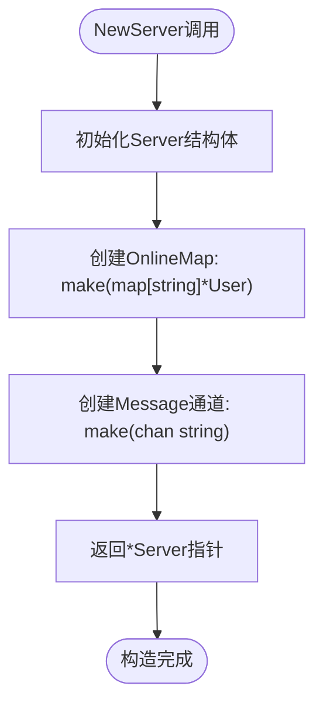
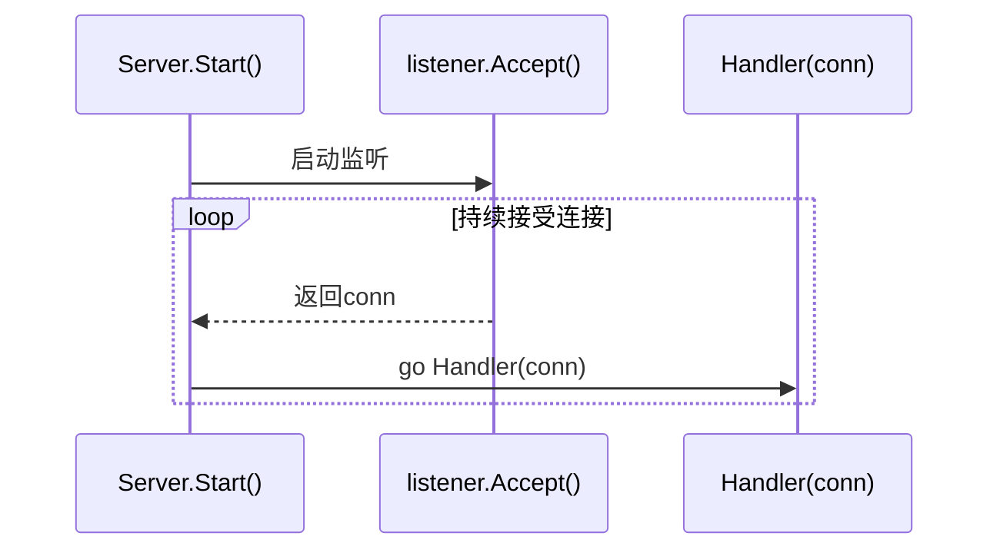
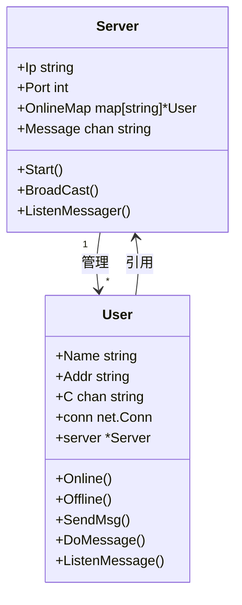
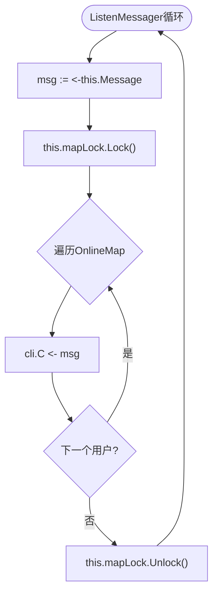
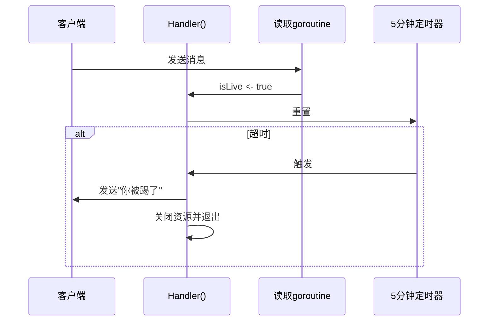

# 核心架构设计

<cite>
**本文档中引用的文件**   
- [main.go](file://14-golang-IM-System/main.go)
- [server.go](file://14-golang-IM-System/server.go)
- [user.go](file://14-golang-IM-System/user.go)
</cite>

## 目录
1. [引言](#引言)
2. [Server结构体设计](#server结构体设计)
3. [User结构体设计](#user结构体设计)
4. [核心交互流程](#核心交互流程)
5. [并发与资源管理](#并发与资源管理)
6. [最佳实践建议](#最佳实践建议)

## 引言
本系统是一个基于Go语言实现的即时通讯（IM）服务器，采用TCP协议进行通信，利用Go的goroutine和channel机制实现高并发处理。系统核心由`Server`和`User`两个结构体构成，分别代表服务器中心协调者和客户端连接实体。通过广播消息、在线用户管理、超时踢出等机制，实现了基础的群聊功能。本文档深入分析其架构设计与交互模式，为开发者提供清晰的理解和开发指导。

## Server结构体设计

`Server`结构体是整个IM系统的核心协调者，负责监听客户端连接、维护在线用户状态、广播消息以及管理服务生命周期。

### 字段职责分析

- **Ip**：表示服务器监听的IP地址，用于绑定TCP监听套接字。
- **Port**：表示服务器监听的端口号，与IP共同构成服务地址。
- **OnlineMap**：类型为`map[string]*User`，存储当前所有在线用户的映射表，以用户名为键，用户对象指针为值，实现快速查找与管理。
- **Message**：类型为`chan string`，是全局的消息广播通道。任何需要广播的消息都先发送至此通道，由专门的goroutine统一处理分发。

### 构造与启动流程

`NewServer`函数负责初始化`Server`实例，创建`OnlineMap`映射和`Message`通道，完成资源的预分配。

**Diagram sources**
- [server.go](file://14-golang-IM-System/server.go#L23-L32)

**Section sources**
- [server.go](file://14-golang-IM-System/server.go#L10-L32)

`Start`方法启动服务器主循环：
1. 调用`net.Listen`在指定IP和端口上创建TCP监听。
2. 启动`ListenMessager` goroutine，持续监听`Message`通道。
3. 进入无限循环，通过`listener.Accept()`接受新的客户端连接。
4. 每当有新连接到来，立即派生一个新的goroutine执行`Handler`方法处理该连接，实现非阻塞并发。

**Diagram sources**
- [server.go](file://14-golang-IM-System/server.go#L118-L142)

**Section sources**
- [server.go](file://14-golang-IM-System/server.go#L118-L142)

## User结构体设计

`User`结构体封装了单个客户端的连接信息和状态，与`Server`形成双向关联，是消息处理的基本单元。

### 字段职责分析

- **Name**：用户的唯一标识名，初始为客户端地址，可后续修改。
- **Addr**：客户端的网络地址（如`127.0.0.1:54321`），用于消息前缀显示。
- **C**：类型为`chan string`，是该用户的私有消息接收通道。服务器通过向此通道发送消息来异步推送给客户端。
- **conn**：`net.Conn`类型的TCP连接对象，用于实际的网络读写操作。
- **server**：指向所属`Server`实例的指针，形成与服务器的反向引用，便于访问服务器资源（如`OnlineMap`）。

### 用户生命周期管理

`NewUser`函数在`Handler`中被调用，用于创建并初始化用户实例。它将传入的TCP连接和服务器指针赋值给对应字段，并创建私有消息通道`C`。最关键的是，它立即启动`ListenMessage` goroutine，实现消息的异步推送。

**Diagram sources**
- [server.go](file://14-golang-IM-System/server.go#L10-L20)
- [user.go](file://14-golang-IM-System/user.go#L7-L14)

**Section sources**
- [user.go](file://14-golang-IM-System/user.go#L17-L33)

`Online`方法将新用户注册到服务器的`OnlineMap`中，并广播“已上线”消息。`Offline`方法则从`OnlineMap`中移除用户并广播“下线”消息。这两个操作均在`mapLock`读写锁的保护下进行，确保并发安全。

## 核心交互流程

### 消息广播机制

`ListenMessager` goroutine是消息广播的核心。它在一个无限循环中持续从`Server`的`Message`通道接收消息。一旦收到消息，便获取`mapLock`写锁，遍历`OnlineMap`中的所有在线用户，并将消息发送到每个用户的私有通道`C`中，最后释放锁。

**Diagram sources**
- [server.go](file://14-golang-IM-System/server.go#L35-L46)

**Section sources**
- [server.go](file://14-golang-IM-System/server.go#L35-L46)

`BroadCast`方法是广播的入口，它接收一个`User`和消息内容，格式化后将消息推送到`Message`通道，触发上述广播流程。

### 客户端消息处理

`Handler`方法处理单个客户端的完整生命周期：
1. 创建`User`对象并调用`Online`使其上线。
2. 启动一个goroutine读取客户端发来的数据流。
3. 在主循环中使用`select`监听`isLive`通道和5分钟超时定时器。
   - 当读取goroutine收到有效消息时，会向`isLive`通道发送信号，重置超时定时器。
   - 若5分钟内无任何消息（`time.After`先触发），则执行踢出逻辑：发送提示、关闭资源、断开连接。

**Diagram sources**
- [server.go](file://14-golang-IM-System/server.go#L55-L115)

**Section sources**
- [server.go](file://14-golang-IM-System/server.go#L55-L115)

`DoMessage`方法解析用户输入，支持`who`（查询在线用户）、`rename|新名字`（改名）、`to|用户名|消息`（私聊）等命令，其余消息则调用`BroadCast`进行群发。

## 并发与资源管理

### 读写锁的应用

`OnlineMap`作为共享资源，被多个goroutine并发访问（如`ListenMessager`遍历、`Online`/`Offline`修改、`DoMessage`查询）。`sync.RWMutex`的使用至关重要：
- `ListenMessager`和`DoMessage`中的遍历操作使用`RLock()`/`RUnlock()`，允许多个读操作同时进行。
- `Online`、`Offline`和改名操作使用`Lock()`/`Unlock()`，确保写操作的原子性，防止数据竞争。

### 资源泄漏防护

系统通过多种机制防止资源泄漏：
1. **defer listener.Close()**：确保服务器监听套接字在退出时被正确关闭。
2. **close(user.C)**：在用户被踢出或下线时关闭其消息通道，使`ListenMessage` goroutine能检测到通道关闭并退出。
3. **conn.Close()**：关闭TCP连接，释放网络资源。
4. **超时踢出**：`select + time.After`模式有效清理长时间不活跃的连接，避免僵尸连接占用内存和连接数。

## 最佳实践建议

1. **临界区精简**：确保在`mapLock`锁的保护范围内只执行必要的、快速的map操作，避免在其中执行耗时的网络IO或复杂计算。
2. **Channel缓冲**：`Message`和`User.C`通道均为无缓冲通道。在高并发场景下，可考虑为`Message`通道设置适当缓冲（如`make(chan string, 100)`），以平滑突发消息流量，防止`BroadCast`阻塞。但需权衡内存使用和消息延迟。
3. **Defer资源释放**：在`Start`方法中使用`defer`关闭`listener`是良好实践，确保函数退出时资源必然被释放，无论是否发生错误。
4. **错误处理完善**：现有代码对`conn.Read`和`conn.Write`的错误进行了基础处理，但在生产环境中应增加更详细的日志记录和可能的重试机制。
5. **goroutine生命周期管理**：每个用户连接都派生了多个goroutine（`Handler`主循环、读取goroutine、`ListenMessage`）。需确保在连接断开时，所有相关goroutine都能正确退出，避免goroutine泄漏。当前设计通过关闭`conn`和`user.C`来通知其他goroutine退出，是有效的。