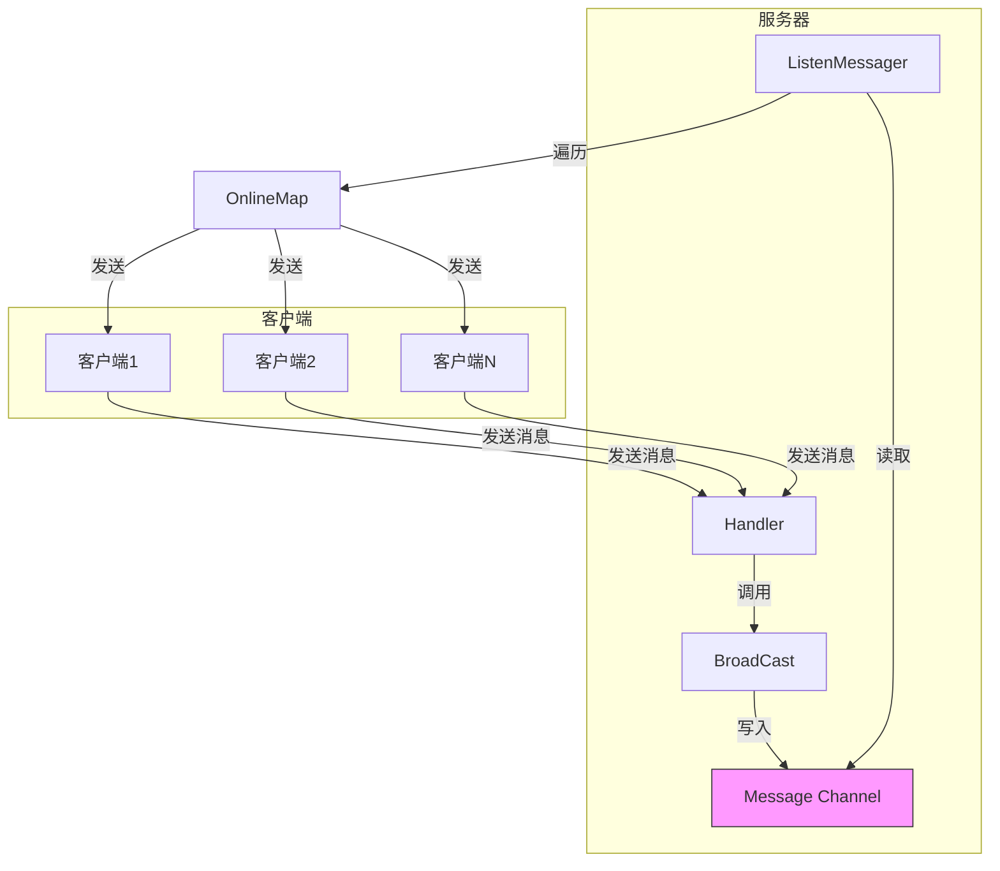
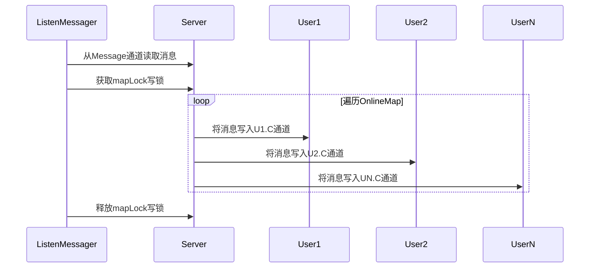
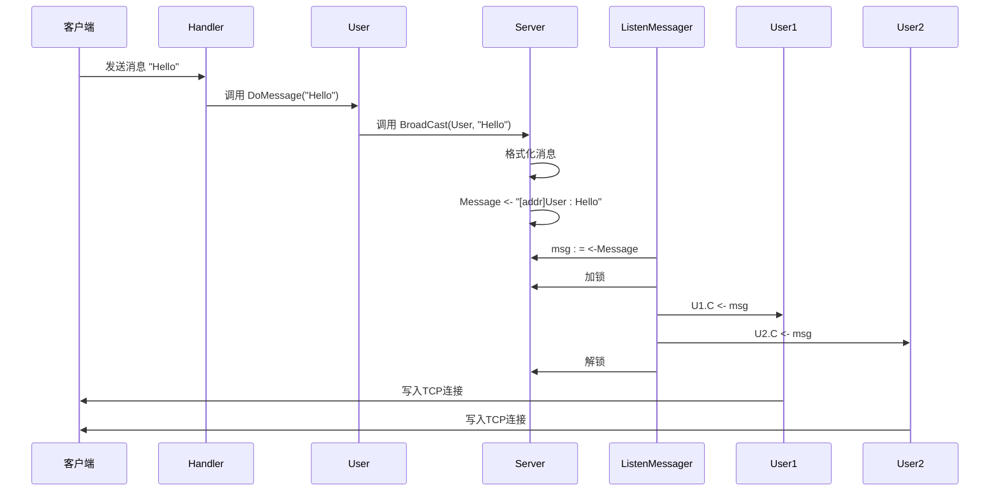
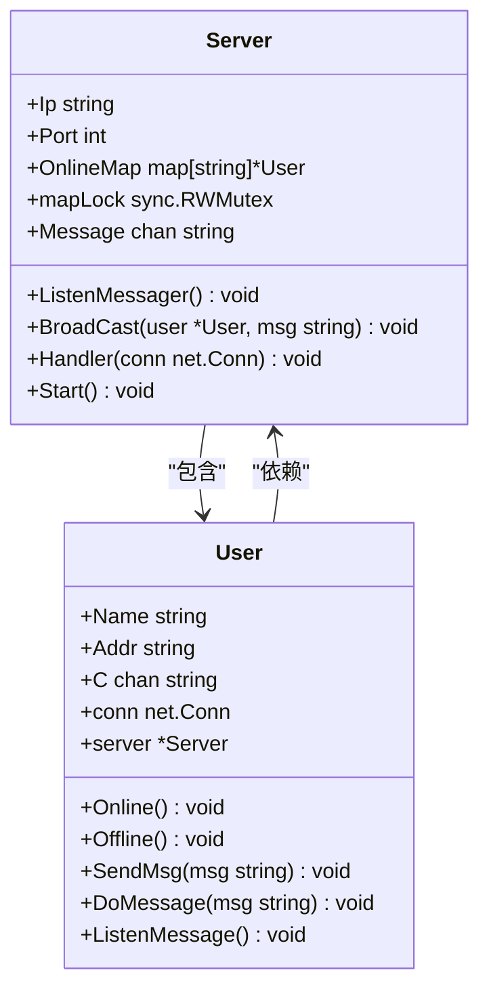

<cite>
**本文档中引用的文件**
- [server.go](file://14-golang-IM-System\server.go)
- [user.go](file://14-golang-IM-System\user.go)
- [main.go](file://14-golang-IM-System\main.go)
</cite>

# 消息广播机制

## 目录
1. [引言](#引言)
2. [核心组件](#核心组件)
3. [架构概览](#架构概览)
4. [详细组件分析](#详细组件分析)
5. [依赖分析](#依赖分析)
6. [性能考量](#性能考量)
7. [结论](#结论)

## 引言
本文档深入分析了即时通讯系统中的消息广播机制。该系统基于Go语言的并发特性（goroutine和channel）构建，实现了高效的一对多消息分发。文档将详细阐述从客户端消息接收到服务器广播，再到所有在线用户接收的完整流程，并探讨其背后的异步解耦设计与性能优化策略。

## 核心组件
系统的核心在于`Server`和`User`两个结构体。`Server`负责管理所有在线用户、接收和广播消息；`User`代表一个客户端连接，负责接收服务器消息并发送给客户端，同时处理客户端发来的指令。

**Section sources**
- [server.go](file://14-golang-IM-System\server.go#L1-L143)
- [user.go](file://14-golang-IM-System\user.go#L1-L133)

## 架构概览
系统采用经典的生产者-消费者模式。客户端是消息的生产者，服务器是消息的消费者和再分发者。`Server`结构体中的`Message`通道是整个广播系统的核心枢纽。

**Diagram sources**
- [server.go](file://14-golang-IM-System\server.go#L35-L53)
- [user.go](file://14-golang-IM-System\user.go#L126-L132)

## 详细组件分析

### 消息广播流程分析

#### 服务端消息监听与分发
`Server`结构体启动一个名为`ListenMessager`的协程，该协程持续监听`Message`通道。一旦有新消息到达，它会获取`mapLock`的写锁，遍历`OnlineMap`（存储所有在线用户的映射），将消息推送到每个在线用户的`C`通道中，然后释放锁。这种设计确保了在遍历和写入用户通道时的数据一致性。

**Diagram sources**
- [server.go](file://14-golang-IM-System\server.go#L35-L46)

#### 消息广播方法
`BroadCast`方法是消息注入的入口。它接收一个`User`指针和一条消息字符串，首先将消息格式化为`[用户地址]用户名:消息内容`的样式，然后将格式化后的消息发送到`Server`的`Message`通道。这一步完成了消息从具体用户到广播队列的转换。

**Section sources**
- [server.go](file://14-golang-IM-System\server.go#L49-L53)

#### 客户端消息接收
每个`User`实例在创建时都会启动一个`ListenMessage`协程。该协程持续监听其专属的`C`通道。当`ListenMessager`协程将消息推送到该用户的`C`通道后，`ListenMessage`协程会立即读取到消息，并通过`conn.Write`方法将消息直接写回客户端的TCP连接。这种设计实现了服务器与客户端之间的完全异步解耦。

**Section sources**
- [user.go](file://14-golang-IM-System\user.go#L126-L132)

### 群发消息时序流程
从客户端发送消息到所有用户接收到消息，完整的时序流程如下：

1.  **Handler读取数据**：`Server.Handler`协程通过`conn.Read`从客户端TCP连接中读取原始字节流。
2.  **调用DoMessage**：`Handler`协程将读取到的消息字符串传递给`User.DoMessage`方法进行处理。
3.  **调用BroadCast**：在`DoMessage`方法中，对于普通消息，会调用`this.server.BroadCast(this, msg)`。
4.  **消息进入Message通道**：`BroadCast`方法将格式化后的消息写入`Server.Message`通道。
5.  **ListenMessager分发消息**：`ListenMessager`协程从`Message`通道读取到新消息，加锁后遍历`OnlineMap`，将消息逐一推送到每个在线用户的`C`通道。
6.  **客户端输出**：每个用户的`ListenMessage`协程从其`C`通道读取消息，并通过`conn.Write`将其发送回各自的客户端。

**Diagram sources**
- [server.go](file://14-golang-IM-System\server.go#L55-L115)
- [user.go](file://14-golang-IM-System\user.go#L66-L123)

## 依赖分析
系统内部依赖关系清晰。`Server`结构体是核心，它依赖`User`结构体来表示客户端。`User`结构体在创建时需要传入一个`*Server`指针，以便能够调用服务器的`BroadCast`等方法。`ListenMessager`和`ListenMessage`协程分别依赖于`Server`和`User`的通道进行通信。

**Diagram sources**
- [server.go](file://14-golang-IM-System\server.go#L8-L28)
- [user.go](file://14-golang-IM-System\user.go#L3-L17)

## 性能考量
尽管该广播机制简洁高效，但在高并发场景下仍需注意以下几点：

1.  **广播消息的序列化开销**：`BroadCast`方法中对每条消息都进行字符串拼接（`+`操作），在高频率消息场景下会产生大量临时字符串，增加GC压力。建议使用`strings.Builder`或`fmt.Sprintf`来优化字符串构建。
2.  **大流量下的goroutine调度压力**：`ListenMessager`协程在遍历`OnlineMap`时持有写锁，如果在线用户数量巨大，这个循环会阻塞其他需要修改`OnlineMap`的操作（如用户上下线）。虽然读写锁（RWMutex）允许并发读，但写操作是独占的。在极端情况下，可能成为性能瓶颈。
3.  **扇出模式优化**：当前设计是“一写多读”的简单模式。对于超大规模的在线用户，可以考虑引入“扇出”（Fan-out）模式。即`ListenMessager`不直接向所有用户`C`通道写入，而是将消息分发到多个工作协程（worker goroutines）的队列中，由这些工作协程并行地将消息推送给用户，从而提高分发效率。

**Section sources**
- [server.go](file://14-golang-IM-System\server.go#L35-L46)
- [server.go](file://14-golang-IM-System\server.go#L49-L53)

## 结论
该消息广播系统巧妙地利用了Go语言的channel和goroutine，构建了一个简单而健壮的实时通信模型。其核心在于`ListenMessager`协程对`Message`通道的监听和对`OnlineMap`的安全遍历，以及`User`的`ListenMessage`协程实现的异步消息推送。整个流程清晰，实现了生产者（客户端）与消费者（所有客户端）之间的解耦。理解其时序流程和内部依赖，对于维护和优化此类系统至关重要。在面对更高并发需求时，应考虑上述性能优化建议。