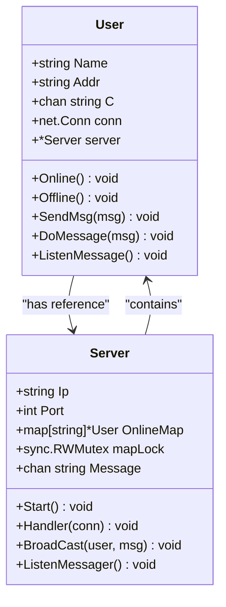
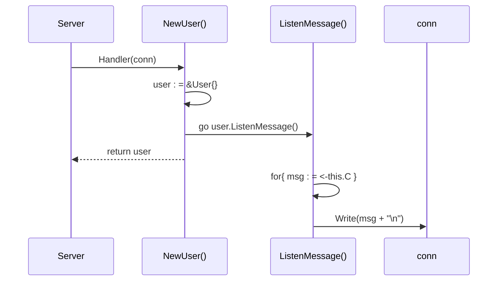
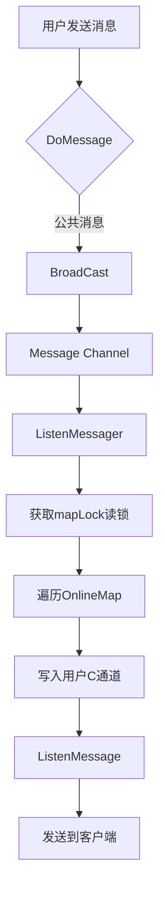

<cite>
**Referenced Files in This Document**   
- [user.go](file://14-golang-IM-System/user.go)
- [server.go](file://14-golang-IM-System/server.go)
</cite>

# 用户管理

## Table of Contents
1. [用户结构体设计](#用户结构体设计)
2. [用户生命周期管理](#用户生命周期管理)
3. [并发安全机制](#并发安全机制)
4. [消息处理与广播](#消息处理与广播)
5. [最佳实践与扩展](#最佳实践与扩展)

## 用户结构体设计

`User`结构体是即时通讯系统中的核心实体，负责封装客户端连接的完整上下文信息。该结构体通过组合网络连接、通信通道和服务器引用，实现了用户状态的集中管理。

**Section sources**
- [user.go](file://14-golang-IM-System/user.go#L7-L14)

### 字段设计意图

`User`结构体包含五个关键字段，每个字段都承担着特定的职责：

- **Name**: 用户的唯一标识符，初始值为客户端的远程地址，支持通过`rename`命令动态修改
- **Addr**: 客户端的网络地址，用于在消息广播中标识消息来源
- **C**: 私有消息通道，作为goroutine间通信的管道，接收来自服务器广播的消息
- **conn**: 原始TCP连接，用于与客户端进行实际的数据读写操作
- **server**: 指向`Server`实例的指针，建立与服务器的双向引用关系，支持功能调用和状态同步



**Diagram sources**
- [user.go](file://14-golang-IM-System/user.go#L7-L14)
- [server.go](file://14-golang-IM-System/server.go#L10-L20)

### 双向引用关系

`User`与`Server`之间建立了双向引用关系，这种设计模式支持了功能的解耦与协作。`User`通过`server`指针访问服务器的公共方法（如`BroadCast`），而`Server`通过`OnlineMap`维护对所有在线`User`实例的引用。这种双向关系使得用户可以主动触发服务器行为（如广播消息），同时服务器也能集中管理用户状态。

## 用户生命周期管理

用户生命周期管理涵盖了从连接建立到资源释放的完整过程，通过一系列协调的方法调用确保状态的一致性。

**Section sources**
- [user.go](file://14-golang-IM-System/user.go#L17-L33)
- [user.go](file://14-golang-IM-System/user.go#L48-L58)
- [server.go](file://14-golang-IM-System/server.go#L55-L115)

### 用户初始化与异步消息推送

`NewUser`函数负责创建新的用户实例并初始化其运行环境。该函数接收TCP连接和服务器实例作为参数，完成以下关键操作：

1. 从连接中提取远程地址作为初始用户名和地址
2. 创建私有消息通道`C`用于接收广播消息
3. 建立与服务器的引用关系
4. 启动`ListenMessage`协程实现异步消息推送



**Diagram sources**
- [user.go](file://14-golang-IM-System/user.go#L17-L33)
- [user.go](file://14-golang-IM-System/user.go#L126-L132)

`ListenMessage`协程持续监听私有通道`C`，一旦有消息写入，立即通过TCP连接推送给客户端。这种异步推送机制避免了消息处理的阻塞，确保了高并发场景下的响应性能。

### 上线与下线流程

`Online`和`Offline`方法分别处理用户的上线和下线业务，通过调用这些方法，系统能够维护准确的在线用户状态。

- **Online方法**: 将新创建的用户实例注册到服务器的`OnlineMap`中，并触发上线广播通知
- **Offline方法**: 从`OnlineMap`中移除用户实例，并触发下线广播通知

这两个方法都通过调用`BroadCast`方法实现状态变更的全局通知，确保所有在线用户都能及时感知到网络拓扑的变化。

## 并发安全机制

在高并发的网络环境中，对共享资源的访问必须保证线程安全。系统通过读写锁机制有效解决了并发访问`OnlineMap`的竞态条件问题。

**Section sources**
- [user.go](file://14-golang-IM-System/user.go#L35-L37)
- [user.go](file://14-golang-IM-System/user.go#L49-L51)
- [server.go](file://14-golang-IM-System/server.go#L16-L16)

### 读写锁的应用

`Server`结构体中的`mapLock`字段是`sync.RWMutex`类型的读写锁，它被用于保护`OnlineMap`这一共享资源。读写锁的优势在于允许多个读操作并发执行，而写操作则独占访问权。

```go
// 在Online和Offline方法中使用写锁
this.server.mapLock.Lock()
// 修改OnlineMap
this.server.mapLock.Unlock()

// 在查询在线用户时使用读锁
this.server.mapLock.RLock()
// 遍历OnlineMap
this.server.mapLock.RUnlock()
```

这种锁策略在读多写少的场景下表现出色，因为大多数操作（如消息广播、在线用户查询）都是读操作，可以并发执行，而写操作（用户上下线）相对较少，不会成为性能瓶颈。

### 防止竞态条件的最佳实践

为确保并发环境下的正确性，开发者应遵循以下实践：

1. **始终成对使用锁**: 每次`Lock()`调用都必须有对应的`Unlock()`，建议使用`defer`语句确保锁的释放
2. **最小化临界区**: 锁定的代码块应尽可能小，避免在临界区内执行耗时操作
3. **避免死锁**: 遵循一致的锁获取顺序，避免在持有锁时调用可能获取其他锁的函数

## 消息处理与广播

消息处理系统是即时通讯服务的核心，负责接收、解析和分发用户消息。

**Section sources**
- [user.go](file://14-golang-IM-System/user.go#L66-L123)
- [server.go](file://14-golang-IM-System/server.go#L49-L53)
- [server.go](file://14-golang-IM-System/server.go#L35-L46)

### 消息分发机制

`DoMessage`方法实现了消息的路由逻辑，根据消息前缀将其分发到不同的处理分支：

- `who`: 查询当前在线用户列表
- `rename|`: 修改用户名
- `to|`: 发送私聊消息
- 其他: 作为公共消息进行广播

每种消息类型都经过严格的格式验证和业务逻辑处理，确保系统的健壮性。

### 广播架构

系统的广播功能采用发布-订阅模式实现：

1. 用户消息通过`BroadCast`方法发布到服务器的`Message`通道
2. `ListenMessager`协程监听`Message`通道，接收广播消息
3. 协程获取读锁，遍历`OnlineMap`，将消息写入每个在线用户的私有通道`C`
4. 用户的`ListenMessage`协程从通道`C`读取消息并推送给客户端



**Diagram sources**
- [user.go](file://14-golang-IM-System/user.go#L66-L123)
- [server.go](file://14-golang-IM-System/server.go#L35-L46)

## 最佳实践与扩展

### 资源清理策略

为防止内存泄漏，系统在用户下线时执行完整的资源清理：

1. 从`OnlineMap`中移除用户引用
2. 关闭私有消息通道`C`
3. 关闭TCP连接
4. 终止相关协程

### 异常断开处理

`Handler`方法通过监控连接读取结果来检测客户端异常断开。当`conn.Read`返回0字节时，系统自动调用`Offline`方法完成优雅的资源回收。

### 用户身份验证扩展

当前系统使用IP地址作为默认用户名，可通过以下方式扩展身份验证：

1. 在`NewUser`阶段引入认证协议
2. 集成JWT或OAuth等标准认证机制
3. 建立持久化的用户数据库
4. 实现会话管理功能

这些扩展将使系统从简单的即时通讯原型演变为生产级别的安全通信平台。