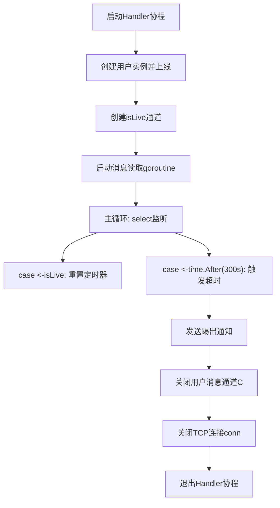
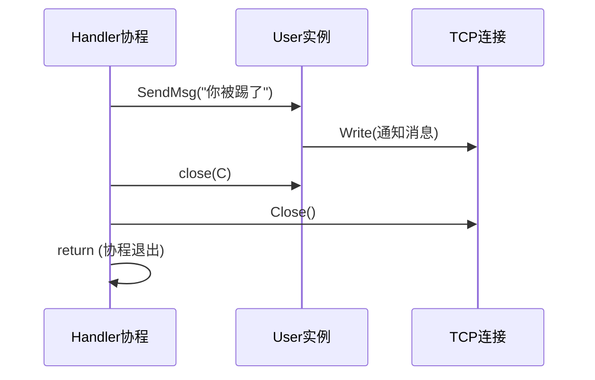

# 超时踢出机制

<cite>
**Referenced Files in This Document**   
- [server.go](file://14-golang-IM-System/ServerV0.7-超时强踢功能/server.go)
- [user.go](file://14-golang-IM-System/ServerV0.7-超时强踢功能/user.go)
- [main.go](file://14-golang-IM-System/ServerV0.7-超时强踢功能/main.go)
</cite>

## 目录
1. [引言](#引言)
2. [核心机制解析](#核心机制解析)
3. [Handler函数中的超时控制流程](#handler函数中的超时控制流程)
4. [isLive通道与用户活跃度监听](#isLive通道与用户活跃度监听)
5. [超时触发后的资源清理流程](#超时触发后的资源清理流程)
6. [设计优势与系统稳定性保障](#设计优势与系统稳定性保障)
7. [关键代码模式分析](#关键代码模式分析)
8. [可配置化扩展建议](#可配置化扩展建议)

## 引言

在即时通讯（IM）系统中，维护一个健康、高效的连接状态管理机制至关重要。长时间存在的空闲或非活跃连接不仅会占用宝贵的服务器资源，还可能被恶意利用，影响整体服务的稳定性和性能。本文档深入解析了基于Go语言实现的IM系统中“超时强踢”功能的核心技术细节。该功能通过在`Handler`协程中巧妙运用`select`语句与`time.After`定时器，结合`isLive`心跳通道，实现了对用户活跃状态的精准监控。当检测到用户在指定的300秒内无任何消息交互时，系统将自动执行踢出流程，有效释放资源，保障了服务器的长期稳定运行。

## 核心机制解析

超时踢出机制的核心在于利用Go语言的并发原语，构建一个非阻塞的、基于事件驱动的监控循环。其主要由三个关键组件协同工作：

1.  **`isLive` 心跳通道**：这是一个布尔类型的无缓冲通道，作为用户活跃状态的信号灯。
2.  **`time.After` 定时器**：创建一个在指定时间（300秒）后发送信号的单次定时器。
3.  **`select` 多路复用**：在`Handler`主循环中，同时监听`isLive`通道和`time.After`通道，实现对“用户活动”和“超时”两个事件的响应。

该机制的设计精髓在于，只要用户发送任何消息，处理逻辑就会向`isLive`通道发送一个信号，从而“重置”定时器。如果在300秒内没有收到任何信号，`time.After`通道将被触发，执行踢出逻辑。

**Section sources**
- [server.go](file://14-golang-IM-System/ServerV0.7-超时强踢功能/server.go#L55-L115)

## Handler函数中的超时控制流程

`Handler`函数是处理每个TCP连接的入口，其内部的超时控制流程是整个机制的执行中枢。

**Diagram sources**
- [server.go](file://14-golang-IM-System/ServerV0.7-超时强踢功能/server.go#L55-L115)

**Section sources**
- [server.go](file://14-golang-IM-System/ServerV0.7-超时强踢功能/server.go#L55-L115)

## isLive通道与用户活跃度监听

`isLive`通道是连接用户行为与超时逻辑的桥梁。其工作流程如下：

1.  **通道创建**：在`Handler`函数中，为每个新连接创建一个`isLive`通道。
2.  **监听用户输入**：一个独立的`goroutine`负责从TCP连接中读取数据。
3.  **发送心跳信号**：每当成功读取到用户消息（`conn.Read`返回数据），在调用`user.DoMessage(msg)`处理消息后，会立即向`isLive`通道发送`true`。这行代码`isLive <- true`是关键，它代表了“用户在此刻是活跃的”这一事件。
4.  **重置定时器**：在主`select`循环中，一旦`case <-isLive:`分支被选中，就意味着收到了心跳信号。虽然该分支没有显式操作，但`select`语句的特性决定了它会重新评估所有通道。此时，旧的`time.After`定时器被丢弃，新的`time.After(300 * time.Second)`被创建，从而实现了定时器的“重置”。

这种设计避免了手动管理定时器的复杂性，利用`select`的“短路”特性，实现了简洁高效的定时器重置。

**Section sources**
- [server.go](file://14-golang-IM-System/ServerV0.7-超时强踢功能/server.go#L71-L89)

## 超时触发后的资源清理流程

当`select`语句因`time.After`通道超时而选择其分支时，系统将按序执行一系列清理操作，确保资源被正确释放。

**Diagram sources**
- [server.go](file://14-golang-IM-System/ServerV0.7-超时强踢功能/server.go#L101-L113)
- [user.go](file://14-golang-IM-System/ServerV0.7-超时强踢功能/user.go#L61-L63)

**Section sources**
- [server.go](file://14-golang-IM-System/ServerV0.7-超时强踢功能/server.go#L101-L113)

该流程包含以下步骤：
1.  **发送通知**：调用`user.SendMsg("你被踢了")`向客户端发送一条友好的断开通知。
2.  **关闭消息通道**：执行`close(user.C)`。这会关闭用于向该用户广播消息的通道。任何向此通道发送数据的操作都将引发panic，但由于`User.ListenMessage()`协程在尝试写入已关闭的连接时会退出，因此能安全地终止该协程。
3.  **断开TCP连接**：调用`conn.Close()`，主动关闭底层的TCP连接。
4.  **退出协程**：执行`return`，使`Handler`协程正常退出，其所占用的栈空间和局部变量将被回收。

## 设计优势与系统稳定性保障

该超时踢出设计具有显著的优势，对保障系统稳定性起到了关键作用：

-   **资源高效**：通过及时清理非活跃连接，释放了文件描述符、内存和goroutine等核心资源，防止了资源耗尽（如`Too many open files`错误）。
-   **防止恶意占用**：有效抵御了恶意用户创建大量空连接进行资源耗尽攻击（DoS）的行为。
-   **逻辑简洁**：利用`select`和`time.After`的组合，代码逻辑清晰，易于理解和维护，避免了复杂的定时器管理。
-   **高并发友好**：每个连接的超时监控都是独立的，不相互影响，非常适合高并发场景。

## 关键代码模式分析

### 非阻塞Select的使用技巧

`select`语句在此处的使用是Go并发编程的经典范例。它允许`Handler`协程在等待用户输入的同时，不被长时间阻塞，并能响应超时事件。`select`的随机性确保了公平性，而其非阻塞特性保证了协程的及时响应。

### Defer语句在资源释放中的作用

虽然在`Handler`函数中未显式使用`defer`来关闭`conn`，但`defer`是Go语言中管理资源释放的最佳实践。一个更健壮的实现可以在`Handler`函数开始时添加`defer conn.Close()`。这样，无论`Handler`因正常退出还是因`panic`而终止，都能确保连接被关闭，避免了资源泄漏。

## 可配置化扩展建议

为了提升系统的灵活性和可维护性，建议对当前实现进行以下扩展：

1.  **超时时间参数化**：将硬编码的`300`秒提取为`Server`结构体的一个可配置字段（如`Timeout time.Duration`），并在`NewServer`函数中通过参数传入。
2.  **动态调整**：提供API或管理命令，允许在运行时动态调整全局或特定用户的超时时间。
3.  **日志审计**：在执行踢出操作时，除了向用户发送消息，还应在服务器端记录详细的日志，包括被踢用户的IP、名称、踢出时间等，便于后续的审计和问题排查。
4.  **可配置的踢出消息**：将踢出通知消息也设为可配置项，以便根据不同场景定制提示内容。